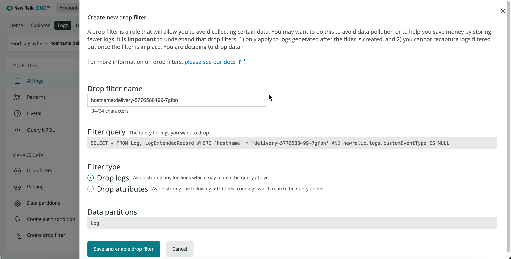
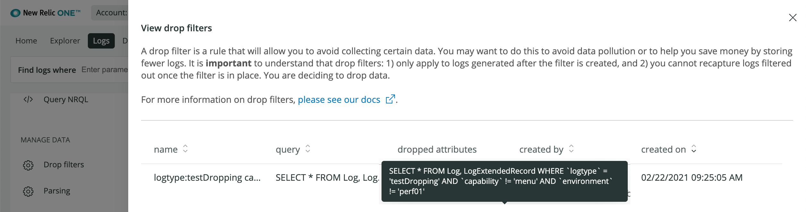

After log event data has been sent to New Relic, it can either be stored in our NRDB database or dropped (discarded). To drop log data, you can use the logs management UI: that is explained in this doc. Alternatively, you can [use NerdGraph to drop data](/docs/accounts/accounts/data-management/drop-data-using-nerdgraph).

## Savings, security, speed [#why-it-matters]

Drop filter rules help you accomplish several important goals:

* Lower costs by storing only the logs relevant to your account.
* Protect privacy and security by removing personal identifiable information (PII).
* Reduce noise by removing irrelevant events and attributes.

<Callout variant="caution">
  Use caution when deciding to drop data. The data you drop is not recoverable. Before using this feature, review the [responsibilities and considerations for dropping data](#caution).
</Callout>

## How drop filter rules work [#how-it-works]

A drop filter rule matches data based on a query. When triggered, the drop filter rule removes the matching data from the ingestion pipeline before it is written to NRDB.

This creates an explicit demarcation between the logs being forwarded from your domain and the data that New Relic collects. Since the data removed by the drop filter rule doesn't reach our backend, it cannot be queried: the data is gone and cannot be restored.

<figcaption>
  During the ingestion process, customer log data can be parsed, transformed, or dropped before being stored in New Relic's database.
</figcaption>

## Cautions when dropping data [#caution]

When creating drop rules, you are responsible for ensuring that the rules accurately identify and discard the data that meets the conditions that you have established. You are also responsible for monitoring the rule, as well as the data you disclose to New Relic.

New Relic cannot guarantee that this functionality will completely resolve data disclosure concerns you may have. New Relic doesn't review or monitor how effective the rules you develop are.

Creating rules about sensitive data can leak information about what kinds of data you maintain, including the format of your data or systems (for example, through referencing email addresses or specific credit card numbers). Any user with the relevant role-based access control permissions can view and edit all information in the rules you create.

## Create drop filter rules [#create]

For permissions-related requirements, see [Drop data requirements](/docs/data-apis/manage-data/drop-data-using-nerdgraph#requirements).

Once a drop filter rule is active, it's applied to all log events ingested from that point onwards. Rules are not applied retroactively. Logs collected before creating a rule are not filtered by that rule.

<figcaption>
  Filter or query the set of logs that contain the data you want to drop. Then, from **Manage data** on the left nav of the Logs UI, click **Create drop filter**.
</figcaption>

To create a new drop filter rule, you can use new or existing [log queries](/docs/logs/new-relic-logs/ui-data/query-syntax-logs).

1. Go to **[one.newrelic.com](https://one.newrelic.com) > Logs**.
2. Filter or query to the specific set of logs that contain the data to be dropped.
3. Once the query is active, from **Manage data** on the left nav of the Logs UI, click **Create drop filter**.
4. **Recommendation:** Change the drop rule's default name to a meaningful name.
5. Choose to either [drop the entire log event](#drop-events) that matches the query or just a [specific subset of attributes](#drop-attributes) in the matching events.
6. Review the log partitions where this drop rule applies.
7. Save the drop filter rule.

## Manage drop filter rules via NerdGraph API [#nerdgraph]

To manage your drop filter rules programmatically, you can use [NerdGraph](/docs/accounts/accounts/data-management/drop-data-using-nerdgraph) to create, query, and delete your drop filter rules.

If you are creating drop filters for Log events using the NerdGraph, you will need to set the <code>source</code> attribute to <code>Logging</code>. 

The Logging UI will only display drop filters with that <code>source</code> attribute.

## Types of drop filter rules [#types]

The drop filters UI prompts you to select whether to drop logs based on the query or on specific attributes.

### Drop log events [#drop-events]

The default type of drop filter rule is to drop logs. This option drops the entire log events that match the filter or query. When creating a rule, try to provide a specific query that only matches log data that should be dropped.

Our drop filters process won't let you create drop filter rules without values in the matching query. This prevents badly formed rules from dropping all log data.

### Drop attributes [#drop-attributes]

You can specify attributes to be dropped in a log event that matches your query. At least one or more attributes must be selected. Any attribute which is selected will be dropped; all remaining attributes will be kept and stored in NRDB.

<Callout variant="tip">
  We recommend this method for removing fields that could contain personal identifiable information (PII) or other sensitive attributes without losing valuable monitoring data.
</Callout>

## View or delete drop filter rules [#drop-rules-delete]

To view or delete a drop filter rule:

1. Go to **[one.newrelic.com](https://one.newrelic.com) > Logs**.
2. From **Manage data** on the left nav of the Logs UI, click **Drop filters**.
3. Click the **delete** <Icon name="fe-trash-2"/> icon next to the drop filter rule you want to remove.

Once deleted, rules no longer filter ingested log events.
