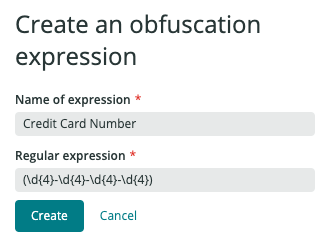

An obfuscation rule applies a set of obfuscation [actions](#actions) to a set of target logs specified via a user-defined NRQL filter (matching criteria). Each obfuscation action references an existing obfuscation [expression (a regex)](#expressions) and applies it to a set of log attributes, based on your preferred obfuscation method (`HASH` or `MASK`).

## How obfuscation works [#overview]

<Callout variant="important">
The JSON objects displayed in this section are simplifications of the payloads used in the Obfuscation API, in order to help you better correlate the different API operations with their UI equivalent counterparts.
</Callout>

Imagine you have the following log record:

```json
{
  "message": "The credit card number 4321-5678-9876-2345 belongs to user user@email.com (born on 01/02/2003) with SSN 123-12-1234",
  "creditCardNumber": "4321-5678-9876-2345",
  "ssn": "123-12-1234",
  "department": "sales",
  "serviceName": "loginService"
}
```

This log record contains several sensitive data. Ideally, you would like your log to end up looking like this:

```json
{
  "message": "The credit card number 9aa9bc1528859aee1b1df75795f1ebd54beb2f0d26c8a1d4580a71a07189cdd5 belongs to user user@email.com (born on XXXXXXXXXX) with SSN 30e6897f76dc102e32ee1d781c43417d259e586eac15c963d75ab8b5187769da",
  "creditCardNumber": "9aa9bc1528859aee1b1df75795f1ebd54beb2f0d26c8a1d4580a71a07189cdd5",
  "ssn": "30e6897f76dc102e32ee1d781c43417d259e586eac15c963d75ab8b5187769da",
  "department": "sales",
  "serviceName": "loginService"
}
```

You decide you want to apply the following obfuscation actions to all the logs coming from that service:

  * `HASH` the credit card number present in the `message` and `creditCardNumber` attributes.
  * `MASK` the birth date present in the `message` attribute.
  * `HASH` the social security number present in the `message` and `ssn` attributes.

The first thing you need to do is to define some obfuscation expressions that allow you to capture this sensitive information:

<table>
    <thead>
      <tr>
        <th style={{ width: "150px" }}>
          Obfuscation expression
        </th>
        <th>
          Definition
        </th>
      </tr>
    </thead>
    <tbody>
      <tr>
        <td>
          Credit card number
        </td>
        <td>
          We need to capture 4 groups of 4 digits separated by hyphens:

          ```json
          {
            "name": "Credit Card Number",
            "regex": "(\d{4}-\d{4}-\d{4}-\d{4})"
          }
          ```
        </td>
      </tr>
      <tr>
        <td>
          Social security number
        </td>
        <td>
          We need to capture 3 groups of 3, 2 and 4 digits separated by hyphens:

          ```json
          {
            "name": "Social Security Number",
            "regex": "(\d{3}-\d{2}-\d{4})"
          }
          ```
        </td>
      </tr>
      <tr>
        <td>
          Born date (loginService specific)
        </td>
        <td>
          In this example, the born date is part of the Login service. We define the portion to obfuscate based on the date information in the surrounding words `"(born on 01/02/2003)"`:

          ```json
          {
            "name": "Born date (loginService specific)",
            "regex": "born on (.*)\)"
          }
          ```
      </td>
    </tr>
    </tbody>
  </table>

Each obfuscation expression defines how to capture some sensitive information out of a string (using a regex) and associates it with some friendly name so that you can easily identify it later.

Obfuscation expressions __can__ be reusable: they are totally agnostic to how the log attribute containing the sensitive data is named. For instance, the Social Security expression defined above could be applied to a log attribute named either `ssn`, `socialSecurityNumber` or `socSecNum`.

But still, you can create non-reusable obfuscation expressions (like the `Born date (loginService specific)` one) that are tightly coupled to the format of the log attribute (i.e. whatever comes after "born on" and before ")").

Now that we have defined how to capture our sensitive data, we need to specify which logs need to be obfuscated (the ones of the Login Service) and how (with the obfuscation actions we defined). To achieve this, we will define an obfuscation rule.

```json
{
  "name": "Obfuscate Login Service Logs",
  "filter": "serviceName = 'loginService' AND department = 'sales'",
  "actions": [
    {
      "attributes": ["message", "creditCardNumber"],
      "expression": {"name": "Credit Card Number"},
      "method": "HASH_SHA256"
    },
    {
      "attributes": ["message"],
      "expression": {"name": "Born date (loginService specific)"},
      "method": "MASK"
    },
    {
      "attributes": ["message", "ssn"],
      "expression": {"name": "Social Security Number"},
      "method": "HASH_SHA256"
    }
  ]
}
```

This rule contains three main components:

<table>
  <thead>
    <tr>
      <th style={{ width: "150px" }}>
        Obfuscation rule component
      </th>
      <th>
        Description
      </th>
    </tr>
  </thead>
  <tbody>
    <tr>
      <td>
        Name
      </td>
      <td>
        It helps to easily identify what the rule does. In this example, this rule defines how to obfuscate the different attributes of the logs coming from the Login Service.
      </td>
    </tr>
    <tr>
      <td>
        Filter
      </td>
      <td>
        The filter uses NRQL format to tell our system how identify the target logs coming from the Login Service. This example queries for logs where `serviceName = loginService` and `department = sales`.
      </td>
    </tr>
    <tr>
      <td>
        Actions
      </td>
      <td>
        Finally, this rule defines the set of obfuscation actions to apply to the logs matching the filter. Each action defines which previously created obfuscation expression to use to extract the sensitive information from each set of attributes, as well as the obfuscation method (`HASH_SHA256` or `MASK`) to be applied to obfuscate it.
    </td>
  </tr>
  </tbody>
</table>

As a final example, imagine we also needed to obfuscate logs coming from another service named "Checkout Service" that have an attribute `serviceName = checkoutService` as well as a `ccn` attribute that contains credit card information:

```json
{
  "message": "Order completed",
  "ccn": "4321-5678-9876-2345",
  "department": "sales",
  "serviceName": "checkoutService"
}
```

To obfuscate the logs from this service, we would only have to define another obfuscation rule targeting these specific logs, and we would simply reuse the previously created `Credit card number` obfuscation expression:

```json
{
  "name": "Obfuscate Checkout Service Logs",
  "filter": "serviceName = 'checkoutService' AND department = 'sales'",
  "actions": [
    {
      "attributes": ["ccn"],
      "expression": {"name": "Credit Card Number"},
      "method": "HASH_SHA256"
    }
  ]
}
```

## Checklist: steps to obfuscate logs [#checklist]

To obfuscate your logs:

1. Study the shape of your logs:
  - Do all your logs contain sensitive information? Or can you be more specific (only the logs from service A or region B)?
  - What sensitive information do they contain: credit card numbers, driver's license numbers, biometrics...
2. Create obfuscation expressions to identify how to extract sensitive data.
3. Define obfuscation rules for each set of logs:
  - Define how you will capture them using NRQL.
  - Define which obfuscation actions need to be applied to each of them. Ask yourself: Will I need to query my logs using this sensitive information later (consider using `HASH`) or do I need to remove it entirely from my logs (consider using `MASK`)?

## Obfuscation expressions

<CollapserGroup>
  <Collapser
    id="expressions-read"
    title="Read an obfuscation expression"
  >
### Using the Logs UI
1. Go to **[one.newrelic.com](https://one.newrelic.com) > Logs** and from the left nav, select **Obfuscation**.

2. Select the **Expressions** tab to view all the available obfuscation expressions and their definitions.

### Using NerdGraph

Use the  `obfuscationExpressions` fetcher under `actor.account.logConfigurations`. You can find a populated example in GraphiQL as well as the related documentation [here](https://api.newrelic.com/graphiql?#query=%7B%0A%20%20actor%20%7B%0A%20%20%20%20account%28id%3A%201234%29%20%7B%0A%20%20%20%20%20%20logConfigurations%20%7B%0A%20%20%20%20%20%20%20%20obfuscationExpressions%20%7B%0A%20%20%20%20%20%20%20%20%20%20id%0A%20%20%20%20%20%20%20%20%20%20name%0A%20%20%20%20%20%20%20%20%20%20regex%0A%20%20%20%20%20%20%20%20%20%20description%0A%20%20%20%20%20%20%20%20%20%20createdAt%0A%20%20%20%20%20%20%20%20%20%20createdBy%20%7B%0A%20%20%20%20%20%20%20%20%20%20%20%20name%0A%20%20%20%20%20%20%20%20%20%20%20%20email%0A%20%20%20%20%20%20%20%20%20%20%7D%0A%20%20%20%20%20%20%20%20%20%20updatedAt%0A%20%20%20%20%20%20%20%20%20%20updatedBy%20%7B%0A%20%20%20%20%20%20%20%20%20%20%20%20name%0A%20%20%20%20%20%20%20%20%20%20%20%20email%0A%20%20%20%20%20%20%20%20%20%20%7D%0A%20%20%20%20%20%20%20%20%7D%0A%20%20%20%20%20%20%7D%0A%20%20%20%20%7D%0A%20%20%7D%0A%7D%0A).

  </Collapser>
  <Collapser
    id="expressions-create"
    title="Create an obfuscation expression"
  >
### Using the Logs UI
1. Go to **[one.newrelic.com](https://one.newrelic.com) > Logs** and from the left nav, select **Obfuscation**.

2. Click **Create regex**.

3. Enter a name for your new obfuscation rule, as well as a regular expression matching the sensitive data you want to capture. Use [RE2 syntax](https://github.com/google/re2/wiki/Syntax). The following example shows a basic obfuscation expression that will match credit card numbers:



### Using NerdGraph

Use the  `logConfigurationsCreateObfuscationExpression` mutator. You can find a populated example in GraphiQL [here](https://api.newrelic.com/graphiql?#query=mutation%20%7B%0A%20%20logConfigurationsCreateObfuscationExpression%28accountId%3A%201234%2C%20expression%3A%20%7Bname%3A%20%22Credit%20Card%20Number%22%2C%20regex%3A%20%22%28%5C%5Cd%7B4%7D-%5C%5Cd%7B4%7D-%5C%5Cd%7B4%7D-%5C%5Cd%7B4%7D%29%22%2C%20description%3A%20%22Reusable%20expression%20to%20capture%20credit%20card%20numbers%22%7D%29%20%7B%0A%20%20%20%20id%0A%20%20%20%20name%0A%20%20%20%20regex%0A%20%20%20%20description%0A%20%20%20%20createdAt%0A%20%20%20%20createdBy%20%7B%0A%20%20%20%20%20%20name%0A%20%20%20%20%20%20email%0A%20%20%20%20%7D%0A%20%20%7D%0A%7D%0AA).

<Callout variant="important">
You must escape the `regex` when introducing it via NerdGraph: `(\\d{4}-\\d{4}-\\d{4}-\\d{4})`

</Callout>

  </Collapser>
  <Collapser
    id="expressions-update"
    title="Update an obfuscation expression"
  >
  yibidi yabada
  </Collapser>
  <Collapser
    id="expressions-delete"
    title="Delete an obfuscation expression"
  >
  yibidi yabada
  </Collapser>
</CollapserGroup>

## Obfuscation rules

<CollapserGroup>
  <Collapser
    id="rules-read"
    title="Read an obfuscation rule"
  >

  </Collapser>
  <Collapser
    id="rules-create"
    title="Create an obfuscation rule"
  >

  </Collapser>
  <Collapser
    id="rules-update"
    title="Update an obfuscation rule"
  >
  yibidi yabada
  </Collapser>
  <Collapser
    id="rules-delete"
    title="Delete an obfuscation rule"
  >
  yibidi yabada
  </Collapser>
</CollapserGroup>

-------


To do this in New Relic One:

1. Go to **[one.newrelic.com](https://one.newrelic.com) > Logs** and from the left nav, select **Obfuscation**.

2. Click **Create regex**.

3. Enter a name for your new obfuscation rule, and enter a regular expression matching the sensitive data you want to mask or hash. Use [RE2 syntax](https://github.com/google/re2/wiki/Syntax). The following example shows a basic obfuscation expression that will match US social security numbers:

4. Return to the **Obfuscation** page, and click **Create obfuscation rule**.

  * **Obfuscation name**: The name of your obfuscation rule.
  * **Matching criteria (NRQL)**: The NRQL query that will determine the subset of your log data this obfuscation rule will be applied to. In the example below, the rule will be applied to any log that contains an attribute named `socialsecurity`.
  * **Attributes**: One or more log attributes containing the values you wish to obfuscate. Multiple attributes may be specified here (attributes must be comma-separated).
  * **Select regex**: Select the obfuscation expression that will be used to match the sensitive data you wish to obfuscate.
  * **Replace with**: Select the obfuscation method you want to apply to your logs. Hash will replace sensitive data with a SHA-256 hash value. Mask will replace all matching characters with `Xs`.

5. To define multiple actions, click **Add new action**. This option allows you to specify additional attributes to be obfuscated as well as the obfuscation method to be used. In the example below, the `socialsecuritynum` and `request` attributes will be masked, and any value found in the `ccnum` attribute will be hashed.

6. Click **Create rule** to create and activate your obfuscation rule.

## Use obfuscation API [#nerdgraph-api]

You can also create, query, update, and delete your obfuscation settings programmatically by using NerdGraph, our GraphQL-format API, at [api.newrelic.com/graphiql](https://api.newrelic.com/graphiql). For more information, see the [NerdGraph tutorial](/docs/apis/nerdgraph/examples/nerdgraph-log-data-obfuscation) to manage your obfuscation expressions and rules.
