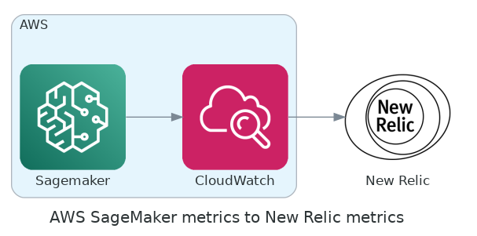
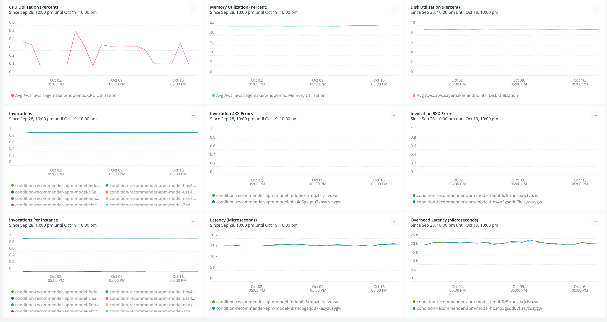

By integrating Amazon SageMaker's integration with New Relic, you'll be able to instrument, analyze, troubleshoot, and optimize your machine-learning performance across your entire system. Rigorously observe your capabilities to react quickly to changes in the model's input or output and the relationship between the two.

Take the next steps to monitor your Amazon SagaMaker metrics and objects (that are sent to AWS CloudWatch) and view them as [entities](/docs/new-relic-one/use-new-relic-one/core-concepts/what-entity-new-relic/) and [dashboards](/docs/query-your-data/explore-query-data/dashboards/introduction-dashboards/) in New Relic. 



## Stream AWS CloudWatch Metrics to New Relic [#set-up-cloudwatch]

Start benefiting from New Relic [MLOps](/docs/alerts-applied-intelligence/mlops/get-started/intro-mlops/) entities in a single simple step (and just a few minutes!): 

<Callout variant="important">
  Each metric sent to CloudWatch is automatically sent to New Relic's metric table in NRDB, according to the namespace filter. You can always query them using NRQL:
  
  ```
  FROM Metric SELECT *  WHERE aws.Namespace='/aws/sagemaker/Endpoints'  LIMIT MAX SINCE 1 WEEK AGO
  ```
</Callout>

### Manual option [#set-up-manual] 
Follow our docs to set up [CloudWatch Metric Streams](/docs/integrations/amazon-integrations/aws-integrations-list/aws-metric-stream).

### Automated option [#set-up-automated] 

You may automate the set up with the [Terraform code](https://github.com/newrelic-experimental/terraform-cloudwatch-metric-streams):

```
module "example_usage" {
  source = "modules/nr-cloudwatch-metric-stream"

  name_suffix = "<var>suffix</var>" # optional
  aws_account_id = "<var>your-aws-account-id</var>"

  newrelic_collector_endpoint = "<var>newrelic-endpoint-url</var>"
  newrelic_trusted_account_id = "12345678"
  newrelic_license_key        = "<var>[your-newrelic-license-key](/docs/apis/intro-apis/new-relic-api-keys/#ingest-license-key)</var>"
}
```	

When calling the module, please write the correct `newrelic_collector_endpoint`:
* HTTP endpoint URL - US datacenter: `https://aws-api.newrelic.com/cloudwatch-metrics/v1`
* HTTP endpoint URL - EU datacenter: `https://aws-api.eu01.nr-data.net/cloudwatch-metrics/v1`

When you set the metric stream you can choose to stream the metric from all the namespaces, or you can specify namespaces. 

<Callout variant="important">
  You can view each entity's metrics in a dashboard that's created automatically when the metrics arrive at the New Relic.
</Callout>

## Monitor your data and model in Amazon SageMaker, and send the metrics to CloudWatch [#model-monitor]

SageMaker automatically monitors your endpoints’ performance, and sends statistic metrics to CloudWatch. For more information, see [Endpoint CloudWatch Metrics](https://docs.aws.amazon.com/sagemaker/latest/dg/monitoring-cloudwatch.html). 

To obtain more benefits from the Amazon SageMaker MLOps integration, use the Amazon SageMaker Model Monitor tools. You'll have to define scheduled monitoring jobs to monitor the quality of your machine learning models in production and send metrics to CloudWatch. 

The **[Amazon SageMaker Model Monitor](https://docs.aws.amazon.com/sagemaker/latest/dg/model-monitor.html)** provides the following types of monitoring:

* [Monitor Data Quality](https://docs.aws.amazon.com/sagemaker/latest/dg/model-monitor-data-quality.html): Monitor drift in data quality.
  * Example notebook: [Amazon SageMaker Model Monitor](https://sagemaker-examples.readthedocs.io/en/latest/sagemaker_model_monitor/introduction/SageMaker-ModelMonitoring.html)
  * Namespace: `aws/sagemaker/Endpoints/data-metrics`
* [Monitor Model Quality](https://docs.aws.amazon.com/sagemaker/latest/dg/model-monitor-model-quality.html): Monitor drift in model quality metrics, such as accuracy.
  * Example notebook: [Amazon SageMaker Model Quality Monitor](https://sagemaker-examples.readthedocs.io/en/latest/sagemaker_model_monitor/model_quality/model_quality_churn_sdk.html)
  * Namespace: `aws/sagemaker/Endpoints/model-metrics`
* [Monitor Bias Drift for Models in Production](https://docs.aws.amazon.com/sagemaker/latest/dg/clarify-model-monitor-bias-drift.html): Monitor bias in you model's predictions.
  * Example notebook: [Monitoring bias drift and feature attribution drift Amazon SageMaker Clarify](https://sagemaker-examples.readthedocs.io/en/latest/sagemaker_model_monitor/fairness_and_explainability/SageMaker-Model-Monitor-Fairness-and-Explainability.html)
  * Namespace: `aws/sagemaker/Endpoints/bias-metrics`
* [Monitor Feature Attribution Drift for Models in Production](https://docs.aws.amazon.com/sagemaker/latest/dg/clarify-model-monitor-feature-attribution-drift.html): Monitor drift in feature attribution.
  * Example notebook: [Monitoring bias drift and feature attribution drift Amazon SageMaker Clarify](https://sagemaker-examples.readthedocs.io/en/latest/sagemaker_model_monitor/fairness_and_explainability/SageMaker-Model-Monitor-Fairness-and-Explainability.html)
  * Namespace: `aws/sagemaker/Endpoints/explainability-metrics`

### Advanced options [#model-monitor-advanced]

You can aso publish metric data points to Amazon CloudWatch and define the namespaces and one of the above using the [`put_metric_data` function](https://boto3.amazonaws.com/v1/documentation/api/latest/reference/services/cloudwatch.html#CloudWatch.Client.put_metric_data). 

If you use your own algorithm for hyperparameter tuning, make sure that it sends at least one metric by writing evaluation data to `stderr` or `stdout`. Read more on [how to define metrics in automatic model tuning](https://docs.aws.amazon.com/sagemaker/latest/dg/automatic-model-tuning-define-metrics.html). See also the example notebook [Develop, Train, Optimize and Deploy Scikit-Learn Random Forest](https://github.com/aws/amazon-sagemaker-examples/blob/master/sagemaker-python-sdk/scikit_learn_randomforest/Sklearn_on_SageMaker_end2end.ipynb).  

## Explore your MLOps entities and dashboards [#explore-entities-dashboards]

We generate `aws-entities` (under the MLOps entity domain) for the detailed namespaces. For these entities, you can get out-of-the-box dashboards and views. You can also create your own dashboard to view metrics that are not being displayed as part of the entities' views. 

<table>
  <thead>
    <tr>
      <th style={{ width: "350px" }}>
      New Relic entity  
      </th>
      <th>
      Namespace  
      </th>
    </tr>
  </thead>
    <tbody>
    <tr>
      <td>
        Machine learning endpoint
      </td>
      <td>
        `/aws/sagemaker/Endpoints`, `AWS/SageMaker`
      </td>
    </tr>
    <tr>
      <td>
        Machine learning model data
      </td>
      <td>
        `aws/sagemaker/Endpoints/data-metrics`
      </td>
    </tr>
    <tr>
      <td>
        Machine learning model
      </td>
      <td>
        `aws/sagemaker/Endpoints/model-metrics`, `aws/sagemaker/Endpoints/explainability-metrics`
      </td>
    </tr>
    </tbody>
</table>

Go to [one.newrelic.com](https://one.newrelic.com) and select the **Explorer** to view: 

* Your machine-learning entities 


* The dashboard for the metrics of the endpoint from one of the Amazon SageMaker entities



* The dashboard for the model data entity


