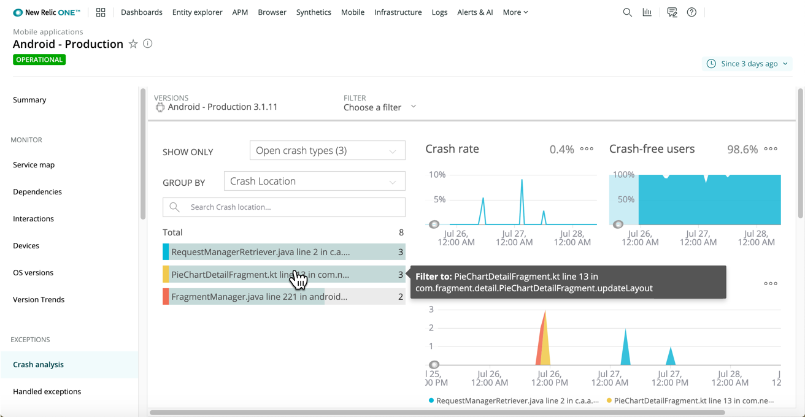

The digital customer experience with your brand encompasses iOS and Android devices, your browser website, kiosks, and support. Impatient users spend the majority of their time in mobile apps, and they expect the best.

* **Crashes:** How do you fix what’s broken before it surfaces as 1-star customer reviews in the app store?
* **Latency:** How can you connect your fragmented mobile ecosystem to troubleshoot faster across networks, teams, and devices?
* **Customer experience:** How can you efficiently understand how users are interacting with your app?
* **ROI:** How can you easily query and share vital performance data like user flow and total cart revenue?

Our Mobile Monitoring tools integrate across your entire digital customer experience, so that you can get detailed crash reporting and analytics along with deep diagnostics on code and network performance. With New Relic, you get full end-to-end observability for your mobile stack platform. This includes backend APM visibility, end-user flow (browser) monitoring, synthetic API checks, flexible alerting, querying, and visualization tools.

Go beyond fixing crashes. Use New Relic to prevent mobile problems before they happen, and improve your customers' overall experience.

Quickly examine crash occurrences, app launches, handled exceptions, network problems, alert details, focused queries, and more when you use our mobile monitoring tools.

<LandingPageTileGrid>
  <LandingPageTile
    title="Get started."
    icon="fe-check-square"
  >

    * Learn about our [mobile monitoring capabilities](/docs/mobile-monitoring/new-relic-mobile/get-started/introduction-mobile-monitoring).
    * <i className="fa fa-android">
        
          [android icon]
        
      </i>
      Install New Relic on your [Android apps](/docs/mobile-monitoring/new-relic-mobile-android/get-started/introduction-new-relic-mobile-android), or customize what you want to monitor with our [Android SDK API](/docs/mobile-monitoring/new-relic-mobile-android/android-sdk-api).
    * <i className="fa fa-apple">
        
          [apple icon]
        
      </i>
      Install New Relic on your [iOS and tvOS apps](/docs/mobile-monitoring/new-relic-mobile-ios/get-started/introduction-new-relic-mobile-ios), or customize what you want to monitor with our [iOS SDK API](/docs/mobile-monitoring/new-relic-mobile-ios/api-guides/ios-sdk-api-guide).
  </LandingPageTile>

  <LandingPageTile
    title="Troubleshoot and resolve problems."
    icon="fe-alert-triangle"
  >

    * Use [alerts](/docs/mobile-monitoring/new-relic-mobile/get-started/alert-information-new-relic-mobile) and [Applied Intelligence](/docs/new-relic-one/use-new-relic-one/new-relic-ai/introduction-new-relic-ai) for key performance indicators.
    * Examine issues by using the [Mobile Monitoring UI](/docs/mobile-monitoring/mobile-monitoring-ui).
    * Correlate your apps, related services, alerts, logs, and overall digital customer experience with [New Relic One](/docs/new-relic-one/use-new-relic-one/get-started/introduction-new-relic-one).
  </LandingPageTile>

  <LandingPageTile
    title="Visualize your data."
    icon="fe-bar-chart-2"
  >

    * [Query](/docs/using-new-relic/data/understand-data/query-new-relic-data) any data type ([metrics, events, logs, traces](/docs/using-new-relic/data/understand-data/new-relic-data-types)) via UI or API.
    * Add [custom data](/docs/mobile-monitoring/new-relic-mobile/maintenance/add-custom-data-new-relic-mobile) to your queries to include customer context with business priorities and expected outcomes.
    * Create and share a variety of [charts and dashboards](/docs/dashboards/new-relic-one-dashboards/get-started/introduction-new-relic-one-dashboards).
  </LandingPageTile>
</LandingPageTileGrid>

<ButtonLink
  role="button"
  to="/docs/mobile-monitoring/table-of-contents"
  variant="normal"
>
  View all Mobile docs
</ButtonLink>
