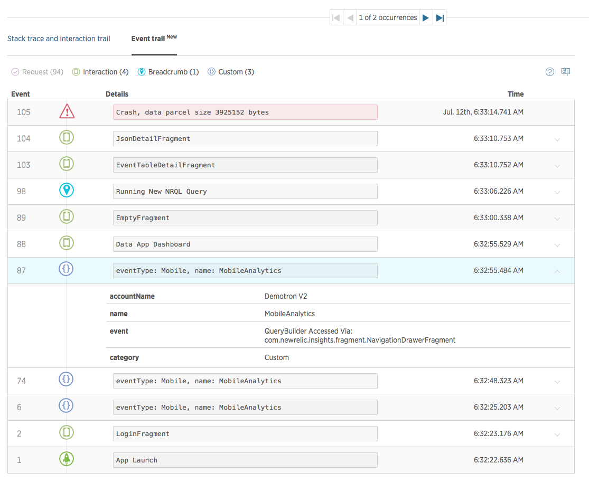

The New Relic Mobile **crash event trail** shows you the events leading up to a crash of a mobile app, based on your subscription level's [data retention policy](/docs/accounts-partnerships/accounts/account-billing-usage/data-retention). These can be events New Relic monitors by default, or custom events you created in New Relic Insights. This document explains [what the crash event trail is](#what-is) and [how to use it](#use).

<Callout variant="tip">
  Access to this feature depends on your [subscription level](http://newrelic.com/mobile-monitoring/pricing).
</Callout>

## View events before mobile app crashes [#what-is]

When a mobile app crashes and you don't know why, you can study what happened right before the crash. New Relic Mobile's crash event trail shows you these events so that you can follow the "breadcrumbs" leading up to the crash and diagnose the cause of the failure.

**[rpm.newrelic.com/mobile](https://rpm.newrelic.com/mobile) > (select a mobile app) > Crash analysis > (selected crash type) > Event trail**: The crash event trail shows the activity leading up to a mobile app crash.

The crash event trail shows all New Relic Mobile [event types](/docs/insights/explore-add-data/custom-events/insert-query-custom-mobile-app-events-attributes#event-definition) leading up to a crash. You can use New Relic Mobile's [iOS SDK](/docs/mobile-monitoring/new-relic-mobile-ios/install-configure/work-ios-sdk-api) or [Android SDK](/docs/mobile-monitoring/new-relic-mobile-android/android-sdk-api/recordbreadcrumb) to create custom `MobileBreadcrumb` events that track whatever app activity you think would help you diagnose a crash.

You can also use `MobileHandledException` events in the crash event trail to aid in debugging. Use the iOS and Android `recordHandledException` APIs for [iOS](/docs/mobile-monitoring/new-relic-mobile-ios/ios-sdk-api/recordhandledexception-ios-sdk-api) or [Android](/docs/mobile-monitoring/new-relic-mobile-android/android-sdk-api/recordhandledexception) to annotate where exceptions are handled in your application. These events will automatically appear in the crash event trail.

For more about annotating crash event trails with custom data, see [Add custom data to New Relic Mobile](/docs/mobile-monitoring/new-relic-mobile/maintenance/add-custom-data-new-relic-mobile).

## Use the event trail [#use]

To use the New Relic Mobile crash event trail:

1. Go to **[rpm.newrelic.com/mobile](https://rpm.newrelic.com/mobile) > (select a mobile app) > Crash analysis**.
2. On the lower right side of the **Crash analysis** page, select a crash type.
3. On the **Crash details** page, beside the stack trace, select **Event trail**.
4. Study the events leading up to a crash type for clues to the reasons for the crash.
5. To expand details about an event's attributes, select it.
6. To view the event trail results in New Relic Insights, select **Open session in Insights**.
7. To scroll through occurrences of the same crash type, use the event trail's left and right arrows.

For optimal use of New Relic's crash analysis tools, use:

* New Relic Mobile's [Android SDK API](/docs/mobile-monitoring/new-relic-mobile-android/android-sdk-api/recordbreadcrumb) or [iOS SDK API](/docs/mobile-monitoring/new-relic-mobile-ios/ios-sdk-api/record-breadcrumb) to create custom `MobileBreadcrumb` or `MobileHandledException` events
* [Enable `MobileRequest` events](/docs/mobile-monitoring/mobile-monitoring-ui/network-pages/analyze-network-requests-using-mobilerequest-event-data)
* New Relic Mobile's [**Crash analysis** page](/docs/mobile-monitoring/mobile-monitoring-ui/crashes/crash-analysis-group-filter-your-crashes)
* New Relic Mobile's [Interaction trail](/docs/mobile-monitoring/mobile-monitoring-ui/crashes/investigate-mobile-app-crash-report#interaction-trail)
* [New Relic Insights queries](/docs/insights/explore-add-data/custom-events/insert-query-custom-mobile-app-events-attributes) of your crash event data
* New Relic Insights [dashboards](/docs/insights/use-insights-ui/manage-dashboards/create-edit-copy-insights-dashboards)

## Difference between event trail and interaction trail [#diff-interaction-trail]

The crash event trail is different from the [interaction trail](/docs/mobile-monitoring/mobile-monitoring-ui/crashes/investigate-mobile-app-crash-report#interaction-trail). The crash event trail shows **all** New Relic Mobile [event types](/docs/insights/explore-add-data/custom-events/insert-query-custom-mobile-app-events-attributes#event-definition) leading up to a crash, whereas the interaction trail only shows interaction event types (`Mobile` events with the category `interaction`). The interaction trail has additional features, including stack traces and links to the associated interaction charts.
