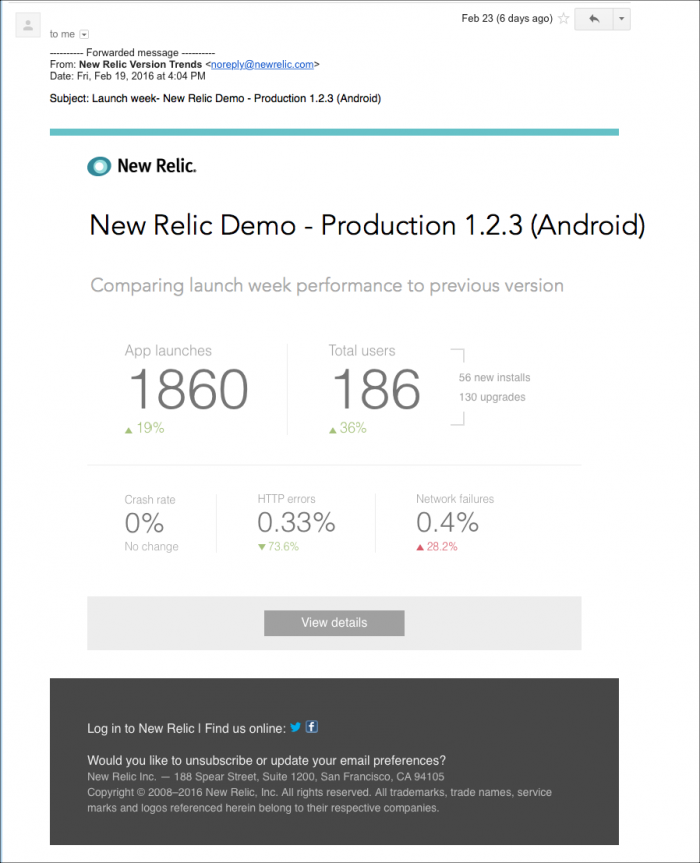

Managing and pinpointing your mobile app's successes and problems can have additional complexity when multiple versions are live at any one time. This is why Mobile monitoring provides version trend data by email.

If you manage mobile app development, or if you are a mobile app developer, the email reports provide a convenient communication tool to share, track, and review your app's progress, adoption, and other trends. Each email includes a link to Mobile monitoring's [**Version trends** user interface](/docs/mobile-monitoring/mobile-monitoring-ui/mobile-app-pages/version-trends-compare-user-adoption-metrics-performance), where you can drill down into additional details.

## Analyze email report data [#vt-email-data]

Here is an example of New Relic Mobile's version trends email report.

To opt in or out of New Relic Mobile's version trends report for any or all of your mobile apps: Go to **[one.newrelic.com](https://one.newrelic.com/) > Mobile > [(account dropdown)](/docs/accounts-partnerships/education/getting-started-new-relic/glossary#account-dropdown) > User preferences**, and then use the **Mobile version trends** tab in the **Emails per account** section. A link to your account **User preferences** also is available from New Relic Mobile's **Version trends** page in the user interface.

The email reports help you analyze data for version releases over time.

<Table>
  <thead>
    <tr>
      <th style={{ width: "200px" }}>
        **Time period**
      </th>

      <th>
        **Comments**
      </th>
    </tr>
  </thead>

  <tbody>
    <tr>
      <td>
        Day after release
      </td>

      <td>
        The day after a new release launches, the report provides data about crash rates, HTTP errors, and network failures. This can help you quickly understand if the release is causing any major issues.
      </td>
    </tr>

    <tr>
      <td>
        Week and month after release
      </td>

      <td>
        One week and one month later, the numbers and percentages will show whether new users are installing the app and existing users are upgrading to this version. This can help you analyze the success of specific app versions and your promotional efforts around them.
      </td>
    </tr>

    <tr>
      <td>
        Over time
      </td>

      <td>
        Over time you can evaluate your development efforts. This can help you determine whether each release is maintaining or improving the stability and performance of your app. This in turn can help you to identify any changes needed to support or enhance your app.
      </td>
    </tr>
  </tbody>
</Table>

<Callout variant="tip">
  To go directly to New Relic Mobile's **Version trends** user interface, select the email's **View details** link. The UI provides additional details that can [help you analyze performance, user adoption, and key technical indicators](/docs/mobile-monitoring/mobile-monitoring-ui/mobile-app-pages/version-trends-compare-user-adoption-metrics-performance#details). You can also opt in to email reports directly from the **Version trends** page in the UI.
</Callout>

## All mobile apps: Select email reporting [#email-all]

By default, all of your mobile apps are disabled for email reporting to your [account email address](/docs/accounts-partnerships/accounts/account-maintenance/account-email-settings). Once you enable the feature for one or more of your mobile apps, we will automatically send the email reports one day, one week, and one month after each new version release.

To opt in or out of the version trends email reports:

1. Go to **[one.newrelic.com](one.newrelic.com) > Mobile > (select a mobile app) > App > Version trends**.
2. Select the **Enable version trends email notifications** link.
3. From the **Emails per account** section in your account's **User preferences** page, select **Mobile version trends**.
4. Select the checkbox option to enable or disable version trend email notifications.
5. Select **Save email preferences**.

OR

1. Go to **[one.newrelic.com](https://one.newrelic.com) > [(account dropdown)](/docs/accounts-partnerships/education/getting-started-new-relic/glossary#account-dropdown) > User preferences**.
2. From the **Emails per account** section, select **Mobile version trends**.
3. Select the checkbox option to enable or disable version trend email notifications.
4. Select **Save email preferences**.

## Individual mobile app: Select email reporting [#email-one]

To enable or disable email reporting for a specific mobile app:

1. From the list of available mobile apps in your **User preferences**, hover over a mobile app, and then select **Edit**.
2. From the selected mobile app's **Alert thresholds** page, select the checkbox option to turn on or turn off email reporting for new releases.
3. Select **Save alert settings**.

OR:

1. Go to **[one.newrelic.com](https://one.newrelic.com) > (selected app) > Settings > Application**.
2. From the selected mobile app's **Crash reports and release notifications** section, select the checkbox option to turn on or turn off email reporting for new releases.
3. Select **Save alert settings**.
