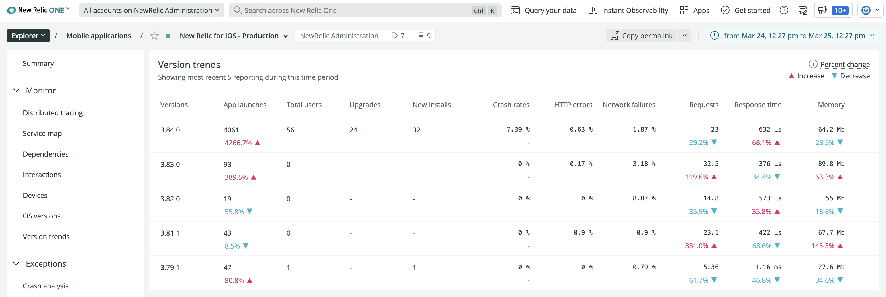
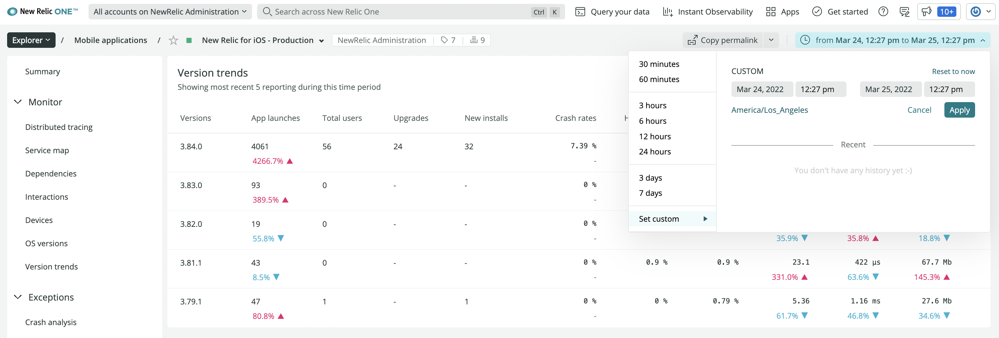

You can view version trend data in the mobile monitoring UI and compare performance across the most recent versions of your mobile app using the version trends report. On this single page you have access to the key data points you need to analyze the impact of improvements, fixes, and degradations for each version. This report provides metrics to compare usage, adoption, and key technical indicators.

## Requirements

Older versions of the New Relic mobile agent don't collect install/upgrade count data. You know you're on one of these older versions if you see the "No adoption data is available for this version because it is running an older agent" message.

To collect version trend information for your mobile app, make sure your agent version is:

* New Relic mobile agent for [Android version 5.3.3](/docs/release-notes/mobile-release-notes/android-release-notes/) or higher
* New Relic mobile agent for [iOS version 5.3.4](/docs/release-notes/mobile-release-notes/ios-release-notes/) or higher

## View version trends [#view-version-trends]

To view the **version trends** report go to **[one.newrelic.com](https://one.newrelic.com) > Mobile > (select an app) > App > Version trends**.

Each new version of your mobile app is compared against the previous version. For a selected time period, the version trends report compares the performance increases and decreases of your app versions against each other.

For example, use the timepicker dropdown to select default or custom time periods to query:

## Understanding version trend details [#details]

Each version includes several metrics to analyze performance, user adoption, and key technical indicators.

<CollapserGroup>
  <Collapser
    id="adoption"
    title="Critical user adoption metrics"
  >
    You can compare different versions to see how successfully they have been adopted by your users.

    * **App launches:** Count of the number of times the application has been launched by a user
    * **Total users:** Count of unique devices active
    * **Upgrades:** Count of unique devices active that were upgrades from a previous app version
    * **New installs:** Count of unique devices active who performed a new install of this app

    Upgrades and new installs combine to reveal adoption in the form of total unique installs.
  </Collapser>

  <Collapser
    id="kti"
    title="Key technical indicators"
  >
    Key technical performance indicators include stability, network health, other app or server problems, and memory usage:

    * **Crash rates:** the percentage of all app sessions that crashed
    * **HTTP errors:**  HTTP errors are HTTP requests that have a status code greater than 400
    * **Network failures:** a network failure is a HTTP request that results in no response
    * **Requests:** the average number of network requests made per app session
    * **Response time:** the average server response time as seen from the app’s perspective
    * **Memory usage:** memory occupied by the app
  </Collapser>
</CollapserGroup>

## Query version trend data [#insights]

When querying with [NRQL](/docs/query-data/nrql-new-relic-query-language/getting-started/introduction-nrql), we provide two attributes to help analyze version trend information:

* To track when a session includes a new install or a new upgrade, use `install`. This attribute records `true` for new installations.
* To track the last version of the mobile app when an upgrade is detected, use `upgradeFrom`.

To use these attributes, make sure your version of our [Android agent](/docs/release-notes/mobile-release-notes/android-release-notes/) or [iOS agent](/docs/release-notes/mobile-release-notes/ios-release-notes/) supports them.