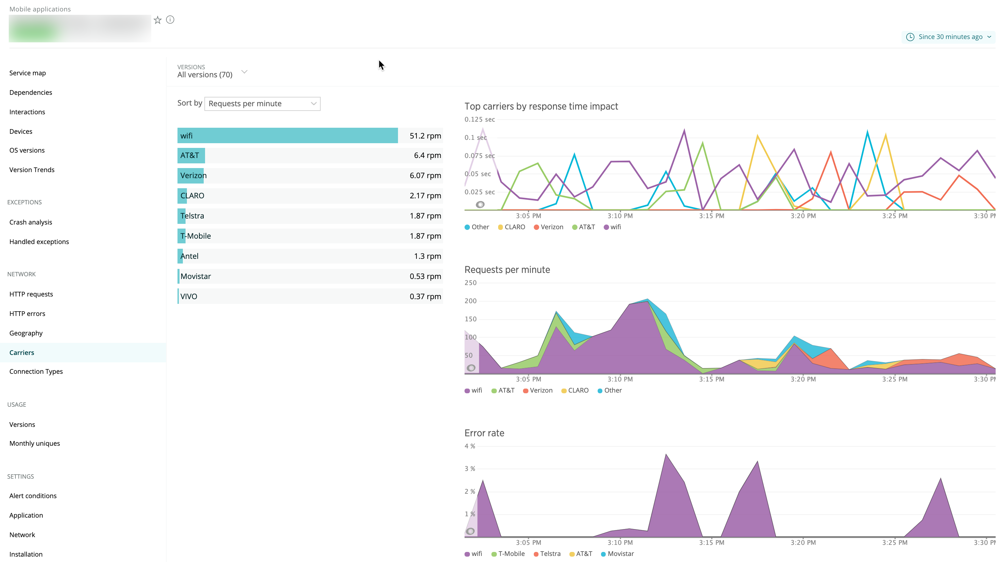

The Carriers page for mobile monitoring includes charts that show your users' wireless carriers and their response time impact, error rate, and active sessions for the selected time period. Wifi is included as a carrier. From here you can sort and drill down into detailed information about specific carriers.

## Viewing the Carriers page [#procedures]

<figcaption>
  **[one.newrelic.com](https://one.newrelic.com) > Mobile > (select an app) > Network > Carriers**: Use this page to view, sort, or drill down into detailed information about your users' mobile carriers by response time impact, network failures, and active sessions.
</figcaption>

To view your users' mobile carriers:

1. Go to **[one.newrelic.com](https://one.newrelic.com) > Mobile > (select an app) > Network > Carriers**.
2. To change the information that appears (including response time, active devices, or network errors), select your choice from the **Sort by** menu.
3. To adjust the amount of information that appears, select **Hide &lt; 1% throughput**.
4. To select the mobile app versions or time period, use the [**Versions**](/docs/mobile-apps/versions) menu and [time picker](/docs/site/timepicker-setting-time-periods-to-view-data) below the New Relic menu bar.
5. To view details for a specific carrier, select its name.

Use any of our standard [user interface functions](/docs/accounts-partnerships/education/getting-started-new-relic/new-relic-user-interface) and [page functions](/docs/accounts-partnerships/education/getting-started-new-relic/standard-dashboard-features) to drill down into detailed information.