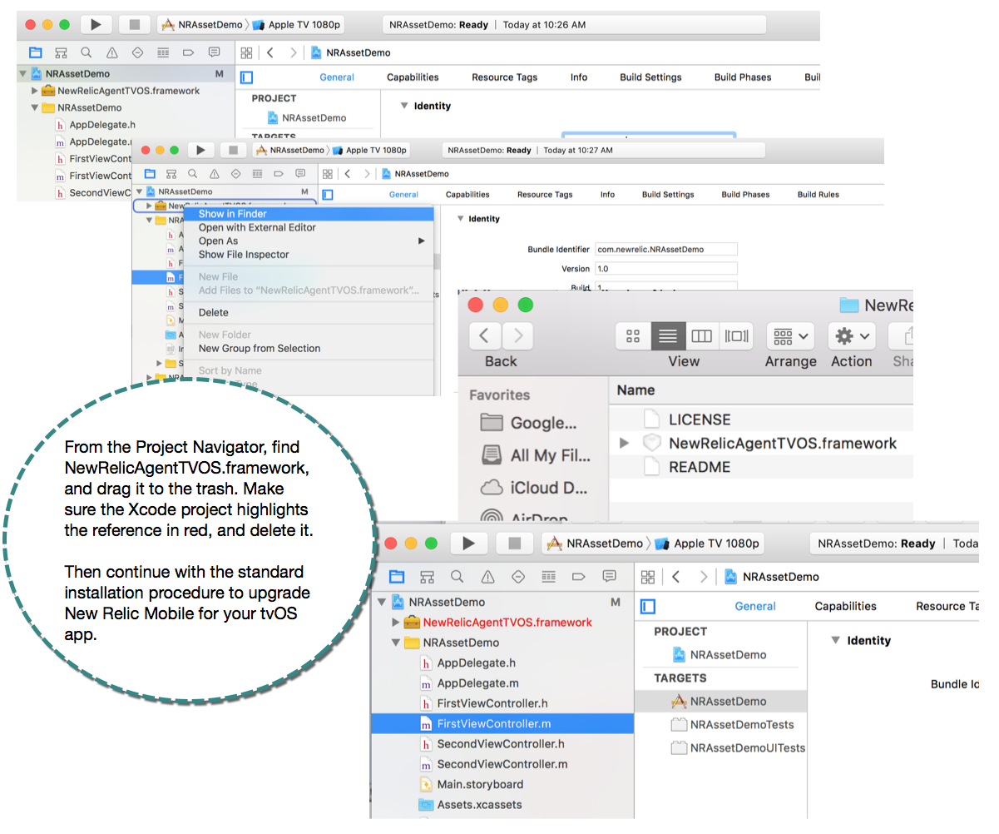

You must be the account Admin to install, configure, and upgrade the tvOS agent. For information about the latest version, refer to the [release notes](/docs/releases/ios).

## Contents [#qiklinks]

## Replacing your tvOS framework [#v1]

Admins: You must replace the earlier version of your tvOS agent framework before upgrading to a newer version of the tvOS SDK.

<figcaption>
  Here is an example of the workflow to remove your existing tvOS agent framework so you can replace it with a newer version.
</figcaption>

1. From the Project Navigator (**CMD 1**) in Xcode, search for **NewRelicAgentTVOS.framework**.
2. Right-click or control-click **NewRelicAgentTVOS.framework**, and select **Show in Finder**.
3. Drag **NewRelicAgentTVOS.framework** to the trash.
4. Verify that the Xcode project highlights the reference to **NewRelicAgentTVOS.framework** in red.
5. Right-click or control-click **NewRelicAgentTVOS.framework**, and select **Delete** to remove the obsolete reference from the project.
6. Follow standard installation procedures for tvOS app monitoring.