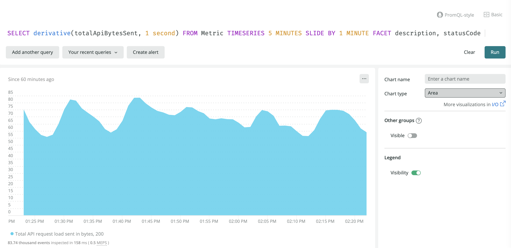

Here are some best practices based on how OpenTelemetry works with New Relic:

* [Resources](#resources)
* [Batching](#batching)
* [Compression](#compression)
* [Traces](#traces)
* [Metrics](#metrics)
* [Logs](#logs)

## Resources [#resources]

A resource in OpenTelemetry represents information about an entity generating telemetry data. All telemetry data sent to New Relic is expected to be associated with a resource so that it can be linked with the appropriate entity in New Relic. The [OpenTelemetry Resource SDK specification](https://github.com/open-telemetry/opentelemetry-specification/blob/main/specification/resource/sdk.md) defines the functionality implemented by all language SDKs for defining a resource.

The following suites of attributes are defined by the [OpenTelemetry resource semantic conventions](https://github.com/open-telemetry/opentelemetry-specification/tree/main/specification/resource/semantic_conventions#resource-semantic-conventions). These attributes are usually set by creating a resource using the OpenTelemetry SDK.

  * `service.* attributes`
    * `service.name` attribute is required to associate your resource with an entity in the UI
    * `service.instance.id` is required for certain panes to light up
  * `telemetry.sdk.language=java` is required to see data in the JVM section 

## Batching [#batching]

<Callout variant="caution">
  Avoid getting rate limited! You should batch requests sent to the OTLP endpoint as described in this section.
</Callout>

By default, the OpenTelemetry SDKs and Collector send one (1) data point per request. Using these defaults, it is likely your account will be rate limited.

All OpenTelemetry SDKs and Collectors provide a `BatchProcessor`, which batches data points in memory. This batching allows requests to be sent with more than one (1) data point.

<table>
  <thead>
      <tr>
        <th style={{ width: "200px" }}>Component</th>
        <th>Batch Processor</th>
      </tr>
  </thead>
  <tbody>
    <tr>
      <td>Collector</td>
      <td>[Batch Processor](https://github.com/open-telemetry/opentelemetry-collector/blob/main/processor/batchprocessor/README.md)</td>
    </tr>
    <tr>
      <td>Go SDK</td>
      <td>[BatchSpanProcessor](https://pkg.go.dev/go.opentelemetry.io/otel/sdk/trace#NewBatchSpanProcessor)</td>
    </tr>
    <tr>
      <td>JS SDK</td>
      <td>[BatchSpanProcessor](https://github.com/open-telemetry/opentelemetry-js/blob/main/packages/opentelemetry-sdk-trace-base/src/export/BatchSpanProcessorBase.ts)</td>
    </tr>
    <tr>
      <td>Python SDK</td>
      <td>[BatchExportSpanProcessor](https://open-telemetry.github.io/opentelemetry-python/sdk/trace.export.html#opentelemetry.sdk.trace.export.BatchExportSpanProcessor)</td>
    </tr>
  </tbody>
</table>

## Compression [#compression]

New Relic supports gzip compression for OTLP payloads exported over gRPC. To maximize the amount of data you can send per request, we recommend enabling compression in all OTLP exporters. If there are other compression formats you'd like to see us support, please let us know in the [CNCF Slack channel](https://cloud-native.slack.com/archives/C024DRQ63UP).

## Traces [#traces]

Familiarize yourself with these trace topics to ensure your traces and spans appear in New Relic.

### Required fields [#required]

The `startTimeUnixNano` and `endTimeUnixNano` fields on spans are required according to the OpenTelemetry protocol for [trace data](https://github.com/open-telemetry/opentelemetry-proto/blob/74e38fb4882dd500d77b757d44e97de296c65b05/opentelemetry/proto/trace/v1/trace.proto#L145-L159). When `startTimeUnixNano` is not present, the span is dropped and a [`NrIntegrationError`](/docs/telemetry-data-platform/manage-data/nrintegrationerror/) is created. When `endTimeUnixNano` is not present, the duration of your span is large and negative.

The `timeUnixNano` field on span events is required. When `timeUnixNano` is not present, the span event is dropped and a [`NrIntegrationError`](/docs/telemetry-data-platform/manage-data/nrintegrationerror/) is created.

The `traceId` and `spanId` fields on spans are required according to the OpenTelemetry protocol for [trace data](https://github.com/open-telemetry/opentelemetry-proto/blob/74e38fb4882dd500d77b757d44e97de296c65b05/opentelemetry/proto/trace/v1/trace.proto#L73-L84). When `traceId` or `spanId` are not present, the span is dropped and a [`NrIntegrationError`](/docs/telemetry-data-platform/manage-data/nrintegrationerror/) is created. 

### Sampling [#sampling]

Trace data is the most mature OpenTelemetry data type. Because of this, New Relic's OpenTelemetry user experience is largely based on trace data and is therefore influenced by your sampling strategy.

You can configure sampling in a number of places:

* **Service:** Use the OpenTelemetry SDK for your language.
* **Collector:** If you're running your own instance of the OpenTelemetry collector, you can configure it to do more sophisticated forms of sampling, such as tail-based sampling ([see below](#infinite-tracing)).

Check out this documentation about how to configure different types of sampling:

<CollapserGroup>
  <Collapser
    className="freq-link"
    id="built-in"
    title="OpenTelemetry built-in samplers"
  >
  [Built-in samplers](https://github.com/open-telemetry/opentelemetry-specification/blob/main/specification/trace/sdk.md#built-in-samplers) implemented by the OpenTelemetry SDK for each language.
  </Collapser>
  <Collapser
    className="freq-link"
    id="ot-tail-based"
    title="OpenTelemetry tail-based samplers"
  >
    The OpenTelemetry collector has a [tail-based sampling processor](https://github.com/open-telemetry/opentelemetry-collector-contrib/tree/main/processor/tailsamplingprocessor). We have an [example](https://github.com/newrelic/newrelic-opentelemetry-examples/tree/main/collector/k8s-collector-tail-sampling) demonstrating the use of the tail-based sampling processor.
  </Collapser>
  <Collapser
    className="freq-link"
    id="infinite-tracing"
    title="New Relic tail-based sampling with Infinite Tracing"
  >
  Infinite Tracing is New Relic's tail-based sampling option. You can use this in conjunction with your OpenTelemetry instrumented services. In setting up Infinite Tracing, you need to override the default span endpoint and send telemetry data to the New Relic trace observer:

  <Callout variant="important">
  Currently, Infinite Tracing does not support OTLP ingest. You must run your own instance of the OpenTelemetry Collector and configure it to use the [New Relic exporter](/docs/integrations/open-source-telemetry-integrations/opentelemetry/opentelemetry-legacy-new-relic-exporters).
  </Callout>

  1. Follow the steps in [Set up the trace observer](/docs/distributed-tracing/infinite-tracing/set-trace-observer/) to get the value for <var>YOUR_TRACE_OBSERVER_URL</var>.
  2. Use the value of <var>YOUR_TRACE_OBSERVER_URL</var> to configure your integration.
  3. Since you want New Relic to analyze all your traces, make sure to verify that your OpenTelemetry integrations use the `AlwaysOn` sampler.
  </Collapser>
</CollapserGroup>

## Metrics [#metrics]

OpenTelemetry metrics are largely compatible with New Relic dimensional metrics. We support OpenTelemetry metrics v0.10. All of the supported metric types include an independent set of associated attributes (name-value pairs) which map directly to dimensions you can use to facet or filter metric data at query time. OpenTelemetry metrics are accompanied by a set of [resource](https://github.com/open-telemetry/opentelemetry-specification/blob/main/specification/resource/sdk.md#resource-sdk) attributes that identify the originating entity that produced them and map to dimensions for faceting and filtering. 

The OpenTelemetry [data model](https://github.com/open-telemetry/opentelemetry-specification/blob/main/specification/metrics/datamodel.md#metric-points) for metrics defines a number of different metric types: sum, gauge, histogram, and summary.

### Sum metrics [#sums]

OpenTelemetry sums are a scalar metric that is the sum of all data points over a given time window. Sums have a notion of [temporality](https://github.com/open-telemetry/opentelemetry-specification/blob/main/specification/metrics/datamodel.md#temporality) indicating whether reported values incorporate previous measurements (cumulative temporality) or not (delta temporality). 

In addition, sums can either be monotonic (only go up or only go down) or non-monotonic (go up and down). 

#### Delta sums [#delta]

In New Relic, delta metrics are handled differently depending on whether they are monotonic or non-monotonic:

  * Monotonic delta sums are mapped to the count metric type.
  * Non-monotonic delta sums are mapped to the gauge metric type.

#### Cumulative sums [#cumulative]

Monotonic and non-monotonic cumulative sums are mapped to the New Relic gauge metric type.

#### Sum configuration examples [#config-sums]

To understand how to configure aggregation temporality, see these examples using the [Java](https://github.com/newrelic/newrelic-opentelemetry-examples/tree/main/java/sdk-nr-config) and [Go](https://github.com/newrelic/newrelic-opentelemetry-examples/tree/main/go/go-metrics) OpenTelemetry SDKs.

### Gauge metrics [#gauge]

OpenTelemetry gauge metric data points represent a sampled value at a given time. These values are converted to the New Relic gauge metric type. OpenTelemetry gauges do not have an aggregation temporality, but the sampled values can be aggregated at query time.

### Histogram metrics [#otel-histogram]

OpenTelemetry [histograms](https://github.com/open-telemetry/opentelemetry-specification/blob/87a5ed7f0d4c403e2b336f275ce3e7fd66a8041b/specification/metrics/datamodel.md#histogram) compactly represent a population of recorded values along with a total count and sum. Optionally, histograms may include a series of buckets with explicit bounds and a count value for that bucket’s population. 

OpenTelemetry histograms are converted to New Relic’s [distribution](https://docs.newrelic.com/docs/telemetry-data-platform/understand-data/metric-data/metric-data-type/#metric-types) metric type, which is backed by a scaled exponential base 2 histogram (see [NrSketch](https://github.com/newrelic-experimental/newrelic-sketch-java#new-relic-sketch) for a more thorough explanation).

Counts from OpenTelemetry histogram buckets are assigned to New Relic’s distribution metric buckets using linear interpolation.  Also, OpenTelemetry has negative and positive infinity bound buckets which we represent in New Relic as zero-width buckets. We do this because we do not have a representation for negative and positive infinity.  For example, an OpenTelemetry bucket with bounds [-∞, 10) will be represented by a [10,10) zero width New Relic bucket.  You may see exaggerated bucket counts at the endpoints of your distribution due to this translation.

### Summary metrics [#summary-metric]

OpenTelemetry summary metric data points are used to represent quantile summaries (for example, P99 latency). These map directly to the New Relic summary metric type. 

Summary metric data points include count, sum, and quantile values, with 0.0 as min and 1.0 as max. OpenTelemetry provides summary metrics for compatibility with other formats.

### Start time [#start-time]

The `startTimeUnixNano` field is optional according to the OpenTelemetry [specification](https://github.com/open-telemetry/opentelemetry-specification/blob/87a5ed7f0d4c403e2b336f275ce3e7fd66a8041b/specification/metrics/datamodel.md#temporality).  When this field is provided, it is used for the timestamp on the resulting NewRelic metric, and the `duration` is calculated as `timeUnixNano - startTimeUnixNano`.  The `duration` field is used to calculate the queryable `endTimeStamp` attribute on the New Relic metric, but it serves no other semantic purpose.

If `startTimeUnixNano` is not provided, then `timeUnixNano` is used for the timestamp field on the resulting NewRelic metric, and the duration field is set to zero.

### Array values for attributes [#array-values]

OpenTelemetry metrics and other signals may include attributes that consist of a homogenous array of primitive types. These attributes are not supported by New Relic.

### Exemplars [#exemplars]

OpenTelemetry defines exemplar values that allow other signals, like traces, to be connected to a metric event and provide context. Exemplars are not supported by New Relic.

### How to query metrics [#query]

Consider these tips for building metric NRQL queries in New Relic.

#### Query cumulative sums stored as gauges [#sums-as-gauges]

Since cumulative sums are converted to gauges, here are some ways to query your data:

<CollapserGroup>
  <Collapser
    className="freq-link"
    id="raw-gauge"
    title="Example: Raw gauge value for cumulative sums"
  >
  To view the raw gauge value for cumulative sums, you can use the [`latest()`](/docs/query-your-data/nrql-new-relic-query-language/get-started/nrql-syntax-clauses-functions/#latest) NRQL function:

```sql
SELECT latest(totalApiBytesSent) FROM Metric 
```

  
  </Collapser>
  <Collapser
    className="freq-link"
    id="derivative-function"
    title="Example: Rate of change with cumulative sums as gauges"
  >
  To see the rate of change over a given time interval for a cumulative sum stored as a gauge, you can use the [`derivative()`](http://localhost:8000/docs/query-your-data/nrql-new-relic-query-language/get-started/nrql-syntax-clauses-functions/#derivative) NRQL function:

```sql
SELECT derivative(totalApiBytesSent, 1 minute) FROM Metric
```

  

  New Relic does not currently support either reporting on [resets and gaps](https://github.com/open-telemetry/opentelemetry-specification/blob/87a5ed7f0d4c403e2b336f275ce3e7fd66a8041b/specification/metrics/datamodel.md#resets-and-gaps) or accounting for them with cumulative counters.
  </Collapser>
</CollapserGroup>

#### Query gauge metrics [#query-gauges]

When New Relic converts cumulative sums to gauges, you can query them using either the [`latest()`](/docs/query-your-data/nrql-new-relic-query-language/get-started/nrql-syntax-clauses-functions/#latest) or [`derivative()`](/docs/query-your-data/nrql-new-relic-query-language/get-started/nrql-syntax-clauses-functions/#derivative) NRQL functions. The function you choose depends on whether you want to see the raw value or compute the rate of change. 

#### Query histogram metrics [#query-histograms]

New Relic histograms translated from OpenTelemetry metrics have the same query semantics as other New Relic histograms.  Namely, the [`histogram()`](/docs/query-your-data/nrql-new-relic-query-language/get-started/nrql-syntax-clauses-functions/#func-histogram) NRQL function can be used to represent the histogram with a configurable number of buckets and bucket width. Note that you may see larger bucket counts at the endpoint buckets. This is because we are adding negative and positive infinity bound OpenTelemetry buckets into a zero width New Relic bucket.

<CollapserGroup>
  <Collapser
    className="freq-link"
    id="normal-distribution"
    title="Example: Normal distribution"
  >
```sql
FROM Metric SELECT histogram(test.histogram, buckets: 100, width: 1000) WHERE distributionType = 'Normal Distribution' SINCE 1 day ago
```

  
  </Collapser>
  <Collapser
    className="freq-link"
    id="histogram-heat-map"
    title="Example: Heat map"
  >
  The FACET keyword is also available to create heat map charts.

```sql
FROM Metric SELECT histogram(test.histogram, buckets: 100, width: 1000) FACET distributionType SINCE 1 day ago
```

  

  </Collapser>
</CollapserGroup>

<Callout variant="important">
 The TIMESERIES keyword is not supported for New Relic histograms.
</Callout> 

## Logs [#logs]

Logs generated from your applications and environment are an important piece of telemetry. They may represent application logs, machine generated events, or system logs. OpenTelemetry has defined a [log data model](https://github.com/open-telemetry/opentelemetry-specification/blob/main/specification/logs/data-model.md) for representing log data.

You can send logs using OpenTelemetry tooling, correlate them with applications, and view them in New Relic.

### Send logs to New Relic [#send-logs]

The [OpenTelemetry Collector](https://github.com/open-telemetry/opentelemetry-collector) and [OpenTelemetry Collector Contrib](https://github.com/open-telemetry/opentelemetry-collector-contrib) repositories contain a number of components for consuming log data. The general pattern is to configure the collector to:

1. Receive logs from any of the log receivers. Some of the receiver options include [Filelog Receiver](https://github.com/open-telemetry/opentelemetry-collector-contrib/tree/main/receiver/filelogreceiver), [Fluent Forward Receiver](https://github.com/open-telemetry/opentelemetry-collector-contrib/tree/main/receiver/fluentforwardreceiver), and [Syslog Receiver](https://github.com/open-telemetry/opentelemetry-collector-contrib/tree/main/receiver/syslogreceiver).
2. Process logs, potentially annotating them with resource information. Some of the processor options include [Resource Detection Processor](https://github.com/open-telemetry/opentelemetry-collector-contrib/tree/main/processor/resourcedetectionprocessor) and [Resource Processor](https://github.com/open-telemetry/opentelemetry-collector-contrib/blob/main/processor/resourceprocessor/README.md).
3. Export logs to New Relic via the OTLP exporter.

### Application log correlation [#log-correlation]

Application logs are more useful if they're correlated with other telemetry data produced by the application. The OpenTelemetry [semantic convention for services](https://github.com/open-telemetry/opentelemetry-specification/tree/main/specification/resource/semantic_conventions#service) specifies `service.name` as a required field. All application metric, trace, and log data sent to New Relic with the same `service.name` are associated with the same [entity](/docs/new-relic-one/use-new-relic-one/core-concepts/what-entity-new-relic).

The specifics of how logs get annotated with the `service.name` resource attribute depends on the application's environment:

* Applications may produce structured JSON logs, which you can configure to include `service.name` as another field.
* You can deploy applications alongside a dedicated [Collector Agent](https://opentelemetry.io/docs/collector/getting-started/#agent) instance, which you can configure with a [Resource Processor](https://github.com/open-telemetry/opentelemetry-collector/tree/main/processor/resourceprocessor) to annotate logs with the `service.name` attribute.

Optionally, additional application [trace context](https://github.com/open-telemetry/opentelemetry-specification/blob/main/specification/logs/overview.md#log-correlation) (sometimes called execution context) can be propagated to log messages. The setup and availability of this depends on the language and logging framework used by the application. The general strategy is to set up the application to write structured JSON logs and to configure it to extract trace context into specified [trace context fields](https://github.com/open-telemetry/opentelemetry-specification/blob/main/specification/logs/data-model.md#trace-context-fields) on available log messages.

The [Logs in Context with Log4j2 example in GitHub](https://github.com/newrelic/newrelic-opentelemetry-examples/tree/main/java/logs-in-context-log4j2) demonstrates an end-to-end working example for a simple Java application using Log4j2.

### View OpenTelemetry logs [#view-logs]

Here are two ways you can view logs:

* Look in the New Relic [Logs UI](/docs/logs/log-management/ui-data/use-logs-ui/).
* If your logs are correlated with an application, view them in the [context of the application](/docs/integrations/open-source-telemetry-integrations/opentelemetry/view-your-opentelemetry-data-new-relic#logs).

### The time field [#log-time]

The `timeUnixNano` field is optional according to the OpenTelemetry specification for log data. When `timeUnixNano` is not present New Relic will use the time that the data was received for the New Relic log timestamp.

