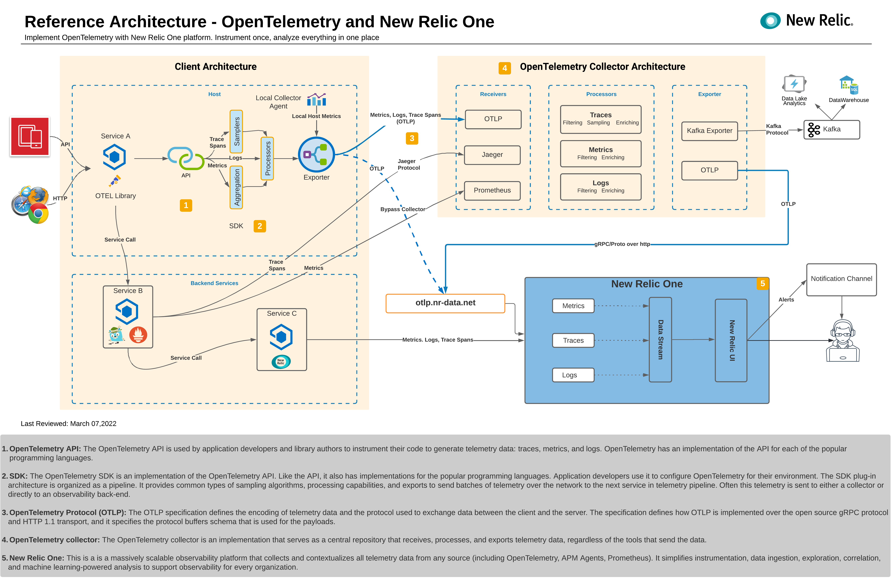

If you need guidance implementing OpenTelemetry with New Relic One, this reference architecture should help your software developers, DevOps, enterprise architects, and technology managers collaborate on the project. It is a template showing a bird's-eye view of common ways to implement OpenTelemetry with New Relic.

The diagram shows a New Relic One implementation that ingests telemetry from OpenTelemetry, Prometheus, Jaeger, and a New Relic APM agent. The three services (A, B, and C) are instrumented to send metrics, traces, and logs.

For data collected by OpenTelemetry, you can either send it directly to New Relic via the OTLP endpoint, or you can send it first to an optional OpenTelemetry collector. If you use the collector, it aggregates and enhances data pipelines before the telemetry is sent over to back-ends (Kafka for data analytics and New Relic One for end-to-end observability).

Click on the image to enlarge it:

