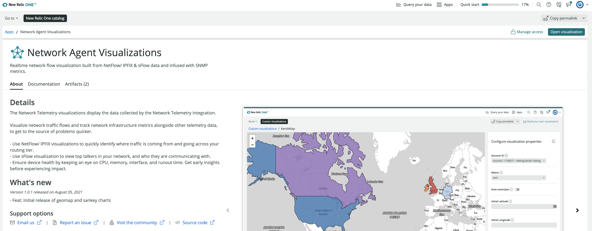
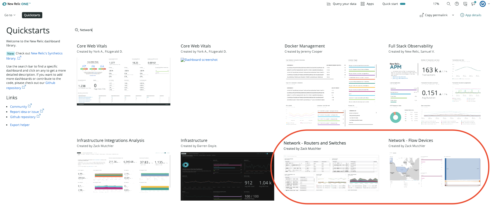

After you've set up your network data for performance monitoring, you can go to New Relic One to install several custom curated visualizations designed specifically for network performance montoring.

Once you've set up these visualizations, you'll be able to start exploring the network data your devices are reporting to New Relic One.

## Prerequisites [#prerequisites]

- Having set up your network performance monitoring devices.
- Add the custom visualizations app to your account:
    1. Go to [one.newrelic.com](https://one.newrelic.com) > **Apps**, and search for **Network Agent Visualizations**.
    2. Click the app, and then click **Open visualization**.
      
      <figcaption>
      [one.newrelic.com](https://one.newrelic.com) > **Apps**, and search for **Network Agent Visualizations**.
      </figcaption>
    3. From the **Account ID** dropdown, select the account you want to add the visualizations to, and click **Enable**.

## Add the custom visualizations dashboard to your account [#custom-viz]

You can go to New Relic One and import a dashboard containing these visualizations to see the data that these devices are reporting.

1. Go to [one.newrelic.com](https://one.newrelic.com) > **Apps**, and search for **Quickstarts**.
2. Click **Quickstarts**, and in the search bar, search for **Network** and click one of the dashboards:
  - The **Network - Routers and Switches** dashboard for SNMP data.
  - The **Network - Flow Devices** dashboard for network flow data.
  
  <figcaption>
  [one.newrelic.com](https://one.newrelic.com) > **Apps**, and search for **Network**.
  </figcaption>
3. Click **Import**, and
  - Select the account you want to add the dashboard to.
  - Edit the dashboard name, if you want to.
4. Click **Import dashboard**.

<Callout variant="tip">
If you want to read more about custom visualizations in New Relic One, see the [introduction to custom visualizations](https://developer.newrelic.com/explore-docs/custom-viz/).
</Callout>

## Start exploring your network performance data [#explore-network-performance-data]

Once you've finishe setting up these visualizations, you can start seeing your network data by going to:

- [one.newrelic.com](https://one.newrelic.com) > **Explorer**:
    - Entities are listed under the **Network** category in the left-hand side menu.
    - Open a specific device to see the details and trend of its performance.
    - On the top right-hand side, click **Lookout** to see anomalies.

- [one.newrelic.com](https://one.newrelic.com) > **Dashboards** you have an overview of your network performance data in the dashboards you imported.