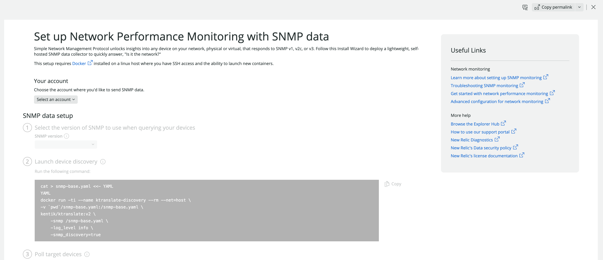

Set up your network devices so they send network data to New Relic One.

## Prerequisites [#prerequisites]

- A **New Relic account ID**. Read how to [find your account ID](https://docs.newrelic.com/docs/accounts/accounts-billing/account-setup/account-id/).
- An **Insights Insert Key**. Read how to [generate an Insights insert key](https://docs.newrelic.com/docs/apis/intro-apis/new-relic-api-keys/#insights-insert-key).
- [Docker](https://docs.docker.com/engine/install/) installed in a Linux host.
- SSH access to the Docker host, with the ability to launch new containers.
- We recommend using read-only community strings for SNMPv1 and SNMPv2c.
- We recommend read-only configuration for SNMPv3.

### Network security prerequisites [#prerequisites-network]

<table>
  <thead>
    <tr>
      <th style={{ width: "100px" }}>
        Direction
      </th>
      <th>
        Source
      </th>
      <th>
        Destination
      </th>
      <th>
        Ports
      </th>
      <th>
        Protocol
      </th>
    </tr>
  </thead>
    <tbody>
    <tr>
      <td>
        Outbound
      </td>
      <td>
        Docker host
      </td>
      <td>
        [Kentik's docker image GitHub repository](https://github.com/kentik/ktranslate)
      </td>
      <td>
        80, 443
      </td>
      <td>
        UDP, TCP
      </td>
    </tr>
    <tr>
      <td>
        Outbound
      </td>
      <td>
        Docker host
      </td>
      <td>
        [EU Logs endpoint](/docs/logs/log-management/log-api/introduction-log-api/#endpoint)
        ```
        https://log-api.eu.newrelic.com/log/v1
        ```
        [US Logs endpoint](/docs/logs/log-management/log-api/introduction-log-api/#endpoint)
        ```
        https://log-api.newrelic.com/log/v1
        ```
      </td>
      <td>
        80, 443
      </td>
      <td>
        UDP, TCP
      </td>
    </tr>
    <tr>
      <td>
        Outbound
      </td>
      <td>
        Docker host
      </td>
      <td>
        [Metrics endpoint](/docs/telemetry-data-platform/ingest-apis/metric-api/report-metrics-metric-api/#api-endpoint)
        ```
        https://log-api.eu.newrelic.com/log/v1
        ```
      </td>
      <td>
        80, 443
      </td>
      <td>
        UDP, TCP
      </td>
    </tr>
    <tr>
      <td>
        Outbound
      </td>
      <td>
        Docker host
      </td>
      <td>
        Target devices that will send SNMP data
      </td>
      <td>
        161
      </td>
      <td>
        TCP
      </td>
    </tr>
    </tbody>
</table>

## Set up SNMP data monitoring in New Relic One [#setup-snmp-monitoring]

1. Go to **[one.newrelic.com](https://one.newrelic.com)** and click **Add more data**.
2. Scroll down until you see **Network performance monitoring** and click **SNMP**.
3. Follow the steps in New Relic One.
  
    <figcaption>
    **[one.newrelic.com](https://one.newrelic.com)** > **Add more data** > **Network performance monitoring** > **SNMP** to set up SNMP data monitoring.
    </figcaption>
4. To get better visibility into your network, [set up network flow data monitoring](/docs/network-performance-monitoring/setup-performance-monitoring/network-flow-monitoring).
5. [Visualize your network performance data in New Relic](/docs/network-performance-monitoring/monitoring-network-data/visualize-network-data).

<CollapserGroup>
  <Collapser
    id="manual-setup"
    title="Manual setup"
  >
  If you prefer to do the setup manually, proceed with the following steps.

  1. In your local machine, from a Linux host with Docker installed, download the **ktranslate** image from [dockerhub](https://hub.docker.com/) by running 
  ```shell
  docker pull kentik/ktranslate:v2
  ```
  2. Copy the `snmp-base.yaml` file to the local `$HOME` directory of your Docker user, and discard the container by running
      ```shell
      cd .
      id=$(docker create kentik/ktranslate:v2)
      docker cp $id:/etc/ktranslate/snmp-base.yaml .
      docker rm -v $id
      ```
  3. Edit the `snmp-base.yaml` file and define the `cidrs` and `default_communities` variables to appropriate values for your network.
  4. Optionally, you can launch a discovery run on SNMP devices. This helps you ensure your devices are ready to be monitored. This discovery run is based on the values you defined for the `cidrs` and `default_communities` variables by running
      ```shell
      docker run -ti --name ktranslate-discovery --rm --net=host \
      -v `pwd`/snmp-base.yaml:/snmp-base.yaml \
      kentik/ktranslate:v2 \
          -snmp /snmp-base.yaml \
          -log_level info \
          -snmp_discovery=true
      ```
    After the discovery run finishes, you should see an output similar to the following:
    ```shell
    >[Info] KTranslate Adding 3 new snmp devices to the config, 0 replaced from 3
    # In this example, the discovery run found 3 new SNMP devices.
    ```
    The discovered devices are listed in the `snmp-base.yaml` file. By default, only the `IF-MIB` mib is polled. You can manually add other mibs here if your devices support them. 
  5. Run `ktranslate` to poll target devices. Use the following example:

    <Callout variant="important">
    Add your New Relic Insights insert key and your account ID in the `$NR_INSIGHTS_INSERT_KEY` and `$NR_ACCOUNT_ID` variables respectively.
    </Callout>

    ```shell
    docker run -d --name ktranslate-snmp --restart unless-stopped --net=host \
    -v `pwd`/snmp-base.yaml:/snmp-base.yaml \
    -e NEW_RELIC_API_KEY=$NR_INSIGHTS_INSERT_KEY  \
    kentik/ktranslate:v2 \
      -snmp /snmp-base.yaml \
      -nr_account_id=$NR_ACCOUNT_ID \
      -log_level=info \
      -metrics=jchf \
      -tee_logs=true \
      ## If your account is located in Europe, you need to add the following option:
      ## -nr_region=EU
      nr1.snmp 
    ```
  6. To get better visibility into your network, [set up network flow data monitoring](/docs/network-performance-monitoring/setup-performance-monitoring/network-flow-monitoring).
  7. [Visualize your network performance data in New Relic](/docs/network-performance-monitoring/monitoring-network-data/visualize-network-data).
  </Collapser>
</CollapserGroup>
