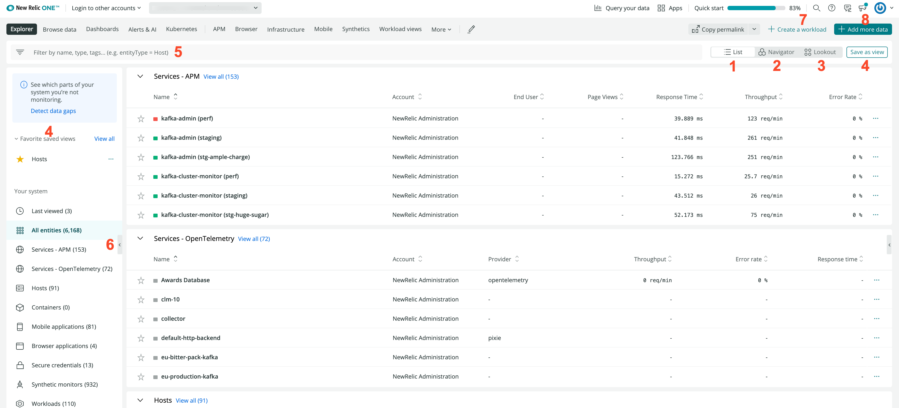
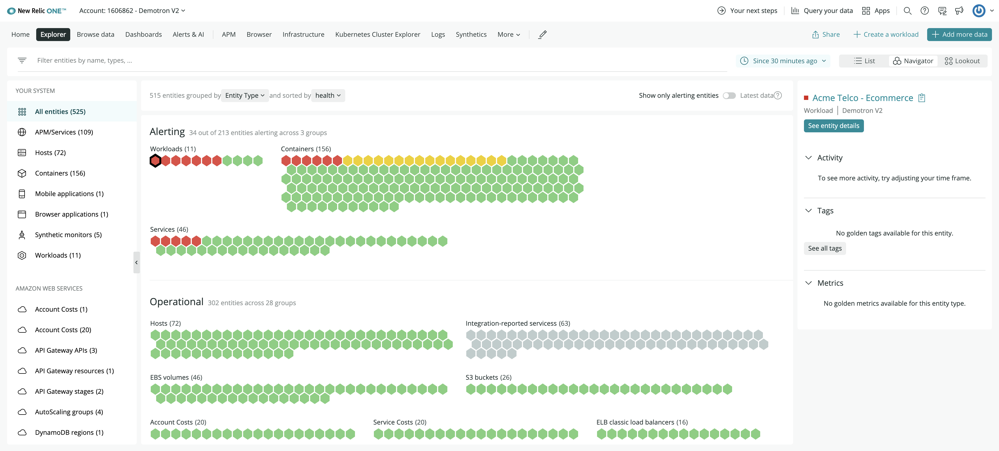
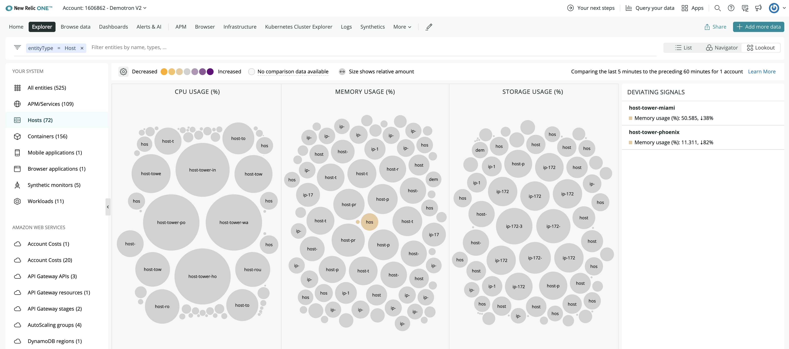

In digital business, systems are becoming increasingly large, complex, and interdependent. You have hundreds of applications and services running at the same time, and you need to monitor thousands of elements emitting data (we call those data sources [entities](/docs/new-relic-one/use-new-relic-one/core-concepts/what-entity-new-relic)).

With the New Relic Explorer, we give you a new, efficient front-door experience to easily observe the full stack of your software. We automatically create and maintain visibility from the data you send us. Use the New Relic Explorer to access and give context to the performance data from all your monitored applications, services, hosts, containers, synthetic monitors, etc. You can quickly see the entities related to a problem, exposing possible root causes and what other systems might be affected.

## Why it matters [#why-it-matters]

With the New Relic Explorer, it’s more than just observing the metrics: understand the root of what’s happening, not just the symptoms.

* Gain extensive visibility of each entity in your solution, its [alert status](#alert-status), and how the entities are connected, at a glance.
* See all your [workloads](/docs/new-relic-one/use-new-relic-one/workloads/workloads-isolate-resolve-incidents-faster), and create a new one in a click.
* Get a high level view of how your system’s doing with the New Relic Navigator.
* Quickly grasp unusual trends and behaviors with New Relic Lookout.
* Filter and group related entities to quickly drill down to the issues.
* Troubleshoot issues with tools that are faster, less cumbersome, and more accurate.
* Identify areas of improvement, and plan your changes.

Want to learn more? See the video (it's only 45 seconds!):

<Video
  type="wistia"
  id="gs5d8zlodq"
/>

<Icon name="fe-play-circle"/>

Short guide to using the New Relic Explorer.

## View and connect the performance of your entities [#find]

Access the New Relic Explorer at **[one.newrelic.com](http://one.newrelic.com)** and see together data reported by any [entity](/docs/new-relic-one/use-new-relic-one/core-concepts/what-entity-new-relic) from across all of your New Relic accounts. Entity categories include:

* **Services**: [APM](/docs/apm)-monitored applications and services monitored.
* **Hosts**: your monitored [infrastructure](/docs/infrastructure) (your servers and hosts).
* **Mobile applications**: your [mobile apps](/docs/mobile-monitoring).
* **Browser applications**: your front-end [browser apps](/docs/browser).
* **Integration-reported data**: data from services monitored by [our integrations](https://newrelic.com/integrations), including our [on-host integrations](/docs/integrations/host-integrations/getting-started/introduction-host-integrations) (like Kubernetes, StatsD, and NGINX), and cloud platform integrations, like Amazon, Microsoft Azure, and Google Cloud Platform (GCP).
* **Workloads**, your customized entity groupings.
* **Containers**, such as Kubernetes or Docker.
* **[Synthetic monitors](/docs/synthetics)**, for simulations.

<Callout variant="tip">
  You can create new entity types to monitor any data source. Learn more about [entity synthesis](https://github.com/newrelic/entity-definitions#entity-definitions).
</Callout>

Toggle between the Explorer's three views and the following features:

<figcaption>
  **[one.newrelic.com](http://one.newrelic.com) > Explorer**: Use the New Relic Explorer to locate and examine the entities you monitor.
</figcaption>

1. **[List](#view-list)**. Browse and filter from a list of all the entities in your account. Use this landing interface to navigate, group, and filter your entities.
2. **[New Relic Navigator](#view-navigator)**. Get a high density overview of all your entities, grouped by entity type or by tags. Use this to detect any issues and health patterns at a glance.
3. **[New Relic Lookout](#view-lookout)**. Spot entities that have recent performance deviations. Use this to quickly identify unusual behaviors. 
4. **Saved views**. Save your favorite filters as a view and recover them in a click each time you return to the Explorer. 
5. **[Filterbar](#filter-tag)**. Drill down and locate problematic entities easily with our improved search capabilities, and benefit from the `AND` and `OR` operators in one place.
6. **See everything**. All the different entity types you have access to are listed in the collapsible sidebar on the left of the screen. This sidebar is interactive and used for exploratory purposes. It allows you to see only entities of the selected type, as it updates the filter from the filterbar.
7. Create a new **[workload](/docs/new-relic-one/use-new-relic-one/workloads/workloads-isolate-resolve-incidents-faster)** for meaningful groupings of your monitored entities.
8. **Add more data** to instrument more elements of your system and achieve full stack observability.

### List view [#view-list]

Your monitored entities are on the left, in a collapsable menu. You may need to scroll your list of entities to see them all.

The list view also has a collapsable activity stream on the right side. You can see different useful events related to the first 25 alerting entities which are currently being filtered.

Click on any entity for more details on its performance. The entity overview also incorporates the relationship between the selected entity and other [entities in your system](/docs/new-relic-one/use-new-relic-one/core-concepts/what-entity-new-relic).

### New Relic Navigator [#view-navigator]

The New Relic Navigator makes it easy to explore large numbers of entities as it intuitively displays the entire estate of your system in a highly dense honeycomb view with traffic light colors based on alerts.

With the New Relic Navigator you can:

* Quickly explore the health of your environment at a glance.
* See all the entities that belong to all your accounts, and focus on specific entity types or specific groups of entities grouped by tags.
* Group and filter across all your entities to quickly zero in on issues.
* Click on any entity to see a mini-overview of its activity, metrics, and meta-data.

### New Relic Lookout [#view-lookout]

New Relic Lookout provides an intuitive view of entities that are deviating from normal behavior, using circle visualization with color indicating severity and size conveying the scale of recent changes. You don’t need to configure anything: New Relic Lookout automatically compares performance within the last five minutes against the previous hour.

Use New Relic Lookout to:

* Select the entity type to see golden signals of throughput, response time, and errors across all your accounts.
* Zoom in with correlations, abnormal history, traces, and the ability to leverage New Relic’s profiles across your estate.
* Click on an entity of interest to access the mini-overview component.

Read more about [New Relic Lookout](/docs/new-relic-one/use-new-relic-one/core-concepts/new-relic-lookout-monitor-your-estate-glance).

<Callout variant="tip">
  You can modify the color palette to focus on clusters of interest.
</Callout>

## Understand the state of your system with the health (alert) status [#alert-status]

The New Relic Explorer shows a color-coded [health](/docs/alerts/new-relic-alerts/getting-started/introduction-new-relic-alerts) status for entities. For example, you may see a red alert status indicating a critical violation in progress.

* To see what an alert status means, mouse over it.
* To see details about an entity's alerting status, select the entity.

[NRQL alert conditions](/docs/alerts/new-relic-alerts/defining-conditions/create-alert-conditions-nrql-queries) aren't used to determine alert status because they aren't associated with specific entities.

<Callout variant="important">
  Starting June 8, 2020, New Relic One will not continue to display any APM application that hasn't reported data for 93 days. To match our published APM [data retention guidelines](/docs/accounts/accounts/data-management/overview-data-retention-components#apm), applications that have not reported data will be available within the New Relic UI for 90 days. After 90 days, those applications will be removed from the UI; however, key metrics will continue to be available via the New Relic REST API based on subscription level. For more information, see New Relic's [Explorers Hub post](https://discuss.newrelic.com/t/new-relic-feature-end-of-life-announcements/105772).
</Callout>

## Filter entities using the filterbar [#filter-tag]

The filterbar lets you select the entities displayed according to the conditions you enter:

1. Type in a **string** of characters and/or numbers (for example, an environment) to find any entity that has this string in their name or ID. When typing, the UI suggests items that coincide with the string you're entering, so you can select one of those from the dropdown. You can also filter by the name of the **entity**, the **entity type**, **account ID**, **environment**, or a [**tag**](/docs/new-relic-one/use-new-relic-one/core-concepts/tagging-use-tags-organize-group-what-you-monitor).

   <Callout variant="tip">
     Selection parameters, once created, have a blue background.
   </Callout>
2. If you filter using a string, the filter will have the `=` operator.
3. If you filter using the dropdown menu, once the first element of the searched item (tag key or attribute) is entered, you need to select an operator (`=`, `!=`, `LIKE`, `NOT_LIKE`, `IN`, `NOT IN`) for your filter.
4. Once the operator is selected, complete the filter by selecting the value to complete the search item.

To add more filters, first you have to select an operator, `AND` or `OR.`

* Use `AND` to indicate you want to restrict the selection removing entities from the list of results. You can also use the AND operator to add conditions that need to be met in the list of results, for example, **entityType = Services `AND` location = APAC**.
  * Note that **entityType = Services `AND` entityType = Hosts** doesn’t return any results, as entities can only have one type and no entity would match this condition.
* Use `OR` to add more entities to the selection. For example, the filter **entityType = Services `OR` entityType = Hosts** returns every entity you have access to that is of type `Services` or `Hosts`.

## Entity data retention [#data-retention]

Availability of data depends on these factors:

<table>
  <thead>
    <tr>
      <th style={{ width: "200px" }}>
        Scope
      </th>

      <th>
        Data retention
      </th>
    </tr>
  </thead>

  <tbody>
    <tr>
      <td>
        New Relic Explorer and search
      </td>

      <td>
        In the UI, data is available for eight days after an entity no longer exists, with one exception: data reported by integrations, such as Amazon AWS, is only available for one day after an entity ceases to exist.
      </td>
    </tr>

    <tr>
      <td>
        Our database (accessible via [NRQL query](/docs/insights/nrql-new-relic-query-language/using-nrql/introduction-nrql))
      </td>

      <td>
        For querying our database (for example, via the [query builder](/docs/query-your-data/explore-query-data/query-builder/introduction-query-builder) or data explorer), availability is dependent on the [data retention](/docs/telemetry-data-platform/get-data-new-relic/manage-data/manage-retention-stored-data) for that data type.
      </td>
    </tr>
  </tbody>
</table>

As a result of these factors, a short-lived entity (like a cloud host) may not be available in the explorer list or via search, but its data may still be available via NRQL query.
