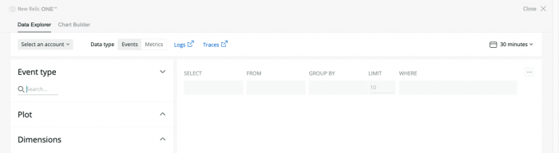

Welcome to [New Relic One](/docs/new-relic-one/use-new-relic-one/get-started/introduction-new-relic-one)! We’ve streamlined and enhanced your Full-Stack Observability platform to make it open, connected, and programmable. This transition guide explains how to take advantage of new capabilities to achieve the same goals you’re used to doing in New Relic, and more!

We will continue to improve and simplify your experience with the New Relic One platform. As always, we're here to help, and we also want to learn what you like and dislike about your new experience.

Want to view our UI in dark mode? [Learn how to switch between a dark or light theme](/docs/using-new-relic/welcome-new-relic/get-started/view-our-ui-dark-mode).

 To give us immediate feedback: At the top of any New Relic One UI page, click the **comment** icon.

## See why it matters [#why]

Whether you're a software engineer, part of an operations team, a site reliability engineer, or an executive, you must keep your business running and your customers satisfied. Watch this video (approx. 3:30 minutes) to start making the transition to New Relic One.

<Video
  type="youtube"
  id="NjkHQDS870k"
/>

With New Relic One, you can quickly and easily:

* Observe, visualize and troubleshoot your entire software stack. Anticipate, find, and fix problems faster, and understand how your software performance drives business outcomes.
* Pinpoint outages and performance problems originating from anywhere across your entire software stack to get things up and running in moments.
* Improve uptime and performance, drive operational efficiency, and accelerate time to market.
* Instrument everything so you have no blind spots, understand your complex systems quickly so you can act more effectively, and build views and workflows that drive your business.
* Collect all your telemetry data in one place to power Full-Stack Observability and insights driven by Applied Intelligence so you can confidently improve service reliability and accelerate time to market.

**<Icon style={{color: 'green'}} name="fe-info"/>
Learn more for a successful transition:**

* [Introduction to New Relic](/docs/using-new-relic/welcome-new-relic/get-started/introduction-new-relic)

## Get started

New Relic One is a unified user experience that makes it easier for you to navigate the platform, find and diagnose problems, and take advantage of new, more powerful features. To get started, go to [one.newrelic.com](https://one.newrelic.com) or [one.eu.newrelic.com](https://one.eu.newrelic.com) as applicable.

To customize your New Relic One experience, you can add your favorite apps, teams, and other resources to your homepage.

From the New Relic One homepage, you can:

* See the current health across your ecosystem.
* Troubleshoot problems and find patterns in anomalies.
* Query data and share information with others.
* Find areas to optimize performance.

<Callout variant="tip">
  If your New Relic One homepage is blank when you first visit it, add your favorite apps, services, teams, etc. to it. Then the homepage will have everything important about your ecosystem's resources in one place, including their current health, alert patterns and violations, and links to more details and resources.
</Callout>

**<Icon style={{color: 'green'}} name="fe-info"/>
Learn more for a successful transition:**

* [Introduction to New Relic One](/docs/new-relic-one/use-new-relic-one/get-started/introduction-new-relic-one)

## Navigate the UI [#ui-new]

New Relic One gives you a single platform that unites your telemetry data, connects your full-stack resources, and helps you build more perfect software. We've organized the homepage so you can navigate the UI in any way that best fits your needs.

<Table>
  <thead>
    <tr>
      <th style={{ width: "200px" }}>
        Navigate the UI
      </th>

      <th>
        Tips for a successful transition
      </th>
    </tr>
  </thead>

  <tbody>
    <tr>
      <td>
        Unified view on homepage
      </td>

      <td>
        In the previous UI experience, you had to go to separate pages to view your applications (via `rpm.newrelic.com`) or view your hosts and integrations (via `infrastructure.newrelic.com`). The new UI combines all of your full-stack monitoring needs on a single homepage for fast, easy access.

        When you go to [**one.newrelic.com**](https://one.newrelic.com) or [**one.eu.newrelic.com**](https://one.eu.newrelic.com), you see links to all of your resources. You can also query your telemetry data, create charts, and share your dashboards from here.
      </td>
    </tr>

    <tr>
      <td>
        Entity explorer
      </td>

      <td>
        The [entity explorer](/docs/new-relic-one/use-new-relic-one/ui-data/new-relic-one-entity-explorer-view-performance-across-apps-services-hosts) link in the top nav takes you to all of your services, hosts, applications, and groups. You can quickly search and filter, select favorites, review metadata, and get color-coded health status at a glance.

        <Callout variant="tip">
          If you need to copy your GUID in the metadata and it truncates, use **CMD C** (Mac) or **CTRL C** (Windows).
        </Callout>
      </td>
    </tr>

    <tr>
      <td>
        Global search
      </td>

      <td>
        You can search across all apps and resources with the global search feature at the top of the homepage. You can also search across all data types reporting to New Relic. Whether it's a dashboard, an application, a host, a synthetic script, or a cloud service, one search can find them all.
      </td>
    </tr>

    <tr>
      <td>
        Online help
      </td>

      <td>
        To view documentation and support resources directly in the UI: At the top of any page, click the question <Icon name="fe-help-circle"/>
        icon.
      </td>
    </tr>

    <tr>
      <td>
        Customizable experience 
      </td>

      <td>
        We've moved the [app launchers](/docs/using-new-relic/welcome-new-relic/get-started/glossary#launcher) to their own experience. From the homepage, click the **apps** icon, then:

        * Add favorite apps and entities so they are easily in sight.
        * Add others in your account if you are a [Nerdpack manager](/docs/new-relic-one/use-new-relic-one/build-new-relic-one/new-relic-one-applications-requirements-security#security).
        * Browse the [New Relic One Catalog](/docs/new-relic-one/use-new-relic-one/build-new-relic-one/discover-manage-applications-new-relic-one-catalog) of publicly available apps and apps that you create directly in the UI.
        * Download the [CLI](https://developer.newrelic.com/explore-docs/nr1-cli) to build your own apps.
      </td>
    </tr>

    <tr>
      <td>
        UI views toggle
      </td>

      <td>
        If the original UI view has a feature or functionality you want, or if New Relic One presents a feature that you preferred in the original view, you can toggle between experiences at the top right of the page.
      </td>
    </tr>
  </tbody>
</Table>

**<Icon style={{color: 'green'}} name="fe-info"/>
Learn more for a successful transition:**

* [Core concepts](/docs/new-relic-one/use-new-relic-one/core-concepts) in New Relic One
* [UI and collecting data](/docs/new-relic-one/use-new-relic-one/ui-data) in New Relic One
* [Build on New Relic One](/docs/new-relic-one/use-new-relic-one/build-new-relic-one/new-relic-one-build-your-own-custom-new-relic-one-application)
* [New Relic One Catalog](/docs/new-relic-one/use-new-relic-one/build-new-relic-one/discover-manage-applications-new-relic-one-catalog)

New Relic One has multiple ways to [query and chart your data](#explore-data) from the **Dashboards** link on the top nav. That's why Insights is not listed there. However, you can still access your old Insights dashboards and data from the **More** dropdown at the top of the homepage, or simply click **Dashboards**. Learn more about how to make the [transition from Insights to New Relic One](/docs/new-relic-one/use-new-relic-one/core-concepts/transition-new-relic-one-insights).

## Get started with instrumentation [#instrumentation]

 Get data from your stack flowing into New Relic from a single location, and stay up to date with the latest agents, integrations, and reporting services.

* If you're already using New Relic One: At the top of the UI, click **Add more**, then search for or select whatever you want.
* If your New Relic One homepage is blank: Click **Add more data**, then search for or select whatever you want.

When you click **Add more**, New Relic One presents a unified page where you can extend your instrumentation with any programming languages and frameworks you need.

The UI immediately provides interactive steps to select the languages and frameworks you need.

<Table>
  <thead>
    <tr>
      <th style={{ width: "200px" }}>
        Extend your instrumentation
      </th>

      <th>
        Comments
      </th>
    </tr>
  </thead>

  <tbody>
    <tr>
      <td>
        Front-end and back-end monitoring
      </td>

      <td>
        Programming languages, frameworks, and customer experience monitoring for:

        * Back-end (C, Go, Java, .NET, Node.js, PHP, Python, Ruby)
        * Front-end (browsers or synthetic monitors)
        * Mobile (Android, iOS, tvOS) applications
      </td>
    </tr>

    <tr>
      <td>
        Cloud and platform technologies
      </td>

      <td>
        Cloud computing, container orchestration, and serverless technologies, including Amazon Web Services (AWS), Amazon ECS, Microsoft Azure, Google Cloud Platform, Kubernetes, and Lambda
      </td>
    </tr>

    <tr>
      <td>
        Host operating systems
      </td>

      <td>
        Linux and Windows systems, including Amazon Linux, CentOS, CoreOS, Debian, RHEL, SLES, Ubuntu, and Windows Servers
      </td>
    </tr>

    <tr>
      <td>
        Log ingestion
      </td>

      <td>
        Plugins for log aggregators and log forwarders, including Fluentd, AWS Cloudwatch, Logstash, Fluent Bit, and AWS FireLens
      </td>
    </tr>

    <tr>
      <td>
        Infrastructure
      </td>

      <td>
        Data stores, message brokers, proxy servers, and other services
      </td>
    </tr>

    <tr>
      <td>
        Open source monitoring systems
      </td>

      <td>
        Integrations to other telemetry collection systems, such as JMX, Nagios, Prometheus, SNMP, StatsD, Kamon, Micrometer, and OpenTelemetry
      </td>
    </tr>
  </tbody>
</Table>

**<Icon style={{color: 'green'}} name="fe-info"/>
Learn more for a successful transition:**

* [All integrations](https://newrelic.com/integrations)
* New Relic agent [installation](/docs/agents/manage-apm-agents/installation/install-agent) and [configuration](/docs/using-new-relic/cross-product-functions/install-configure/configure-agent)
* [Serverless technologies](/docs/serverless-function-monitoring)
* [Host operating system integrations](/docs/integrations/host-integrations/installation/install-host-integrations-built-new-relic)
* [Logging plugins](/docs/logs/enable-logs/enable-logs/enable-new-relic-logs)
* [Infrastructure integrations](/docs/integrations/infrastructure-integrations/get-started/introduction-infrastructure-integrations)
* [Open source telemetry integrations](/docs/integrations/open-source-telemetry-integrations)

## Explore your data [#explore-data]

Collect, explore, and alert on all your metrics, events, logs, and traces from any source with our open and unified telemetry database. Automatic integrations for open-source tools enable easy setup, eliminating the cost and complexities of hosting, operating, and managing additional monitoring systems or data stores.

To use a single resource where you can explore any data type, including metrics, events, logs, and traces: At the top of any New Relic One page, click the **Query your data** icon.

We offer several ways to help you explore your data:

* If you don't want to use [NRQL](/docs/query-your-data/nrql-new-relic-query-language), use the data explorer to navigate your data and create customized visualizations.
* If you're new to running queries, go to the [query builder](/docs/chart-builder/use-chart-builder/get-started/introduction-chart-builder), where you can run queries and build charts using our assisted (basic) mode.
* If you're comfortable with running NRQL or [PromQL](/docs/integrations/prometheus-integrations/view-query-data/translate-promql-queries-nrql)-type queries, try the query builder's advanced mode.
* If you want to run multiple queries, include `TIMESERIES`.

From the New Relic One **data explorer** page, you can navigate all data types, or you can click **query builder** to query, visualize, and share this data.

**<Icon style={{color: 'green'}} name="fe-info"/>
Learn more for a successful transition:**

* [Data types](/docs/using-new-relic/data/understand-data/new-relic-data-types)
* [Query your data via UI or API](/docs/using-new-relic/data/understand-data/query-new-relic-data)
* [Visualize your data with charts and dashboards](/docs/dashboards/new-relic-one-dashboards/get-started/introduction-new-relic-one-dashboards)
* [Terms and conditions](/docs/licenses/product-or-service-licenses/new-relic-one/preview-access-new-relic-one) during your New Relic One preview period

If you feel more comfortable navigating from Insights while making the [transition from Insights to New Relic One](/docs/new-relic-one/use-new-relic-one/core-concepts/transition-new-relic-one-insights): At the top of any New Relic One page, select **More > Insights**.

## Troubleshoot more efficiently [#troubleshoot]

Everything is interconnected with New Relic One. The relationships between your apps, services, and alerts are all combined in a single, unified user interface. You get a holistic picture of your entire technology ecosystem, especially when problems are detected.

New Relic One's **Alerts & AI** link gives you a single starting point to identify, troubleshoot, and prevent problems across your ecosystem before they impact your customers.

For example:

* New Relic Diagnostics automatically detects common problems with New Relic agents and suggests troubleshooting steps. It can also attach troubleshooting data to your support ticket automatically.
* Alerts will notify you when things that matter to you are going wrong, while Applied Intelligence and muting rules help you screen out items you don't want to see.
* Workloads give you the tools to group and monitor entities in ways that make sense to you. This helps you to understand your complex systems, detect issues, and understand how and why something goes wrong, so you can resolve problems quickly.

**<Icon style={{color: 'green'}} name="fe-info"/>
Learn more for a successful transition:**

* [New Relic Diagnostics](/docs/using-new-relic/cross-product-functions/troubleshooting/new-relic-diagnostics)
* [Alerts](/docs/alerts/new-relic-alerts/getting-started/introduction-new-relic-alerts)
* [Applied Intelligence](https://docs.newrelic.com/docs/new-relic-one/use-new-relic-one/new-relic-ai/introduction-new-relic-ai)
* [Muting rules](/docs/alerts/new-relic-alerts/managing-notification-channels/muting-rules-suppress-notifications)
* [Workloads](/docs/new-relic-one/use-new-relic-one/core-concepts/new-relic-one-workloads-isolate-resolve-incidents-faster)

## Use developer resources [#open-source]

New Relic was founded by developers for developers, and that mindset is still a cornerstone of our mission. We have centralized our resources to deliver the code where you can more easily access, customize, and contribute to it.

For example, **[developer.newrelic.com](https://developer.newrelic.com)**, our developer hub, helps you build apps and other solutions. You can customize the data you want to see, visualized the way you want to see it.

The developer site is open source, and we welcome your input and requests for content! We have a growing selection of guides to help you get started and try out several development tasks to:

* Collect data
* Automate workflows
* Build apps
* Use the New Relic API Explorer or NerdGraph API Explorer

Through **[opensource.newrelic.com](https://opensource.newrelic.com)**, we are creating a community of developers and a library of open source projects (more than 180 at last count). This site will help you get the precise data you need and visualize it the way you most want to see it.

We also recognize developer expertise and leaders in the technical community through our [developer champion](https://developer.newrelic.com/developer-champion) program. Check it out and get involved!

**<Icon style={{color: 'green'}} name="fe-info"/>
Learn more for a successful transition:**

* Review our guides and video for getting started, then start coding at **[developer.newrelic.com](https://developer.newrelic.com)**.
* Watch a video overview, then explore our open source and open standards projects at **[opensource.newrelic.com](https://opensource.newrelic.com)**.
* Check out our [Developer toolkit on GitHub](https://newrelic.github.io/developer-toolkit/), and learn about our [CLI](https://github.com/newrelic/newrelic-cli).
* Read the [blog post about your open source community resources](https://blog.newrelic.com/product-news/announcing-new-relic-open-source/).

## New Relic feature end-of-life announcements [#eol-release-notes]

Many changes to your UI experience are related to functions and features that reached end of life (EOL). For more information, including action items to help you make a successful transition from your EOL experience to your new experience in New Relic One, see the [July 2020 EOL announcements](/docs/new-relic-one/use-new-relic-one/ui-data/new-relic-feature-end-life-announcements-july-2020).
