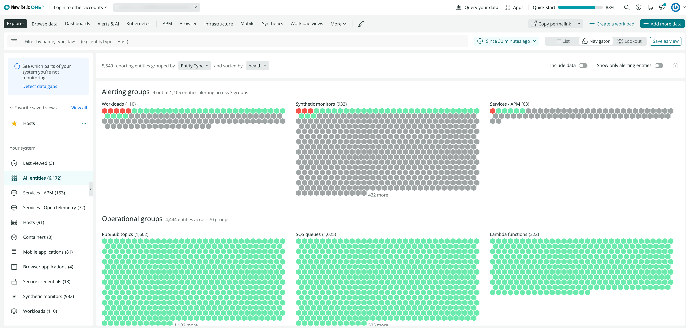
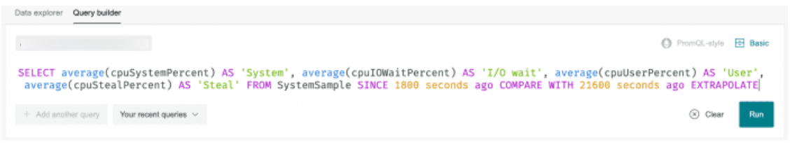
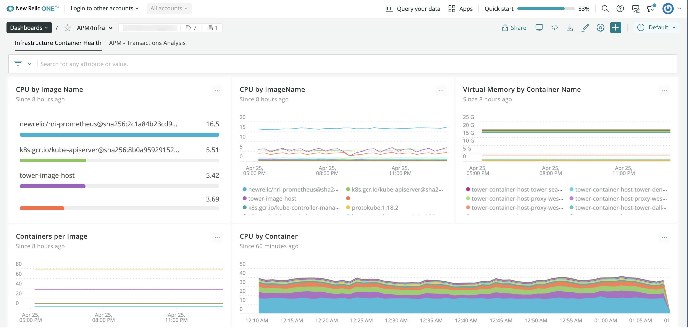

New Relic One provides an integrated platform where you can explore core capabilities like querying data and building charts, dig deeper into more curated [observability experiences](/docs/full-stack-observability/monitor-everything/get-started-new-relic-monitoring-tools/get-started-full-stack-observability#h2-start-anywhere) in the UI, and use our [alerting and Applied Intelligence](/docs/alerts-applied-intelligence) tools. With New Relic One, you can see and act on all the data throughout your entire ecosystem.

<figcaption>
  To access New Relic One, go to **[one.newrelic.com](https://one.newrelic.com)**. Or, if you report data to our EU data center, go to **[one.eu.newrelic.com](https://one.eu.newrelic.com)**.
</figcaption>

<Callout variant="tip">
  This doc gives you detailed information about why New Relic One's capabilities matter to your business. But if you want to skip ahead, just [sign up for a New Relic account](https://newrelic.com/signup). (It's free, forever!) Then, after you [install New Relic](/docs/using-new-relic/cross-product-functions/install-configure/install-new-relic/), you can start [working with your data](/docs/data-apis/get-started/nrdb-horsepower-under-hood).
</Callout>

## Quickly understand context [#context]

We provide multiple ways to understand your system's dependencies, so you can easily see how everything fits together and troubleshoot problems. New Relic One gives you and your teams a connected view that cuts through complexity! 

<table>
  <thead>
    <tr>
      <th style={{ width: "250px" }}>
        If you want to...
      </th>

      <th>
        Use this
      </th>
    </tr>
  </thead>

  <tbody>
    <tr>
      <td>
        Have an overall view of your system, and drill down to get performance details.
      </td>

      <td>
        * Use the [New Relic Explorer](/docs/new-relic-one/use-new-relic-one/core-concepts/entity-explorer-view-performance-across-apps-services-hosts) as the front door to New Relic One. Observe, group, and filter the performance data from all your system's [entities](/docs/new-relic-one/use-new-relic-one/core-concepts/what-entity-new-relic), including applications, services, hosts, and containers.

        * Gain extensive visibility into each entity in your solution, its alert status, and how the entities are connected.
        
        * Use the [New Relic Navigator](/docs/new-relic-one/use-new-relic-one/core-concepts/new-relic-explorer-view-performance-across-apps-services-hosts/#view-navigator) to give you a high density overview of all your entities so you can detect any issues at a glance.
        
        * Use [New Relic Lookout](/docs/new-relic-one/use-new-relic-one/core-concepts/new-relic-explorer-view-performance-across-apps-services-hosts/#view-lookout) to spot entities recently experiencing deviations from expected behavior.
      </td>
    </tr>

    <tr>
      <td>
        Provide context for your entities.
      </td>

      <td>
        Use tags to illustrate relationships and contextual information for what you monitor. By thoughtfully tagging your entities, you can connect all the data your teams need to understand their increasingly complex and interdependent systems. For example:

        * [Add tags](/docs/tagging-use-tags-organize-group-what-you-monitor) to all your entities.
        
        * [Create tags via API](/docs/apis/graphql-api/tutorials/graphql-tagging-api-tutorial) for teams and all the services they monitor. 
      </td>
    </tr>

    <tr>
      <td>
        See how each part of your system is connected.
      </td>

      <td>
        Review [service maps](/docs/service-maps-new-relic-one) that illustrate your upstream and downstream dependencies.
      </td>
    </tr>

    <tr>
      <td>
        Visualize the aggregated health and activity data from all you monitor.  
      </td>

      <td>
        Group and monitor any entities together into functional team-focused, project-focused groupings, or any other attribute, with [workloads](/docs/new-relic-one/use-new-relic-one/core-concepts/new-relic-workloads-create-groupings-entities). 
      </td>
    </tr>

    <tr>
      <td>
        Fetch and analyze specific data.
      </td>

      <td>
        Get more context while you query with the [query builder](/docs/introduction-chart-builder), which surfaces data definitions as you craft and edit queries.
      </td>
    </tr> 

    <tr>
      <td>
        Create visuals that showcase your business needs at a glance. 
      </td>

      <td>
        Tailor [custom dashboards](#dashboards) for your unique needs. 
      </td>
    </tr>

    <tr>
      <td>
        Find a service or dashboard in a complex environment.
      </td>

      <td>
        * Search by name [across all accounts](/docs/new-relic-one/use-new-relic-one/core-concepts/cross-account-features-security) in the unified search.
        * Filter the explorer by tags or text.
        * View everything you’re monitoring in one place, like entities or dashboards, across your organization.       
      </td>
    </tr>

    <tr>
      <td>
        View a list of all the dependencies for a service.
      </td>

      <td>
        Use the [dependencies](/docs/new-relic-one/use-new-relic-one/ui-data/new-relic-one-dependencies-page) tab in an entity summary to see all the dependencies of the entity you’re viewing.
      </td>
    </tr>

    <tr>
      <td>
        Track activity as it moves across your distributed system.
      </td>

      <td>
        Use our [distributed tracing](/docs/distributed-tracing-new-relic-one) solution to analyze your complex environment.
      </td>
    </tr>

    <tr>
      <td>
        Understand how everything is connected via API.
      </td>

      <td>
        Use our [NerdGraph GraphiQL explorer](/docs/apis/graphql-api/getting-started/introduction-new-relic-graphql-api) to manage all your entities, tags, and relationships.
      </td>
    </tr>
    </tbody>
</table>

## Query your data more easily [#chart-builder]

On the **Browse data** menu on the top navigation menu you can easily access your basic telemetry data (metrics, events, logs, and traces).

Wherever you go in the UI, **Query your data** is available. No matter your level of proficiency with our query language, you can create custom queries and charts:

* Browse your data in a query-less experience with our [data explorer](/docs/query-your-data/explore-query-data/data-explorer/introduction-data-explorer).
* Use your NRQL (our query language) expertise to build custom charts in the [query builder](/docs/specify-data-chart#use-advanced).
* [Run PromQL-style queries](/docs/query-your-data/explore-query-data/query-builder/use-advanced-promql-style-mode-query-data) in the query builder.

<figcaption>
  **[one.newrelic.com](https://one.newrelic.com) > Query your data**: Build NRQL and PROMQL-like queries.
</figcaption>

## Enhanced dashboards [#dashboards]

<figcaption>
  **[one.newrelic.com](https://one.newrelic.com) > Dashboards**: Quickly create information-dense custom views into the data that matters most to you with dashboards in New Relic One.
</figcaption>

New Relic One [dashboards](/docs/introduction-new-relic-one-dashboards) let you build better visualizations more easily, with more options to customize. Dashboard features include:

* Perform [NRQL](/docs/insights/nrql-new-relic-query-language/using-nrql/introduction-nrql) queries and create charts and dashboards everywhere in the platform using the [query builder](/docs/chart-builder/use-chart-builder/get-started/introduction-chart-builder).
* [Manage your charts and dashboards](/docs/explore-dashboards-index) easily using our quick-access CRUD menus and editing options.
* Explore and contextualize data with advanced tooltips and zoom in functions to monitor what your systems are doing in real time.
* Search your dashboards for attributes and metrics.
* [Send data](/docs/insights/insights-data-sources/custom-data/send-custom-data-insights) to your dashboards using our agents, integrations, and APIs.
* Share dashboards or charts as a .pdf, or embed a chart in an external site.

If you previously used New Relic Insights to create dashboards, they are [available as New Relic One dashboards](/docs/new-relic-one/use-new-relic-one/core-concepts/transition-new-relic-one-insights).

## Build on New Relic One [#build]

If custom charts and dashboards don't solve your current challenge, we give you a framework for building React JavaScript applications that:

* Live on [New Relic One](/docs/new-relic-one/use-new-relic-one/get-started/introduction-new-relic-one), alongside your other New Relic-monitored data.
* Feature highly tailored visualizations.
* Display data from any source you want, whether from a New Relic-monitored entity or data from any service or API.

And you can use open source apps built by the community, and contribute your own open source apps.

To learn more, see [New Relic One applications](/docs/new-relic-programmable-platform-introduction).

## What’s next? [#what-next]

Start exploring your data in New Relic One!

* Start using our [basic UI features](/docs/new-relic-one/use-new-relic-one/ui-data/basic-ui-features/).
* See what data you have available with the [data explorer](/docs/query-your-data/explore-query-data/data-explorer/introduction-data-explorer).
* Browse your monitored entities with the [New Relic Explorer](/docs/new-relic-one/use-new-relic-one/ui-data/new-relic-one-entity-explorer).
* Use our [NerdGraph API](/docs/apis/graphql-api/getting-started/introduction-new-relic-graphql-api) to [add tags](/docs/apis/graphql-api/tutorials/graphql-tagging-api-tutorial) to your data.
* Learn about [dashboards](/docs/dashboards/new-relic-one-dashboards/get-started/introduction-new-relic-one-dashboards).
