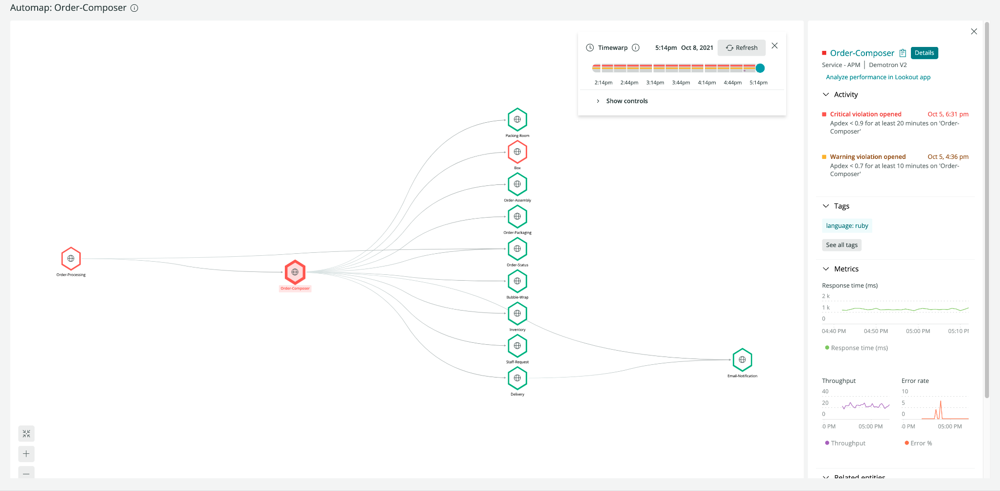
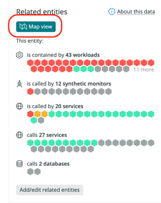
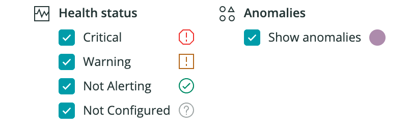

The New Relic automap feature displays entity-centric maps to help you troubleshoot incidents that cascade through interconnected services. With automap, you can pinpoint when and where an issue began by viewing the dependencies that affect your services.

To use automap, you need a New Relic account. If you don't already have one, you can sign up [here](https://newrelic.com/signup) for a free account.

<figcaption>
Here's an example of where you could start troubleshooting with automap.
</figcaption>

## How it works [#how-works]

New Relic automap displays relationships between entities in your architecture. For version 1, the relationships displayed in automap are based on direct calls between services. For example, APM services are represented as vertices (hexagons) and direct calls are represented as edges (lines) on the graph. This shows you how these services depend on one another. 

 Automap displays only the entities related to the source entity that have experienced a change in health status within three hours after the automap was launched. So, it may not show all entities related to the source entity. To understand entities and relationships, as well as how the entity platform synthesizes both from telemetry data, see [entities](https://docs.newrelic.com/docs/new-relic-one/use-new-relic-one/core-concepts/what-entity-new-relic/) and [relationships](https://docs.newrelic.com/docs/apis/nerdgraph/examples/nerdgraph-relationships-api-tutorial/).

<Callout variant="important">
Automap auto-expand logic relies on the health status of an entity, which is largely determined by the alert status of that entity. For optimal troubleshooting with automap, ensure that your [alerts are properly configured](docs/new-relic-solutions/best-practices-guides/alerts-applied-intelligence/alerts-best-practices/).
</Callout>

## Open automap [#open-automap]

Automap appears on any **Related entities** pane for supported entity types:

  1. In **Explorer**, insert a filter to find your entity/service (for example, `alerts`).
  2. Click on the entity/service.
  3. On the **Summary page**, go to **Related entities** in the right pane.
  4. Click **Map view**: 
  
    

The **Map view** button is only available for the following types of entities:

<table>
  <thead>
    <tr>
      <th style={{ width: "200px" }}>Entity type
        
      </th>
      <th>Description</th>
      <th>Icon</th>
    </tr>
  </thead>
    <tbody>
    <tr>
      <td>
        APM|APPLICATION
      </td>
      <td>
        Application service instrumented with a New Relic APM agent
      </td>
      <td style="text-align:center">
        
      </td>
    </tr>
    <tr>
      <td>
        BROWSER|APPLICATION
      </td>
      <td>Browser application instrumented with New Relic Browser agent</td>
      <td style="text-align:center">
        
      </td>
    </tr>
    <tr>
      <td>
        EXT|SERVICE
      </td>
      <td>
        Services instrumented with OpenTelemetry, including Pixie-instrumented services
      </td>
      <td style="text-align:center">
        
      </td>
    </tr>
    <tr>
      <td>
        MOBILE|APPLICATION
      </td>
      <td>
        Mobile app instrumented with a New Relic agent
      </td>
      <td style="text-align:center">
        
      </td>
    </tr>
    <tr>
      <td>
        NR1|WORKLOAD
      </td>
      <td>
        [Workload](https://docs.newrelic.com/docs/new-relic-one/use-new-relic-one/workloads/workloads-isolate-resolve-incidents-faster/)
      </td>
      <td style="text-align:center">
        
      </td>
    </tr>
    <tr>
      <td>
        SYNTH|MONITOR
      </td>
      <td>
        Synthetic monitor
      </td>
      <td style="text-align:center">
        
      </td>
    </tr>
    </tbody>
</table>

## Explore the history

Unlike simple navigation maps, such as New Relic [maps in context](https://docs.newrelic.com/docs/new-relic-one/use-new-relic-one/ui-data/maps-in-context/), automap helps you understand how problems developed by allowing you to scroll backwards and forwards in time. You can also screen out entities you're not interested in.

### Timewarp cursor: go back in time [#timewarp-cursor]

To identify exactly when and where an incident originated, simply move the **Timewarp** cursor to see health status changes for the entities on the map. If you don't see the **Timewarp** cursor, click the clock icon in the upper-right of the automap. When you scroll through the history, you see when anomalous behavior was detected by New Relic Lookout.

Here’s an example of scrolling that reveals that the issue occurred between `FulfillmentService` and `BillingService`:

<Video
  type="wistia"
  id="xqj83ghoog"
/>

### Controls: See only what you need to see [#filter-automap]

With the **controls** menu available below the **Timewarp** cursor, you can de-emphasize certain entities on the map by unchecking those options. For example, you can hide the healthy service to focus only on those alerting as you browse the timeline:

Here is an example of how the controls work:

<Video
  type="wistia"
  id="e15c99hsr2"
/>

## Map symbols [#map-symbols]

Here's a table showing the various health status icons:

<table>
  <thead>
    <tr>
      <th style={{ width: "200px" }}>
        Health status
      </th>
      <th style="text-align:center">
        Icon
      </th>
    </tr>
  </thead>
    <tbody>
    <tr>
      <td>
        Critical
      </td>
      <td style="text-align:center">
        
      </td>
    </tr>
    <tr>
      <td>
        Warning
      </td>
      <td style="text-align:center">
        
      </td>
    </tr>
    <tr>
      <td>
        Not alerting
      </td>
      <td style="text-align:center">
        
      </td>
    </tr>
    <tr>
      <td>
        Not configured
      </td>
      <td style="text-align:center">
       
      </td>
    </tr>
    <tr>
      <td>
        Anomaly
      </td>
      <td style="text-align:center">
       
      </td>
    </tr>
  </tbody>
</table>