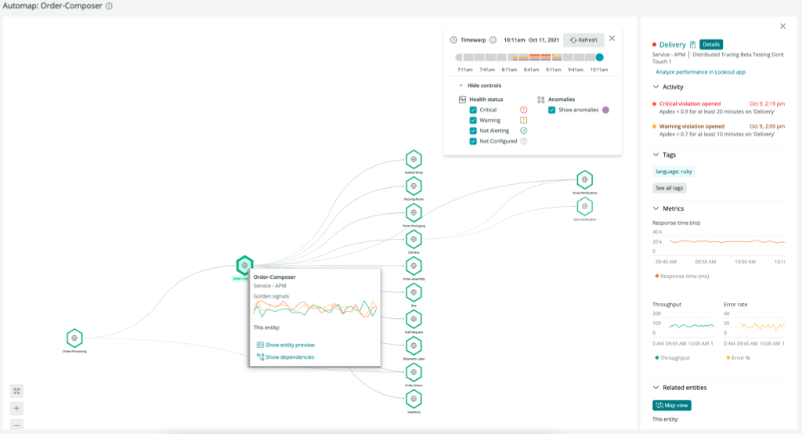
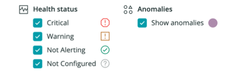

The New Relic automap feature displays entity-centric maps to help you troubleshoot incidents that cascade through multiple interconnected services. With automap, you can pinpoint when and where an issue began by viewing the dependencies that affect your services.

<figcaption>
Here's an example of where you could start troubleshooting with automap.
</figcaption>

## How it works [#how-works]

New Relic automap displays relationships between entity types based on their calls to each other. For example, APM services are represented as edges on a graph, showing you how these services depend on one another. 

 Automap displays only the entities related to the source entity that have experienced a change in health status within three hours after the automap was launched. So, it may not show all entities related to the source entity.

<Callout variant="important">
Automap auto-expand logic relies on the health status of an entity, which in turn is largely determined by the alert status of that entity. For optimal troubleshooting with automap, ensure that your [alerts are properly configured](docs/new-relic-solutions/best-practices-guides/alerts-applied-intelligence/alerts-best-practices/).
</Callout>

The **Map view** button to launch automap is only available in the **Related entities** pane for entities supported by automap:

  * APM|APPLICATION
  * BROWSER|APPLICATION
  * EXT|SERVICE
  * EXTERNAL|SERVICE
  * MOBILE|APPLICATION
  * NR1|WORKLOAD
  * SYNTH|MONITOR
  * SYNTH|PRIVATE_LOCATION
  * SYNTH|SECURE_CRED

## Explore the history

Unlike simple navigation maps, such as New Relic maps in context, automap helps you understand how problems developed by allowing you to scroll backwards and forwards in time. 

To identify exactly when and where an incident originated, simply move the **Timewarp** cursor to see health status changes for the entities on the map. When you scroll through the history, you see when anomalous behavior was detected by New Relic Lookout .

Here’s an example of scrolling that reveals that the issue occurred between `FulfillmentService` and `BillingService`:

<Video
  type="wistia"
  id="xqj83ghoog"
/>

## Map symbols [#map-symbols]

Here are some of the standard visual elements of an automap: 

<table>
  <thead>
    <tr>
      <th style={{ width: "200px" }}>
        Icon
      </th>
      <th>
        Description
      </th>
    </tr>
  </thead>
    <tbody>
    <tr>
      <td>
        Large, hollow hexagon
      </td>
      <td>
        The primary entities that are the focus of the current map. 
        
        For example, for a [distributed trace](/docs/distributed-tracing/concepts/introduction-distributed-tracing) or [Incident Intelligence](/docs/alerts-applied-intelligence/applied-intelligence/incident-intelligence/use-incident-intelligence/) issue, those would be the entities directly involved. If the entity is monitored by a New Relic agent, its language or type is indicated by the icon inside the hexagon.
      </td>
    </tr>
    <tr>
      <td>
        Small, solid hexagon
      </td>
      <td>
        Other New Relic-monitored entities that call or are called by the primary entities.
      </td>
    </tr>
    <tr>
      <td>
        Cloud
      </td>
      <td>
        Externals called by the primary entities.
      </td>
    </tr>
    <tr>
      <td>
        Database
      </td>
      <td>
        Datastores called by the primary entities.
      </td>
    </tr>    
    </tbody>
</table>

## See only what you need to see [#filter-automap]

With the automap layer controls, you can de-emphasize certain entities on the map by unchecking those options. For example, you can hide the healthy service to focus only on those alerting as you browse the timeline.

To emphasize or de-emphasize entities with a particular health status or with anomalies present, check or uncheck the option in the **Automap controls** pane:

[TODO: GIF of UI Controls & entities moving in & out of focus]

## Troubleshooting example [#troubleshooting-example]

[TODO: INSERT EXAMPLE]

