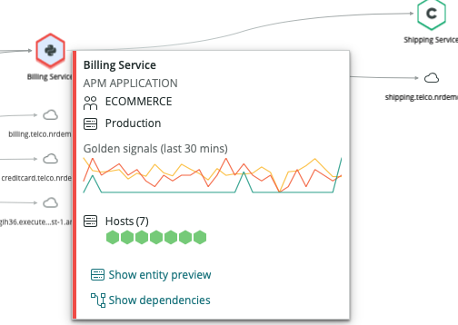

Some New Relic features, like distributed tracing and Incident Intelligence, display topological maps that show relationships between your New Relic-monitored entities and other external hosts and services. These maps can help you diagnose and correct issues. 

## Map display [#map-display]

The exact display of these maps depends on the New Relic feature in which they're located, but there are some common visual elements. The typical map view uses hexagon icons to represent your monitored [entities](/docs/new-relic-one/use-new-relic-one/core-concepts/what-entity-new-relic) and other external hosts or services. The relationships between entities are represented as lines, with arrows indicating call direction. 

<figcaption>This is an [Incident Intelligence issues](/docs/alerts-applied-intelligence/applied-intelligence/incident-intelligence/use-incident-intelligence) map showing three primary entities and their immediate dependencies.</figcaption>

Here is more detail about the standard visual elements of a map: 

<table>
  <thead>
    <tr>
      <th style={{ width: "200px" }}>
        Icon
      </th>
      <th>
        Description
      </th>
    </tr>
  </thead>
    <tbody>
    <tr>
      <td>
        Large, hollow hexagon
      </td>
      <td>
        The primary entities that are the focus of the current map. 
        
        For example, for a [distributed trace](/docs/distributed-tracing/concepts/introduction-distributed-tracing) or [Incident Intelligence](/docs/alerts-applied-intelligence/applied-intelligence/incident-intelligence/use-incident-intelligence/) issue, those would be the entities directly involved. If the entity is monitored by a New Relic agent, its language or type is indicated by the icon inside the hexagon.
      </td>
    </tr>
    <tr>
      <td>
        Small, solid hexagon
      </td>
      <td>
        Other New Relic-monitored entities that call or are called by the primary entities.
      </td>
    </tr>
    <tr>
      <td>
        Cloud
      </td>
      <td>
        Externals called by the primary entities.
      </td>
    </tr>
    <tr>
      <td>
        Database
      </td>
      <td>
        Datastores called by the primary entities.
      </td>
    </tr>    
    </tbody>
</table>

## Health status [#health]

Some maps use our standard [health status colors](/docs/alerts-applied-intelligence/new-relic-alerts/alert-conditions/view-entity-health-status-find-entities-without-alert-conditions/#colors) to indicate entity health. 

Distributed trace maps use these colors to indicate health:
    
  * A solid red hexagon means one or more span errors.
  * A solid orange hexagon means one or more anomalous spans.

## Map tooltip [#tool-tips]

Maps in context show additional information about map elements when you hover over them.

<figcaption>When you mouse over an entity on a map, you'll see more detail.</figcaption>

The map tooltip includes:

* entity name and type
* any essential [tags](/docs/new-relic-one/use-new-relic-one/core-concepts/use-tags-help-organize-find-your-data) present on the entity
* golden signals from the last 30 minutes
* hosts the entity is running on, if known
* other entities that have manually-created relationships to this entity
* a link to an entity's mini-overview
* a link to show all of the entity's dependencies

## How map relationships are determined [#relationships]

The feature that the map resides in determines the detected relationships. Examples: 

* Applied Intelligence: when you select an [issue](/docs/alerts-applied-intelligence/applied-intelligence/incident-intelligence/use-incident-intelligence/#issue-summary) in the UI, the map relies on [entity relationships](/docs/apis/nerdgraph/examples/nerdgraph-relationships-api-tutorial).
* [Distributed tracing](/docs/distributed-tracing/concepts/introduction-distributed-tracing): when you [view a trace in the UI](/docs/distributed-tracing/ui-data/understand-use-distributed-tracing-ui#trace-map), the map shows the relationships found in the trace.
