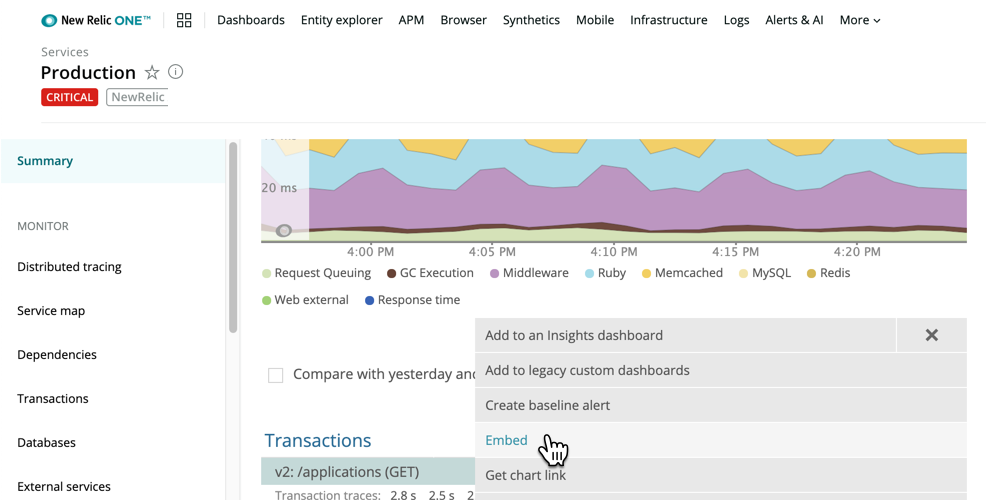

In order to improve your New Relic experience we've made some big improvements to our platform. As a result, we'll be ending support for some old features over the next few weeks. Many have already been publicly announced as "end-of-life." These changes represent our commitment to improve your interactions with our platform.

Our mission is one observability platform that unites your telemetry data, connects your full stack, and helps you build more perfect software. To that end we're focusing on simplifying your experience for troubleshooting, alerting, and visualizing data.

Here are more details on what's changed, with some helpful links and guides on how to take advantage of new capabilities to achieve the same goals. As always, we're here to help. Please connect with us in the [Explorers Hub](https://discuss.newrelic.com/t/new-relic-feature-end-of-life-announcements/105772/), or contact your account team with any questions.

## Old Kubernetes integration agent versions [#kubernetes]

To improve our unified experience, starting from Wednesday, August 12, 2020, Kubernetes integrations that use v1.7 or older will be deprecated. The UI experience in the `infrastructure.newrelic.com` domain will no longer be available; it will only be available in New Relic One.

* If you are already using the [latest Kubernetes agent version](/docs/release-notes/platform-release-notes/kubernetes-integration-release-notes), no action is necessary.
* If you are using v1.7 or older, you must update your integration in order to continue viewing Kubernetes performance data.

Follow the instructions in our documentation to upgrade to the latest version of the Kubernetes integration.

**<Icon style={{color: 'green'}} name="fe-info"/>
Action items for a successful transition:**

1. Review the [Kubernetes agent deprecation notice](/docs/release-notes/platform-release-notes/kubernetes-integration-release-notes/deprecation-notice-kubernetes-v17-or-lower).
2. Follow standard procedures to [upgrade your Kubernetes agent to the latest version](/docs/integrations/kubernetes-integration/installation/kubernetes-installation-configuration#update).
3. Learn about the [Kubernetes cluster explorer UI](/docs/integrations/kubernetes-integration/understand-use-data/kubernetes-cluster-explorer) in New Relic One.

For more information, see the [Explorers Hub post](https://discuss.newrelic.com/t/important-end-of-life-kubernetes-integrations-v1-7-or-older/102167).

## Monitor listing page and Synthetic labels [#synthetics]

To improve the experience of Synthetic monitors and labels, we've moved both experiences into the New Relic One platform. If you use the REST API for Synthetic label management, you must update to the tags API moving forward. The good news: with the NerdGraph tags API, you can organize and group all your entities in a single request.

For more information about any of the following, see the [Explorers Hub post](https://discuss.newrelic.com/t/end-of-life-notice-synthetics-labels-and-synthetics-apm-group-by-tag/103781).

**<Icon style={{color: 'green'}} name="fe-info"/>
Action items for a successful transition:**

<table>
  <thead>
    <tr>
      <th style={{ width: "200px" }}>
        Synthetic monitors transition
      </th>

      <th>
        Comments
      </th>
    </tr>
  </thead>

  <tbody>
    <tr>
      <td>
        Monitor index list
      </td>

      <td>
        When migration is completed, no action is needed on your part to use the new Synthetics entity listing pages. The new experience will be available to you automatically after July 20, 2020. For more information, learn how the [explorer in New Relic One](/docs/new-relic-one/use-new-relic-one/ui-data/new-relic-one-entity-explorer-view-performance-across-apps-services-hosts) replaces the [Synthetics monitors index](/docs/synthetics/new-relic-synthetics/pages/synthetics-monitors-index-access-your-monitors).
      </td>
    </tr>

    <tr>
      <td>
        Existing Synthetics labels
      </td>

      <td>
        You may have already seen an option in the UI to migrate your Synthetics monitor labels to New Relic One tags. If you did not select that option, we've got you covered.

        Automatic migration from labels to tags starts begins July 8, 2020. For more information, learn how [tagging in New Relic One](/docs/new-relic-one/use-new-relic-one/core-concepts/tagging-use-tags-organize-group-what-you-monitor) replaces [labels for Synthetics monitors](/docs/using-new-relic/user-interface-functions/organize-your-data/labels-categories-organize-apps-monitors).
      </td>
    </tr>

    <tr>
      <td>
        REST API
      </td>

      <td>
        If you use the [REST API for Synthetics label management](/docs/apis/synthetics-rest-api/label-examples/use-synthetics-label-apis), follow these steps to update to the tags API:

        1. Learn more about [NerdGraph](/docs/apis/nerdgraph/get-started/introduction-new-relic-nerdgraph).
        2. Review the [NerdGraph tagging API tutorial](/docs/apis/nerdgraph/examples/nerdgraph-tagging-api-tutorial).
        3. Make sure you have a [Personal API key to use NerdGraph](/docs/apis/nerdgraph/get-started/introduction-new-relic-nerdgraph#authentication).
        4. Follow the procedures in the [Explorers Hub post](https://discuss.newrelic.com/t/end-of-life-notice-synthetics-labels-and-synthetics-apm-group-by-tag/103781) (look for the **How do I transition my scripts from the Synthetics API to the tag API (NerdGraph)?** section), and update your existing tags with the GraphiQL explorer at [api.newrelic.com/graphiql](https://api.newrelic.com/graphiql).

        NerdGraph is our GraphQL API, a query language that lets you request exactly the data you need, without over-fetching or under-fetching. NerdGraph calls get all the data you need in a single request. NerdGraph also makes it easier to evolve APIs over time.
      </td>
    </tr>
  </tbody>
</table>

## "Rollup by" in Synthetics [#rollup]

Synthetics is moving to New Relic One to provide a single platform for observability of your complex software systems. To do this we are unifying the tools you use to tag (or label) your services, applications, and monitors. The specific feature that is end-of-life is the **Rollup by** feature under the **Search monitors** dropdown menu.

You can group monitors by tags in New Relic One without needing a separate **Rollup by** dropdown. No changes will be required to use the new Synthetic monitor listing pages. The new experiences will be available to you after July 20, 2020.

Documentation:

* [Tagging in New Relic One](/docs/new-relic-one/use-new-relic-one/core-concepts/tagging-use-tags-organize-group-what-you-monitor) replaces [labels for Synthetics monitors](/docs/using-new-relic/user-interface-functions/organize-your-data/labels-categories-organize-apps-monitors).
* [Explorer in New Relic One](/docs/new-relic-one/use-new-relic-one/ui-data/new-relic-one-entity-explorer-view-performance-across-apps-services-hosts) replaces [Synthetics monitors index](/docs/synthetics/new-relic-synthetics/pages/synthetics-monitors-index-access-your-monitors).

**<Icon style={{color: 'green'}} name="fe-info"/>
Action items for a successful transition:**

If you currently use Synthetics rollups:

Follow the procedures in the Explorer Hub post to recreate the rollups that are being retired.

1. Go to the [Explorers Hub post](https://discuss.newrelic.com/t/end-of-life-notice-synthetics-labels-and-synthetics-apm-group-by-tag/103781) about the rollups EOL. In particular, look for **How can New Relic Workloads help me visualize groups of applications and monitors?** in the post's **FAQs** section.
2. Follow the procedures in the Explorers Hub post to recreate the rollups that are being retired.

## Embedded charts

In order to reduce redundancy and provide a more unified experience, the [embedded charts](/docs/apm/apm-ui-pages/features/embed-charts-external-webpages) functionality will be replaced by the New Relic One **Get chart**. Embedded charts currently in use and hosted outside the New Relic domain will continue to function. The changes will include:

* The name on the chart's menu that generates them will change from **Embed** to **Get chart** link.
* For charts that are no longer supported, **Embed** will be replaced with **Get chart link is not supported for this chart**.
* The APM UI page that lists all embedded chart links will no longer be available.

Documentation:

* [Explorers Hub post](https://discuss.newrelic.com/t/change-to-shareable-charts-in-apm-embedded-charts/102240)
* New Relic One's [enhanced query builder functionality](/docs/chart-builder/use-chart-builder/use-charts/use-your-charts#get-chart-link) replaces the [EOL embed chart functionality](/docs/apm/apm-ui-pages/features/embed-charts-external-webpages).

**<Icon style={{color: 'green'}} name="fe-info"/>
Action items for a successful transition:**

You can generate a publicly accessible link to add to internal and external websites. Users do not need to be logged in to New Relic to see the chart link. The ability to [embed a chart](/docs/chart-builder/use-chart-builder/use-charts/use-your-charts#get-chart-link) will remain, but instead of clicking **Embed** (which will be removed from the UI), you will click **Get chart link** (which is in the same location). This gives you the ability to get links with an even broader range of chart visuals and behaviors than the one we are retiring.

Here's an example of how it looks in New Relic One:

* To replace existing chart links you created with **Embed**, create new URLs with New Relic One's **Get chart link**, and insert them in webpages where they're used.
* If you have an embedded chart and get the message **Get chart link is not supported for this chart**, simply run a different query, select an available chart type, and then select **Embed**.

## Legacy distributed tracing UI [#distributed-tracing]

To standardize our user experience, we will be deprecating the older distributed tracing UI, which exists within the `rpm.newrelic.com` domain. You can access distributed tracing through New Relic One, which provides a superior experience with all the functionality supported in the duplicate UI that is end-of-life.

Documentation:

* [Global and service-specific distributed tracing views](/docs/understand-dependencies/distributed-tracing/ui-data/additional-distributed-tracing-features-new-relic-one#find-data) in New Relic One
* [Deprecated distributed tracing UI](/docs/apm/distributed-tracing/ui-data/understand-use-distributed-tracing-data)

**<Icon style={{color: 'green'}} name="fe-info"/>
Action items for a successful transition:**

No action required, but you can get ready for the new UI experience.

<figcaption>
  New Relic One's distributed tracing page builds on capabilities you are already familiar with.
</figcaption>

* Get acquainted with the enhanced [distributed tracing features in New Relic One](/docs/understand-dependencies/distributed-tracing/ui-data/additional-distributed-tracing-features-new-relic-one), including search and filter capabilities with cross-account trace details, query options with the [NerdGraph API](/docs/apis/nerdgraph/examples/nerdgraph-distributed-trace-data-tutorial), and histogram charts (which can help you quickly understand trace distribution for important values such as duration).
* Review the [trace sampling options](/docs/understand-dependencies/distributed-tracing/get-started/how-new-relic-distributed-tracing-works#sampling) available with head-based sampling (standard distributed tracing) and tail-based sampling (Infinite Tracing).

## Violations changes [#violations]

In order to provide a unified experience, we're deprecating browser, mobile, and synthetics monitor violations and replacing them with the New Relic One equivalent. New Relic One users can access violations by using any of these options:

* Click the **Alerts and AI** link in New Relic One's main UI.
* Review the entity list activity stream.
* See alert details from inside a specific entity via the new indicator for `Operational`, `Warning`, and `Critical` violations.

You will see alert details automatically when navigating to `one.newrelic.com`.

Documentation:

* [Applied Intelligence and alerting in New Relic One](/docs/new-relic-one/use-new-relic-one/new-relic-ai/introduction-new-relic-ai)
* [Browser alert violations](/docs/browser/new-relic-browser/configuration/view-browser-apps-alert-information) (moving to New Relic One)
* [Mobile violations](/docs/mobile-monitoring/new-relic-mobile/getting-started/alert-information-new-relic-mobile#violations) (moving to New Relic One)
* [Monitor violations](/docs/synthetics/new-relic-synthetics/pages/view-monitors-alert-information) (moving to New Relic One)

**<Icon style={{color: 'green'}} name="fe-info"/>
Action items for a successful transition:**

No action required, but you can get ready for the new UI experience.

<figcaption>
  Here's an example of the detailed information about an Alerts violation for a selected entity in New Relic One.
</figcaption>

<table>
  <thead>
    <tr>
      <th style={{ width: "200px" }}>
        Violation details in New Relic One
      </th>

      <th>
        Comments
      </th>
    </tr>
  </thead>

  <tbody>
    <tr>
      <td>
        Holistic view
      </td>

      <td>
        From New Relic One's homepage, the entity list presents an activity stream of **all** entities with alert violations. You no longer need to jump around individual lists of end-user, mobile, or monitor violations.
      </td>
    </tr>

    <tr>
      <td>
        Enhanced troubleshooting tools
      </td>

      <td>
        From New Relic One's homepage, you will also see an **Alerts & AI** (Applied Intelligence) link. From here you can solve problems faster with anomaly detection, incident correlation, and noise reduction.
      </td>
    </tr>

    <tr>
      <td>
        Specific violation
      </td>

      <td>
        From a selected entity, you will see a new button identifying the violation as `Operational`, `Warning`, or `Critical`, as well as entity metadata and useful details about the incident.
      </td>
    </tr>
  </tbody>
</table>

## Connected agents page [#connected-agents]

Finding your connected agents has never been easier! You can already do this via the **Query your data** link in New Relic One. Simply run [these `NrDailyUsage` queries](https://discuss.newrelic.com/t/replicate-the-connected-agents-report-in-insight/77575) to get a list of connected agents and hosts. The old **Connected agents** page is end-of-life and will be removed.

Documentation:

* [Explorers Hub post](https://discuss.newrelic.com/t/replicate-the-connected-agents-report-in-insight/77575)
* [NRQL query tools](/docs/query-your-data/nrql-new-relic-query-language/query-tools)
* [NrDailyUsage data definition](/attribute-dictionary/?event=NrDailyUsage)

**<Icon style={{color: 'green'}} name="fe-info"/>
Action items for a successful transition:**

To query your connected apps and hosts, you can use existing [NRQL query tools](/docs/query-your-data/nrql-new-relic-query-language/query-tools), such as New Relic One's query builder or the GraphQL API.

**Recommendation:** For best results exploring comprehensive data about your apps and hosts, use the [query builder](/docs/chart-builder/use-chart-builder/get-started/introduction-chart-builder#specify-data) in New Relic One or the [NerdGraph API](/docs/apis/nerdgraph/examples/nerdgraph-nrql-tutorial). 

## Inactive apps in New Relic One [#inactive-apps]

Starting June 8, 2020, New Relic One will not continue to display any APM application that hasn't reported data for 93 days. To match our published APM [data retention guidelines](/docs/accounts/accounts/data-management/overview-data-retention-components#apm), applications that have not reported data will be available within the New Relic UI for 90 days.

After 90 days, those applications will be removed from the UI. However, key metrics will continue to be available via the [New Relic REST API](/docs/apis/rest-api-v2/getting-started/introduction-new-relic-rest-api-v2) based on subscription level. This is why the application name will remain reserved until the application is permanently deleted via the [REST API Explorer](/docs/apis/rest-api-v2/api-explorer-v2/introduction-new-relics-rest-api-explorer).

**<Icon style={{color: 'green'}} name="fe-info"/>
Action items for a successful transition:**

If you want to reuse an app name for an old app that is no longer reporting data:

* Use the [REST API v2](/docs/apis/rest-api-v2/application-examples-v2/summary-data-examples-v2) or [API Explorer](https://api.newrelic.com/) to get summary data, including app ID, name, health status (look for gray), last reported, etc.
* [Uninstall the agent](/docs/using-new-relic/cross-product-functions/install-configure/uninstall-agent) for your app.
* Use the REST API or API Explorer to delete the apps.

## Synthetic monitor alert notifications and conditions [#synthetics-alerts]

In order to provide a unified experience, we're deprecating Synthetics monitor [alert notifications](/docs/synthetics/new-relic-synthetics/using-monitors/alerting-synthetics) and [condition violations](/docs/synthetics/new-relic-synthetics/pages/view-monitors-alert-information). We are replacing these pages with a new Synthetics monitor overview experience in New Relic One. This new experience provides visibility into a monitor's open violations and alert conditions with the monitor results in a single view, removing the need to open multiple tabs to view violations or alert conditions.

**<Icon style={{color: 'green'}} name="fe-info"/>
Action items for a successful transition:**

No action required, but you can get ready for the new UI experience by reviewing our documentation about [New Relic Applied Intelligence](/docs/new-relic-one/use-new-relic-one/new-relic-ai/introduction-new-relic-ai), which includes:

* The alerting functionality you are already familiar with in New Relic Alerts, and more
* Incident Intelligence, which reduces noise and accelerates your incident resolution process
* Proactive Detection, which surfaces relevant issues and provides automatic explanations to their cause
