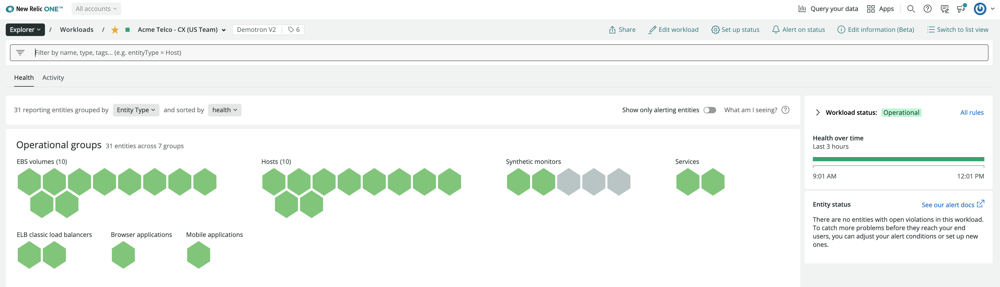

Our workloads feature gives you the ability to group and monitor entities based on a team or a set of responsibilities, providing aggregated health and activity data from frontend to backend services across your entire stack. Workloads help you [understand the status of complex systems](/docs/workloads/use-workloads/workloads/use-workloads), [detect issues](/docs/workloads/use-workloads/workloads/workload-status), understand the cause and impact of an incident, and resolve those issues quickly. Want to try it? [Create a New Relic account](https://newrelic.com/signup) for free! No credit card required. 

## What is a workload in New Relic? [#definition]

New Relic monitors a wide range of entities and data, from client-side applications and backend APIs, to the underlying infrastructure. To make sense of this large data set, we give you the ability to create and monitor workloads.

Workloads give you the ability to group and monitor entities based on a team or a set of responsibilities, and provide an aggregated view of the health and activity of the entities in the workload. Thus, you can understand better how your business logic is working, from frontend to backend services, across your entire stack.

Here are some workload examples:

* A serverless application that includes an API gateway, a few serverless functions, and a managed database and storage.
* A browser application and the backend APIs that support it.
* A collection of Java microservices and the infrastructure they run on.

Here's a workload:

<figcaption>
  **[one.newrelic.com](https://one.newrelic.com) > Explorer > Workloads > (selected workload):** The workloads UI provides a curated view of how the entities in your workload are performing. The charts you see will depend on the types of entities you've included to the workload.
</figcaption>

<Callout variant="tip">
  Learn [how to use workloads](/docs/workloads/use-workloads/workloads/use-workloads).
</Callout>

## Why it matters [#why-matters]

Workloads give you visibility into the end-to-end availability and consumption of resources across an entire service, and provide you a way to define what’s relevant to you. You can use workloads to group together entities that are important to a specific team or project, so you can better browse and isolate the most relevant data for that service.

Because our UI gives you [cross-account access](/docs/new-relic-one/use-new-relic-one/core-concepts/cross-account-features-security-new-relic-one), you can add entities to your workload from any of the accounts you have access to.

A workload can include:

* Any New Relic-monitored entity, including services, browser apps, mobile apps, databases, and hosts.
* [Dashboards](/docs/dashboards/new-relic-one-dashboards/get-started/introduction-new-relic-one-dashboards).
* Other workloads: this is useful for complex teams who need to divide and overlap workloads.

## Requirements [#requirements]

Requirements for creating and managing workloads:

* All users for an account can view that account's workloads.
* To create, edit, and delete workloads, you must have a user role with that permission.

## Impact of accounts on the workload permissions and content [#accounts]

Workloads can group and display entities from multiple accounts to provide complete observability of complex systems. When [creating a workload](/docs/new-relic-one/use-new-relic-one/workloads/use-workloads/#create), you must set:

* The [workload account](#workload-account)
* [Scope accounts](#scope-accounts)

[Learn how to find a New Relic account ID](/docs/accounts/install-new-relic/account-setup/account-id).

### Workload account

The workload account is where any workload-specific data is stored. For example, a workload might generate [`NrAuditEvent` data](/docs/insights/insights-data-sources/default-data/nrauditevent-event-data-query-examples), and you would find that data by querying the workload account.

The workload account determines the user permissions that govern which users can see and manage the workload, through the account roles.

Once created, the workload account can’t be changed.

### Scope accounts

Scope accounts are the accounts from which a workload fetches entity data. In other words, the scope accounts provide the content for a workload. Users who don’t have access to all of a workload's scope accounts may not be able to see complete workload data.

Scope accounts can be updated at any point in time by any user with workload management capabilities on the workload account. By default, all accounts that the workload creator has access to at the moment of the workload creation are set as scope accounts.
