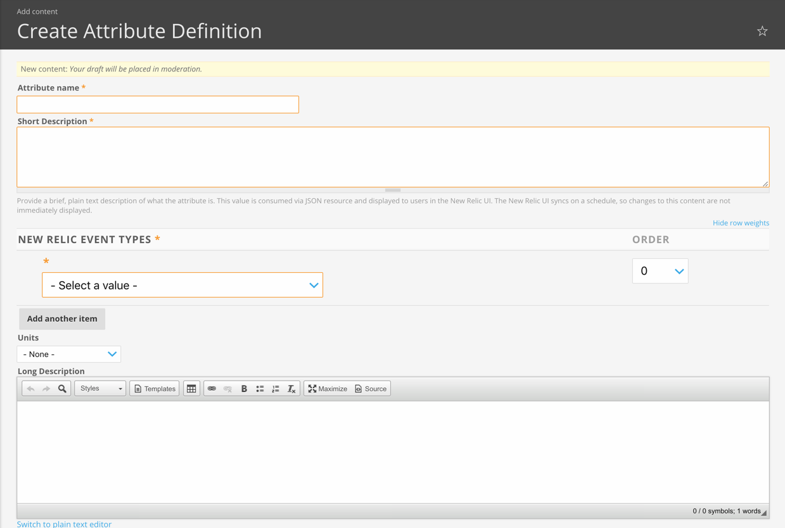

This document describes the different elements of the event data dictionary (EDD), with explanations of each element and style guidelines for writing and editing descriptions of those elements.

## Event data dictionary elements [#edd-elements]

The data in the event data dictionary is defined in a three-part hierarchy.

### Data sources

There are two types of data sources used in the EDD:

* Core data sources contain event types and attributes for New Relic products and services, such as Mobile and Browser.
* On-host integrations, such as MongoDB and RabbitMQ, are data sources that also contain event types and attributes.

Cloud integrations will not be added to the EDD.

If edits are required for the text for a data source, contact Clinton for assistance.

### Event types

An event type contains attributes that are attached to the event type. Event type definitions describe the kind of data collected when the event is run. Event types are associated with a data source. For example, the APM data source has two event types: `Transaction` and `TransactionError`. Event type descriptions contain an overview of the data gathered and information on how and when the event is run. Event type descriptions are displayed in New Relic One chart builder when you hover over suggested event names.

The **naming conventions** **for event types** are:

* No spaces or special characters are allowed in an event type name.
* If multiple words are used, each word should be capitalized, followed by all lower-case letters, even acronyms.

<Callout variant="important">
  While JavaScript is treated as a single word, it is always spelled as JavaScript.
</Callout>

Examples: `MobileSession`, `AwsLambdaInvocation`, `Mobile`, `JavaScriptError`.

<Callout variant="important">
  Do not edit the name of an existing event type unless requested by the product manager or their representative.
</Callout>

### Attributes

An attribute is a key-value pair for the data being captured. For example, `httpResponseCode` returns standard HTTP codes, such as 202 or 301. An attribute is often used for more than one event type; `httpResponseCode` is used by both `Transaction` and `TransactionError`. Attribute definitions are displayed in the New Relic One chart builder when you hover over suggested attribute names.

The **naming conventions** **for attributes** are:

* No spaces or special characters are allowed in an attribute name.
* Attributes that are a single word are always in lower case.
* When an attribute is comprised of multiple words, the first word is lower case and all remaining words start with a capital letter.
* Do not capitalize an acronym that is part of an attribute name.

Examples: `appId`, `httpResponseCode`, `guid`, `entityGuid`.

<Callout variant="important">
  Do not edit an attribute name unless requested by the product manager or their representative.
</Callout>

For up-to-date information about event types and attributes, see the [New Relic Attribute Catalog Data](https://source.datanerd.us/javimb/architecture-notes/blob/3c69a6153eca67216268cf5c859fe9df31875701/_data/attributes.yml) page (requires VPN to view).

## Event data dictionary style guidelines [#edd-style-guidelines]

When writing or editing event descriptions and attribute definitions, follow the standard Product Language style guide, unless otherwise noted. The text for events and attributes should be complete, but should not be too lengthy, as the text is displayed in pop-up windows in New Relic One. For that reason, the text is terser than general writing.

### Event type descriptions

Event type descriptions are written standard prose and should be written in complete sentences. Generally, they do not contain examples. New event type descriptions must be approved by the product manager for the teams working on the core product. The Infrastructure product manager approves all event type descriptions for on-host integrations.

Our CEO gave this note regarding event type descriptions:

Document when an event is fired, not what attributes it contains. For example, don’t tell me that a BrowserInteraction is used by New Relic Mobile. Rather tell me what happens in the browser that will generate a BrowserInteraction. Is it every click? Keystroke? Something else?

The event type description `BrowserInteraction` was rewritten and now reads:

A BrowserInteraction represents a unit of work in a browser session, triggered by a user interacting with the webpage. It captures information about the session, AJAX calls and custom JavaScript timing that occurred as a result of the interaction. Initial load and route changes are captured as special types of Browser interactions and are used for SPA monitoring.

This description tells the reader:

<Table>
  <tbody>
    <tr>
      <td>
        Definition of `BrowserInteraction`
      </td>

      <td>
        A BrowserInteraction represents a unit of work in a browser session ...
      </td>
    </tr>

    <tr>
      <td>
        When the event is triggered
      </td>

      <td>
        ... triggered by a user interacting with the webpage.
      </td>
    </tr>

    <tr>
      <td>
        What kind of data is captured
      </td>

      <td>
        It captures information about the session, AJAX calls and custom JavaScript timing that occurred as a result of the interaction.
      </td>
    </tr>

    <tr>
      <td>
        Additional information about the event type, as used for a special type of monitoring
      </td>

      <td>
        Initial load and route changes are captured as special types of Browser interactions and are used for SPA monitoring.
      </td>
    </tr>
  </tbody>
</Table>

In breaking down the event type description into these components, we can see how it ticks the boxes for an event type description: it has a clear definition, tells us when the event triggers, and an overview of the data that is being gathered. It even includes additional information about another edge uses for the event.

Event type descriptions are easily [added](#add-event) and [edited](#edit-event) in Drupal.

### Attribute definitions [#attribute-defs]

Attribute descriptions are created and edited in Drupal.

* To add a new attribute, go to **Docs > My Workbench > Create Content > Attribute Definition.**
* To edit an existing attribute, use **Docs > My Workbench > Attribute Explorer** to locate and edit that attribute.

To fully illustrate writing and editing attribute definitions, we can look at the attribute definition tool:

**Docs site > My Workbench > Create Content > Attribute Definition**

<CollapserGroup>
  <Collapser
    id="attr-name"
    title="Attribute name"
  >
    If you are documenting a new attribute, enter attribute name here. Otherwise, do not change or edit.
  </Collapser>

  <Collapser
    id="short-desc"
    title="Short description"
  >
    Short descriptions can only use plain text.

    Sentence fragments are acceptable in a short description, though they should be used judiciously.

    When a user hovers over an attribute name in New Relic One, the tooltip contains only the short description.

    Every attribute is associated with one or more event types. Use the dropdown to select an event type. Click **Add Another Item** to add additional rows, if needed.

    <Callout variant="important">
      When you select additional event types for an attribute, remember that the description you write must be accurate for all of the event types that use the attribute.
    </Callout>

    <Callout variant="important">
      An attribute is made unique by the event type name plus the attribute name. If you want to write a unique description for one particular attribute that has a name that is widely used, such as \`name\`, document that attribute with the specific text, being sure to only apply the event type name associated with the attribute.
    </Callout>

    For more tips on writing attribute definitions, see [attribute guidelines](#attribute-guidelines).
  </Collapser>

  <Collapser
    id="simple-units"
    title="Units"
  >
    Some, but not all, attributes have data that is measurable in a unit, such as sizes or time units. When applicable, use the Units dropdown to select the correct unit. In addition to the normal size and time units IDs, rates, and percentage units are also noted. [New units of measurement](#unit) can be added in Drupal.

    <CollapserGroup>
      <Collapser
        id="units"
        title="More detail on using units"
      >
        Attribute entries in our event data dictionary have a **unit of measurement** field. What unit of measurement to select for an attribute is sometimes obvious, like if the attribute value is measured in milliseconds or seconds, or a percentage.

        We use several units of measurement that are not obvious, though, like `count`, `enum`, `rate`, and `ID`. (Technically, these aren't actually "units of measurement" and are more just **conceptual data types** but we're doing it this way as a workaround so you can ignore the fact that **units of measurement** isn't actually accurate.)

        The main reason we want to specify this information is that this will control what kinds of queries or charts can be created or auto-suggested by New Relic. For example, the New Relic UI wouldn't want to auto-suggest a chart graphing the average of ID values because that wouldn't make any sense. So attributes with accurate units, such as **data types**, will help product provide more practical help/suggestions to customers in future.

        Here are definitions and tips for using these "non-obvious" units of measurement:

        * Count: This is a count of something, though not a count of time-based units. For a number to be a `count`, it must (a) only be capable of increasing during a given time/sampling period, and (b) have a theoretically uncapped range. This wouldn't be used for a count of time units; if it was a count of seconds, for example, you would just use 'seconds' as the unit of measurement. A couple of examples of a count:
          * [https://docs.newrelic.com/attribute-dictionary/transaction/databasecallcount](https://docs.newrelic.com/attribute-dictionary/transaction/databasecallcount)
          * [https://docs.newrelic.com/attribute-dictionary/transactionerror/threadconcurrency](https://docs.newrelic.com/attribute-dictionary/transactionerror/threadconcurrency).
        * Enum: `enum` is short for enumerated list. In other words, it is a specific range of numbers that represent other non-numeric elements. For example, an attribute that had HTTP error codes (404, 505, etc.) as possible values would be an `enum`. A range of numbers that represent color codes would be another example of an `enum`. (Theoretically, an `enum` can represent lists without numeric values but we have no need to categorize strings so we only care about numeric-value lists.) Example: [https://docs.newrelic.com/attribute-dictionary/transaction/httpresponsecode](https://docs.newrelic.com/attribute-dictionary/transaction/httpresponsecode)
        * Rate: Use this for any `rate` (for example, count per second). These are typically for averaged rates over small units of time, like second or millisecond. We previously have used the unit of time for these attributes (for example, using seconds as the unit of measurement for a count per second rate), but now we want to use `rate` for these. This is necessary because the types of displays used for rates would be different than the types of displays used for a simpler duration/count measurement. Example: MySql integration attribute `db.innodb.dataReadBytesPerSecond`, which has the definition "Rate at which data is read from InnoDB tables in bytes per second."
        * ID: Use `ID` for any identification number attribute. Example: [https://docs.newrelic.com/attribute-dictionary/transaction/appid](https://docs.newrelic.com/attribute-dictionary/transaction/appid)
      </Collapser>
    </CollapserGroup>
  </Collapser>

  <Collapser
    id="event"
    title="New Relic event types"
  >
    Every attribute must be associated with at least one event type. Some attributes, along with the definition, are used by multiple event types. You can add as many event types as needed for an attribute.
  </Collapser>

  <Collapser
    id="long-desc"
    title="Long description"
  >
    A few attributes are complex enough that additional information is required to fully document that attribute. In these cases, you can use the long description box to add that information. Unlike the short description, long descriptions support HTML, links, and other standard writing tools. When a long description is used for an attribute, a **read more** link is added to the short description and appears in the tooltip.
  </Collapser>

  <Collapser
    id="related"
    title="Related info"
  >
    All data sources have a doc that discusses the data source and provides information about the event types associated with that data, such as [APM default events in Insights](/docs/insights/insights-data-sources/default-data/apm-default-events-insights). A link to the page or pages (depending on whether the attribute has one or multiple event types associated with it), should be provided in the **Related info** section. These links are displayed when a user views the attribute topic on the docs site.
  </Collapser>
</CollapserGroup>

## Style guidelines for attribute definitions [#styles-attr]

This section contains guidelines for attribute definitions:

<CollapserGroup>
  <Collapser
    id="general"
    title="General guidelines"
  >
    Refer to the [Style guide](/docs/new-relic-only/basic-style-guide) for all general technical writing style guidelines. The items listed here are exceptions to the Style Guide.
  </Collapser>

  <Collapser
    id="attr-value"
    title="Attribute values"
  >
    If you are using an example of a key-value pair in a short description, avoid the use of the = sign. Instead, use the word "is," which helps you in avoiding the need for formatting content.

    For example: httpResponseCode is 404.
  </Collapser>

  <Collapser
    id="code-types"
    title="Code for event type names and attributes"
  >
    If you are using an example of of a key-value pair in a short description, avoid the use of the = sign. Instead, use the word "is," which helps you in avoiding the need for formatting content.

    For example: Only reported when httpResponseCode has a value of 404 or higher.
  </Collapser>

  <Collapser
    id="examples"
    title="Examples"
  >
    Use examples when needed to clarify a description; attributes that are easily understood may not need an example. Examples should always be at the end of the description. Start with "For example:" followed by one or more examples of the key-value pair or other values.

    When you need to include a literal value in the short description, such as a SQL statement, use single quotes (') around the entire string.

    'dbc.url="jdbc:mysql://mysql-db.servers.net:3306/accounts"'
  </Collapser>

  <Collapser
    id="measurements"
    title="Measurements"
  >
    Some attributes have measurements, such as those for size or time. For those attributes, the measurement should be mentioned in the attribute definition **and** entered with the unit of measurement dropdown.

    The duration of the session, measured in seconds.

    See the section on [units](#units) for detailed information about units of measurement.
  </Collapser>

  <Collapser
    id="fragments"
    title="Sentence fragments"
  >
    Sentence fragments are acceptable in short descriptions.
  </Collapser>

  <Collapser
    id="if-when"
    title="Reported if/when"
  >
    Some attributes are only reported when certain conditions are met. These conditions include

    1. Which agent is being used
    2. If a certain configuration option is set to true
    3. When an attribute has a specific value.

    For the first two conditions, the wording can be contained in a normal sentence or sentence fragment. For example: Not reported when using the Abc agent or Reported when the Java Xyz configuration option is enabled.

    For the third condition, the actual attribute name and required value must be stated clearly. Use single quotes around a literal string, as in the following example:

    Reported when the 'appID=12345'

    For more complex examples, consider first stating the example followed by a formatted example in the long description.
  </Collapser>
</CollapserGroup>

### Attribute example [#example]

Let's analyze this actual attribute definition for `duration`, which is reported by the `Transaction` event type.

The total server-side response time for the transaction, in seconds. Does not include request queueing time.

This is an effective attribute definition:

* **Short:** This definition is terse, but includes enough information to explain the nature of the data that the attribute reports on.
* **Specific:** This attribute reports its data in a unit of measurement: seconds. This value is also selected in the measurement dropdown.
* **Pre-answers a potential question:** Request queueing time might be considered as part of a generic duration; however, it is not part of this attribute and is so noted.

Attribute definitions must be approved either by the product manager or a designated representative from the engineering team.

## Maintain the event data dictionary [#maintain]

The event data dictionary is not a static collection of information about event types and attributes. Over time, expect updates for event types and attributes or even data sources. The [New Relic Attribute Catalog Data](https://source.datanerd.us/javimb/architecture-notes/blob/3c69a6153eca67216268cf5c859fe9df31875701/_data/attributes.yml) page always contains the definitive list of event types and attributes.

<Callout variant="important">
  The link to New Relic Attribute Catalog Data will only work if you are physically working in a New Relic office. For example, the link will not work when you are working from home, even if you are authenticated with Okta.
</Callout>

To request changes to the event data dictionary, notify the `@hero` in the [#documentation Slack channel](https://app.slack.com/client/T02D34WJD/C0DSGL3FZ/thread/G11BMTFPS-1572380904.254200).

## Event data dictionary procedures [#edd-procs]

To add an event type description:

1. From Drupal, go to **Structure > Taxonomy**.
2. Click **add terms** next to New Relic event types.
3. In the **Name** field, enter the name of the event type.
4. In the **Short Description** field, enter the short description for the event type.
5. Use the dropdown in the Data Sources section to select the data source for the event type.
6. If needed, click **Add another item** to select an additional data source for the event type.
7. Select the **Generate automatic URL alias** checkbox, then save.

To edit an event type description:

1. From Drupal, go to **Structure > Taxonomy**.
2. Click **list terms** next to New Relic event types.
3. Click **edit** next to the name of the event type.
4. Edit the **short description** of the event type, then save.

<Callout variant="important">
  Do not edit the name of an event type unless requested by the product manager.
</Callout>

To add a new unit of measurement:

1. From Drupal, go to **Structure > Taxonomy**.
2. Click **add terms** next to Units of measurement.
3. In the **Name** field, enter the name and, if commonly used, the abbreviation, then save. For example, `megabytes` use MB for an abbreviation, so you would enter megabytes (MB); while terms such as `rate` and `count` do not use abbreviations.

To add your new event type to the data dictionary UI:

<Callout variant="tip">
  If you prefer to view a video of this process, see our [Google Team Drive video folder](https://drive.google.com/file/d/18z2c2X7CIbX4tYcN-mXKKIRejpAxCykM/view?usp=sharing).
</Callout>

1. Go to the data dictionary in our doc site.
2. Click the gear icon in the upper-right corner, and then click **Edit view**.
3. Under **Filter criteria**, click **Content: New Relic data types (exposed)**.
4. Hold down your command key (Apple computers), and in **Select terms from vocabulary New Relic event types**, select your new event type.

   <Callout variant="important">
     Be careful not to deselect the other values!
   </Callout>
5. If your new event is highlighted along with the original selections, click **Apply (this display)**.
6. Click **Save** in the upper right-hand corner.
7. Return to the data dictionary page and confirm that your new event type is displayed under **Types**.
