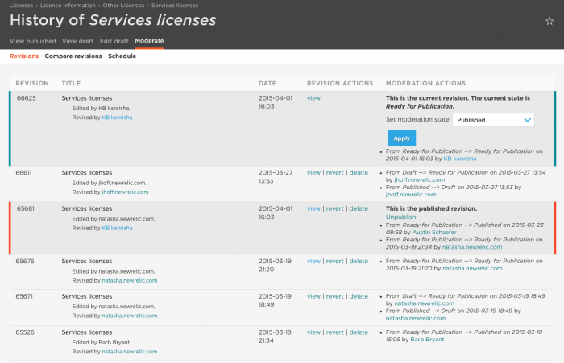
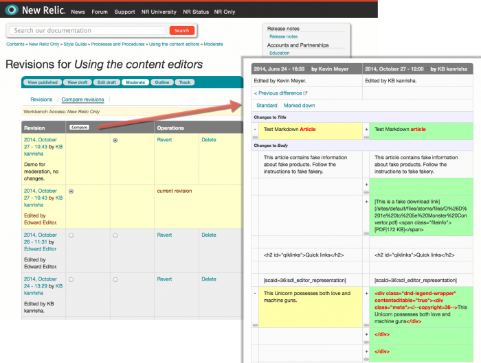

The Docs site uses content versioning to track changes within individual docs. When you select a document to edit, Drupal creates a new draft version, and tracks all changes within that draft until it is published. When anyone edits it again, Drupal creates a new version to track the changes since publication.

Each document has two **Moderation** pages to look at revisions: **History** and **Compare revisions**. This is basically the equivalent of "diffing" changes in code branches.

<Callout variant="tip">
  Some of these features are available only to Drupal admins.
</Callout>

## View history of a doc's changes [#versioning]

Each document on the Docs site has a **History** page that lists the revisions for that document. It lists the complete history of changes to each node, with the most recent version listed first.

From this page, you can:

* View any history version of the document.
* See who made changes when.
* Revert to earlier versions of the document.
* Delete a specific version of a document.

To access the document's **History** page:

1. From the document, select the **Moderate** tab.
2. From the Workbench, select **List revisions**.

**(page) > Moderate:** The Drupal **Revision history** lists each version of a document in reverse chronological order.

## Compare content revisions [#comparing]

Each document on the site has a **Compare revisions** page that lists the revisions for that document. It lists the complete history of changes to each node, with the most recent version listed first.

From this page, you can:

* Compare any two versions of the document.
* See who made changes when.
* Revert to earlier versions of the document.
* Delete a specific version of a document.

To compare revisions:

1. From the document, select the **Moderate > Compare revisions** tab.
2. From the Workbench, select **Compare revisions**.
3. Select the radio buttons for the two versions you want to compare.
4. Select **Compare**.
5. To scroll through additional revisions, select **Previous difference** or **Next difference**.

Drupal displays a table with a color-coded, side-by-side diff report.

**(page) > Moderate > Compare revisions:** Use this page to compare any two versions of a document.

## Schedule content revisions [#scheduling]

Before you can schedule a publication for individual revisions, you need the revision number. This is the first column in the [**Moderation history**](#comparing) table. Typically this will be the most recent revision and the first item in the list on the scheduling page.

To schedule a revision:

1. From the **Moderation history** page, select **Schedule**.
2. Select **Add scheduled revision**.
3. From the **Revision** dropdown, select the version to be scheduled.
4. From the **Operation** dropdown, select **Moderate to published**.
5. Assign a date and time.
6. Select **Schedule**.

<Callout variant="tip">
  From here you can also schedule documents to unpublish and auto-delete.
</Callout>

## Revert content revisions [#reverting]

If a draft gets published by mistake, you can revert the changes back to any previous version from either of the document moderation pages. To revert to a previous version of the document:

1. [Compare revisions](#comparing) to confirm you are looking at the correct versions.
2. Select **View** for the version you are **reverting to**, and make sure you are reverting to the correct vesion.
3. Select **Revert** for the version you are reverting to.
4. Publish your changes.

## Delete content versions [#deleting]

You should not need to delete content versions. However, there may be mistakes or abandoned drafts you don't want to accidentally publish.

You only delete active drafts from **Compare revisions**. You cannot delete the currently published revision. Instead, you must [revert the currently published version](#reverting) to a previous revision.

To delete a **draft** version of the document:

1. From **Compare revisions**, make sure the version to be deleted is not the most recently published revision.
2. Select **Delete** for the draft version you want to delete, and confirm.
