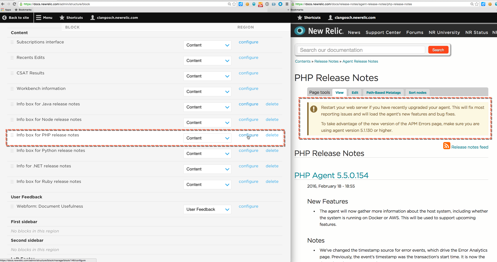

The content above a release note page is managed with [Blocks](/admin/structure/block). For example:

<figcaption>
  **Admin > Structure > Blocks**: The callout info at the top of the [PHP release notes](/docs/release-notes/agent-release-notes/php-release-notes) page is managed by the [Info box for PHP release notes block](/admin/structure/block/manage/block/146/configure).
</figcaption>

## Add content to top of release note page [#add]

To add info to the top of a specific release note page:

1. Access blocks management page at [**Admin > Structure > Blocks**](/admin/structure/block).
2. Select **Add block**.
3. Fill out the following fields:

   <table>
     <thead>
       <tr>
         <th width={150}>
           Field
         </th>

         <th>
           Notes
         </th>
       </tr>
     </thead>

     <tbody>
       <tr>
         <td>
           Block title
         </td>

         <td>
           Enter `<none>`
         </td>
       </tr>

       <tr>
         <td>
           Block description
         </td>

         <td>
           Provide a summary of what, why, and where the block is.
         </td>
       </tr>

       <tr>
         <td>
           Block body
         </td>

         <td>
           Enter the content that will display in the specified location.
         </td>
       </tr>

       <tr>
         <td>
           Region settings > NRKB
         </td>

         <td>
           Select the front-end page location the content should appear. For release notes page, select **Content**.
         </td>
       </tr>

       <tr>
         <td>
           Visibility settings > Pages
         </td>

         <td>
           Select **Only the listed pages** radio item and enter the path of the release note page.
         </td>
       </tr>
     </tbody>
   </table>
4. Select **Save block**.

Changes should display for all users immediately.

If the added block shows up at the bottom of the page instead of at the top: in the list of blocks, re-order the block and then select **Save**. For some reason, this will help.

## Edit content on top of release note page [#edit]

To edit info to the top of a specific release note page:

1. Access blocks management page at [**Admin > Structure > Blocks**](/admin/structure/block).
2. Find the applicable block under **Content**.
3. Select **Configure**.
4. Edit the content.
5. Select **Save block**.

Changes should display for all users immediately.
