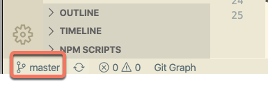
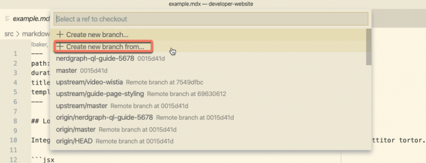
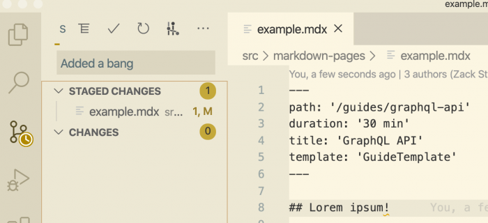
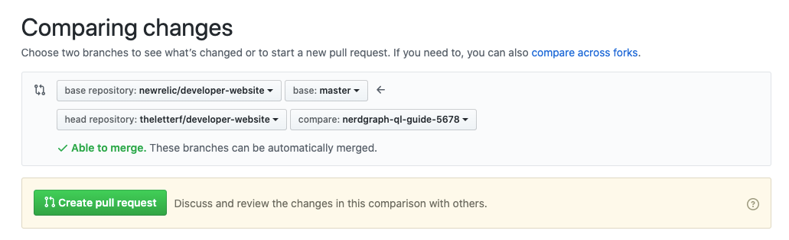

The [New Relic Developer docs](https://developer.newrelic.com/) are part of our documentation ecosystem. To edit content on the developer docs' website, you have to create or edit Markdown files in an open source code repository hosted on GitHub. This [docs-as-code](https://www.writethedocs.org/guide/docs-as-code/) procedure requires a different set of tools than Drupal.

## Requirements

To edit the developers website you need the following:

* A public GitHub account. If you don't have one, create it using your New Relic email [here](https://github.com/join).
* git (macOS already has a git client, so that's easy).
* A code editor. [Visual Studio Code](https://code.visualstudio.com/download) is strongly recommended.
* Some familiarity with [Markdown](https://github.com/adam-p/markdown-here/wiki/Markdown-Cheatsheet) dialects.

To test the site locally, you will need node.js installed on your machine. The easiest way to get it is to install [Homebrew](https://brew.sh/) (a macOS package manager) and fetch node.js and npm from there.

1. Install Homebrew:

   ```
   /bin/bash -c "$(curl -fsSL https://raw.githubusercontent.com/Homebrew/install/master/install.sh)"
   ```
2. Install node.js and npm:

   ```
   brew update
   brew install node
   ```
3. Test that node.js and npm are installed correctly by installing a simple package globally:

   ```
   npm install -g hello-world-npm
   ```

To fix issues with Homebrew, run `brew doctor` .

<Callout variant="tip">
  Homebrew and npm are routinely used by our developers — they're approved by IT and Security.
</Callout>

## Set up your environment

### Configure git and SSH

Before starting to use git, you should set your username and email address as global settings. To do so, open the terminal and type the following commands:

```
git config --global user.name "Your name here"
git config --global user.email "Your_email@example.com"
```

That will associate your commits to your GitHub username and email. You should also [set up an SSH key](https://help.github.com/en/github/authenticating-to-github/adding-a-new-ssh-key-to-your-github-account) before pulling and pushing data from/to GitHub: it's safer and you won't have to re-type your password.

### Clone the repository on your machine

The Developer Experience team requests that New Relic employees work in a branch off of the developer-website repo. So you will clone the repo, create a working branch, and push that to GitHub. Note they have [contributor's guidelines](https://github.com/newrelic/developer-website/blob/main/CONTRIBUTING.md) on the repo.

1. To clone the repository, open a terminal session and run the following command (if you're using **SSH**):

```
git clone git@github.com:newrelic/developer-website.git
```

Or this command if you're using **HTTPS**:

```
git clone https://github.com/newrelic/developer-website.git
```

Git clones the repository onto your machine. You'll be on the `main` branch, which is the branch that is published to the developer.newrelic.com site.

### Create a working branch

1. In terminal, cd to the folder where you have cloned the developer-website repo:

for example: `cd documents/github/developer-website`  
2. Create a new branch:

```
git checkout -b BRANCHNAME
```

3. You should be in the new branch. To check, run `git branch` If you need to switch to the branch you created, run `git checkout BRANCHNAME`

4. Start working in the `src/markdown-pages` folder on your machine.

## Using Visual Studio Code + Git

[Visual Studio Code](https://code.visualstudio.com/download) is a popular code editor. It's extensible and has built-in support for both Markdown and git — it will make your life a lot easier when editing code that is hosted on GitHub.

### Open the repo folder in Visual Studio Code

In Visual Studio Code, go to **File > Open**, navigate to the root folder of the repo, and click Open. That will open the repo as a workspace, and you'll be able to navigate its structure.

Once the folder structure is visible, open **src > markdown-pages.** Clicking a file will open a tab in Visual Studio Code, with the content ready to be edited.


### Create a new branch in your local repository

Visual Studio Code is smart about git repositories, and checks automatically what branch are you on and what have you changed. Look at the status bar at the bottom-left corner of Visual Studio Code — you should see that you're on the `main` branch (unless you've already created one) (note that this used to be master and is now main).



Working on a different branch is cleaner. To create a new branch from Visual Studio Code, hit the master button you've just seen: a menu will appear at the top. This menu not only allows to create new branches, but also to switch between branches with a couple clicks. Hit **Create new branch from**:



Write a recognizable name, then select which branch are you starting from (hint: it's `master`). Now check again the bottom-left half of the editor: you should be on the newly created branch.

### Tracking and committing changes

Every time you save, move, delete, or alter files and folders in the branch, git records those changes in its log. Visual Studio Code lets you watch what happens from its **Source Control** view.



To save any meaningful changes to the code, you must **commit**, which is akin to logging changes in a diary. When you commit, you are telling git to remember what changed since the last time and why. You can commit directly from Visual Studio Code by typing a message and hitting the check button:


**Commit often and write meaningful commit messages.** Since commits can be undone, cherry-picked, and accessed individually, having lots of commits in your repo lets you go back and forth in time effortlessly.

### Push changes to remote

All changes are done, and all have been committed. It's now time to push the changes to the repository. First, Pull from main (see the image below). You might have some merge conflicts. If so, dial a friend. If not, click the **...** button in the Source Control view and select **Push to**:


Choose: `origin` If there are no conflicts, your commit will be synced with the GitHub developer-website repository.

### What if something goes wrong

git is a complex, unwieldy piece of software, and getting things wrong can be incredibly easy. If something doesn't go as expected, here are some general recommendations:

* Click the **...** button in **Source Control** view to access some useful shortcuts, such as **Undo last commit** or **Discard all changes**.
* If you want to start from scratch, move the local repository to a different location on your machine and re-clone the GitHub repository.
* Some issues can only be solved from the terminal. Google is your friend. Also look at the [Useful links](#useful_links).

## Open a pull request

Pull requests are the (very social) way GitHub handles code merging. When the branch on your fork reached an acceptable state and you are ready to integrate the docs into the official repository, open your fork in GitHub.

Once you're there, click **New pull request**, then, on the right side, select the branch that you wish to merge with `main`. GitHub will automatically show the diff between both the original `master` and your branch.



If you're fine with what you see, click **Create pull request**. It's recommended that you add a description to the PR, but remember that GitHub is public: **do not disclose any internal information**, even if the repo is private.

The PR being open, it's time for you to wait for the repo maintainers to check the changes and merge. Remember that you can [edit files directly in the pull request](https://help.github.com/en/enterprise/2.14/user/articles/editing-files-in-your-repository) if need be, and also [add comments to any line](https://help.github.com/en/enterprise/2.14/user/articles/commenting-on-a-pull-request).

<Callout variant="tip">
  Any commit that you push to your branch will appear in automatically update your pull request — no need to open a new PR if there's a last minute change!
</Callout>

## Recommended: iTerm 2 + zsh + oh-my-zsh

You are going to use the terminal much more in the future: customizing it will make your life easier when dealing with git repositories. Look at this screenshot:


The terminal prompt is colored and includes useful information, such as the branch you're on and how many changes you can pull/push (among other things).

To get this on your terminal, follow the instructions in [iTerm2 + zsh + oh-my-zsh](https://gist.github.com/kevin-smets/8568070).

## Useful resources and links [#useful_links]

Here are some useful resources, split by category:

### Git and GitHub

* [Oh S\*\*\*, Git!?!](https://ohshitgit.com/) - A simple cookbook that will pull you out of most troublesome git scenarios
* [GitHub Guides](https://guides.github.com/) - Easy-to-follow, user-friendly approach to git's basics.
* [Official git documentation](https://git-scm.com/) - A bit dry, but extremely thorough.

### Visual Studio Code

* [Visual Studio Code for documentation](https://github.com/cangulo/meetups/tree/master/vs_code_for_docs/2020_05_22_write_bcn) - Recording + presentation of a Write the Docs BCN
* [MDX](https://marketplace.visualstudio.com/items?itemName=silvenon.mdx) - This extension adds Markdown syntax highlighting to MDX files.
* [Working with GitHub](https://code.visualstudio.com/docs/editor/github) - A Microsoft guide on using version control in VS Code
* [Markdown and Visual Studio Code](https://code.visualstudio.com/docs/languages/markdown) - Another Microsoft guide, this time on Markdown support
