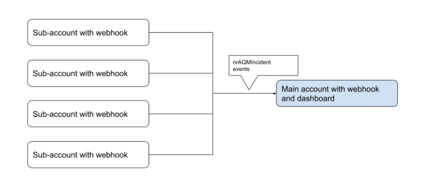

## The Problem [#problem]

Teams suffer from alert fatigue when they are subject to high alert volumes and alerts that are not aligned to business impact. This situation will condition responders to believe that most alerts are false, will cause them to prioritize easy to resolve alerts over others, and may drive them to close unresolved incidents so they can stay within their SLA targets.  Overall, these behaviors will result in slower incident response, which will magnify issue scope and severity when true business impacting issues occur.

Alert Quality Management (AQM) focuses on reducing the number of nuisance incidents so that only alerts with true business impact are asserted.  This reduces alert fatigue and ensures that attention is focused on the right places at the right times.

You are a good candidate for AQM if any of the following are true:

* You have too many alerts.
* You have alerts that are asserted for long time periods.
* Your alerts are not relevant.
* You perceive that customers discover your issues before your monitoring tools do.
* You can’t see the value of your observability tool(s).

## Desired Outcome [#solution]

### Overview [#overview]

An alert strategy based on measuring business impact will result in faster response times and greater proactive awareness of critical events.  An improved alert signal to noise ratio reduces confusion and improves rapid identification and problem isolation.

AQM’s overall goal is to ensure that fewer, more valuable, incidents are created, resulting in increased uptime and availability and reduced MTTR.  As you move towards this goal, alert volume will decrease and alerts that are not valuable will be identified and either made valuable or removed.

The AQM process described in this guide will generate the key performance metrics that you will use to measure progress towards these goals.  Those KPIs will be used to drive a continuous improvement process that identifies and reduces nuisance alerts and increases user engagement in incident investigation.  Those business metrics are measured in real time in the AQM dashboard.

AQM is intended to improve the value of existing alert configurations and to detect known or expected modes of failure.  It does not encompass anomaly detection or AIOps, which are designed to detect unknown or unexpected modes of failure.  The two practices (AQM and ML/AI) work hand in hand, they are not mutually exclusive.

## Key Performance Metrics [#kpi]

AQM measures the following KPIs:

* Incident volume:
  * Incident Count
  * Accumulated incident time
  * Mean Time to Close (MTTC)
  * Percent Under 5 Minutes

* User Engagement:
  * Mean Time to Investigate  (MTTI)
  * % of Incidents Investigated

Detailed information on each metric follows.

### Incident Volume [#incident-volume]

#### Summary [#iv-summary]

Incidents (with or without alerts) should be treated like a queue of tasks and, just like a queue, the number of alerts should spend time near zero. For each incident, an action should be taken to resolve the condition. If an alert does not result in action, then the value of the alert condition should be questioned.

If you see a constant rate of incidents or specific incidents that are “always-on”, you should question why. Are you in a constant state of business impact, or do you simply have a large volume of noise? The alert volume KPIs help you to answer those questions and to measure progress towards a healthy state of high quality alerting.

#### Volume - Incident Count [#iv-count]

<table>
  <thead>
    <tr>
      <th width={200}>
        Volume - Incident Count
      </th>

      <th>
        Notes
      </th>
    </tr>
  </thead>

  <tbody>
    <tr>
      <td>
        Description
      </td>

      <td>
        Incident Count is the number of incidents generated over a period of time. Typically you should compare the current and previous weeks.
      </td>
    </tr>

    <tr>
      <td>
        Goal
      </td>

      <td>
        Reduce the number of low value / nuisance incidents.
      </td>
    </tr>

    <tr>
      <td>
        Best Practices
      </td>

      <td>
        * Ensure condition settings are intended to detect real business impact.
See “Service Level Objectives” [link tbd].
        * Ensure condition settings are detecting abnormal behavior.
        * Communicate that the incident details “Acknowledge” feature helps measure meaningful and actionable alerts. See “Percent Investigated KPI” [link tbd].
        * Report AQM KPIs to all stakeholders.
      </td>
    </tr>
  </tbody>
</table>

#### Volume - Accumulated Incident Duration [#iv-duration]

<table>
  <thead>
    <tr>
      <th width={200}>
        Volume - Incident Duration
      </th>

      <th>
        Notes
      </th>
    </tr>
  </thead>

  <tbody>
    <tr>
      <td>
        Description
      </td>

      <td>
        Accumulated incident duration is the total sum of minutes that all the incidents accumulated over a period of time. Typically you should compare the current and previous weeks.
      </td>
    </tr>

    <tr>
      <td>
        Goal
      </td>

      <td>
        Reduce the total accumulated minutes of incidents.
      </td>
    </tr>

    <tr>
      <td>
        Best Practices
      </td>

      <td>
        * Do not manually close incidents. Manual closure will skew the real duration of incident length.
        * Eliminate alerts that do not result in any remediation actions from the recipients.
        * Improve percent investigated and mean-time-to-investigate KPIs (below) by communicating their importance in improving detection and response time.
        * Report AQM KPIs to all stakeholders.
      </td>
    </tr>
  </tbody>
</table>

#### Volume - Mean-Time-To-Close (MTTC) [#iv-mttc]

<table>
  <thead>
    <tr>
      <th width={200}>
        Volume - Mean-Time-To-Close (MTTC)
      </th>

      <th>
        Notes
      </th>
    </tr>
  </thead>

  <tbody>
    <tr>
      <td>
        Description
      </td>

      <td>
        Average duration of incidents within the period of time measured.
      </td>
    </tr>

    <tr>
      <td>
        Goal
      </td>

      <td>
        Reduce MTTC.
      </td>
    </tr>

    <tr>
      <td>
        Best Practices
      </td>

      <td>
        * Do not manually close incidents. Manual closure will skew the real duration of incident length.
        * Improve Reliability Engineering skills [link tbd].
        * Report AQM KPIs to all stakeholders.
      </td>
    </tr>
  </tbody>
</table>

#### Volume - Percent Under Five Minutes [#iv-percent]

<table>
  <thead>
    <tr>
      <th width={200}>
        Volume - Percent Under Five Minutes
      </th>

      <th>
        Notes
      </th>
    </tr>
  </thead>

  <tbody>
    <tr>
      <td>
        Description
      </td>

      <td>
        Percentage of incidents where the duration of the incident is under five minutes.  This can be an indicator of incident flapping.
      </td>
    </tr>

    <tr>
      <td>
        Goal
      </td>

      <td>
        Minimize percentage of incidents with short durations.
      </td>
    </tr>

    <tr>
      <td>
        Best Practices
      </td>

      <td>
        * Ensure that conditions are detecting legitimate deviations from expected behavior. See Baselining and Service Level Management [links tbd].
        * Ensure that conditions are detecting legitimate deviations that correlate to business impact or impending business impact.
      </td>
    </tr>
  </tbody>
</table>

### User Engagement [#user-engagement]

#### Summary [#ug-summary]

The value of an incident is measured by whether or not it engages the attention of the relevant incident response team(s).  Engagement in this context is measured by whether or not an incident has been acknowledged.  The amount of engagement an individual alert receives is a direct measurement of its value.  More engagement implies a valuable alert, less (or zero) engagement implies a nuisance alert that should be modified or disabled.

It is important to understand that there is a significant difference between measuring the moment of incident awareness vs. acknowledging the moment resolution activity begins. If you are using an integration with New Relic Alerting, be sure that the “acknowledge” event that is sent to New Relic is triggered when resolution activity begins, not when the incident is sent to the external incident management tool.  For more information regarding the standard Incident Management process, see [Incident Management Process: 5 Steps to Effective Resolution Posted on August 31, 2020 by OnPage Corporation](https://www.onpage.com/incident-management-process-5-steps-to-effective-resolution/). -- in reference to [ITIL4](https://itsm.tools/its-here-itil-4-explained/).

#### User Engagement - Percentage Incidents Acknowledged [#ue-ack]

<table>
  <thead>
    <tr>
      <th width={200}>
        User Engagement - Percentage Incidents Acknowledged
      </th>

      <th>
        Notes
      </th>
    </tr>
  </thead>

  <tbody>
    <tr>
      <td>
        Description
      </td>

      <td>
        Incidents acknowledged identifies the percentage of incidents that had their acknowledged property set to true.  Typically you should compare the current and previous weeks.
      </td>
    </tr>

    <tr>
      <td>
        Goal
      </td>

      <td>
        Increase the percentage of users engaging incident details.
      </td>
    </tr>

    <tr>
      <td>
        Best Practices
      </td>

      <td>
        * Educate the DevOps team on when it is appropriate to acknowledge an incident alert.
        * Gamify alert acknowledgement to drive usage.
        * Discourage mass acknowledgement exercises.
      </td>
    </tr>
  </tbody>
</table>

#### User Engagement - Mean Time to Investigate [#ue-mtti]

<table>
  <thead>
    <tr>
      <th width={200}>
        User Engagement - Mean Time to Investigaten
      </th>

      <th>
        Notes
      </th>
    </tr>
  </thead>

  <tbody>
    <tr>
      <td>
        Description
      </td>

      <td>
        Mean time to investigate identifies the average time it takes for an incident to be triaged.  Typically you should compare the current and previous weeks.
      </td>
    </tr>

    <tr>
      <td>
        Goal
      </td>

      <td>
        Reduce the mean time to investigate.
      </td>
    </tr>

    <tr>
      <td>
        Best Practices
      </td>

      <td>
        * Work at building incident responder’s confidence in alerts.
        * Ensure that valuable alerts are acknowledged.
        * Incentivize response teams to respond quickly to alerts.
      </td>
    </tr>
  </tbody>
</table>

## Required Knowledge [#required-knowledge]

Implementers of this use case should have basic knowledge of the topics itemized below.

1. NR1 Alert Policy and Conditions configuration
2. NR1 Incident Notification Channel Webhook configuration
3. NR1 NRQL
4. NR1 Alerting Best Practices
5. NR1 APM & Infrastructure
6. How to baseline data in order to determine anomalies vs. normal behavior.

**NOTE:** It’s highly recommended that all attendees complete the New Relic University (NRU) Overview Course or have equivalent experience.

## Establishing Current State [#current-state]

As with any continuous improvement process, the first step of AQM is to establish the current state of your KPIs.  To do so, perform the following tasks:

### Install and configure incident event webhook. [#webhook]

In this task, you should do the following:

1. Identify your primary production account and each of your accounts that you will be analyzing with the AQM process.
2. Install the Incident Event webhook into each account that will participate in the AQM process and configure the webhook to report nrAQMIncident events to your primary production account.
3. Assign the webhook as a notification channel to every alert policy in each account.

<figcaption>
  This example shows a webhook notification for each account.
</figcaption>

The webhook will create New Relic events corresponding to each incident as it proceeds through its lifecycle (open, acknowledge, close).  It is critical that this webhook be associated as a notification channel for each and every alert policy.  Failure to do so will reduce or eliminate the value of the AQM process.

**NOTE:** AQM requires the use of incident, not violation data. The out of box NrAiIncident event provides violation data only and must not be used to drive this process. As of December 2020, the NR Detection Team has not yet integrated acknowledged events into NrAiIncident.  It’s anticipated that the NrAiIssue event type will contain this required event at some point in 2021. In the meantime, we must still manually establish a webhook to send the required data to New Relic.

Full webhook instructions can be found at: [https://source.datanerd.us/amazzarellafaria/observability-maturity](https://source.datanerd.us/amazzarellafaria/observability-maturity) (VPN Required).

## Install the AQM Dashboard [#install-dashboard]

text.

## H2 [#h2]

text.

## What's next?

To learn more about using alerts:

* Learn about the [API](https://docs.newrelic.com/docs/alerts/rest-api-alerts/new-relic-alerts-rest-api/rest-api-calls-new-relic-alerts).
* Read technical details about [min/max limits and rules](https://docs.newrelic.com/docs/alerts/new-relic-alerts/getting-started/minimum-maximum-values).
