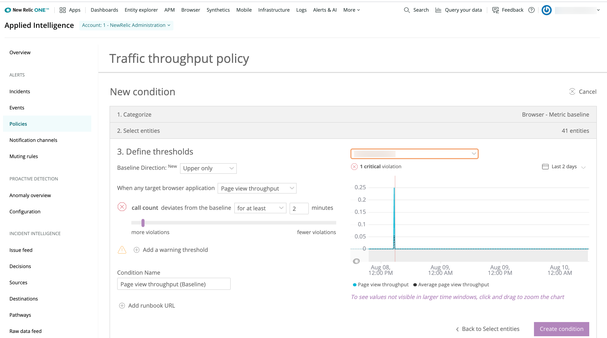

**Browser monitoring tips & tricks that every user should know**

Get more out of [browser monitoring](https://newrelic.com/platform/full-stack-observability), with deeper visibility into your websites and your users. Here are 10 best practices to help you find problems faster and deliver a better experience to your customers with real user monitoring.

## 1. Use browser SPA agent [#spa]

**Use the browser SPA agent for deeper visibility**

Modern websites are complex, with dynamic content and sophisticated logic. See deeper into your user interactions, enable the [single-page application (SPA) agent](/docs/browser/single-page-app-monitoring/get-started/introduction-single-page-app-monitoring) for browser and gain visibility into your user actions and the underlying webpage events behind them.

This framework-agnostic agent is not only for single-page application frameworks like React, Angular, Ember, or Backbone, but also for custom frameworks and any other pages with dynamic content. Advanced timing analytics provide more granularity into [Navigation Timing Specification API](/docs/browser/new-relic-browser/page-load-timing-resources/instrumentation-browser-monitoring) sub-timings beyond page rendering or DOM processing, with detailed performance data filtering useful for understanding all page lifecycles.

### How to do it

This is enabled by default for new [browser agent installs](/docs/browser/browser-monitoring/installation/install-browser-monitoring-agent). To edit this configuration, go to a browser app's [**App settings** page](/docs/browser/new-relic-browser/configuration/browser-app-settings-page). 

## 2. Use APM auto-instrumentation [#auto-instrument]

**Use APM automatic instrumentation over copy/paste**

If you’re also a [APM](https://newrelic.com/application-monitoring) customer, we recommend enabling [automatic instrumentation](/docs/browser/new-relic-browser/installation-configuration/add-apps-new-relic-browser) where possible, as this will automatically inject the browser monitoring JavaScript agent into your frontend for you. Not only will the browser agent remain automatically up to date with this approach, using these products together helps unify frontend to backend visibility.

For example, you’d be able to link frontend AJAX calls to their corresponding backend transaction, and to align your frontend and backend data together in an Insights dashboard.

<Callout variant="tip">
  Depending on your backend framework or CDN strategy, a copy/paste approach may be the better strategy. Just remember that it’ll require periodic updating.
</Callout>

### How to do it

See [Enable browser monitoring](/docs/browser/browser-monitoring/installation/install-browser-monitoring-agent). 

## 3. Customize Apdex [#apdex]

**Customize your Apdex threshold**

New Relic uses [Apdex](/docs/apm/new-relic-apm/apdex/view-your-apdex-score), an [industry-standard](/docs/apm/new-relic-apm/apdex/apdex-measuring-user-satisfaction) metric, to measure users’ satisfaction with the response time of your applications. Apdex converts many measurements into one number on a uniform scale of 0 to 1 (0 = no users satisfied, 1 = all users satisfied). [Apdex T](/docs/apm/new-relic-apm/apdex/change-your-apdex-settings) is the central value for Apdex—it is the response time below which a transaction is considered “Satisfactory.”

You can define Apdex T values for each application, with separate values for app server and end-user browser performance. (Note that many modern websites are bottlenecked primarily in the frontend browser, accounting for 90% or more of pageload times.)

While a suggested T-value threshold is 5 seconds, we encourage you to customize your Apdex T value to fit the needs of your users and application. For example, an ecommerce site may want to have a lower T value to reduce bounce rates from potential buyers frustrated by a slow experience, compared to an internal employee application. However, the goal is to continually lower T-values over time to improve your digital customer experience.

### How to do it

1. From the browser app list, select an app, then select **Settings > Application settings**.
2. Set the **Apdex T** value (in seconds) for this application.
3. Click **Save application settings**.


<figcaption>
  [one.newrelic.com](https://one.newrelic.com) > Browser > Settings > Application
</figcaption>

## 4. Create alerts [#alerts-policies]

**Create and evaluate alert policies**

What happens if your Apdex score exceeds your threshold? You want to be alerted whenever this happens, so that you can investigate what is causing the issue before you lose any customers.

New Relic provides [unified alerting](/docs/alerts/new-relic-alerts/getting-started/alert-policy-workflow) across all our products, including browser monitoring, so that you’ll always be in the know. We recommend setting up alerts to monitor your Apdex score, along with these sample alerts to get you started:

* **Apdex score:** Alert if score is below 0.8 for 5 minutes. (If the Apdex score is below 0.8, that means 20% or more of your users are not “satisfied” with their experience on your website.)
* **Page load time:** Alert if median page load time is above 10 seconds for 5 minutes. (If the median page load time begins to spike, that suggest that something may be wrong with your web page causing it to significantly slow down. This complements alerting on your Apdex score.)
* **JS errors:** Alert if error rate is above 5% for 5 minutes. (If your frontend error rate starts spiking, particularly after a deployment, you may have introduced bad JavaScript into your frontend that should be fixed.)

### How to do it

1. From **Alerts & AI**, select **Go to Alerts**, and click on **Policies** on the left column.
2. Select **(+) New alert policy** to create a new alert policy, and give it a meaningful name.
3. Click on **Create a condition** to create your first condition, then select **Browser** for your product and the **Metric** for the condition (which should be the default). Then click **Next, select entities**.
4. Click the checkbox for the applications you want to alert on, and click **Next, define thresholds**.
5. Pick the metrics of interest and their thresholds that determine when to trigger an alert.


<figcaption>
  [one.newrelic.com](https://one.newrelic.com) > Alerts & AI > Policies > New alert policy
</figcaption>

## 5. Use baseline alerts [#alerts-anomalies]

**Alert on anomalous behaviors and events**

While some metrics can be easily tracked against specific thresholds, other types of data can be more cyclical or have variable ranges for what’s considered healthy. Traffic throughput is a good example of this; it can have significantly cycles, but large traffic drops or spikes may be important indicators of a breakage preventing user traffic or a DDoS attack spiking traffic. [Baseline alerts](/docs/alerts/new-relic-alerts/defining-conditions/create-baseline-alert-conditions) can be helpful for creating an expected "band" of normal activity to create more signal to noise in your alerting.

### How to do it

1. From **Alerts & AI**, select **Go to Alerts**, and click on **Policies** on the left column.
2. Select **(+) New alert policy** to create a new alert policy, and give it a meaningful name.
3. Click on **Create a condition** to create your first condition, select **Browser** for your product and the **Metric Baseline** for the condition (which should be the default). Then click **Next, select entities**.
4. Click the checkbox for the applications you want to alert on, and click **Next, define thresholds**.
5. Pick the **Page view throughput** and use the slider to define the normal range you want to trigger the alert.



<figcaption>
  [one.newrelic.com](https://one.newrelic.com) > Alerts & AI > Policies > New alert policy
</figcaption>

## 6. Add alerts to workflows [#alerts-notifications]

**Integrate your alerts into your workflows**

With the different alerting policies that you’re setting up, you’ll want to make sure to take advantage of the different [alert notification channels](/docs/alerts/new-relic-alerts/managing-notification-channels/notification-channels-controlling-where-send-alerts) available so that they’re integrated into team workflows. After all, what good are alerts if no one knows about them?

You can route alerts through Slack, PagerDuty, webhooks, email, and more. You also have the opportunity to align alert notifications with your response processes, such as integrating with ChatOps or [linking runbooks](/docs/alerts/new-relic-alerts/defining-conditions/provide-runbook-instructions-alert-activity) to your alerts. Be sure to evaluate alert policies on a regular basis to ensure that they are always valid.

### How to do it

1. From **Alerts & AI**, click on **Notification channels**.
2. Set up different [notification channels](/docs/alerts/new-relic-alerts/managing-notification-channels/notification-channels-controlling-where-send-alerts), which can then be used within different [alerting policies](/docs/alerts/new-relic-alerts/getting-started/alert-policy-workflow).

## 7. Create dashboards [#insights-dashboards]

**Create your own dashboards**

Browser automatically provides a curated experience to quickly triage issues, but you can also create bespoke [dashboards](/docs/query-your-data/explore-query-data/dashboards/introduction-new-relic-one-dashboards) with your frontend data with the [query builder](/docs/query-your-data/explore-query-data/query-builder/use-advanced-nrql-mode-specify-data). Build unique real-time overviews of what’s going on in your frontend, and see how it fits with the rest of your technology stack.

For example, you can:

* Create a browser-specific breakdown of percentiles, durations, and page views:

  ```
  SELECT average(duration),percentile(duration,50,75,95) as 'Percentile', count(*) as 'Pageviews' FROM PageView WHERE userAgentName='Chrome' SINCE 1 week ago
  ```
* Break down route change performance into percentiles:

  ```
  SELECT count(*) as 'Route Change', average(duration) as 'Avg PageLoad',percentile(duration,50,75) as '%' ,average(jsDuration) as 'JS Duration' FROM BrowserInteraction FACET targetUrl where category = 'Route change' SINCE 1 day ago
  ```
* Compare frontend performance to backend performance in APM:

  ```
  SELECT average(duration) as 'Avg Frontend Duration', average(backendDuration) FROM PageView SINCE 2 minutes ago UNTIL 10 seconds ago TIMESERIES
  ```

These individual widgets can be added together to create a team dashboard that’s shared across different engineering teams and the company. You can bring together web and mobile application data, backend data, infrastructure data, synthetic monitoring data, and more, all on a single custom dashboard across [New Relic One](/docs/new-relic-one/use-new-relic-one/get-started/introduction-new-relic-one).


<figcaption>
  [one.newrelic.com](https://one.newrelic.com) > Dashboards
</figcaption>

### How to do it

1. Go to **[one.newrelic.com](https://one.newrelic.com)**, then click **Query your data** to access the [query builder](/docs/query-your-data/explore-query-data/query-builder/introduction-query-builder).
2. In the NRQL tab of the query builder, paste the query into the **NRQL>** query bar and click **Run**.
3. Type in a **widget title**, and add to either an existing or a new dashboard**.**
4. Go to **Dashboards** to see your new dashboard.

For more information, see our docs on [data querying](/docs/using-new-relic/data/understand-data/query-new-relic-data) and [dashboards](/docs/query-your-data/explore-query-data/dashboards/introduction-new-relic-one-dashboards).

## 8. Group your data [#segment-whitelist]

**Group your data into meaningful categories**

Different websites have different URL architectures, which can vary depending on content structure, technology framework, or SEO strategy. For example:

* website.com/product/widget-name
* website.com/gallery?product=109832
* website.com/gallery/housewares/lamps/widget-name
* website.com/product#widget-name

URL structure possibilities are endless, so browser includes an automatic grouping algorithm to set categories for that data into different URL groups. We recommend using [URL grouping allowed lists](/docs/browser/new-relic-browser/configuration/url-whitelists-grouping-browser-metrics) to customize how your data is grouped together, which makes the corresponding performance information more useful and aligned to your website architecture.

If the data generated by this default grouping is too high level, creating a URL grouping will disaggregate the data and give you greater granularity to make it more useful. For example, you could group by:

* Different page types: product pages vs. search pages
* Different forms, APIs, or user groupings
* Mobile vs. non-mobile
* Authenticated vs. non-authenticated
* Different content delivery networks (CDNs)

### How to do it

1. In the browser monitoring UI, select **Settings** > **Segment allow lists**.
2. In the **Allow listed segments** section, click on the **+** icon.
3. Type in the URL segments you want to appear in groupings on the page views and AJAX pages.


<figcaption>
  [one.newrelic.com](https://one.newrelic.com) > Browser > Settings > Segment allow lists.
</figcaption>

## 9. Get the right data [#domain-conditions]

**Make sure you get data only from the right sources**

Browser data is generated from wherever your JavaScript agent is instrumented, though copies of your agent might become duplicated, such as through development, staging, or other environments, resulting in additional data being included from these sources that you would not want mixed with your production data. You can use [domain conditions](/docs/browser/new-relic-browser/configuration/monitor-or-block-specific-domains) to allow or deny data from the different website domains you want monitored.

### How to do it

1. In the browser monitoring UI, select **Settings** > **Domain conditions**.
2. If there are no domain conditions in place, select **Enable domain conditions**. If conditions exist, select **Next, Choose your setting**.
3. Select **Deny only** or **Allow only** to identify the data you want collected from the domains you want monitored. Then select **Next, Create conditions.**
4. Enter the domain string conditions that you want to deny or allow data collection (maximum 10 conditions).
5. Review and confirm your domain condition settings.


<figcaption>
  [one.newrelic.com](https://one.newrelic.com) > Browser > Settings > Domain conditions.
</figcaption>

## 10. Break down performance data [#breakdown]

**Break down performance across your users, business, and more**

By leveraging [New Relic APIs](/docs/apis/get-started/intro-apis/introduction-new-relic-apis#browser-api), you can add vital context to your performance data as it relates to your technology, users, and your business. All our monitoring tools send their data to [New Relic One](/docs/new-relic-one/use-new-relic-one/get-started/introduction-new-relic-one), which enables plenty of customization and extensibility in your dashboarding. Just be sure to standardize naming for custom events and attributes across different data sources (such as between browser and mobile) for omnichannel engagement.

Here are some examples of what you can measure:

* **Build id**: Pass in a build number to A/B test differences between versions
* **User id:** Manage your VIP customers and track their experience
* **Cart value:** Understand how much revenue is at risk when errors occur during checkout
* **Content type:** Track the type of content your users are viewing
* **Video playback:** See how users are consuming your media content

The possibilities are endless. And as you can see, this type of reporting creates context around how your application performance impacts the rest of the business.

### How to do it

* Use [our APIs](/docs/apis/get-started/intro-apis/introduction-new-relic-apis#browser-api) to pass custom data about people, things, money, and more into New Relic One.
* Visit [**one.newrelic.com**](https://one.newrelic.com), and query on the custom data that is now available.

For more information, see our docs on [data querying](/docs/using-new-relic/data/understand-data/query-new-relic-data) and [dashboards](/docs/query-your-data/explore-query-data/dashboards/introduction-new-relic-one-dashboards).


<figcaption>
  [one.newrelic.com](https://one.newrelic.com) > Dashboards > (selected dashboard).
</figcaption>

## Want more user tips? [#more-tips]

* View training videos at [New Relic University](https://learn.newrelic.com/).
* Read the [Browser documentation](/docs/browser).
* Check out our [Tutorials](https://newrelic.com/resources/tutorials) page.
* Ask a question in the [New Relic Community Forum](https://discuss.newrelic.com/).
