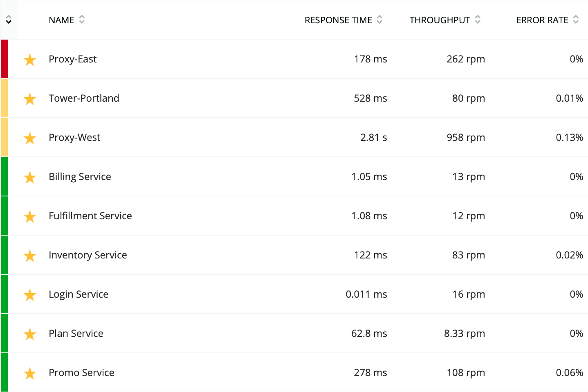

The health map provides a single place to visually monitor the health of all your apps and their related hosts, prioritized by [health status](/docs/alerts/new-relic-alerts/configuring-alert-policies/identify-entities-without-alert-policies#colors). You can customize the page by using different [views, filters, and toggles](#views) to organize the map in a way most relevant to you or your team. [Use your health map](#view-use-map) to monitor applications and hosts in real-time, and quickly track down problems as they occur.

## Best practices [#optimize]

The health map pulls data together from several New Relic solutions. To get the most out of the health map, we recommend using the following features:

* Infrastructure monitoring: [Create filter sets](/docs/infrastructure/new-relic-infrastructure/filter-group/filter-sets-organize-your-infrastructure-hosts) to meaningfully categorize hosts.
* APM: Create [tags](/docs/data-analysis/user-interface-functions/organize-your-data/labels-categories-organize-apps-servers-monitors) to meaningfully categorize your applications.
* Alerts: Create alert policies that cover all your alerting scenarios.

The health map is also especially useful if you're using containerized apps on hosts, with many instances of apps per host.

## Features

<figcaption>
  **[one.newrelic.com](https://one.newrelic.com) > More > Health maps**: The health map combines data from APM, infrastructure monitoring, and alerts to display your applications and hosts prioritized by health status.
</figcaption>

Health map features include:

<CollapserGroup>
  <Collapser
    id="entities"
    title="Entities prioritized by health"
  >
    The health map organizes the page by primary [entity](/docs/alerts/new-relic-alerts/getting-started/alerts-glossary#alert-entity) boxes. Primary entity boxes contain current (refreshes every two minutes), at-a-glance health and performance data, secondary entities related to it, and links to relevant APM or Infrastructure UI pages for detailed performance data.

    

    <figcaption>
      Example of a health map primary entity box with secondary entities. The health map prioritizes entities based on the health status of primary then secondary entities.
    </figcaption>

    The health status is determined using data from [Alerts](/docs/alerts-applied-intelligence/new-relic-alerts/get-started/introduction-alerts). The health map prioritizes the entities by first sorting the primary entities by [health status](/docs/alerts/new-relic-alerts/configuring-alert-policies/identify-entities-without-alert-policies), then sorting those by the health status of their secondary entities (related apps or hosts).

    The health map supports red, yellow, green, light green (not targeted by any conditions), and gray (application stopped reporting data) statuses for applications.

    The health map supports red, yellow, and green statuses for hosts.

    <Callout variant="tip">
      If you have a host not targeted by any conditions, it appears green on the health map. If a host is not reporting data, it does not display on the health map unless you [create a host-not-reporting condition](/docs/infrastructure/new-relic-infrastructure/infrastructure-alert-conditions/create-infrastructure-host-not-reporting-condition).
    </Callout>

    Entities are prioritized to the top based on this order:

    <CollapserGroup>
      <Collapser title="Entity sort order criteria">
        1. Primary entities that have critical (red) health status ordered by:

           1. Count of secondary entities with critical (red) health status
           2. Count of secondary entities with warning (yellow) health status
           3. Count of secondary entities with green health status
           4. Count of secondary entities with light green health status (host view only)
        2. Primary entities that have warning (yellow) health status ordered by:

           1. Count of secondary entities with critical (red) health status
           2. Count of secondary entities with warning (yellow) health status
           3. Count of secondary entities with green health status
           4. Count of secondary entities with light green health status (host view only)
        3. Primary entities that have green health status ordered by:

           1. Count of secondary entities with critical (red) health status
           2. Count of secondary entities with warning (yellow) health status
           3. Count of secondary entities with green health status
           4. Count of secondary entities with light green health status (host view only)
        4. Count of secondary entities
        5. Name of entity
      </Collapser>
    </CollapserGroup>
  </Collapser>

  <Collapser
    id="views"
    title="Views, filters, toggles"
  >
    Use the **Views** dropdown to see the health of your system organized by your applications or your hosts.

    You can then filter those views by tags (apps) or filter set (hosts) to only see data most relevant to you or your team.

    Use the **Show metrics/hosts** toggles to show more/less information in the entity boxes.

    <table>
      <thead>
        <tr>
          <th width="225px">
            View
          </th>

          <th>
            Description
          </th>
        </tr>
      </thead>

      <tbody>
        <tr>
          <td>
            **Applications and related hosts**
          </td>

          <td>
            Organizes the map by application entities to display for each app:

            * Health status color
            * Condition violation information, if any
            * Summary metrics
            * Health of related hosts the application is running on as reported by New Relic Infrastructure

            Map includes an optional app tag filter.
          </td>
        </tr>

        <tr>
          <td>
            **Hosts and related applications**
          </td>

          <td>
            Organizes the map by host entities to display for each host:

            * Health status color
            * Condition violation information, if any
            * Summary metrics
            * Health of related applications running on the host reported by New Relic APM

            Map includes an optional host filter.
          </td>
        </tr>

        <tr>
          <td>
            **Filter sets and related hosts**
          </td>

          <td>
            Uses data reported by our infrastructure monitoring to display:

            * Health of the hosts in each filter set in Infrastructure
          </td>
        </tr>
      </tbody>
    </table>
  </Collapser>
</CollapserGroup>

## View and use health maps [#view-use-map]

<Callout variant="tip">
  To get the most out of your health map, see [health maps best practices](#optimize).
</Callout>

The health map represents the current state of your system. The map refreshes every two minutes. To view the health map:

1. From [one.newrelic.com](https://one.newrelic.com), select **More**, then select **Health maps**.
2. Select a view from the **View** dropdown to organize the map by application, host, or infrastructure filter sets.
3. If using the views **Applications and related hosts** or **Hosts and related applications**, use the **Filter** dropdown to only display entities most interesting to you or your team.
4. Optional: Toggle **Show metrics** or **Show hosts** to display more or less entity data.
5. Optional: Display the health map on a TV / wallboard in your operations center to [see your system's current health at a glance](#use-case-wallboard).
6. If entities start showing critical (red) or warning (yellow) health statuses, hover over the entity or the **Related hosts/apps** tiles for violation information to quickly ascertain the [scope](#use-case-scope) and [scale](#use-case-scale) of the problem.
7. Click through to the relevant APM or Infrastructure UI pages to get detailed information to start troubleshooting.

## Use cases

The health map is designed to help operations and DevOps professionals, who are responsible for the health of large, complex environments, understand:

<CollapserGroup>
  <Collapser
    id="use-case-wallboard"
    title="The system's current health at a glance"
  >
    You like to have a view up on the TV wallboard in your network operations center (NOC) that represents the health of all systems. You may be focused on a task and not notice when an alert comes in.

    With a wallboard you can feel assured that you can always glance up to see if anything is on fire. Conversely, even though something is alerting, you like to see the applications and hosts that are healthy to help keep things in perspective.
  </Collapser>

  <Collapser
    id="use-case-scope"
    title="Scope of the problem: What else is broken?"
  >
    You are responsible for many applications at your company. At any point in time, something is alerting and because there are many applications deployed across many hosts, it’s difficult for you to keep track of everything and know what is experiencing problems.

    The health map gives you a single place to see the health and relationship between all applications and hosts. You can easily correlate the alerting host with applications deployed to it and easily answer the question: What else is broken right now?
  </Collapser>

  <Collapser
    id="use-case-scale"
    title="Scale of the problem: Use context to find a noisy neighbor"
  >
    With container orchestration deploying containerized applications across many hosts, it’s difficult for you to understand the scale of the problem when you receive an alert for a host or groups of hosts.

    By using the application view of the health map, you can see the alerting host along with all the other hosts serving the application.

    If the issue is isolated to a single host, you can change to the host view of the health map to see what other applications are deployed on that host. In that view, you see that the host has four applications running and one of the applications is alerting on higher than normal throughput.
  </Collapser>
</CollapserGroup>

## Troubleshooting

If health map host boxes do not display their installed apps, or if application boxes do not display the Infrastructure-monitored hosts where they are running, see [APM data missing from infrastructure monitoring](https://docs.newrelic.com/docs/infrastructure/new-relic-infrastructure/troubleshooting/apm-data-missing-infrastructure).
