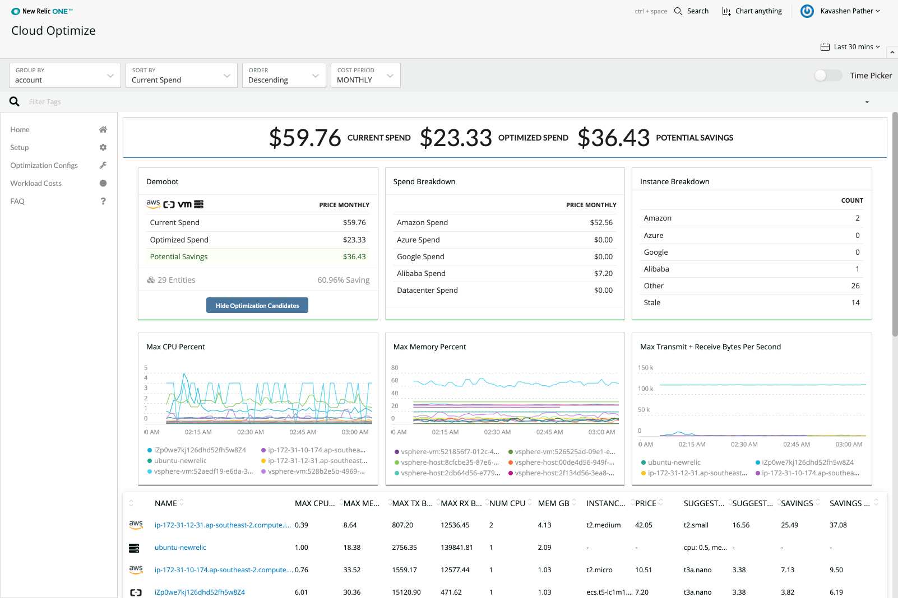

Analyzing metrics collected by [New Relic Infrastructure](/docs/infrastructure/new-relic-infrastructure/getting-started/introduction-new-relic-infrastructure) allows you to uncover opportunities to optimize your organization's operating environment, whether it is a physical datacenter or thousands of instances.

* Using too few resources in key areas can lead to errors or performance problems.
* Using too many resources can lead to unneeded costs.

For example, you may find that you can redistribute application instances to hosts that have extra memory and CPU resources, and terminate or repurpose the hosts those instances came from.

Use Infrastructure to ensure that your team is providing the right amount of compute power to meet customer expectations at appropriate costs.

## Prerequisites

This tutorial assumes you have reviewed New Relic's [Establish objectives and baselines](/docs/establish-objectives-baselines) tutorial.

## 1. Evaluate your environment's current efficiency [#efficiency]

Use the Cluster Explorer to observe performance and dependencies across any Kubernetes environment, and to troubleshoot failures, bottlenecks, and other abnormal behavior—helping ensure that their applications are always available, running fast, and doing what they’re supposed to do. You get an overall view of the health of each cluster, and can drill down as needed for details on the state of a Kubernetes object, including a view of key metrics and logs. Start at the outer ring to view nodes of the cluster, with each node displaying CPU, memory, and storage performance metrics that provide at-a-glance understanding of the node’s overall health. Specify a lower and upper RAM and CPU limits for each container using [requests and limits](https://blog.newrelic.com/engineering/kubernetes-request-and-limits/).

<figcaption>
  **[one.newrelic.com](https://one.newrelic.com) > Infrastructure > Hosts:** To evaluate your operating environment's efficiency, review the Infrastructure metrics (including averages that show as dotted lines), watch for outliers, and expand and sort the table's **Memory used** column.
</figcaption>

If you are using on-premise hosts (or Docker without Kubernetes), you can see the health of your hosts and containers in Infrastructure. Again, focus on CPU %, Load Average and Memory Used %. These metrics provide a good overview of your environment’s capacity.

## 2. Identify underutilized hosts and applications [#utilization]

As you identify hosts that have extra capacity, start with memory usage, as that is a common limiting factor:

1. From the Infrastructure **Hosts** page, expand _\[**Expand** icon]_ the table, then sort the **Memory used** column in descending order.
2. To identify good redistribution candidates, look for hosts using a small amount of memory that have a small number of applications deployed on them.

Also consider the health of an application before moving it to a different host.

1. To ensure that an application has predictable performance, use [APM](/docs/apm/new-relic-apm/getting-started/introduction-new-relic-apm).
2. From the [APM **Overview** page](/docs/apm/applications-menu/monitoring/apm-overview-page), track metrics for [Apdex (user satisfaction)](/docs/apm/new-relic-apm/apdex/apdex-measuring-user-satisfaction) and average response time for [transactions](/docs/apm/transactions/intro-transactions/transactions-new-relic-apm).
3. Review other app performance details from the [APM UI](/docs/apm/applications-menu).
4. Stabilize applications that are volatile before introducing other variables into their runtime performance.

## 3. Use the Cloud Optimize Nerdpack [#downsize]

[Cloud Optimize](https://github.com/newrelic/nr1-cloud-optimize) analyzes your cloud environment using the New Relic Infrastructure cloud integrations(for AWS, GCP, Azure and Alibaba). It compares the size of your instances to their utilization, identifying resources that are sized larger than needed. Cloud Optimize will estimate your savings by optimizing resource size. Installation details are on [GitHub](https://github.com/newrelic/nr1-cloud-optimize).

