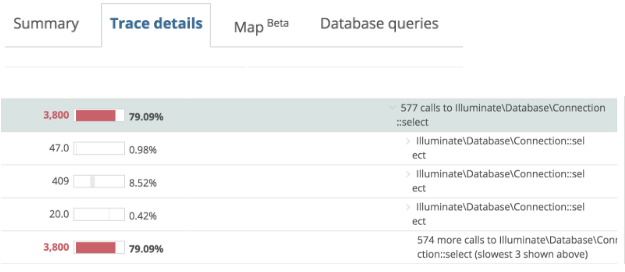

Application remediation involves gathering metrics and performance statistics about your application. This helps you identify bottlenecks and errors that can lead to instability in your software (and frustration for your users).

New Relic provides views of your application’s performance to help you quickly identify and remediate errors. These quick wins ensure you and your colleagues can accelerate the momentum of DevOps in your organization.

## 1. Use semantic naming throughout New Relic

Use semantic naming to give meaningful, structured names and labels to the applications you’re monitoring. Create a scalable syntax that can be understood, filtered, and sorted by any team who might use New Relic now or in the future. When you create your naming structure, be sure to consider growth and the potential for scaling/changes in your application’s architecture.

Consider the following naming structure:

* **store--us-web-prod**
* **store--us-web-stage**
* **store--us-web-dev**

This structure allows for additions to scale (for example, **store-eu-web-prod-02**), and makes the application’s environment searchable. Any convention you use should be unique to your organization’s structure, but be sure to use a convention that will allow you to optimize your environment as need.

## 2. Deploy the New Relic agent

Review the [compatibility and requirements for New Relic agents and products](/docs/agents/manage-apm-agents/installation/compatibility-requirements-new-relic-agents), and then follow the [documentation](/docs/agents/manage-apm-agents/installation/install-agent) to install the appropriate agent in your application. Once the agent is installed, you should see data begin to populate in New Relic within minutes.

<Callout variant="tip">
  If after several minutes, New Relic is not showing performance information, see [No data appears](/docs/agents/manage-apm-agents/troubleshooting/not-seeing-data).
</Callout>

## 3. Identify application performance outliers and errors

The default charts in New Relic tell a story about your application’s performance. If there are performance issues, patterns in the charts highlight the causes. The following figure, from the [Overview](/docs/apm/applications-menu/monitoring/apm-overview-page) page in APM, shows a large spike occurred at noon on March 27th, and was nearly double the response time of our application’s overall trend:

<figcaption>
  **[one.newrelic.com](https://one.newrelic.com) > APM > (select an app) > Monitoring > Overview**
</figcaption>

Additionally, the response time breakdown shows a spike in **Web external** (which indicates downstream dependencies). Since the spike seems to correlate with periods of higher throughput, we can then use the **Throughput** chart to analyze the problem in more detail.

## 4. Drill into specific time frames

Click and drag on a graph, to [drill into a focused time slice of performance data](/docs/using-new-relic/user-interface-functions/view-your-data/standard-page-functions#drilldown) to better isolate any issue you’re investigating. In this example, we’ve narrowed the view on the spike we saw in web transactions times:

<figcaption>
  **[one.newrelic.com](https://one.newrelic.com) > APM > (select an app) > Monitoring > Overview**
</figcaption>

Here, it’s obvious that some part of **Web external**, which is an application or service called by our **Web portal** app, is likely the source of the issue.

## 5. Drill into transaction traces to investigate outliers

New Relic displays transactions ordered with the most time consuming transaction at the top. Click a transaction to navigate to the [Transactions](/docs/apm/applications-menu/monitoring/transactions-page-find-specific-performance-problems) page and expand that transaction into its component parts and see any transaction traces that have been captured as a result of any performance issues. New Relic automatically captures these traces whenever a transaction violates your [Apdex](/docs/apm/new-relic-apm/apdex/apdex-measuring-user-satisfaction) score by more than four times for a specific number of seconds.

<Callout variant="tip">
  If you’re not capturing any transaction traces, you may not be violating these thresholds. Be sure to [configure transaction traces](/docs/apm/transactions/transaction-traces/configure-transaction-traces) for your applications as needed.
</Callout>

In the following example, we see that **interceptor.ServletConfigInter...** has significant transaction times:

<figcaption>
  **[one.newrelic.com](https://one.newrelic.com) > APM > (select an app) > Monitoring > Overview**
</figcaption>

In fact, it’s responsible for 99.9% of the app server time, which means we’re getting closer to identifying the culprit of our spike.

Here, we see the same spike from before, but the performance of the transaction is broken down into its components:

<figcaption>
  **[one.newrelic.com](https://one.newrelic.com) > APM > (select an app) > Monitoring > Overview**
</figcaption>

While the share of the response times for most components of this transaction remained stable, **GetPlansController** (in brown) spiked massively.

From the **Transaction traces** table, we can drill further into the transaction trace to get method-level detail of where the issue is occurring.

## 6. Identify performance outliers in the database

We identified that **GetPlansController** is consuming the vast majority of our response time. Here we see it in the [transaction trace summary](/docs/apm/transactions/transaction-traces/transaction-trace-summary):

<figcaption>
  **[one.newrelic.com](https://one.newrelic.com) > APM > (select an app) > Monitoring > Overview**
</figcaption>

[Trace details](/docs/apm/transactions/transaction-traces/transaction-trace-details) shows an execution timeline of this transaction, and we see that **Plan Service** is the external transaction causing the issues—the red color-coding indicates the problem.

<figcaption>
  **[one.newrelic.com](https://one.newrelic.com) > APM > (select an app) > Monitoring > Overview**
</figcaption>

From this point, we can navigate to the Transactions summary page for **Plan Service**:

<figcaption>
  **[one.newrelic.com](https://one.newrelic.com) > APM > (select an app) > Monitoring > Transactions**
</figcaption>

The breakdown of the **GetPlans** transaction shows that database calls, particularly **MySQL PlansTable select**, appear to be a significant portion of the overall response time. The **Breakdown table** further identifies the problem: the number of database calls per transaction is very high. Note again that it’s highlighted in red.

<figcaption>
  **[one.newrelic.com](https://one.newrelic.com) > APM > (select an app) > Monitoring > Transactions**
</figcaption>

Once again, we can look at a transaction trace to find what might be causing these queries.

<figcaption>
  **[one.newrelic.com](https://one.newrelic.com) > APM > (select an app) > Monitoring > Transactions**
</figcaption>

Finally we find that an extremely large number of select methods account for the majority of transaction time. We can now take steps to address this potential N+1 query problem.

After we remediate this issue, improved response times will lead to fewer frustrated requests and more satisfied customers—which will be reflected in this application's Apdex score.

## 7. Explore and Resolve Clusters of Errors

When you need to track down what causes errors in your app, it may not be easy to identify the cause. Using applied intelligence developed by New Relic, [APM Error Profiles](/docs/apm/applications-menu/error-analytics/apm-error-profiles-troubleshoot-trends) automatically compare one set of events to another. An error profile is a collection of attributes with significantly different traits compared to non-errors. New Relic displays pie charts that sorts error attributes by the greatest deviation from the “norm."

For backend errors, go to APM, select **Error Analytics** in the left nav, and then click on the **Error Profile tab**. In this example, the culprit is obviously a web transaction validating coupons, and now you can view the error stack trace, message, and the line of code from which the error was thrown.

<figcaption>
  **[one.newrelic.com](https://one.newrelic.com) > APM > (select an app) > Error Analytics > Error Profile**
</figcaption>

As a quality customer experience increasingly relies on complex client-side logic, it’s important to quickly analyze and understand JavaScript errors. From [one.newrelic.com](https://one.newrelic.com), click **Browser** in the top header, and then click **JS errors** in left navigation menu. Expand the details about JavaScript errors by clicking on a attribute. In this case, we've expanded the transaction names that are related to the errors:

<figcaption>
  **[one.newrelic.com](https://one.newrelic.com) > Browser > (select an app) > JS errors**
</figcaption>

Roughly half of the errors come from `phone.jsp`, so that is the place to start investigating. Then determine if you can safely ignore the error, or if you should resolve the error with code edits and a new deployment, or provide communication about the issue to your customers.

Now that you have dealt with performance outliers and clusters of errors, you are well on your way to optimizing your application so you can [baseline it for trend analysis](/docs/establish-objectives-baselines).