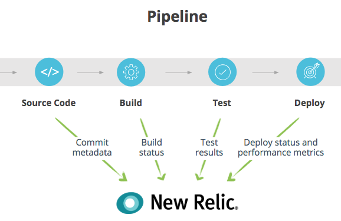

High functioning DevOps teams use instrumentation to push changes to production more frequently and with less risk. This process yields important insights: How is your build pipeline performing? Where are the issues? They key is to instrument your pipeline in order to track it and to make improvements.

## Prerequisite

Before starting this tutorial, be sure to complete the [Establish team dashboards](/docs/using-new-relic/welcome-new-relic/measure-devops-success/establish-team-dashboards-gather-visualize-key-metrics) tutorial.

## 1. Identify what to track

Look at your CI/CD system and determine the stats you'd like to gather. We recommend, at a minimum, starting with commit metadata, build status, test results, deploy status, and performance metrics.

<figcaption>
  Determine which stats you want to report to New Relic.
</figcaption>

## 2. Capture the events required to instrument your pipeline

1. Capture timestamped state changes to your pipeline/CI/CD system indicating when a given stage started; and whether it succeeded or failed. This step, in turn, makes it easy to track your deployment process over time—looking for trends in the frequency of deployments, build quality, and other performance indicators.
2. For easiest tracking, capture timestamped changes to your source code management system (SCM) with at least the author and a hash or unique change ID. Propagate this information wherever possible.
3. If you have your own build system, add code to emit custom events at each stage. For hosted services, create a lightweight intermediary service/function-as-a-service (FaaS) to format and forward these custom events.

The example below uses [AWS CodePipeline](https://aws.amazon.com/codepipeline/) to manage the flow of an application that is sourced in GitHub, built and tested with [AWS CodeBuild](https://aws.amazon.com/codebuild/), and deployed with [Elastic Beanstalk](https://aws.amazon.com/elasticbeanstalk/). It utilizes a simple service written in Node.js, plus some "glue code" and event handlers needed to push data from GitHub and AWS to New Relic. Code for this example is available at [github.com/newrelic/webinar](https://github.com/newrelic/webinar).

<figcaption>
  Use AWS CodePipeline to understand different parts of your flow.
</figcaption>

We chose the tools and products used here as examples—with the goal of illustrating the concepts around the types of data and events you should be thinking about when instrumenting your own code pipeline. The sample code, however, should be generic enough to adapt readily to almost any toolset.

## Outcomes

Here is a sample dashboard you could create to track your code pipeline.

<figcaption>
  Track your code pipeline by creating dashboards in New Relic Insights.
</figcaption>

A dashboard like this yields a number of benefits, including:

* Faster deploy cycles.
* The ability to prioritize reliability work by identifying services with frequent deploy failures or gaps in test coverage.
* Ensuring teams don’t achieve speed at the expense of quality.
* Responding more effectively to change-related failures.
