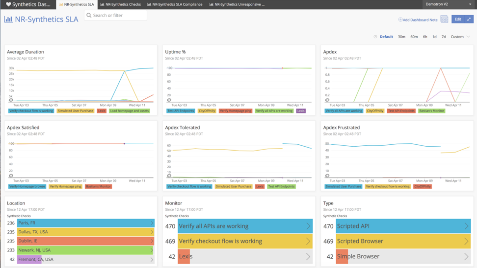

In a DevOps world, a deep understanding of customer expectations and your progress in meeting those expectations is vital to providing stability, maintaining goodwill with your users, and increasing business value. With New Relic you can measure the success of your DevOps initiatives and learn how to identify, resolve, and decrease any gaps in your DevOps performance.

In this tutorial, you’ll gather key service delivery stakeholders to assess your team's progress against service level objectives (SLOs) and service level agreements (SLAs), while facilitating further optimizations.

## Prerequisites

This tutorial assumes you’ve completed the [Establish objectives and baseline](/docs/establish-objectives-baselines) tutorial.

## 1. Assemble a cross-functional team to review service delivery [#assemble-team]

The first (and most important step) is assembling the right team. Identify the proper stakeholders and representatives to play active parts in the operations review process. This team should be comprised of individuals who develop applications, work with service delivery, maintain your ecosystem, and resolve problems for customers.

While operations review teams often focus on technical members, the best teams have broad representation across the company, including representatives from Business Operations, Marketing, and Support.

These cross-functional teams help ensure that the service delivery process is strongly integrated with customer expectations. If you can specifically identify how technical improvements meet customer expectations and positively impact the business’s bottom line, then your operations team is functioning at optimal levels.

<Callout variant="tip">
  Ideally, the cross-functional operations review team should also be the team that defines your SLOs. If this is not possible, try to ensure that some members of the operations review team are also on the team responsible for SLOs.
</Callout>

## 2. Review service records and note key metrics [#review-records]

Create a regular meeting to track your service records. New Relic recommends reviewing your previous service records, and pinpointing specific metrics to analyze at every review.

For example, start with application state, [alert conditions](/docs/alerts/new-relic-alerts/defining-conditions/define-alert-conditions), and runtime anomalies. Look at the same metrics on two separate occasions to identify and assess patterns, inconsistencies, and anomalies.

Monitor these metrics using the service delivery [Insights](/docs/insights) dashboards you created in the [Establish objectives and baselines](/docs/establish-objectives-baselines) tutorial. The widgets on these dashboards provide a high-level overview of the relationships between different performance indicators and baselines:


<figcaption>
  **[insights.newrelic.com](https://insights.newrelic.com) > (select a dashboard)**: Use dashboards to visualize metrics related to service delivery.
</figcaption>

When conducting a thorough performance review, make several dashboards that have corresponding widgets. Use these dashboards to hone-in on two specific time periods that you want to compare. This comparative analysis could cover everything from [Infrastructure](/docs/infrastructure) or [browser](/docs/browser) performance, to [Synthetics](/docs/synthetics) testing or business impact.

To get started with performance indicators in Insights, read the following example queries. These queries provide information that you can consider incorporating for the operations review.

<CollapserGroup>
  <Collapser
    id="daily-uptime"
    title="Daily uptime"
  >
    ```
    SELECT percentage(count(result), where result = 'SUCCESS') from SyntheticCheck since 1 Day ago
    ```

    Create dashboards that are dedicated to the functionality that drives your software development process, such as testing. For example, collect related metrics on uptime, types of monitors, geo-locations, and other data points that are required for appropriately measuring SLAs. The following dashboard provides such an example:

    

    <figcaption>
      **[insights.newrelic.com](https://insights.newrelic.com) > (select a dashboard)**: Track your relevant SLAs together in one dashboard.
    </figcaption>
  </Collapser>

  <Collapser
    id="device-performance"
    title="Device performance breakdown"
  >
    ```
    SELECT count(*) as '# Pages',average(duration) as 'AVG',percentile(duration,50,75) as '%',average(duration - backendDuration) as 'Front',average(backendDuration) as 'Back',average(connectionSetupDuration) as 'Connection',average(domProcessingDuration) as 'DOM Processing',average(pageRenderingDuration) as 'Page Rendering' FROM PageView FACET deviceType LIMIT 3 SINCE 1 day ago
    ```
  </Collapser>

  <Collapser
    id="top-url"
    title="Top URL performance"
  >
    ```
    SELECT count(*) as '# Pages',average(duration) as 'AVG',percentile(duration,50,75) as '%',average(duration - backendDuration) as 'Front',average(backendDuration) as 'Back',average(connectionSetupDuration) as 'Connection',average(domProcessingDuration) as 'DOM Processing',average(pageRenderingDuration) as 'Page Rendering' FROM PageView facet pageUrl SINCE 1 day ago limit 30
    ```
  </Collapser>

  <Collapser
    id="memory-usage"
    title="Memory usage"
  >
    ```
    SELECT average(memoryUsedBytes) /1000000 AS 'Avg MB Used', average(memoryFreeBytes)/1000000 AS 'Avg MB Free', average(memoryFreeBytes/memoryTotalBytes)*100 as 'Memory used %' FROM SystemSample since 30 minutes ago
    ```
  </Collapser>

  <Collapser
    id="server-cpu"
    title="Server CPU"
  >
    ```
    SELECT average(cpuPercent) FROM SystemSample since 3 hours ago facet hostname limit 400
    ```
  </Collapser>
</CollapserGroup>

Combine the results into a single dashboard to help drive decisions during your operations review. Dashboards that give a brief overview of performance across your entire application stack are invaluable for cross-functional team reviews.

<Callout variant="tip">
  Beyond Insights, the [APM reports](/docs/apm/reports) allow you to see how you’re performing on a daily, weekly, and monthly basis with built in [SLA reports](/docs/apm/reports/service-level-agreements/apm-sla-reports) and [other detailed reports](/docs/apm/reports). The out-of-the-box details from these reports give your operations team a launch pad for conversations about progress against objectives and overall performance.
</Callout>

## 3. Summarize events related to application alerts, downtime, and errors [#summarize-events]

Now that you’ve gathered data about your service delivery, the next step is to dive deeper into specific incidents that warrant further investigation or surface a need for broader team action. For example, notable downtime and errors are key areas to investigate as a team.

After completing the [Setup proactive alerting](/docs/set-proactive-alerting) tutorial, you can explore notifications of violations as they occur. Once these violations are brought to your attention, acknowledge the specific incident and have an ongoing record of both opened and closed incidents. Use the incident reports as a focal point for discussion of gaps.


<figcaption>
  **[alerts.newrelic.com](https://insights.newrelic.com) > Incidents**: Identify performance issues and SLA gaps with New Relic Alerts incident reports.
</figcaption>

Ultimately, it’s important to solicit feedback from the cross-functional team on the causes of the incidents to determine how you can improve service delivery processes to prevent reoccurrences. One approach might be to focus on one or two notable incidents, use the New Relic UI to walk through the data points leading up to those incidents, and assess the actions that occurred. Summarize the incident and the cross-functional feedback on causes and potential solutions as succinctly as possible. Over time, you’ll notice patterns that will require deeper action.