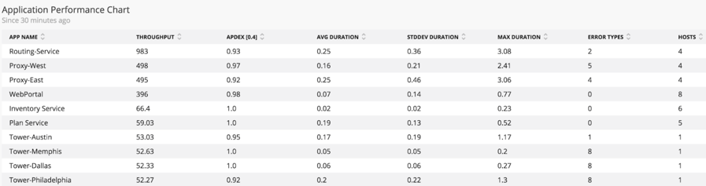
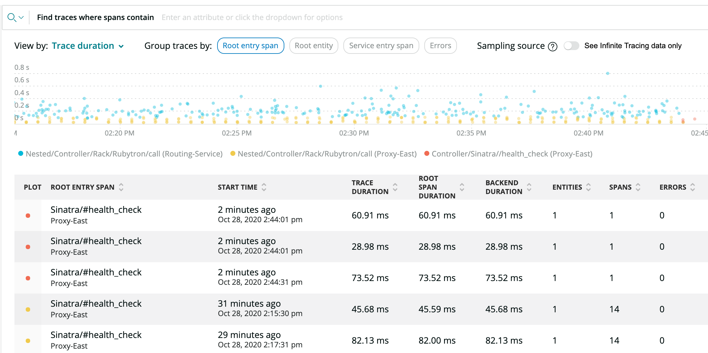

Successfully scaling DevOps requires a robust understanding of dependencies across application teams and related services. Use [New Relics service maps](/docs/using-new-relic/service-maps/get-started/introduction-service-maps) to discover and mitigate risky dependencies from upstream and downstream services.

## Prerequisites

This tutorial assumes you’ve completed the [previous DevOps procedures](/docs/using-new-relic/welcome-new-relic/measure-devops-success/guide-measuring-devops-success).

## 1. Analyze dependencies with service maps

Use [service maps](/docs/using-new-relic/service-maps/get-started/introduction-service-maps) for each application and note any dependent systems and transactions.

New Relic recommends that you start by viewing the entire architecture using the **Discover your environment** option.


<figcaption>
  **[one.newrelic.com](https://one.newrelic.com) > Service Maps > App/Service list**
</figcaption>

This initial view shows all applications that are configured in your account. Applications that have violated a warning threshold are shown in yellow, and those with an active alert are shown in red. Healthy applications appear in green.

New Relic uses a bold line to map applications to the services (such as databases) they connect to. Familiarize yourself with these maps to see how applications and their services fit together. Take note of which applications have the most dependencies and which rely on the same dependency, such as an API.

Click an application to see high level metrics about that app, including throughput, response time, Apdex score, and error rate for the last 30 minutes. Tracking throughput is a good way to determine which of your applications are serving the most traffic.

After looking at the architecture as a whole, review the applications that have the most dependencies. Select the **App/Services** list to see a full list of your applications.


<figcaption>
  **[one.newrelic.com](https://one.newrelic.com) > Service Maps > App/Service list**
</figcaption>

In this example, we’ve chosen **Tower-Chicago** from the **App/Services** list. All of the traffic being sent to **Tower-Chicago** is coming from **Proxy-East**. In this case, **Tower-Chicago** is showing 48.3 requests per minute, or 11.3% of the 426 requests per minute flowing through **Proxy-East**.


<figcaption>
  **[one.newrelic.com](https://one.newrelic.com) > Service Maps > App/Service list**
</figcaption>

In most cases, the separate applications and services represented in service maps are created and maintained by separate teams. This exercise of walking through the dependencies of your architecture should involve representatives from each of those teams.

Teams should work together to ask questions such as:

* How critical is this particular dependency?
* What would happen if it were to go down?
* What happened last time it went down?
* Was there a revenue loss?

## 2. Identify back-end application dependency risks

Once you’ve analyzed your applications’ dependencies, you’ll want to examine the quality of dependency execution. For example, is the dependency stable and predictable for each application or transaction you’ve identified?

To do this, you’ll first need to gather as much information as you can about the applications from [New Relic Insights](https://newrelic.com/solutions/real-time-analytics), which helps you analyze data that is collected about the applications in more detail.

Here is an example [NRQL](/docs/insights/nrql-new-relic-query-language/nrql-resources/nrql-syntax-components-functions) query to further analyze back-end service performance:

```
SELECT count(appName)/30 as 'Throughput', apdex(duration), average(duration), stddev(duration), max(duration), count(error_type), uniquecount(host) FROM Transaction FACET appName SINCE 30 MINUTES AGO
```

This query shows you each application’s request per minute (throughput), Apdex score, and an overview of how the application is performing overall (through the standard deviation calculation, in which lower numbers are generally better). It also shows errors for the time period and the number of hosts on which the application is running.



<figcaption>
  **[insights.newrelic.com](https://insights.newrelic.com) > query results**
</figcaption>

Next, gather information on incidents and events related to the services from [New Relic Alerts](/docs/alerts):

* Click **Alerts** > **Incidents** > **All Incidents**.

  

  <figcaption>
    **[alerts.newrelic.com](https://alerts.newrelic.com) > Incidents > All Incidents**
  </figcaption>
* Click **Alerts** > **Events** > **All Events**.

  

  <figcaption>
    **[alerts.newrelic.com](https://alerts.newrelic.com) > Incidents > All Events**
  </figcaption>

<Callout variant="tip">
  Using webhooks to send alert events to [New Relic Insights](https://newrelic.com/solutions/real-time-analytics), allows you to supplement your dashboards with Alerts data. The process is outlined in [this community discussion post](https://discuss.newrelic.com/t/sending-alerts-data-to-insights/34693).
</Callout>

Here is a simplified example of the results of this exercise:

<table>
  <thead>
    <tr>
      <th>
        Application
      </th>

      <th>
        Number of dependencies
      </th>

      <th>
        RPM
      </th>

      <th>
        Hosts
      </th>

      <th>
        APDEX (avg)
      </th>

      <th>
        Last outage
      </th>

      <th>
        TTR (hrs)
      </th>
    </tr>
  </thead>

  <tbody>
    <tr>
      <td>
        Routing Service
      </td>

      <td>
        10
      </td>

      <td>
        983
      </td>

      <td>
        4
      </td>

      <td>
        .93
      </td>

      <td>
        2/19/18
      </td>

      <td>
        .75
      </td>
    </tr>

    <tr>
      <td>
        Tower Austin
      </td>

      <td>
        1
      </td>

      <td>
        58
      </td>

      <td>
        1
      </td>

      <td>
        .95
      </td>

      <td>
        10/11/17
      </td>

      <td>
        1.5
      </td>
    </tr>

    <tr>
      <td>
        Proxy-East
      </td>

      <td>
        11
      </td>

      <td>
        498
      </td>

      <td>
        4
      </td>

      <td>
        .92
      </td>

      <td>
        1/4/18
      </td>

      <td>
        .25
      </td>
    </tr>

    <tr>
      <td>
        Proxy-West
      </td>

      <td>
        11
      </td>

      <td>
        495
      </td>

      <td>
        4
      </td>

      <td>
        .97
      </td>

      <td>
        12/3/17
      </td>

      <td>
        .25
      </td>
    </tr>

    <tr>
      <td>
        WebPortal
      </td>

      <td>
        7
      </td>

      <td>
        396
      </td>

      <td>
        8
      </td>

      <td>
        .98
      </td>

      <td>
        4/1/18
      </td>

      <td>
        2.5
      </td>
    </tr>
  </tbody>
</table>

Supplement this data with the data that your teams know about your service and that you gathered from the dependency exercise in step 1, and use that data to develop hypotheses about the highest risk areas in your services that should be mitigated.

## 3. Identify front-end dependency risk

Once you’ve analyzed back-end dependencies, explore front-end dependencies. This is a critical step because as you walk higher up the stack and closer to the user, you will likely have more dependencies and abstractions.

Service maps seamlessly integrate data from [browser monitoring](/docs/browser/new-relic-browser/getting-started/introduction-new-relic-browser) and [mobile monitoring](/docs/mobile-monitoring) to help you understand the dependencies from front-end user interfaces to back-end services.


<figcaption>
  **[one.newrelic.com](https://one.newrelic.com) > Service Maps**
</figcaption>

Use the service map view to drill into front-end dependencies, and execute a similar exercise to the one you executed for back-end dependencies. This exercise will again expose data to help you identify risk areas you should address and optimize. We recommend that you conduct the analysis with user interface (UI) teams so that you can also gather a complementary qualitative understanding of what the UI teams consider critical based on their experience. A ranking from the UI teams of the most critical dependency is a useful output of this work.

## 4. Identify Microservice Dependencies

If you are using microservices, you can have dozens, if not hundreds, of services that are calling each other. Use **Distributed Tracing** to see how all those services connect together and how your requests flow through those different services.

Distributed tracing lets you see the path that a request takes as it travels through a distributed system. A distributed trace is composed of multiple "spans," which represent time spent in services or resources of those services.

Click on the **Distributed tracing menu** in APM left nav. You can see “trace listing” view where you’ll be able to quickly identify slow traces and traces with errors. The scatter plot lets you easily see outliers. Below that are the trace summaries, click on a trace to see details. Dive into distributed traces to see how long each span takes. Click into each span to see historical performance charts and associated attributes that layer in the context you need to understand and troubleshoot issues.



<figcaption>
  **[one.newrelic.com](https://one.newrelic.com) > APM > (select an app) > Distributed tracing**
</figcaption>

This rounds out your list of dependencies.

## 5. Create an action plan for risk mitigation

Once you’ve analyzed the dependencies across your application from both front-end and back-end services, create an action plan to reduce dependency risks and achieve your service level objectives (SLO).

As you prioritize these next steps, we recommend you keep these four principles in mind:

1. **Understand your risk tolerance.** It’s helpful to have a clear picture of your tolerance for risk, which ideally should be informed by your service level objectives (refer to the [Establish Objectives and Baselines](/docs/establish-objectives-baselines) tutorial for more information). Set an alert policy to monitor dependencies that you’ve determined have a high relationship to SLO achievement.
2. **Minimize dependencies.** The simpler you keep your code, the less functions you'll have referring to other modules. Removing unnecessary complexity is an important way to ensure you have a maintainable system that meets your customers’ expectations.
3. **Localize dependencies.** For the code you write, package together functions that depend on each other whenever possible.
4. **Stabilize dependencies.** When dependencies are unavoidable, mitigate risks by ensuring these dependencies point to modules that are the least likely to change or are easier to substitute.

When your action plan is complete, monitor the results of the efforts. The efficacy of your actions to resolve dependency risks should ultimately be measured by your SLOs
