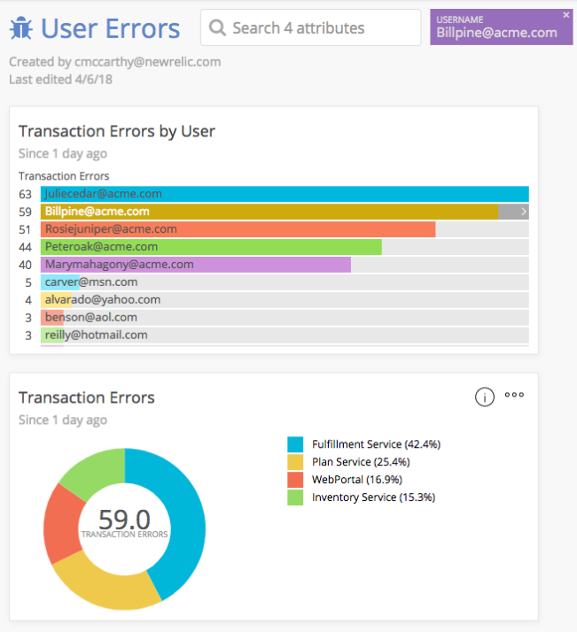

This tutorial covers methods to identify and track the key indicators of customer experience and clarifies the effects of application and infrastructure performance on your business. A clear understanding of what creates a successful customer experience can help modern software teams become more efficient and boost productivity.

An efficient, well-functioning IT culture helps organizations make rapid, frequent releases and product changes. A strong culture also democratizes data beyond the typical backend users, making it available to groups such as customer service, support, sales, and marketing. However, this information enablement is useful only if it serves to optimize customer experience.

The four steps outlined here are designed to help you leverage the data you collect to make the greatest possible improvements in your organization’s digital customer experience.

## 1. Use custom attributes to associate performance data [#custom-attributes]

In order to relate performance data to user experience, you need to capture information that ties a particular user or customer to the frontend and backend transactions responsible for their interactions with your application. In New Relic, you collect this data with [custom attributes](https://docs.newrelic.com/docs/agents/manage-apm-agents/agent-data/collect-custom-attributes).

If you plan to collect this information in both the frontend and backend, be sure to [forward custom attributes from APM to Browser](https://docs.newrelic.com/docs/insights/insights-data-sources/custom-data/insert-data-via-new-relic-browser#custom-attribute-forward-apm).

Here are some common attributes to collect:

* User ID
* Organization or customer ID
* A/B testing cohort value
* High-value customer indicator
* Purchase value or product IDs (for e-commerce)

If you’ve completed the [Establish objectives and baselines](https://docs.newrelic.com/docs/using-new-relic/welcome-new-relic/optimize-your-cloud-native-environment/establish-objectives-baselines-define-team-slos) tutorials, consider what service-level objectives (SLOs) or key metrics you defined in those stages. New Relic recommends including attributes like the ones listed above to measure the impact of your changes and optimizations at a customer level—rather than just measuring pure performance.

## 2. Create dashboards with performance and business metrics [#dashboards]

Using the attributes collected in Step 1, build dashboards to examine the impact of performance issues on your users.


<figcaption>
  **[insights.newrelic.com](https://insights.newrelic.com) > Dashboards**
</figcaption>

For example, if you were collecting a custom `username` attribute, you could use [NRQL](https://docs.newrelic.com/docs/insights/nrql-new-relic-query-language/using-nrql/introduction-nrql) queries like these to create your widgets for your [New Relic Insights dashboard](https://docs.newrelic.com/docs/insights/use-insights-ui/manage-dashboards/create-edit-copy-insights-dashboards):

* Number of errors by username:

  ```
  SELECT count(*) FROM TransactionError FACET username
  ```
* Median response time by username:

  ```
  SELECT percentile(duration,50) FROM Transaction FACET username
  ```
* Total purchase value in transactions with errors:

  ```
  SELECT sum(purchaseTotal) FROM TransactionError FACET username
  ```

<Callout variant="tip">
  If you include a [`FACET` clause](https://docs.newrelic.com/docs/insights/nrql-new-relic-query-language/nrql-resources/nrql-syntax-components-functions#sel-facet) in your queries, you’ll be able to click into metric results to see corresponding change in the performance data. For more information on faceting, see [Linking Between Dashboards to Drill Into Your Data](https://discuss.newrelic.com/t/relic-solution-linking-between-dashboards-to-drill-into-your-data/45563).
</Callout>

## 3. Share dashboards across departments [#share]

Dashboards, data, and metrics that nobody looks at or knows about might as well not exist. When considering how, or with whom, to share your dashboards, consider the following questions:

* Which teams are responsible for applications that have high levels of end-user interaction?
* What non-engineering teams could benefit from this information?

  * Customer support: Could customer issues be resolved faster?
  * Product/engineering: Could the product team make more informed roadmap decisions?
  * Customer success: Can this data be used to make customers more successful?
* Are there other teams that can benefit from cohort analysis that includes performance metrics?

## 4. Use data to separate performance by cohort and debug issues at the customer level [#use-data]

After you create your dashboards, use them to scope issues affecting particular customers or sets of customers. For example, the following widget shows which apps have errors for a particular user:



<figcaption>
  **[insights.newrelic.com](https://insights.newrelic.com) > Dashboards**
</figcaption>

Use attributes that track user and performance to set alerts on high priority users or customers. For example, you could include a [`WHERE` clause](https://docs.newrelic.com/docs/insights/nrql-new-relic-query-language/nrql-resources/nrql-syntax-components-functions#sel-where) in your NRQL queries to scope the results to a set of user IDs or customer IDs. Set alerts on any performance or business metric that is tied to these attributes. See [NRQL alerts will change how you think about using New Relic data](https://blog.newrelic.com/2017/05/04/nrql-alerts/) for more information.
