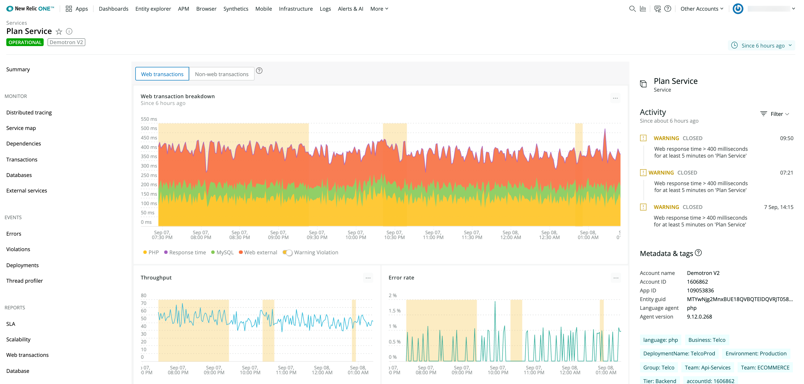

As IT departments seek to optimize their cloud applications, they are decomposing application monoliths into microservices. A microservice architecture is an approach that delivers a single application as a suite of small services, each running in its own process and communicating with lightweight mechanisms. Following a service-oriented architecture (SOA) model, each service should offer public API interfaces to any other service in the environment.

Fragmenting applications into their most basic services enables the continuous delivery/deployment of large, complex applications by removing barriers and silos that previously lengthened the application release cycle. It also enables an organization to evolve its technology stack for modern cloud environments and to operate at internet-scale.

With microservices, app developers can build, manage, scale, and reuse services independently, resolve issues faster, increase the rate of deployments, and ultimately deliver an enhanced end-user experience.

This quest to use microservices to optimize applications is an iterative process. We recommend the following six steps, using the New Relic platform, to ensure an effective migration path to microservices.

## 1. Deploy instrumentation on all application tiers and components [#deploy]

In order to determine which components of an application can be broken into microservices, you need to deploy instrumentation on all tiers and components of the target application. This will allow you to determine baseline application performance, quantify transaction volumes, and gather other key metrics that will determine where you begin your microservice journey.

Specifically, you should:

* Monitor your web apps with [APM](/docs/apm). See [Compatibility and requirements for New Relic agents and products](/docs/agents/manage-apm-agents/installation/compatibility-requirements-new-relic-agents) to learn precise compatibility details for each supported language, and then [install the APM agent](/docs/agents/manage-apm-agents/installation/install-agent) on your application stack. Steps for installing APM agents vary based on language.
* Monitor your compute resources with [Infrastructure](/docs/infrastructure). See [Compatibility and requirements for Infrastructure](/docs/infrastructure/new-relic-infrastructure/getting-started/compatibility-requirements-new-relic-infrastructure) for supported operating systems and environments. You can also instrument other products and services with [on-host integrations](/docs/infrastructure/host-integrations/host-integrations-list).

In some cases, it may be helpful to use [custom instrumentation](/docs/agents/manage-apm-agents/agent-data/custom-instrumentation) to gather detailed performance metrics that aren’t necessarily required in the course of normal application monitoring. For example, you may want to add custom instrumentation to key controllers that are candidates for decomposition to gather very granular response time and throughput information.

## 2. Use key metrics to identify components that you can migrate to microservices [#key-metrics]

Once you have instrumented your application, you can begin to identify which components are strong candidates to migrate to microservices.

It is important to consult with colleagues who have written, designed, and/or maintained the application, to supplement the context that your baseline data provides. Their experience and recommendations will help to guide the decomposition effort.

In addition, you should analyze objective metrics such as transaction call volume and response time. These metrics will point to components in your monolithic application that are heavily called and/or are responding slowly, which means that they are adding disproportionate load to the monolith, possibly degrading application performance and end-user experience.

As microservices, it will be easier to regularly improve and optimize these components. As a result, you will be able to break away and eliminate the most pressing bottlenecks from your monolithic application.

<figcaption>
  **[one.newrelic.com](https://one.newrelic.com) > APM > Transactions**: Identify which components are slowing you down.
</figcaption>

## 3. Use deployment markers to establish app performance baselines [#deployment-markers]

Breaking down monolithic applications into a microservice architecture is typically an iterative project. You will be continually identifying monolithic components that can be decomposed into microservices, and then optimizing them as business and technology requirements dictate. Deployment tracking lets you quickly see, in a side-by-side comparative view, how architectural and code changes impact your application’s performance. You can then use this information to direct future development efforts and to demonstrate return on investment to the business. You should make deployment markers an integral part of the development process by adding them into your build/deployment process automation.

You can view instructions on setting up deployment markers on the [Deployments page in APM](/docs/apm/applications-menu/events/deployments-page).

<figcaption>
  **[one.newrelic.com](http://one.newrelic.com) > APM > Events > Deployments**: Understand how deployments affect your performance.
</figcaption>

## 4. Implement the new microservice-based architecture, and measure the success of your application development processes [#implement]

Your developers should now have marching orders for which application components to migrate to microservices. It’s important for these teams to embrace modern software development practices to support your overarching business and technology initiatives. Measuring process improvements is vital to driving alignment and velocity.

You should instrument your build/test pipeline using [custom events](/docs/insights/insights-data-sources/custom-data/send-custom-data-insights). This will allow you to gather data about:

* The rate at which new code is moving through the pipeline
* Quality metrics (for example, what percent of the code is passing tests, if there is automated testing involved)
* The rate of new deployments via deployment markers

These quantitative data points will allow development and operations teams to visualize the adoption of new processes, measure development team productivity, and assess whether these new processes are moving the needle positively or negatively.

<figcaption>
  **[one.newrelic.com](https://one.newrelic.com) > Dashboards**: Visualize the adoption of new processes with dashboards.
</figcaption>

## 5. Create a dashboard to monitor KPIs [#dashboard]

Once you have determined that the application and its microservices components are (somewhat) production-ready, compare the performance of your new, modern application to the monolithic application (either today or how it performed pre-migration). This will allow you to demonstrate success and to highlight areas for improvement.

Key KPIs to monitor and compare include Response Time, Error Rate, Transaction Call Volume, Operational Cost, Availability, and Apdex.

<figcaption>
  **[one.newrelic.com](https://one.newrelic.com) > Dashboards**: Build KPI dashboards to view all your indicators in one place.
</figcaption>

## 6. Create a new baseline to use for comparisons [#new-baseline]

At this point, you have migrated components of your monolithic application to microservices, and you are now empowered with up-to-date data on how your new application is performing compared to your legacy application. Now you have a new launching point for evaluating which other components of your application can be decomposed into microservices, or which microservice components require more performance tuning.
