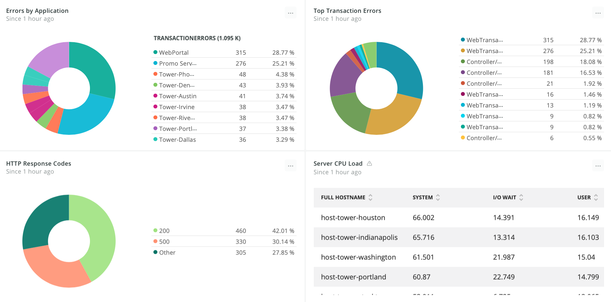

When you are planning a migration to the cloud, it is important to analyze your current on-premise architecture and identify the scope of your migration. When you have a full understanding of your applications, your hosts, and their architecture, you reduce the possibility of missing dependencies during your migration.

## 1. Identify applications and components [#identify]

First, you need to determine the level of instrumentation that is possible or allowed within your organization. The deeper you instrument, the more visibility you gain into your applications. Then, address the scope of your cloud migration by answering the following questions and keeping track of your answers:

* What applications do I need to include in the migration?
* What are the dependencies of each application?
* What are the underlying services/inventory supporting these applications?

## 2. Install New Relic agents [#install]

Based on your answers when you [determined the scope of your cloud migration](#identify), verify that the applications that you want to migrate are compatible with New Relic products and install the agents:

<CollapserGroup>
  <Collapser
    id="apm"
    title="New Relic APM"
  >
    [New Relic APM](https://docs.newrelic.com/docs/apm) delivers data about your application's performance, providing information about app availability and external services so you can visualize your application dependencies.

    Confirm that your system [meets the requirements](https://docs.newrelic.com/docs/agents/manage-apm-agents/installation/compatibility-requirements-new-relic-agents) for the APM agents that you want to install, and then [install the APM agent](https://docs.newrelic.com/docs/agents/manage-apm-agents/installation/install-agent) on your application stack. Steps for installing APM agents vary based on language.
  </Collapser>

  <Collapser
    id="infrastructure"
    title="New Relic Infrastructure"
  >
    [New Relic Infrastructure](https://docs.newrelic.com/docs/infrastructure) provides flexible, dynamic server monitoring so you can inventory your hosts and their configuration settings.

    Confirm that your underlying infrastructure [meets the requirements](https://docs.newrelic.com/docs/infrastructure/new-relic-infrastructure/getting-started/compatibility-requirements-new-relic-infrastructure) for New Relic Infrastructure. [Install the Infrastructure agent](https://docs.newrelic.com/docs/infrastructure/new-relic-infrastructure/installation) on instances that host your applications.
  </Collapser>

  <Collapser
    id="integrations"
    title="Infrastructure on-host integrations"
  >
    [Infrastructure on-host integrations](/docs/integrations/host-integrations/getting-started/introduction-host-integrations) monitor the [services](https://docs.newrelic.com/docs/integrations/host-integrations/host-integrations-list) that your code depends on. [Install the on-host integrations](/docs/integrations/host-integrations/installation/install-host-integrations-built-new-relic) for the services that you are using.
  </Collapser>
</CollapserGroup>

## 3. Visualize application dependencies with APM [#service-maps]

After you install the APM agent, use [service maps](/docs/using-new-relic/service-maps/get-started/introduction-service-maps) to get a full view of your application’s architecture. Service maps allow you to identify any connections from applications to external services, web services, databases, or APIs.

After [creating a service map](/docs/data-analysis/service-maps/get-started/customize-your-service-maps) for the application that has dependencies that you want to explore, [add an application node](/docs/data-analysis/service-maps/get-started/customize-your-service-maps#add-nodes) on the map. Then, begin to add connections to the map including databases, external services, third-party APIs, and even [New Relic Browser](https://docs.newrelic.com/docs/browser)-monitored applications. New Relic pulls every node you add into the map, and you can watch the shape of your architecture emerge.

**[one.newrelic.com](https://one.newrelic.com) > APM > (select an application) > Service map**: View a service map to see a visual overview of your system architecture and the health of entities.

Based on the visibility into internal and external dependencies that the service map provides, you can create a migration plan that includes all aspects of an application’s ecosystem.

## 4. Inventory underlining instances with Infrastructure [#inventory-page]

New Relic Infrastructure's [inventory page](/docs/infrastructure/new-relic-infrastructure/infrastructure-ui-pages/infrastructure-inventory-page-search-your-entire-infrastructure) gives you visibility into the software packages installed on your servers. Essentially, the inventory page displays detailed information about a system’s per-host configuration, including details about system modules, configuration files, metadata, packages, services, and user sessions. The inventory page provides a real-time, filterable, searchable view into each host’s configuration.

The inventory page not only provides you with the list of packages installed but also provides version information as well. Use this version information to know which packages to upgrade and which packages to replicate for your cloud migration. It also helps you track the dependencies between the software packages and configuration files.

**[one.newrelic.com](https://one.newrelic.com) > Infrastructure > Inventory**: View the inventory page for details about your hosts and their configurations.

You can also use the Inventory page to get a sense of what software or packages you no longer need, which is a great way to “clean up” your servers before you migrate to the cloud.

## 5. Uncover unknown applications and components [#unknown-components]

Since anything can happen during an application’s lifecycle, like an application changing ownership, you may come across applications or component dependencies that you did not know about. If you discover any unknown dependencies, assess their relationship to other applications and components in your infrastructure to determine if they should be pulled into your migration plan.

If you discover any applications or components while [viewing service maps](#service-maps) or while [reviewing the inventory page](#), remember to [instrument them](#install) before you migrate them.

## 6. Resolve errors or other issues [#resolve-errors]

After you instrument your applications, APM may uncover errors or issues with your current on-prem applications. Use APM error analytics to determine the root cause of any errors or issues in your applications.

**[one.newrelic.com](https://one.newrelic.com) > APM > (select an app) > Events > Errors**: Use error analytics to determine the root cause of errors in your applications.

Start with the **[Error rate](/docs/apm/applications-menu/error-analytics/error-analytics-explore-events-behind-errors#error-rate-chart)** chart to see if there are any unexpected spikes, dips, or error patterns. Correlate any patterns on the **[Top 5 errors](/docs/apm/applications-menu/error-analytics/error-analytics-explore-events-behind-errors#top5-errors-chart)** chart to [alerts](/docs/alerts) occurring during the same time period.

The **[Error traces](/docs/apm/applications-menu/error-analytics/error-analytics-explore-events-behind-errors#traces-table)** table includes specific stack trace details, such as associated host, user, framework code, and custom attributes to help you identify the root cause of an error.

## 7. Create Dashboards [#create-dashboards]

In addition to the [application baselines](/docs/create-application-baselines) you built, create [dashboards](/docs/dashboards/manage-your-dashboard/manage-your-dashboard) to assess your on-premises applications in preparation for migrating them to the cloud.

Use [Dashboards](/docs/dashboards/new-relic-one-dashboards/get-started/introduction-new-relic-one-dashboards) to gain visibility into the average response times, the top transactions, the associated average duration, and the overall CPU usage for your instrumented application. Drill down into individual applications to see your top processes and the CPU percent for each process.

You can also view an error analysis for a set of instrumented applications:

**[one.newrelic.com](https://one.newrelic.com) > Dashboards > (select a dashboard)**: View errors visualize issues with your applications.

Check out the [best practices guide](https://docs.newrelic.com/docs/insights/use-insights-ui/guides/new-relic-insights-best-practices-guide) for tips on creating and utilizing dashboards. Sharing New Relic Dashboards with your teams and stakeholders is a powerful way to communicate the impact of your migration during your cloud adoption process.

## Expert tip for reporting custom data [#custom-data]

Utilizing service maps, errors, and inventory management gives you a critical look at the architecture of your applications and their dependencies. If you find that you need data that is not available by default, New Relic products allow you to capture custom data:

* [APM](https://docs.newrelic.com/docs/agents/manage-apm-agents/agent-data/custom-instrumentation)
* [Browser](https://docs.newrelic.com/docs/insights/insights-data-sources/custom-data/insert-data-via-new-relic-browser)
* [Infrastructure](https://docs.newrelic.com/docs/infrastructure/new-relic-infrastructure/configuration/configure-infrastructure-agent#conf-custom_attributes)
* [Dashboards](https://docs.newrelic.com/docs/insights/insights-data-sources/custom-data/send-custom-data-insights)
* [Mobile](https://docs.newrelic.com/docs/mobile-monitoring/new-relic-mobile/maintenance/add-custom-data-new-relic-mobile)
* [Synthetics](https://docs.newrelic.com/docs/synthetics/new-relic-synthetics/scripting-monitors/add-custom-attributes-new-relic-synthetics-data)

## For more help [#more_help]

Explore the [New Relic Platform](https://newrelic.com/products).
