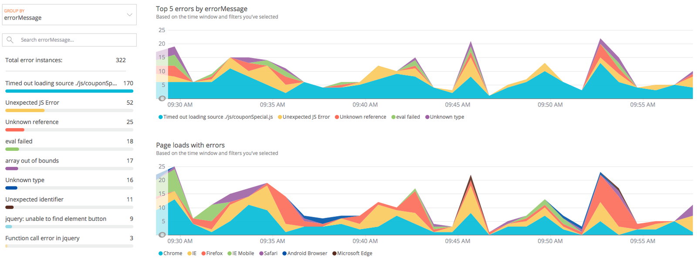

As you migrate your applications to the cloud, you want to catch and correct any unexpected behavior or outcomes as soon as possible. Detecting errors and issues related to your new cloud architecture, performance, and scale is critical—getting the right information at the right time can be the difference between success and failure.

## 1. Identify components [#identify-components]

Create a list all of applications, services, and their underlying server infrastructures in your [application portfolio](/docs/using-new-relic/welcome-new-relic/plan-your-cloud-adoption-strategy/identify-application-dependencies-inventory) that you want to migrate to the cloud.

## 2. Identify KPIs [#identify-kpis]

To provide quantifiable measures that your teams can use to assess your migration, identify a list of [corporate KPIs (key performance indicators)](/docs/optimize-customer-experience#identify-metrics). Using the New Relic platform to measure KPIs helps you eliminate blindspots and see the connections between entities—from your application code, to your cloud infrastructure (including containers running in highly distributed microservices), to your customer experience. Your goal is to create a collection of metrics in several categories that you can visualize in our [Dashboards](/docs/dashboards).

To validate cloud improvements, group KPIs in the following categories, from least to most strong:

* Application and infrastructure performance
* End-user experience, including website and mobile application performance
* Audience and content trends
* DevOps productivity
* Application revenue analytics
* Future business goals

## 3. Deploy monitoring tools [#deploy-monitoring]

To start monitoring your KPIs, verify that the applications that you want to migrate are compatible with the requirements for the New Relic products you will use. Then, install the New Relic agents:

<CollapserGroup>
  <Collapser
    id="deploy-apm"
    title="Deploy APM"
  >
    Review the [compatibility and requirements](/docs/agents/manage-apm-agents/installation/compatibility-requirements-new-relic-agents) and then [install APM agents](/docs/agents/manage-apm-agents/installation/install-agent) on your application stack.

    After installing the APM agents, review the architecture of the applications that you instrumented with an APM agent. Take note of all hosts that are part of each tier of the application stack (database, application, web server, etc.), so you can install infrastructure monitoring agents on each of those hosts.
  </Collapser>

  <Collapser
    id="deploy-browser"
    title="Deploy browser monitoring"
  >
    In a nutshell, browser monitoring is a snippet of JavaScript that needs to appear in all of your application's webpages. It has no dependencies on other libraries, so it does not cause additional delays when bringing jQuery or other frameworks into the webpage. There are three ways to [install the browser agent](/docs/browser/new-relic-browser/installation/install-new-relic-browser-agent):

    <table>
      <thead>
        <tr>
          <th style={{ width: "200px" }}>
            Method
          </th>

          <th>
            When to use this method
          </th>
        </tr>
      </thead>

      <tbody>
        <tr>
          <td>
            [Enable via APM](/docs/browser/new-relic-browser/installation/install-new-relic-browser-agent#select-apm-app)
          </td>

          <td>
            Typically, the quickest path is to let the APM agent dynamically inject the snippet into your pages on the server side. This works for many common web technologies, such as .NET, JSP, and other Java solutions. The [documentation](/docs/browser/new-relic-browser/installation/install-new-relic-browser-agent#select-apm-app) provides a complete reference for the languages and frameworks that allow this option.
          </td>
        </tr>

        <tr>
          <td>
            [Copy/paste method](/docs/browser/new-relic-browser/installation/install-new-relic-browser-agent#copy-paste-app)
          </td>

          <td>
            If you are using an unsupported framework or are in an environment where you can instrument only the webpages but cannot install APM on the backend, use the [copy-paste method](/docs/browser/new-relic-browser/installation/install-new-relic-browser-agent#copy-paste-app). The UI generates a simple JavaScript snippet. Copy that snippet, and paste it into a global page template on your end to get browser monitoring deployed across your site.
          </td>
        </tr>

        <tr>
          <td>
            [Enable via the API](/docs/agents/java-agent/instrumentation/new-relic-browser-java-agent#manual_instrumentation)
          </td>

          <td>
            You can perform a manual instrumentation, in which your developers add instrumentation to your webpages using a server-side API. New Relic supports this for many server-side languages. Refer to the documentation for an example of how to [do this in Java](/docs/agents/java-agent/instrumentation/new-relic-browser-java-agent#manual_instrumentation).
          </td>
        </tr>
      </tbody>
    </table>
  </Collapser>

  <Collapser
    id="deploy-infrastructure"
    title="Deploy New Relic Infrastructure"
  >
    After reviewing the [requirements](/docs/infrastructure/new-relic-infrastructure/getting-started/compatibility-requirements-new-relic-infrastructure) for New Relic Infrastructure, [install the Infrastructure agent](/docs/infrastructure/new-relic-infrastructure/installation) on the hosts that you identified so you can start to gather data for your KPIs.

    <Callout variant="tip">
      If you use [Ansible, Chef, or Puppet](/docs/infrastructure/new-relic-infrastructure/config-management-tools) for automation, you can use those tools to deploy Infrastructure agents to your hosts.
    </Callout>
  </Collapser>
</CollapserGroup>

### Set up alerts

[New Relic Alerts](/docs/alerts/new-relic-alerts/getting-started/introduction-new-relic-alerts) is a single integrated solution with a centralized UI to help you focus on the metrics that you care about most. When you set up New Relic Alerts and [NRQL alerting](/docs/alerts/new-relic-alerts/defining-conditions/create-alert-conditions-nrql-queries), you establish flexible policies and conditions to receive alerts and notifications on multiple channels (email, Slack, OpsGenie, etc.).

For more detailed information about creating, managing, and using alerts, check out the [New Relic University tutorials](https://learn.newrelic.com/#product_alerts).

## 4. Set up cloud integrations [#cloud-integrations]

<Callout variant="tip">
  Cloud-based integrations available through New Relic include [Amazon Web Services (AWS)](/docs/infrastructure/amazon-integrations/aws-integrations-list), [Microsoft Azure](/docs/infrastructure/microsoft-azure-integrations/azure-integrations-list), and [Google Cloud Platform](/docs/integrations/google-cloud-platform-integrations).
</Callout>

Once your applications are migrated to the cloud and you start to integrate new cloud services, you can use New Relic to monitor and report data **about** your cloud services, offering you a comprehensive view of your entire architecture in one place. For example, to capture and record AWS account activity for audit and governance purposes, use the [New Relic AWS CloudTrail integration](/docs/integrations/amazon-integrations/aws-integrations-list/aws-cloudtrail-monitoring-integration).

Tracking error events gives you awareness about API calls and services that have failed, while console logins help you monitor console activity and potential intrusion attempts. New Relic collects this event data so you can display it in a [Dashboard](/docs/insights/use-insights-ui/manage-dashboards/create-edit-copy-insights-dashboards) or [alert on it with NRQL](/docs/alerts/new-relic-alerts/defining-conditions/create-alert-conditions-nrql-queries).

To gain extended visibility into applications that your code depends on, you can also deploy [on-host integrations](/docs/infrastructure/host-integrations/host-integrations-list) for commonly used application components, such as MySQL, Apache, and NGINX. In addition, you can create your own custom on-host integration with the New Relic [Integrations SDK](/docs/infrastructure/integrations-sdk/get-started/intro-infrastructure-integrations-sdk).

## 5. Identify issues and roadblocks [#issues-roadblocks]

Once your applications are running in the cloud, they may generate new types of errors that are different from the errors that they generated when running on-premise. You can use New Relic [APM](/docs/apm) and [browser monitoring](/docs/browser) to view error events, error metrics, and detailed error traces for your applications. If an error or unhandled exception happens, the data appears on the [JavaScript errors page](/docs/browser/new-relic-browser/browser-pro-features/javascript-errors-page-examine-errors-over-time) and the APM [Error analytics page](/docs/apm/applications-menu/error-analytics/error-analytics-explore-events-behind-errors). From these pages, you can quickly troubleshoot runtime errors. Then, further analyze errors by grouping them according to attributes, by filtering them, or by searching for keywords in the event data.

Each unhandled exception generates a [transaction error event](/docs/insights/insights-data-sources/default-data/apm-default-event-attributes-insights#transactionerror-event) in Insights, and the dashboards are updated in real-time. Event data is a record of a single event at a particular moment in time and consists of default attributes, like a timestamp, and an [event type](/docs/insights/use-insights-ui/getting-started/introduction-new-relic-insights#event-type). You can also add [custom attributes](/docs/agents/manage-apm-agents/agent-data/collect-custom-attributes) to provide more context.

<Callout variant="tip">
  Once you start capturing JavaScript errors as events in Insights, set up [NRQL alerting](/docs/alerts/new-relic-alerts/defining-conditions/create-alert-conditions-nrql-queries) so you can stay on top of your error data.
</Callout>

Use the JavaScript errors page to get visibility into real-time user experience:



<figcaption>
  **[one.newrelic.com](https://one.newrelic.com) > Browser > (select an app) > JS errors:** Use the charts on this page to get visibility into the real-time user experience.
</figcaption>

Then, [create a Dashboard](/docs/dashboards/manage-your-dashboard/manage-your-dashboard) that covers a longer period of time and aligns the error and unhandled exception data with your KPIs:


<figcaption>
  **[one.newrelic.com](https://one.newrelic.com) > Dashboards >** **Create a dashboard**: Use dashboards to align the error and unhandled exception data with your KPIs.
</figcaption>

## Expert tip for alerting on JavaScript errors [#expert-tip]

To get notifications for error spikes that are different from known or common JavaScript errors, use the following [NRQL query](/docs/insights/nrql-new-relic-query-language/nrql-resources/nrql-syntax-components-functions) for browser-monitored:

```
SELECT count(*) FROM JavaScriptError WHERE appName = '<<var>BrowserAppName</var>>' AND errorClass NOT IN ('<<var>ErrorClass1</var>>','<<var>ErrorClass2</var>>')
```

* Replace `<BrowserAppName>` with the [browser](/docs/browser) app name that you want to monitor with this alert.
* Replace `<ErrorClass1>` and `<ErrorClass2>` with the on-premise error class names that you do **not** want New Relic to alert you about.
* Set the [threshold](/docs/alerts/new-relic-alerts/defining-conditions/define-thresholds-trigger-alert) based on your alerting needs.

Using this query, New Relic alerts you every time a JavaScript error occurs when it has an error class that is not normally reported.
