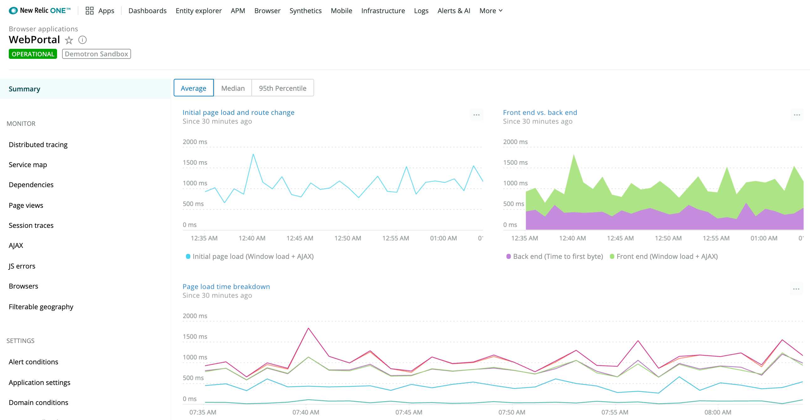
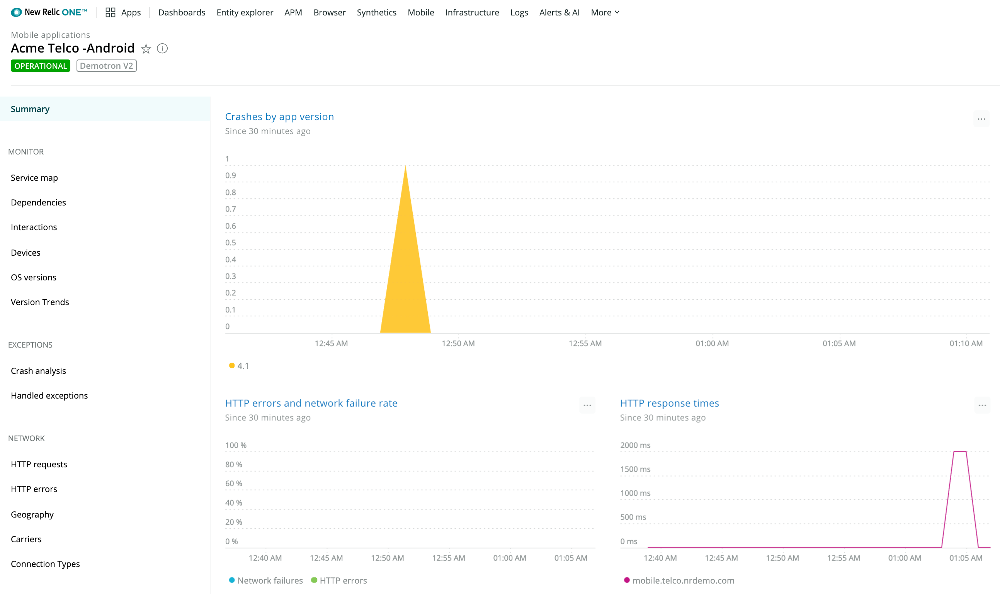

You have been running in the cloud for awhile now, or you just completed your migration from on-premise to the cloud. You have gone through your planning stages, identified your dependencies, tested your assumptions, and everything is looking great. But there are still some big questions:

* How are your customers experiencing your service?
* Did the performance of your front-end applications improve, or did performance stay the same?
* Or did it worsen in ways you did not expect?

New Relic provides a suite of front-end products—[Browser](/docs/browser), [Mobile](/docs/mobile-monitoring), and [Synthetics](/docs/synthetics)—to help you monitor and improve your front-end applications. With [dashboards](/docs/query-your-data/explore-query-data/dashboards/introduction-new-relic-one-dashboards), you can bring together information from each one of these product to give you an overall view of what your customer is experiencing. Follow the steps in this doc to optimize your customer experience after you migrate to the cloud.

## 1. Identify applications scoped for improvement [#identify-apps]

When you identify applications that you want to improve, start with applications where you have some clearly defined KPIs (Key Performance Indicators) that are relevant to the overall performance of your business. Selecting an application that tells a complete story of your performance, regarding key performance indicators, builds trust that you are doing the right level of monitoring and gathering the right metrics. When measuring front-end application performance, most companies think about these common KPIs:

* [Availability](/docs/apm/reports/other-performance-analysis/availability-report#procedures) percentage
* Average [duration](/docs/insights/insights-data-sources/default-data/apm-default-event-attributes-insights#txn-duration)
* [Page load time](/docs/browser/new-relic-browser/page-load-timing-resources/page-load-timing-process)
* [Throughput](/docs/using-new-relic/welcome-new-relic/getting-started/glossary#throughput)
* [Apdex](/docs/apm/new-relic-apm/apdex/apdex-measuring-user-satisfaction)
* [Response time](/docs/using-new-relic/user-interface-functions/view-your-data/response-time)

Use those common KPIs as a guideline when identifying applications. Take each one of the metrics and consider it from the perspective of your company's CEO and business team. What is the actual impact on your company's business if your application becomes unavailable? How many users will your site lose if your page loads start to take over four seconds? How many dollars are lost if your applications are not able to handle throughput spikes and some users get no response during those spikes?

These are serious questions to answer, and, if you are only measuring metrics on the server/application side, you are very likely not seeing what your customers are seeing on the frontend of the application. That is why [Browser](/docs/browser), [Mobile](/docs/mobile-monitoring), and [Synthetics](/docs/synthetics) are key to understanding the complete picture of your application performance. With [dashboards](/docs/query-your-data/explore-query-data/dashboards/introduction-new-relic-one-dashboards), you bring all of these metrics together and give your company a single place to see every metric that is crucial to your success.

## 2. Deploy monitoring: Browser, Mobile, and Synthetics [#deploy]

To start monitoring, you need to deploy Browser, Mobile, and Synthetics agents. With [Browser](/docs/browser), you gain deep insight into how your users are interacting with your application or website. [Mobile monitoring](/docs/mobile-monitoring) allows you to monitor and manage the performance of your [iOS](/docs/mobile-monitoring/new-relic-mobile-ios/get-started/introduction-new-relic-mobile-ios) and [Android](/docs/mobile-monitoring/new-relic-mobile-android/get-started/introduction-new-relic-mobile-android) applications. [Synthetics](/docs/synthetics) is a suite of automated, scriptable tools to monitor your websites and API endpoints.

Just like with all of New Relic's agents, Browser, Mobile, and Synthetics are quick to deploy. Here is a quick overview of each and links to documentation to help you get going:

<CollapserGroup>
  <Collapser
    id="deploy-browser"
    title="Deploy Browser to monitor your front-end data"
  >
    In a nutshell, Browser monitoring is a snippet of JavaScript that needs to appear in all of your application's webpages. It has no dependencies on other libraries, so it does not cause additional delays when bringing jQuery or other frameworks into the webpage. There are three ways to [install the Browser agent](https://docs.newrelic.com/docs/browser/new-relic-browser/installation/install-new-relic-browser-agent):

    <Table>
      <thead>
        <tr>
          <th style={{ width: "200px" }}>
            Method
          </th>

          <th>
            When to use this method
          </th>
        </tr>
      </thead>

      <tbody>
        <tr>
          <td>
            [Enable via APM](/docs/browser/new-relic-browser/installation/install-new-relic-browser-agent#select-apm-app)
          </td>

          <td>
            Typically, the quickest path is to let the APM agent dynamically inject the snippet into your pages on the server side. This works for many common web technologies, such as .NET, JSP, and other Java solutions. The [documentation](/docs/browser/new-relic-browser/installation/install-new-relic-browser-agent#select-apm-app) provides a complete reference for the languages and frameworks that allow this option.
          </td>
        </tr>

        <tr>
          <td>
            [Copy/paste method](https://docs.newrelic.com/docs/browser/new-relic-browser/installation/install-new-relic-browser-agent#copy-paste-app)
          </td>

          <td>
            If you are using an unsupported framework or are in an environment where you can instrument only the webpages but cannot install APM on the back-end, use the [copy/paste method](https://docs.newrelic.com/docs/browser/new-relic-browser/installation/install-new-relic-browser-agent#copy-paste-app). New Relic presents a snippet directly in the UI, and you copy it and paste it into a global page template on your end. Just pick one that is used by all of your webpages and put it there, and then the snippet appears on all pages.
          </td>
        </tr>

        <tr>
          <td>
            [Enable via the API](/docs/agents/java-agent/instrumentation/new-relic-browser-java-agent#manual_instrumentation)
          </td>

          <td>
            You can perform a manual instrumentation, in which your developers can add instrumentation to your webpages using a server-side API. New Relic supports this for many server-side languages. Refer to the documentation for an example of how to [do this in Java](https://docs.newrelic.com/docs/agents/java-agent/instrumentation/new-relic-browser-java-agent#manual_instrumentation).
          </td>
        </tr>
      </tbody>
    </Table>

    Whichever method you choose, you quickly have front-end performance data from your web pages. Just like with [APM](https://docs.newrelic.com/docs/apm) and other New Relic products, the overview tells you the “big picture” story of your performance data—in this case, your front-end data:

    

    **[one.newrelic.com](https://one.newrelic.com) > Browser > (select an app) > Summary:** After you select an application from the Browser apps index, the **Summary** page shows a summary of browser performance for that app.

    Set [alert conditions](https://docs.newrelic.com/docs/browser/new-relic-browser/configuration/view-browser-apps-alert-information) on metrics like **Page view load time** and **Throughput**, as well as **JS Errors** and **Ajax response time**.

    This is not just about seeing a slowdown and fixing it—this is about real users having a frustrating experience and potentially walking away from your application, costing your company potential profits. If you do not already have SLAs defined for these kinds of metrics, now is the time to define them.

    If you do have SLAs, but they were based on your on-premise performance metrics, now is the time to capture your cloud metric baselines. Check out the [Application Baseline](/docs/plan-application-baselining) tutorial for more information on establishing baselines with New Relic products.
  </Collapser>

  <Collapser
    id="deploy-mobile"
    title="Deploy Mobile, if your company has a mobile app"
  >
    If your company has a mobile application, install [Mobile monitoring](/docs/mobile-monitoring).

    <Callout variant="tip">
      Monitoring performance metrics about your webpages **as they work in mobile browsers** is handled by the [Browser agent](#deploy-browser). If you do not have a native mobile application, you can skip this section.
    </Callout>

    Mobile supports many device types running on iOS and Android. The install process for [iOS](https://docs.newrelic.com/docs/mobile-monitoring/new-relic-mobile-ios/get-started/introduction-new-relic-mobile-ios#installation) and [Android](https://docs.newrelic.com/docs/mobile-monitoring/new-relic-mobile-android/get-started/introduction-new-relic-mobile-android#installation) requires you to include the Mobile SDK in your applications. The SDK is as low impact as possible in terms of resource consumption (CPU and memory) while simultaneously providing you a broad and deep spectrum of performance data about your mobile applications.

    Slow performance on your mobile apps can be just as impactful to your business as slow performance in webpages. Think of top-level metrics like crash occurrences, HTTP errors/network failures, and HTTP response times in terms of your business KPIs. What happens to your business objectives when your mobile app starts spiking in terms of crash rate? Do users get frustrated and give up when the app takes forever to pull down data from your back-end systems or from third-party resources?

    The Mobile overview page pulls together a set of metrics that you should be setting SLAs and alert conditions on:

    

    **[one.newrelic.com](https://one.newrelic.com) > Mobile > (select an app) > Summary**: Quickly view crash occurrences, app launches, and more with Mobile monitoring.

    Once you get to know these top level metrics, you can quickly start using your Mobile metrics to find root causes, so you can add new alert conditions on lower-level metrics and discover any regression problems down the road.

    You can also monitor the back-end systems and cloud services that support your mobile apps. Improving the back-end systems and cloud services has a direct result in their improvement. Check out [Monitor your cloud services](/docs/using-new-relic/welcome-new-relic/plan-your-cloud-adoption-strategy/monitor-your-cloud-services) to gain more insight.
  </Collapser>

  <Collapser
    id="deploy-synthetics"
    title="Synthetics—it’s already there!"
  >
    With [Synthetics](https://docs.newrelic.com/docs/synthetics), there is nothing to install—the agents are already installed at many global locations and are just waiting for you to start using them.

    Synthetics lets you quickly define monitors, which run on a schedule you pick and make automated calls from those global locations back into your systems. There are four different [types of monitors](/docs/synthetics/new-relic-synthetics/getting-started/types-synthetics-monitors), and they have the following functions:

    <Table>
      <thead>
        <tr>
          <th style={{ width: "200px" }}>
            Type of monitor
          </th>

          <th>
            What this monitor can do for you
          </th>
        </tr>
      </thead>

      <tbody>
        <tr>
          <td>
            Ping
          </td>

          <td>
            Point a ping monitor at one of your webpages, and New Relic tells you if that page is responding as expected. Think of Ping as a simple “up/down” test but with a few extra features that you will quickly get to know.
          </td>
        </tr>

        <tr>
          <td>
            Simple browser
          </td>

          <td>
            The job of a simple browser is to simulate all of the work that a real browser would do to build out one of your webpages. Where are the slow points? How can you quickly see a waterfall view of the page buildout? Simple Browser quickly gets you all this data.
          </td>
        </tr>

        <tr>
          <td>
            Scripted browser
          </td>

          <td>
            This monitor lets you define a key workflow in your webpages (for example, registering, searching, or purchasing a product) as a script that the monitor runs for you on the frequency you select. If any step in the script fails, New Relic notifies you, with full details about where the failure happened and what it was.
          </td>
        </tr>

        <tr>
          <td>
            API test
          </td>

          <td>
            Testing your API endpoints is just as important as testing your webpages—if one of them stops working as expected, the downstream effects on your systems can be bad news for you and your customers. Define a script that pulls back data from one of your endpoints, tests what it gets back, and alerts you when it encounters a problem.
          </td>
        </tr>
      </tbody>
    </Table>

    Here are a few things to remember about Synthetics:

    * You can alert on every metric recorded by the monitors, from “is it up/down?” to “what came back from my API endpoint?”
    * All of your performance data from Synthetics can be quickly viewed in terms of SLAs and KPIs. Just like with the other areas of your instrumentation, it helps your entire team to start defining your SLAs for your KPIs. The metrics from Synthetics help you prove out the value of having moved to cloud-hosted services.
    * For any test that you want to run on a resource inside your firewall, there are [private minions](https://docs.newrelic.com/docs/synthetics/new-relic-synthetics/private-locations/install-configure-private-minions) that you can quickly and securely stand up in your own environment. They are available in the list of locations for your monitors, just like the the rest of the default global locations.
  </Collapser>
</CollapserGroup>

## 3. Identify your relevant metrics [#identify-metrics]

It is vital to identify which metrics are the most important to your business and use these metrics to define your KPIs. Answer the following questions to begin identifying the relevant metrics:

* What are your KPIs?
* Are you setting SLAs for them?

Here is a look at some examples of KPIs:

<CollapserGroup>
  <Collapser
    id="kpi-performance"
    title="KPIs for business performance"
  >
    Here are some examples of KPIs that companies in many industries consider to be key to business performance:

    <Table>
      <tbody>
        <tr>
          <td>
            **General**

            * DOM readiness
            * Page render
            * [Apdex](/docs/apm/new-relic-apm/apdex/apdex-measuring-user-satisfaction)
            * Mobile crash rate
          </td>

          <td>
            **Web**

            * Session count
            * Session duration
            * Page views
            * DOM readiness
            * Page render
            * Error %
            * [Apdex](/docs/apm/new-relic-apm/apdex/apdex-measuring-user-satisfaction)
          </td>

          <td>
            **Mobile**

            * App launches
            * User counts
            * Load time
            * Response time
            * Crash rates
            * Crash locations
            * Error rates (HTTP, network)
            * API errors
            * Session duration
          </td>
        </tr>

        <tr>
          <td>
            **Video**

            * Video play count
            * Video play duration
            * Video bit rate
            * Video buffering time
            * Video success rate
            * Errors (video, advertisement)
          </td>

          <td>
            **Trends**

            * Active users
            * Product views
            * Session duration
          </td>

          <td>
            **Sales/Retail**

            * Cart value
            * Abandon rate
            * Funnels
            * Click-throughs
            * Revenue (made, loss)
          </td>
        </tr>
      </tbody>
    </Table>
  </Collapser>

  <Collapser
    id="kpi-company"
    title="KPIs that are specific to your company"
  >
    You might start with KPIs from the business performance list and then build them out to be more specific to your own company’s performance:

    <Table>
      <tbody>
        <tr>
          <td>
            * Geography
            * Business unit
            * Product
            * Product name
            * Device type
            * Store/location
            * Mobile platform
          </td>

          <td>
            * Carrier
            * Website name
            * Page name
            * Browser type
            * Error type
            * Application name
            * Cloud provider
            * Success/fail reason
          </td>
        </tr>
      </tbody>
    </Table>
  </Collapser>

  <Collapser
    id="kpi-app"
    title="KPIs for application and infrastructure teams"
  >
    Here are some KPI ideas for your application and infrastructure teams for the server side:

    <Table>
      <tbody>
        <tr>
          <td>
            **Application/Infrastructure**

            * [Apdex](/docs/apm/new-relic-apm/apdex/apdex-measuring-user-satisfaction)
            * Availability
            * Throughput
            * App/API/DB  
              response times
            * Error %
            * Memory footprint
            * CPU workload
            * Disk workload
            * Network throughput
          </td>

          <td>
            **DevOps**

            * Builds
            * Commits
            * Deploys
            * Errors
            * Support incidents
            * MTTR
          </td>
        </tr>
      </tbody>
    </Table>
  </Collapser>
</CollapserGroup>

With New Relic products in place across your ecosystem, you can collect a large number of these metrics right out of the box.

Once you have all of the data flowing, dashboards is the place where you start [creating dashboards](/docs/insights/use-insights-ui/manage-dashboards/create-edit-copy-insights-dashboards) from before and after your migration to show your teams the value of moving to the cloud.

## 4. Create dashboards showing KPIs from before and after your migration [#insights-dashboards]

So, what might a starter dashboard look like for this part of your migration project? Consider this example:

**[one.newrelic.com](https://one.newrelic.com) > Dashboards**: Create customizable dashboards to monitor performance and business data.

The rows represent the “before” and “after” perspectives. The widgets in these rows get you answers to the key questions behind your KPIs:

* What is my site's availability?
* Which global locations are experiencing the slowest performance?
* How can I use [Apdex](/docs/apm/new-relic-apm/apdex/apdex-measuring-user-satisfaction) scoring to measure customer satisfaction levels with my application's performance? How many are satisfied? How many are OK (tolerating)? How many are frustrated with my site?

With just a few setup steps, you can [get your monitors running](#deploy-synthetics), and then head over to [New Relic dashboards](/docs/dashboards) and design your widgets.

Check out the [Introduction to New Relic One dashboards](/docs/dashboards/new-relic-one-dashboards/get-started/introduction-new-relic-one-dashboards) which shows you many examples of these kinds of queries, using data from your own account. You can quickly get a feel for how to start building queries, widgets, and dashboards.

After you identify your SLAs and KPIs, Browser and Mobile monitoring let you quickly start collecting data from your webpages and mobile apps, and Synthetics lets you schedule the monitors you need so that you can find out about problems before your customers start telling you about them. Bringing it all together in dashboards, you can start building the before/after perspective you need to prove the value of moving to the cloud and gain information that will help you optimize your customer’s experience.

## For more help [#more_help]

Explore the [New Relic Platform](https://newrelic.com/products).
