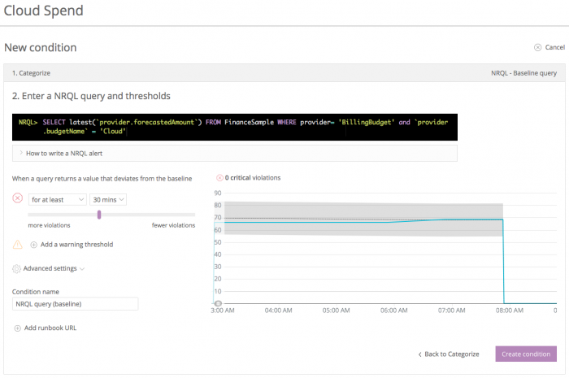

Now that you are using cloud-hosted infrastructure and services, it is important to start looking very early and very closely at your cloud spend:

* Make sure that your assumptions about your cloud spend are playing out as expected.
* Quickly catch and correct any unexpected spikes in spending.
* Start fine-tuning the usage of your cloud-based resources.

For example, if you have a set of 20 instances all running at 10% CPU, you can think about using smaller instances or consolidating more work onto those instances. This kind of thinking about your cloud spend helps you optimize and save money quickly.

New Relic can help you monitor all this. From a data perspective, it is really just another metric that our platform can collect for you. As with any other metric, you can visualize, report, and alert on your cloud spend data, just like you can with any data New Relic can help you collect. Using the [New Relic applied intelligence platform](https://newrelic.com/products) is a great way to help you learn about your cloud spending or about any of your performance data.

## 1. Deploy the New Relic Infrastructure agent [#deploy-infrastructure]

Review the [requirements for the New Relic Infrastructure agent](/docs/infrastructure/new-relic-infrastructure/getting-started/compatibility-requirements-new-relic-infrastructure) and follow the [documentation](https://docs.newrelic.com/docs/infrastructure/new-relic-infrastructure/installation) for instructions on installing the agent. After you install the Infrastructure agent on your hosts, you immediately have access to the broad spectrum of metrics that the agent receives automatically. Then, you can set up the cloud integration to start collecting billing information.

## 2. Create dashboard charts for cloud performance [#insights-widgets]

[New Relic Dashboards](/docs/dashboards) is the product that you use to write powerful custom queries about your data, and then visualize the results in charts that you collect on a dashboard. You can also feed the results of your dashboard queries directly into [New Relic Alerts](https://docs.newrelic.com/docs/alerts/new-relic-alerts/getting-started/introduction-new-relic-alerts), where you can get notifications on any deviations that you specify.

Include charts for various Infrastructure metrics related to performance and usage; for example:

* CPU
* Memory
* Disk
* Database

You may also want to include charts that represent the application using this cloud infrastructure. In this way you can correlate the cloud infrastructure performance with that of the application. As you right-size your cloud infrastructure, you will want to monitor application performance to make sure you are achieving any targets.

Here is an example of an Insights dashboard for cloud performance.

<CollapserGroup>
  <Collapser
    id="data-by-performance"
    title="Break out data by cloud performance and application metrics"
  >
    The following dashboard shows several charts that present key cloud infrastructure metrics and an associated application metric. Every one of these charts represents the result of a query.

    \[Downs: Updated image based on New Relic One can be found at:  
    [https://www.dropbox.com/s/rjq7tqrswxwtte9/Tutorial-Run-OptimizeCloudSpen...](https://www.dropbox.com/s/rjq7tqrswxwtte9/Tutorial-Run-OptimizeCloudSpend-image1.png)

    Image caption: one.newrelic.com > Dashboards: Create dashboards that include both cloud infrastructure and application metrics.]

    

    <figcaption>
      [**insights.newrelic.com**](https://insights.newrelic.com): Create dashboards that include both cloud infrastructure and application metrics.
    </figcaption>
  </Collapser>
</CollapserGroup>

## 3. Configure the Amazon AWS integration [#configure-aws-integration]

New Relic Infrastructure comes with several types of integrations, including [Amazon Web Services (AWS)](/docs/integrations/amazon-integrations/aws-integrations-list), [Microsoft Azure](/docs/integrations/microsoft-azure-integrations/azure-integrations-list), and [on-host integrations](/docs/integrations/host-integrations/host-integrations-list).

This tutorial focuses on the [AWS Billing integration](/docs/integrations/amazon-integrations/aws-integrations-list/aws-billing-monitoring-integration). First, [configure the integration](/docs/integrations/amazon-integrations/getting-started/connect-aws-services-infrastructure) with your AWS account, and then you can set up the AWS Billing integration.

## 4. Set up billing budgets in AWS [#configure-aws-billing]

The Amazon AWS Billing integration requires some additional configuration on the AWS side. Specifically, you need to go into your AWS Billing dashboard and set up **Budgets**. Our [documentation](https://docs.newrelic.com/docs/integrations/amazon-integrations/aws-integrations-list/aws-billing-monitoring-integration) and the blog post [Show Me (Where I’m Spending) the Money! AWS Billing Comes to New Relic Insights](https://blog.newrelic.com/2017/07/25/aws-billing-monitoring-integration/) provide walk-throughs of this process.

When creating **Budgets**, be sure to:

* Fill in an application name.
* Decide whether you are doing cost or service-based budgeting.
* Decide if your budget is open-ended or has a definite ending date.

## 5. Add cloud spend and budget widgets to Insights dashboard [#spend-budget-widgets]

[New Relic Insights](/docs/insights) is the product that you use to write powerful custom queries about your data, and then visualize the results in widgets that you collect on a dashboard. You can also feed the results of your Insights queries directly into [New Relic Alerts](https://docs.newrelic.com/docs/alerts/new-relic-alerts/getting-started/introduction-new-relic-alerts), where you can get notifications on any deviations that you specify.

Here are some examples of ways to use Insights dashboards to visualize your AWS cloud spend data.

<CollapserGroup>
  <Collapser
    id="data-by-budget"
    title="Break out data by application and by AWS budget"
  >
    The following dashboard shows several widgets that present key information about an AWS budget vs. actual spending, with data broken out by an application AWS budget. Every one of these widgets represents the result of an Insights query, and the data in the supporting Insights tables is the data that our integration automatically receives from AWS.

    \[Downs: Updated image based on New Relic One can be found at:

    [https://www.dropbox.com/s/ecp5mrnkezh6hjh/Tutorial-Run-OptimizeCloudSpen...](https://www.dropbox.com/s/ecp5mrnkezh6hjh/Tutorial-Run-OptimizeCloudSpend-image2.png)

    Image caption: one.newrelic.com > Dashboards: Add charts that include AWS cloud and budgets data.]

    \[Downs: put this 'code' section below the image please.

    Here is the query to create the Application X Cloud Cost budget chart in this dashboard example:

    ```
    SELECT latest(`provider.actualAmount`) as '$ Actual', latest(`provider.forecastedAmount`) as '$ Forecast', max(`provider.limitAmount`) as '$ Limit' FROM FinanceSample WHERE provider = 'BillingBudget' AND `provider.budgetName` = '<var>NAME_OF_YOUR_CLOUD_BUDGET</var>'
    ```

    ]

    

    <figcaption>
      [**insights.newrelic.com**](https://insights.newrelic.com): Create dashboards that include AWS cloud and budgets.
    </figcaption>
  </Collapser>
</CollapserGroup>

## 6. Create dashboards for every level of your organization [#create-dashboards]

Whether you are a developer, in DevOps, or an executive, having information about your cloud spend can help you optimize your cloud environment.

Here are a few ways dashboards can help at each level of your organization:

<CollapserGroup>
  <Collapser
    id="developers"
    title="Dashboards for developers"
  >
    Understanding how much applications cost to run helps developers properly configure applications to use more efficient services. For example, could developers save cloud costs using [Amazon AWS Lambda](https://aws.amazon.com/lambda/) or properly sized instances instead of randomly selecting an instance?
  </Collapser>

  <Collapser
    id="dev-ops"
    title="Dashboards for DevOps"
  >
    Monitoring application costs allows operators to catch possible overruns due to misconfigured services. For example, is the DevOps team’s auto-scaling configuration not scaling down properly? Are they spending money on instances that are not being used?
  </Collapser>

  <Collapser
    id="executives"
    title="Dashboards for executives"
  >
    An overall view of both forecasted and actual cloud spends for individual applications on a per region basis, as well as total costs, helps executives make better business decisions.
  </Collapser>
</CollapserGroup>

Use New Relic to keep control of your cloud spending costs, and get your teams alerted when you go over your budgets.

## 7. Set up alerts [#alerts]

After you write queries on your data in Insights, you can easily use them to [create alert conditions](https://docs.newrelic.com/docs/alerts/new-relic-alerts/defining-conditions/create-alert-conditions-nrql-queries).

New Relic gives you the ability to write baseline queries against your data. A baseline query is a query that you write without setting hard limits on the results and instead let [New Relic Applied Intelligence](https://newrelic.com/platform/applied-intelligence) “machine-learn” your performance data. New Relic alerts you when you go too far outside of your baseline numbers.

<CollapserGroup>
  <Collapser
    id="configure-baseline-query"
    title="Configure a baseline query using the forecasted amount"
  >
    Configuring a baseline query using a forecasted amount is a great starting point for monitoring any cloud budget, as you grow to understand what your cloud spend will be over time. New Relic notifies you if something spikes beyond your forecasted trend. That query looks like this:

    ```
    SELECT latest(`provider.forecastedAmount`) FROM FinanceSample WHERE provider = 'BillingBudget' and `provider.budgetName` = '<var>NAME_OF_YOUR_CLOUD_BUDGET</var>'
    ```

    When you [create a baseline query](/docs/alerts/new-relic-alerts/defining-conditions/create-baseline-alert-conditions) and alert on it, you decide how restrictively Applied Intelligence should analyze your data using a simple slider and visualization based on your recent performance. The slider either increases or decreases the gray band around your budget threshold (the blue line):

    

    <figcaption>
      [**alerts.newrelic.com**](https://alerts.newrelic.com) **> Alert policies > (select a policy) > Alert conditions:** Create alert conditions based on your NRQL queries and Insights data.
    </figcaption>

    This example would have resulted in zero violations based on recent data, and that is exactly what you are looking for. However, if that blue line spikes up out of the gray band, New Relic notifies you.
  </Collapser>
</CollapserGroup>

For more detailed information about creating, managing, and using alerts, view these New Relic University tutorials:

* [Intro to alerting](https://learn.newrelic.com/courses/performance_tools/alerts)
* [Alert policies](https://learn.newrelic.com/courses/performance_tools/alert_policies)
* [Alerting incident lifecycle](https://learn.newrelic.com/courses/performance_tools/alerting_lifecycle)
* [Notification channels](https://learn.newrelic.com/courses/performance_tools/alert_notification)
