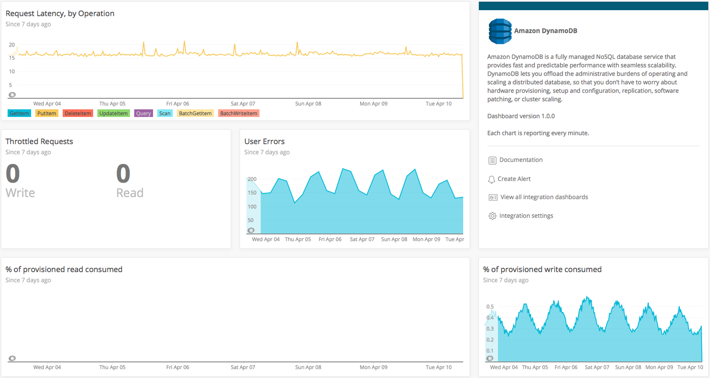

At each step of your cloud adoption process, New Relic plays a critical role in helping you establish baselines, prioritize migration steps, validate improvements, and manage cloud costs. New Relic can also help you refactor, or re-architect, your software and services when you migrate them to the cloud.

One key aspect of refactoring your software is splitting out your components into different services available from your cloud provider. For example, you might move your database component away from a traditional MySQL database to a cloud-hosted solution, like Amazon Relational Database (RDS) services such as DynamoDB or Aurora. If you move to the Azure cloud, you might adopt Azure SQL or Cosmos DB. When you move to solutions like those, you increase your database redundancy and resiliency. If you evaluate your overall ROI properly, you should start to see the cost/benefit ratio taking effect once you complete your refactoring.

## 1. Deploy monitoring [#deploy-monitoring]

New Relic is a true multi-tenant SaaS solution, meaning New Relic designed the agents to work at every layer of your application stack. To get started, deploy the agents:

* [APM](/docs/apm) to collect application-tier performance metrics
* [Browser monitoring](/docs/browser) to collect front-end web metrics
* [Mobile monitoring](/docs/mobile-monitoring) to collect front-end mobile app metrics
* [Infrastructure](/docs/infrastructure) to collect host/server metrics

### Cloud-based integrations

As you refactor your application and integrate new cloud services, you can also use New Relic to monitor and report data **about** your cloud services, offering you a comprehensive view of your entire architecture in one place. Cloud-based integrations available through New Relic include [Amazon Web Services (AWS)](/docs/infrastructure/amazon-integrations/aws-integrations-list) and [Microsoft Azure](/docs/infrastructure/microsoft-azure-integrations/azure-integrations-list).

This tutorial describes a database migration and focuses on APM and Infrastructure.

## 2. Set deployment markers [#deployment-markers]

With New Relic, you can track deployments by setting deployment markers. Deployment tracking lets you quickly see how deployments affect your application’s performance and gauge its performance before and after you refactor.

You can view deployments on the [Deployments page in APM](/docs/apm/applications-menu/events/deployments-page):

<figcaption>
  **rpm.newrelic.com/apm > (selected app) > Events > Deployments**: Here is an example of the **Deployments** page and details about a selected deployment.
</figcaption>

## 3. Establish baselines [#baselines]

When you install the APM agent at the application layer, New Relic immediately starts collecting and displaying metrics. Use these metrics to set your [pre-migration application baseline](/docs/create-application-baselines).

APM agents collect performance metrics about outbound calls to databases. In the **Monitoring** section of the APM UI, click [**Databases**](/docs/apm/applications-menu/monitoring/databases-slow-queries-page) to see a view of your database metrics. The following shows a database running on MySQL that will be refactored to use DynamoDB after migrating to AWS:

<figcaption>
  **[one.newrelic.com](https://one.newrelic.com) > APM > (select an app) > Monitoring > Databases**: Use this page to view and sort detailed information about database performance.
</figcaption>

## 4. Refactor your applications [#refactor]

To take advantage of the cloud, research what services are available from your cloud provider, and then re-architect and uncouple your applications.

## 5. Create dashboards to track refactoring your applications [#create-refactor-dashboards]

Apply your KPIs to your baseline measurements to [validate cloud improvements](/docs/validate-cloud-improvements), and, ideally, start seeing the impact of moving to the cloud. New Relic’s reporting for database interactions goes much deeper than [high-level performance metrics](#baselines) about calls to the database layer in APM. You get access to [metrics about slow queries](/docs/apm/applications-menu/monitoring/databases-slow-queries-page) so you can filter by database vendor and cache type. You can also see host and instance details for databases visually within [Service Maps](/docs/using-new-relic/service-maps/get-started/introduction-service-maps) and within the context of [transaction traces](/docs/apm/transactions/transaction-traces/introduction-transaction-traces).

Because all of your performance metrics are available for querying in New Relic, it's easy to build dashboards to show the performance of your database calls before, during, and after your refactoring in a single unified view.

Here is an example of a dashboard for an application that uses DynamoDB and was migrated to AWS:

<figcaption>
  Build a dashboard that shows the performance of your database calls.
</figcaption>

## 6. Create comparison dashboards [#create-comparison-dashboards]

To compare both the pre- and post-refactor baselines, create a [dashboard](/docs/insights/use-insights-ui/manage-dashboards) that displays the KPIs you [baselined](/docs/create-application-baselines).

The following dashboard shows the MySQL request query latency as compared with all of the operations for DynamoDB. You can see that, for this example, the request query latency for DynamoDB is too small to even register on the graph. Performance is clearly optimized with this cloud-based database.

<figcaption>
  Use dashboards to visualize pre- and post-refactor baselines.
</figcaption>

With [APM agents](/docs/agents/manage-apm-agents/installation/install-agent) and the other integrations New Relic provides, you can measure the effectiveness of refactoring your applications using a broad spectrum of metrics.