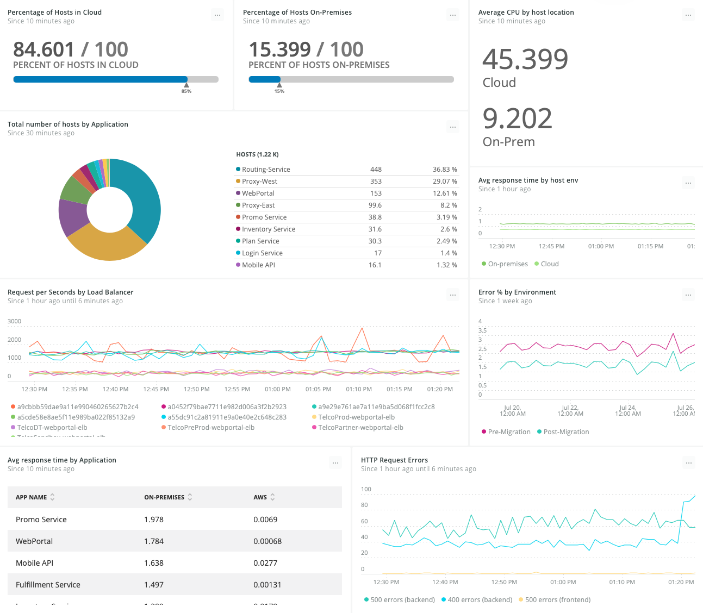

After you migrate your applications to the cloud and integrate cloud services, use New Relic to measure and validate improvements to your applications.

## 1. Identify KPIs [#identify-kpis]

To provide quantifiable measures that your teams can use to assess your migration, identify a list of [corporate KPIs (key performance indicators)](/docs/optimize-customer-experience#identify-metrics). Using the New Relic platform to measure KPIs helps you eliminate blind spots and see the connections between entities—from your application code to your cloud infrastructure (including containers running in highly distributed microservices), to your customer experience. Your goal is to create a collection of metrics in several categories that you can visualize in dashboards in [New Relic Dashboards](/docs/query-your-data/explore-query-data/dashboards/introduction-new-relic-one-dashboards).

To validate cloud improvements, group KPIs in the following categories, from least to most strong:

* Application and infrastructure performance
* End-user experience, including website and mobile application performance
* Audience and content trends
* DevOps productivity
* Application revenue analytics
* Future business goals

## 2. Deploy monitoring tools [#deploy-monitoring]

To start monitoring your [KPIs](#identify-kpis), verify that the applications that you want to migrate are compatible with the requirements for the New Relic products you want to use. Then, install the New Relic agents:

<CollapserGroup>
  <Collapser
    id="install-apm"
    title="Install APM"
  >
    Review the [compatibility and requirements](/docs/agents/manage-apm-agents/installation/compatibility-requirements-new-relic-agents) and then [install APM agents](/docs/agents/manage-apm-agents/installation/install-agent) on your application stack.

    After installing the APM agents, review the architecture of the applications you instrumented with an APM agent. Take note of all hosts that are part of each tier of the application stack (database, application, web server, etc.), so you can install New Relic Infrastructure agents on each of those hosts.
  </Collapser>

  <Collapser
    id="install-infrastructure"
    title="Install infrastructure"
  >
    After reviewing the [requirements](/docs/infrastructure/new-relic-infrastructure/getting-started/compatibility-requirements-new-relic-infrastructure) for New Relic Infrastructure, [install the infrastructure agent](/docs/infrastructure/new-relic-infrastructure/installation) on the hosts that you identified so you can start to gather data for your KPIs.

    <Callout variant="tip">
      If you use [Ansible, Chef, or Puppet](/docs/infrastructure/new-relic-infrastructure/config-management-tools) for automation, you can use those tools to deploy Infrastructure agents to your hosts.
    </Callout>
  </Collapser>

  <Collapser
    id="install-integrations"
    title="Install infrastructure integrations"
  >
    You can also monitor and report data about services that your code depends on using New Relic integrations. New Relic offers cloud integrations for [Amazon Web Services (AWS)](/docs/integrations/amazon-integrations/get-started/introduction-aws-integrations), [Microsoft Azure](/docs/integrations/microsoft-azure-integrations/getting-started/introduction-azure-monitoring-integrations), [Google Cloud Platform](/docs/integrations/google-cloud-platform-integrations/getting-started/introduction-google-cloud-platform-integrations) as well as [on-host integrations](/docs/infrastructure/host-integrations/host-integrations-list).

    <Callout variant="tip">
      If you are using AWS as a cloud provider, take advantage of New Relic’s [AWS billing integrations](/docs/infrastructure/amazon-integrations/amazon-integrations/aws-billing-integration) to stay on top of your budget and prove the success of your migration.
    </Callout>
  </Collapser>
</CollapserGroup>

## 3. Gather custom data [#custom-data]

To [manage, search for, and filter resources](/docs/infrastructure/new-relic-infrastructure/configuration/configure-infrastructure-agent#attributes), assign metadata to your cloud resources in the form of tags. Tags are labels that consist of **key-value** pairs that you use to annotate your Infrastructure data.

Tag formats are different between AWS, Azure, and Google. Google, for example, has the shortest allowable lengths for keys and values. In addition, they all have different requirements for case sensitivity and allowable characters. To make sure that your tags are usable across most cloud providers:

* Use only lowercase letters, numbers, underscores, and dashes.
* Keep keys and values under 63 characters.

New Relic reports data contained in [specific events](/docs/insights/insights-data-sources/default-data) to your account as part of its “out-of-the-box” functionality. You can add additional data to those events by using custom attributes. If you determine that you need to collect custom data, review custom data [requirements](/docs/insights/insights-data-sources/custom-data/insights-custom-data-requirements-limits), and [report custom event data](/docs/insights/insights-data-sources/custom-data/report-custom-event-data).

For more detailed information about sending custom data, check out these New Relic University tutorials:

* [APM custom data overview](https://learn.newrelic.com/custom-data-with-apm)
* [Adding custom events using the API](https://learn.newrelic.com/custom-data-with-insights)

## 4. Create baselines [#baselines]

In order to validate the value of moving to the cloud, you need to get baselines for your applications **before** you move to the cloud. [Define pre-migration baselines](/docs/create-application-baselines) for applications and their underlying infrastructures that you have designated for cloud service improvements based on your KPIs. To stay on top of your KPIs as you are moving, create [baseline alerts](/docs/alerts/new-relic-alerts/defining-conditions/create-baseline-alert-conditions) for applications monitored by APM and browser and use [NRQL alerts](/docs/alerts/new-relic-alerts/defining-conditions/create-alert-conditions-nrql-queries) to get notified on any spikes or drops in your KPIs.

The following dashboard tracks key performance indicators for applications designated to move to the cloud:

<figcaption>
  **[one.newrelic.com](https://one.newrelic.com "Link opens in a new window.") > Dashboards > Create a dashboard**: Create dashboards to track your KPIs.
</figcaption>

After you migrate applications to the cloud, apply the same criteria to [post-migration baselines](/docs/perform-migration-acceptance-testing) so you can compare your results from before and after your migration.

## 5. Validate improvements with Dashboards [#validate]

Dashboards is a single location to view all the data that New Relic products gather. Use New Relic [Dashboards](/docs/dashboards) to visualize your KPIs before and after your move:

* [Transaction](/docs/insights/new-relic-insights/decorating-events/apm-default-attributes-insights) and [TransactionError](/docs/insights/new-relic-insights/decorating-events/error-event-default-attributes-insights) event types with APM
* [PageView and PageAction](/docs/insights/new-relic-insights/decorating-events/browser-default-attributes-insights) event types with browser
* [Default Infrastructure events and attributes](/docs/infrastructure/new-relic-infrastructure/data-instrumentation/default-infrastructure-attributes-events) for your systems, processes, events, storage, and network, [Infrastructure integrations](/docs/infrastructure/integrations-getting-started/getting-started/introduction-infrastructure-integrations), and [custom attributes](/docs/agents/manage-apm-agents/agent-data/collect-custom-attributes)
* [Mobile](/docs/insights/new-relic-insights/decorating-events/mobile-default-attributes-insights) event types with Mobile
* [SyntheticCheck, SyntheticRequest, and SyntheticPrivateMinion](/docs/insights/new-relic-insights/decorating-events/synthetics-default-attributes-insights) event types with Synthetics

The following dashboard shows KPI data used to validate cloud improvements:

<figcaption>
  **[one.newrelic.com](https://one.newrelic.com "Link opens in a new window.") > Dashboards > Create a dashboard**: Create dashboards to track your KPIs pre- and post-migration.
</figcaption>

Use dashboards to validate the value of adopting a new cloud service and to answer key questions about application performance and customer experience.