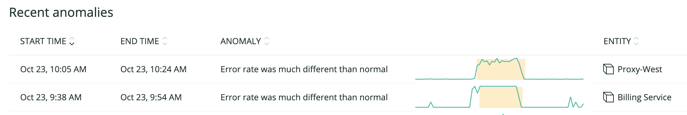

The term "alerting" often carries some negative connotations; for too many developers, alerting correlates too closely with errors, mistakes, and ongoing issues. However, for developers who are proactive about alerting, they know they don’t have to stare at their dashboards all day, because effective alerts will tell them when to check in.

Well-defined alerts help you understand the health of your systems, so you can respond to performance problems before they affect your customers. Alerts can become overwhelming, so tune alerts and leverage AI so you get alerted on what matters.

## Prerequisites

This tutorial assumes you have:

* Instrumented your applications in New Relic.
* Reviewed the tutorial [Establish objectives and baselines](/docs/establish-objectives-baselines) before you begin this one.
* Optional: added [custom attributes and events](/docs/insights/insights-data-sources/custom-data/send-custom-data-insights).

## 1. Define required alerting policies based on Service Level Objectives [#define]

A [service level objective (SLO)](https://en.wikipedia.org/wiki/Service_level_objective) is an agreed upon means of measuring the performance of your service. The SLO defines a target value of a specified quantitative measure, which is called a service level indicator (SLI). Examples service level indicators could be average response time, response time percentile, and application availability. SLOs would then clarify a target value for those SLIs such as:

* Average response time should be less than 200 ms.
* 95% of requests should be completed within 250 ms.
* Availability of the service should be 99.99%.

These SLOs can also be logically grouped together to provide an overall boolean indicator of whether the service is meeting expectations or not (for example, “95% of requests completed within 250 ms AND availability is 99.99%”), which can be helpful for alerting purposes.

Use these SLIs as key performance indicators (KPIs) so your team and organization can measure your service and ensure it’s meeting customer expectations. By breaking down the quantitative performance metrics that are required of your services, you can then identify what kinds of alerts you should set for each. For instance, you could set an alert to notify you if web transaction times go above half a millisecond, or if the error rate goes higher than .20%.

However, not every SLO needs to become an alert. A strong alert strategy takes SLOs and creates a set of simple, actionable alerts. New Relic often finds that our most mature DevOps customers set fewer alerts in general and focus those alerts on a core set of metrics that indicate when their customer experience is truly degraded. As a result, New Relic DevOps customers often use [Apdex](/docs/apm/new-relic-apm/apdex/apdex-measuring-user-satisfaction) as part of their alerting strategy to align alerts with signs of degraded user satisfaction.

As you design your alert strategy, keep this question in mind: “If the customer isn’t impacted, is it worth waking someone up?”

For a simple framework of areas to set alerts for, use the following questions and advised metrics and KPIs:

<table>
  <thead>
    <tr>
      <th width="250px">
        Questions
      </th>

      <th>
        Metrics and KPIs
      </th>
    </tr>
  </thead>

  <tbody>
    <tr>
      <td>
        Are we open for business?
      </td>

      <td>
        Use [Synthetic monitoring pings](/docs/synthetics/synthetic-monitoring/getting-started/get-started-new-relic-synthetic-monitoring) to determine if the site is up and [scripted checks](/docs/synthetics/synthetic-monitoring/scripting-monitors/introduction-scripted-browser-monitors) to determine that the most important capabilities (such as a checkout cart) are working.
      </td>
    </tr>

    <tr>
      <td>
        How's our underlying infrastructure?
      </td>

      <td>
        Set KPIs for key [hardware, virtual hosts, containers](/docs/infrastructure/infrastructure-monitoring/get-started/get-started-infrastructure-monitoring), [network](https://github.com/newrelic/nri-network-telemetry), and storage components.
      </td>
    </tr>

    <tr>
      <td>
        How's the health of our application?
      </td>

      <td>
        Track metrics for JVM performance, queuing, caching, and similar dependencies.
      </td>
    </tr>

    <tr>
      <td>
        How’s the overall quality of our application?
      </td>

      <td>
        Use an [Apdex](/docs/apm/new-relic-apm/apdex/apdex-measuring-user-satisfaction) score to quickly access an application’s quality.
      </td>
    </tr>

    <tr>
      <td>
        How are our customers doing?
      </td>

      <td>
        Consider real end-user metrics ([browser](/docs/browser) or [APM](/docs/apm)), synthetic users ([Synthetics](/docs/synthetics)), and [Apdex](/docs/apm/new-relic-apm/apdex/apdex-measuring-user-satisfaction) scores.
      </td>
    </tr>

    <tr>
      <td>
        How's our overall business doing?
      </td>

      <td>
        Focus on [key transactions](/docs/apm/transactions/key-transactions/introduction-key-transactions) within an application, and tie that to expected business outcomes to illustrate correlation between your application and business performance.
      </td>
    </tr>
  </tbody>
</table>

## 2. Set specific alerts for performance, correctness, throughput, availability, and dependencies [#specify]

With New Relic you can set alerts on your instrumented applications, end-user experience, infrastructure, databases, and more. New Relic will alert you if your site’s availability dips or if your error rate spikes above acceptable levels, as defined by your SLOs. You can set [warning thresholds](/docs/alerts/new-relic-alerts/defining-conditions/define-thresholds-trigger-alert) to monitor issues that may be approaching a critical severity but don’t yet warrant a pager notification.

Setting thresholds for when alerts should notify teams can be challenging. Thresholds that are too tight will create alert fatigue while thresholds that are too loose will lead to unhappy customers.

[Baseline alerts](/docs/alerts/new-relic-alerts/defining-conditions/create-baseline-alert-conditions) allow you to set dynamic thresholds for alerts based on historical performance. Use baselines to tune your alert to the right threshold. For example, an alert in APM can notify incident response teams if web transaction times deviate from historical performance for an allotted amount of time.


<figcaption>
  **[alerts.newrelic.com](https://alerts.newrelic.com) > (select an alert policy) > (select an alert condition) > Define thresholds**
</figcaption>

You can set this same kind of alert in browser to catch sub-optimal performance. In the following example, we’ve set both a warning and a violation for throughput:


<figcaption>
  **[alerts.newrelic.com](https://alerts.newrelic.com) > (select an alert policy) > (select an alert condition) > Define thresholds**
</figcaption>

As you develop smaller, independent services running on increasingly ephemeral architectures, your environments become significantly more complex. Visibility into outliers can be an important tool for understanding likely performance issues. You should set alerts to automatically fire when you have an outlier -- this can indicate misbehaving hosts, load balancers, or apps.

For example, a load balancer divides web traffic approximately evenly across five different servers. You can set an alert based on a NRQL query, and notification to be sent if any server starts getting significantly more or less traffic than the other servers. Here’s the graph:


<figcaption>
  **[alerts.newrelic.com](https://alerts.newrelic.com) > (select an alert policy) > (select an alert condition) > Define thresholds**
</figcaption>

And here’s a sample NRQL query:

```
SELECT average(cpuPercent) FROM SystemSample WHERE apmApplicationNames = 'MY-APP-NAME' FACET hostname
```

Now you have set static, baseline, and outlier alerts. This can provide a comprehensive awareness of your ecosystem.

Refer to the [New Relic Alerts documentation](/docs/alerts/new-relic-alerts) for more details about optimizing your alerts.

## 3. Identify groups to alert, and set broadcasting methods [#identify]

Alerting without the proper broadcasting methods leaves you vulnerable. Your alerts strategy should include a [notification channel](/docs/alerts/new-relic-alerts/managing-notification-channels/notification-channels-control-where-send-alerts) to ensure the appropriate teams are notified if your application or architecture encounters issues. New Relic has many [notification integrations](/docs/alerts/new-relic-alerts/managing-notification-channels/notification-channels-control-where-send-alerts#channel-types), but we recommend that you start simple and add more complexity later.

We recommend that you first send alerts to a group chat channel (for example, using **Slack**). Evaluate these alerts in real time for several weeks to understand which alerts are indicative of important or problematic issues. These are the the types of alerts that warrant waking someone up.

## 4. Leverage AI to fine-tune alerts and seek anomalies [#fine-tune]

To ensure you aren't training your teams to turn off or ignore notifications, keep your alerts valid and fresh. As you use New Relic to optimize your application and infrastructure performance, tighten your [New Relic Alerts](/docs/alerts) policy conditions to keep pace with your improved performance. To keep alerts to a minimum, leverage New Relic Applied Intelligence features, such as [Incident Intelligence](/docs/alerts-applied-intelligence/applied-intelligence/incident-intelligence/get-started-incident-intelligence), which correlates related alerts into one actionable issue combining machine learning and manual input. Check to make sure alerts are correlated correctly and train your system to obtain the most accurate incident correlation.

An additional way to reduce alert noise is by flapping detection and suppression. When an issue is "flapping," it is cycling between an open and resolved state, creating a new alert every time it cycles. [Effectively handling these](https://blog.newrelic.com/product-news/how-to-use-decisions-applied-intelligence/) can reduce the number of total alerts sent to your team. Finally, when you have maintenance scheduled, take advantage of alert [muting rules](/docs/alerts-applied-intelligence/new-relic-alerts/alert-notifications/muting-rules-suppress-notifications) to suppress those alerts you don't need.

Now that you have tuned your alerts to valid notifications, you can proactively go after anomalies so you can fix issues before they become incidents. Enable [Proactive Detection](/docs/alerts-applied-intelligence/applied-intelligence/proactive-detection/proactive-detection-applied-intelligence) of anomalies and set some level of notification for them.



## 5. Create an alerts dashboard [#dashboard]

Be sure to check your alerts and confirm that they're firing regularly and are still relevant for your customer satisfaction metrics. Use the New Relic platform to create dashboards centered around alerts and incidents for the most common policy conditions and violations.


<figcaption>
  **[insights.newrelic.com](https://insights.newrelic.com) > All dashboards > (selected dashboard)**
</figcaption>

Use [NRQL](/docs/insights/nrql-new-relic-query-language/using-nrql/introduction-nrql) to create your dashboards. For example, the dashboard above was created using the following NRQL queries:

* **Incidents by condition**:

  ```
  SELECT count(*) FROM <var>ALERT_NAME</var> WHERE current_state = 'open' FACET condition_name SINCE 1 week ago
  ```
* **Incidents by policy**:

  ```
  SELECT count(*) FROM <var>ALERT_NAME</var> where current_state = 'open' FACET policy_name SINCE 60 MINUTES AGO TIMESERIES
  ```
* **Alert trends over time**:

  ```
  SELECT count(*) FROM <var>ALERT_NAME</var> WHERE current_state IS NOT NULL FACET policy_name SINCE 1 week ago TIMESERIES
  ```
* **Incident details**:

  ```
  SELECT timestamp, incident_id, policy_name, condition_name, details, severity FROM <var>ALERT_NAME</var> SINCE 1 week ago LIMIT 40
  ```

Visualizing this data provides a resource you can share with others to refine the alerts and thresholds you’re using.

For a more extensive discussion on notification channels, refer to the [incident orchestration tutorial](/docs/incident-orchestration).

## Conclusion

Establishing a focused alerts policy helps you pinpoint any degradation that could impact performance in your application or infrastructure. With proactive alerting, you will decrease user-reported incidents, and allow your teams to spend less time firefighting and more time deploying significant changes to your product.