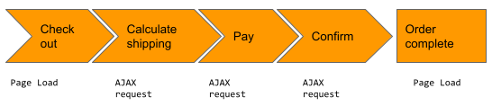

## Overview

Bottom of the funnel analysis is about improving conversion by focusing on performance at the end of the user journey. 


Most sites and apps are built with one or more purposes in mind.  If there is a purpose, there is likely to be a user journey.  Some examples:

|Purpose|User journey|
|-------|------|
| Brand awareness| Download a whitepaper|
| Customer support|Raise a support ticket|
| Customer services (registration, forms, payments)|Make a payment|
| Entertainment|Stream a movie|
| Goods |Buy clothes and accessories|
| Informational purposes|Find a support program in your state |
| Lead generation |Join distribution list to get promotions and coupons|
| Outreach|Get information about events in your town|
| Services (Travel, rentals, bookings)|Book a flight|
| Social media|Share a selfie|


When a user completes a journey, we think of it as a conversion.  All conversions have a value - from a few dollars to thousands.  The best way to improve the conversion rate is to start at the bottom of the funnel, when the intent to complete the user journey is clear. 

### What if I have performance issues in the middle of the funnel?  

Any glaring issues with your app or site should be addressed, no matter where they occur.  When it comes to optimizing conversion, it's better to __start__ at the bottom of the funnel for two reasons:
* Higher return on investment.  Users at this stage are already more likely to convert.  Addressing performance issues here will see an immediate impact on the bottom line.
* If you have issues at the bottom of the funnel, optimizing earlier stages may not have much of an impact on the conversion rate.

Once you've optimized the bottom of the funnel you can use the same techniques to optimize earlier stages of the user journey.

Optimizing the top or the middle of the funnel without focusing on the bottom first is a bit like fishing with a holey net.  You can get more fish into the net by optimizing when and where you fish but you risk losing all that optimization as soon as you take the net out of the water.  


## Desired outcome

Increase revenue by resolving issues that appear when a user attempts to complete an action.

## Key performance indicators

Bottom of the Funnel Analysis measures the following KPIs:

<table>
<thead>
    <tr>
      <th>
      KPI
      </th>

      <th>
      Description
      </th>

      <th>
      Goal
      </th>

    </tr>
</thead>
<tbody>
  <tr>
   <td>Bottom of the Funnel Success Rate/Conversion Rate
   </td>
   <td>The rate of conversion once a user has gone far enough to demonstrate intent to complete an action to actual completion.   Examples of this are rate of:
<br/>

- Checkout -> Order submission<br/>
- Insurance form review -> submission<br/>
- Completing sign up details -> submission <br/>

   </td>
   <td>Increase the rate of conversion by addressing errors and latency at the bottom of the funnel</td>
  </tr>
  <tr>
   <td>Revenue at Risk due to Latency
   </td>
   <td>Value of a conversion * number of pages or interactions in the bottom of the funnel that are slower than the industry threshold.  
   </td>
   <td>Focus on reducing this value by improving page KPIs</td>
  </tr>
  <tr>
   <td>Revenue at Risk due to Errors
   </td>
   <td>Value of a conversion * number of backend errors in the bottom of the funnel interactions
   </td>
   <td>Tune this value to make it meaningful by filtering out errors that aren't visible to the end user.  Once this is meaningful, focus on reducing it.  Create an alert to notify you if it suddenly trends upward.  
   </td>
  </tr>
</tbody>
</table>

## Prerequisites

### Required knowledge

* Familiarity with [synthetic monitoring](/docs/synthetics/synthetic-monitoring/getting-started/get-started-synthetic-monitoring/)
* Familiarity with [browser monitoring](/docs/browser/browser-monitoring/getting-started/)
* Familiarity with [basic Browser UI views](/docs/browser/browser-monitoring/getting-started/introduction-browser-monitoring/)
* Familiarity with [SPA data in Browser UI](/docs/browser/single-page-app-monitoring/use-spa-data/view-spa-data-browser-ui/)

### Required installation and configuration

* [Browser Pro installed in relevant pages](/docs/browser/browser-monitoring/installation/)
* [SPA enabled for single page applications](/docs/new-relic-solutions/best-practices-guides/full-stack-observability/browser-monitoring-best-practices-guide/#how-to-do-it)
* Insights retention for Browser events is at least 2x an average sprint.

## Establish current state
[Identify where the bottom of the funnel starts](#identify-where-the-bottom-of-the-funnel-starts)      
[Distinguish between pages and actions](#distinguish-between-pages-and-actions)    
[Create a scripted synthetics monitor for the bottom of the funnel](#create-a-scripted-monitor-for-the-bottom-of-the-funnel)   
[Import the bottom of the funnel dashboard](#import-the-bottom-of-the-funnel-dashboard)   
[Capture current performance](#capture-current-performance)   

### Identify where the bottom of the funnel starts

The Bottom of the Funnel is focused on the final steps of a user journey where a user has gone far enough to show intent to complete the journey. 

Some examples:

### Ecommerce user journey


The user journey is simplified so you can focus on where the bottom of the funnel begins - at checkout. Most users entering the checkout phase plan to purchase something. Reducing errors and latency from this point onward is more likely to improve conversions than focusing on any other part of the funnel.   

### Car insurance purchase user journey


In the example above, you have the user’s interest in car insurance as they enter information, but you do not know their intent until they see the quote and continue to proceed.  

### Distinguish between pages and actions

The final steps of a user’s journey is likely to be a mix of full page loads and AJAX calls.  



You will need to know all pages and Ajax requests for the next step. If you are not sure which requests are running from the page in question, you can run: 

```
SELECT count(*) FROM AjaxRequest WHERE pageUrl like ‘%FILTER%’ FACET groupedRequestUrl SINCE 1 DAY AGO
```

### Create a scripted monitor for the bottom of the funnel

Make sure you have a [scripted monitor](/docs/synthetics/synthetic-monitoring/scripting-monitors/introduction-scripted-browser-monitors/) for each path through the bottom of the funnel.  The goal is to make sure your bottom of the funnel services are working around the clock.   

For example, you may have a checkout flow that calls a different payment API depending on the customer’s payment preferences.


### Import the Bottom of the Funnel Dashboard


Follow the instructions documented in the public [GitHub README](https://github.com/newrelic/oma-resource-center/blob/main/src/content/docs/oma/value-drivers/customer-experience/use-cases/bottom-of-the-funnel-analysis/README.md).


### Capture Current Performance


1. Follow the GitHub repository [README](https://github.com/newrelic/oma-resource-center/blob/main/src/content/docs/oma/value-drivers/customer-experience/use-cases/bottom-of-the-funnel-analysis/README.md) instructions.
2. Use the dashboard from the previous step to understand the bottom of the funnel performance.  
3. Create a plan to improve KPIs that don’t meet target values as well as reduce revenue at risk.

## Improvement process

### Plan your work

Whether you have a dedicated initiative to improve performance or classifying as ongoing maintenance, you need to track your progress at the end of every sprint. For detailed information, see:

* [Improve uptime](/docs/new-relic-solutions/observability-maturity/customer-experience/cx-improve-web-uptime)

* [Improve page load performance](/docs/new-relic-solutions/observability-maturity/customer-experience/cx-improve-page-load)

* [Improve AJAX performance](/docs/browser/browser-monitoring/browser-pro-features/ajax-page-identify-time-consuming-calls/)

### Advanced topics

Should I apply segmentation? 

Segmentation (breaking out performance into cohorts, such as region and device type) is a good idea if:

* Your organization has initiatives tied to addressing a target audience from a particular cohort that you can segment by using either custom attributes or data that is already available in New Relic.
* You are already familiar with Bottom of the Funnel Analysis and there is a significant enough difference in performance among different cohorts to warrant tracking and/or developer focus.

## Conclusion

### Best practices going forward

* Revisit performance metrics at the end of each sprint.
* Any time the user journey changes, revisit if the steps at the Bottom of the Funnel are the same. Incorporate changes in developer sprints as needed.
* Openly share metrics with the lines of the business you support as well as other internal stakeholders.
* Revisit your Customer Experience SLOs. Do you need to define more ambitious SLOs for the end of the funnel?  
* Create alerts for [business critical](docs/new-relic-solutions/observability-maturity/aqm-implementation-guide/#perform-enablement-two) drops in Quality Foundation KPIs.  

### Value realization

At the end of this process you should: 

* Know your user conversion rate and have addressed errors or performance issues that negatively impact it.
* Increased revenue for your company.
* Created, or be on the path to create, a common language with business owners so you are working together; opening new avenues for recognition and sponsorship for new projects.
