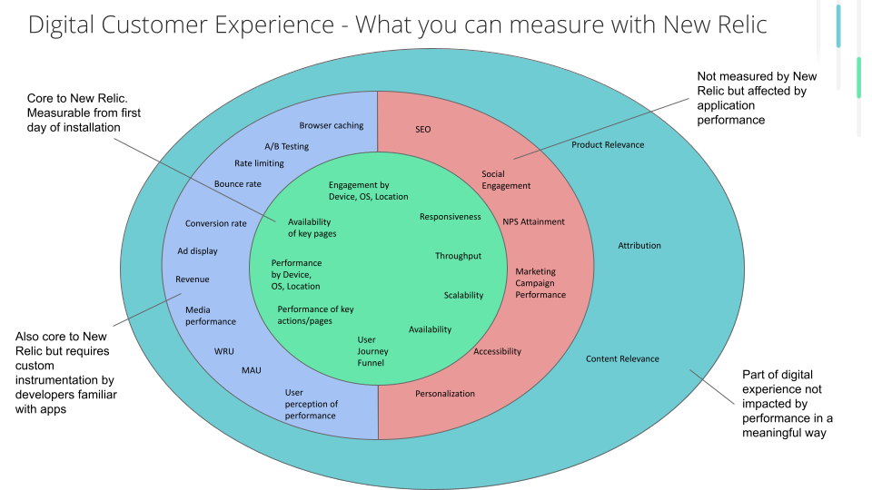

## Overview [#overview]

Digital customer experience is your end user’s experience across all your digital touch points. There are four core factors that impact a user’s experience:

- Availability (Is it reachable?)
- Performance (Does it perform well enough to be usable?)
- Content quality (Does it have what users need and can they find it?)
- Product and content relevance (Does it have what users care about?)

Digital customer experience includes web, mobile, and IoT. The first version of this guide is focused on measuring the end user web experience.

Quality Foundation is about creating a standard practice to help you understand your digital customer experience in a meaningful way.

## Desired Outcome [#desired-outcome]
This implementation guide will help you:

* Look at customer experience in relation to:
    * Global functions, such as search and login
    * Lines of business
    * Regions
* Report back to business stakeholders on what they care about
* Prioritize what you work on
* Create a repeatable practice

## Key Performance Indicators

Quality Foundation measures the following KPIs:

<CollapserGroup>
  <Collapser
    id="js-errors-kpi"
    title="JavaScript error rate KPI"
  >
    This KPI measures the number of JavaScript errors per page view.

    **Goal:**
    * Remove irrelevant JavaScript errors being tracked either by tuning ingest or using filtering.
    * Reduce JavaScript errors that impact customer performance.

  </Collapser>
  <Collapser
    id="http-errors-kpi"
    title="HTTP error rate KPI"
  >
    HTTP errors (or HTTP `4xx` and `5xx` responses) happen when calls to the backend are not successful.

    **Goal:**
    Measure and reduce the HTTP error rate to ensure your customers are able to do what they came to your site to do.

  </Collapser>
</CollapserGroup>
