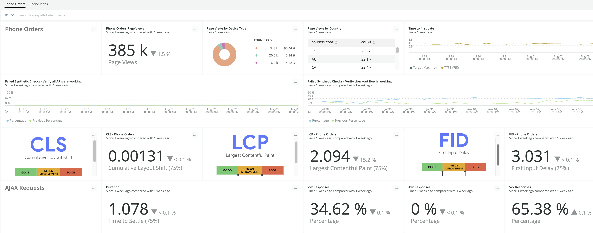
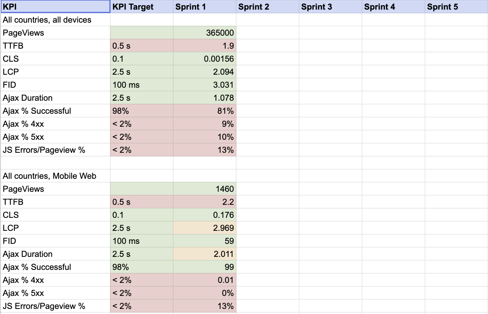

## Overview [#overview]

Digital customer experience is your end user’s experience across all your digital touch points. There are four core factors that impact a user’s experience:

- Availability (Is it reachable?)
- Performance (Does it perform well enough to be usable?)
- Content quality (Does it have what users need and can they find it?)
- Product and content relevance (Does it have what users care about?)


Digital customer experience includes web, mobile, and IoT. The first version of this guide is focused on measuring the end user web experience.

Quality Foundation is about creating a standard practice to help you understand your digital customer experience in a meaningful way.

This implementation guide will help you:

* Look at customer experience in relation to:
    * Global functions, such as search and login
    * Lines of business
    * Regions
* Report back to business stakeholders on what they care about
* Prioritize what you work on
* Create a repeatable practice

## Desired Outcome [#desired-outcome]
Improve customer engagement and retention by measuring and improving performance in a way that better aligns to the end user experience. 

## Key Performance Indicators

Quality Foundation measures the following KPIs:

<CollapserGroup>
  <Collapser
    id="js-errors-kpi"
    title="JavaScript error rate"
  >
    This KPI measures the number of JavaScript errors per page view.

    **Goal:**

    * Remove irrelevant JavaScript errors being tracked either by tuning ingest or using filtering.
    * Reduce JavaScript errors that impact customer performance.

  </Collapser>

  <Collapser
    id="http-errors-kpi"
    title="HTTP error rate"
  >
    HTTP errors (or HTTP `4xx` and `5xx` responses) happen when calls to the backend are not successful.

    **Goal:**

    Measure and reduce the HTTP error rate to ensure your customers are able to do what they came to your site to do.

  </Collapser>
  
  <Collapser
    id="ttfb-kpi"
    title="Time to first byte (TTFB)"
  >
    This KPI measures the time from navigation start (a user clicking a link) to the browser receiving the first byte of the response from the server.

    **Goal:**

    Reduce the time to first byte by improving CDN, network, and service performance.

  </Collapser>
  
  <Collapser
    id="core-web-lcp-kpi"
    title="Largest contentful paint (LCP)"
  >
    Part of [Core Web Vitals](https://web.dev/vitals/). Largest Contentful Paint (LCP) measures the time it takes to load the largest image after a user has navigated to a new page.

    **Goal:**

    * Reduce LCP to 2.5 seconds or better for the 75% percentile for all pages or at least the most critical pages.

  </Collapser>
  
  <Collapser
    id="core-web-kpi"
    title="First input delay (FID)"
  >
    Part of [Core Web Vitals](https://web.dev/vitals/). Measures the interactivity of a page by tracking the time between user interaction (such as clicking a link or entering text) when the browser begins processing the event.

    **Goal:**

    Reduce FID to 100 milliseconds or better for the 75% percentile for all pages or at least the most critical pages.

  </Collapser>

  <Collapser
    id="layout-shift-kpi"
    title="Cumulative layout shift (CLS)"
  >
    Part of [Core Web Vitals](https://web.dev/vitals/). Measures how much the page layout shifts during render.

    **Goal:**

    Maintain a score of 0.1 or less for the 75% percentile for all pages or at least the most critical pages.

  </Collapser>

</CollapserGroup>

## Prerequisites

### Required knowledge

* Familiarity with [synthetic monitoring](/docs/synthetics/synthetic-monitoring/getting-started/get-started-synthetic-monitoring/)
* Familiarity with [browser monitoring](/docs/browser/browser-monitoring/getting-started/)
* Familiarity with [basic Browser UI views](/docs/browser/browser-monitoring/getting-started/introduction-browser-monitoring/)
* Familiarity with [SPA data in Browser UI](/docs/browser/single-page-app-monitoring/use-spa-data/view-spa-data-browser-ui/)

### Required Installation and Configuration

* [Browser Pro installed in all pages](/docs/browser/browser-monitoring/installation/)
* [SPA enabled for single page applications](/docs/new-relic-solutions/best-practices-guides/full-stack-observability/browser-monitoring-best-practices-guide/#how-to-do-it)
*  Synthetics monitors configured:

    * [Ping monitors configured for anonymous users ](/docs/synthetics/synthetic-monitoring/using-monitors/add-edit-monitors/)
    * [Scripted synthetics check configured for login flow](/docs/synthetics/synthetic-monitoring/using-monitors/store-secure-credentials-scripted-browsers-api-tests/)
    * Monitors should be configured to [test from all regions applicable to your users](/docs/synthetics/synthetic-monitoring/using-monitors/add-edit-monitors/#setting-location)
    * Monitors should be configured for each domain and each login flow
* Data retention for browser events greater than or equal to 2x an average sprint 

## Establish current state [#current-state]
[Review instrumented pages](#review-instrumented-pages)  
[Validate Browser URL grouping](#validate-browser-url-grouping)   
[Understand how you will segment your data](#understand-how-you-will-segment-your-data)   
[Import the quality foundation dashboard](#import-the-quality-foundation-dashboard)   
[Capture current performance for each dashboard page](#capture-current-performance-for-each-dashboard-page)


### Review instrumented pages

Review Browser apps and pages to make sure that everything you expect to report back to New Relic is. You can do this by reviewing the Page Views tab in the Browser UI or running the following query:

```
SELECT uniques(pageUrl) from PageView LIMIT MAX 
```

You may need to filter out URLs that contain request or customer ID.

### Validate Browser URL grouping

Ensure Browser segments are captured correctly so user experience performance is measurable in both the NewRelic UI as well as at the aggregate level when querying via NRQL. 

A segment is the text between two `/` in a URL or between `.` of a domain name. For example, in the URL `website.com/product/widget-name`, the segments are:

* `website`
* `.com`
* `product`
* `widget-name`

When there are a lot of URLs with a lot of segments, URLs can get crushed, so that `website.com/product/widget-name` becomes `website.com/` **or** `website.com/product/`. In this example, the first crushed URL is not particularly useful, but the second one may be a useful way of aggregating customer experience data for the product.

Not sure whether you need to tune your configuration? Import the [Segment Allow List Investigation dashboard in GitHub](https://github.com/newrelic/oma-resource-center/tree/main/src/content/docs/oma/value-drivers/customer-experience/use-cases/quality-foundation#readme) to help.

 investigation")

Once you’ve identified which segments to add, you can add them using [Segment allow lists in Browser](/docs/browser/new-relic-browser/configuration/group-browser-metrics-urls/#adding).

### Understand how you will segment your data

Make Customer Experience data understandable and actionable by breaking it out into different segments. In this case, segments refer to groups of data. It does not refer to sections of URLs, as in [segment allow lists](https://docs.newrelic.com/docs/browser/new-relic-browser/configuration/group-browser-metrics-urls/#adding).

Consider the following statements:

* Most of our users experience 3 seconds or better to first input delay.
* On average, we see 2 seconds to the largest contentful paint.
* Last week, there were 1 million page views.

Compared to:

* Most of the users in the US, Canada, and EMEA experience 2 seconds or better to first input delay. Malaysia and Indonesia users experience 4 seconds; we are looking into this.
* Customers buying car insurance typically see 1 second to largest contentful paint. For home insurance, it’s 4 seconds.
* Last week, there were 700,000 page views on mobile browser apps compared to 300,000 on desktop. Let’s make sure we’re optimizing our mobile experience.

Typical segmentation involves breaking down user experience into the following categories:

<table>
  <thead>
    <tr>
      <th style={{ width: "200px" }}>
        Segment
      </th>

      <th>
        Guidance
      </th>
    </tr>
  </thead>

  <tbody>
    <tr>
      <td>
        Region/Location
      </td>

      <td>
        **Basic:** Group by country. Browser events automatically contain the country code of requests, so there is nothing you need to do to break it out further.

        **Advanced:** Make regional grouping match regional SLO groups by creating your own region attribute using [custom attributes](/docs/telemetry-data-platform/custom-data/custom-events/report-browser-monitoring-custom-events-attributes/) in Browser.

        Facet by `countryCode`.

        Related attributes:

        * `regionCode`
        * `city`
        * `asnLatitude`
        * `asnLongitude`
      </td>
    </tr>

    <tr>
      <td>
        Device
      </td>

      <td>
        Break out performance and engagement device type so you can understand:

        * Typical breakdown of desktop vs mobile browser users
        * Experience of desktop vs mobile browser users

        Facet by `deviceType`.

        Related attributes:

        * `userAgentName`
        * `userAgentOS`
        * `userAgentVersion`
      </td>
    </tr>

    <tr>
      <td>
        Product/Line of Business
      </td>

      <td>
        In this scenario, a product is a separate line of business or service provided by your organization. Some examples of industries and respective products:

        * An insurance company that sells both car and house insurance
        * A media company that has multiple streaming services or channels
        * A travel company that provides car rental as well as hotel bookings

        **Basic:** Break out performance by product by:

        * Faceting on `pageUrl`: Use this approach when multiple products are grouped into one browser app in New Relic.
        * Faceting by `appName`: Use this approach when each product is instrumented as a separate web app.
        * Grouping by `appName` and then facet: Use this approach when there are multiple apps in browser supporting one product.

        **Advanced:** Add product offering as a custom attribute to browser pages using [custom attributes](/docs/telemetry-data-platform/custom-data/custom-events/report-browser-monitoring-custom-events-attributes/).
      </td>
    </tr>

    <tr>
      <td>
        Environment
      </td>

      <td>
        During instrumentation or afterwards, follow a naming convention that specifies the environment in Browser. Well named browser apps specify product and/or function as well as environment. Examples:

        * `account-management.prod`
        * `hotels-book.prod`
        * `car-insurance.uat`

        Using app naming conventions to specify the environment supports filtering data in both the UI and in dashboards. For more information, see the documentation for [how to rename Browser apps](/docs/browser/new-relic-browser/configuration/rename-browser-apps/).
      </td>
    </tr>

    <tr>
      <td>
        Team
      </td>

      <td>
        In some organizations, a single team supports multiple products, while in others, a product is big enough to be supported by multiple teams. Report on team performance against customer experience or engagement by either adding the team name to the Browser app name (for example, `account-management.prod.unicorn-squad`) or by using [custom attributes](/docs/telemetry-data-platform/custom-data/custom-events/report-browser-monitoring-custom-events-attributes/).
      </td>
    </tr>

  </tbody>
</table>

### Import the quality foundation dashboard



This step creates the dashboard that you will use to measure your customer experience and improve it.

1. Clone the [GitHub repository](https://github.com/newrelic/oma-resource-center/tree/main/src/content/docs/oma/value-drivers/customer-experience/use-cases/quality-foundation). 
2. Follow the [GitHub repository README](https://github.com/newrelic/oma-resource-center/tree/main/src/content/docs/oma/value-drivers/customer-experience/use-cases/quality-foundation) instructions to implement the dashboard.
3. Make sure to align the dashboard to lines of business or customer facing offerings rather than teams. This ensures optimization time is spent where it is most impactful.

### Capture current performance for each dashboard page

 

1. Follow the [GitHub README](https://github.com/newrelic/oma-resource-center/tree/main/src/content/docs/oma/value-drivers/customer-experience/use-cases/quality-foundation) instructions.
2. Use the dashboard from the previous step to understand the overall performance for each line of business. If relevant, apply filters to see performance across region or device. If values drop below targets and it matters, add it to the sheet as a candidate for improvement.
    * Not worth tracking: A company that sells insurance in the US only notices poor performance in Malaysia.
    * Worth tracking: A company that sells insurance in the US only notices poor performance with respect to mobile users in the US.

## Improvement Process [#improvement-process]

[Plan your work](#plan-your-work)   
[Decide which KPIs to improve](#decide-which-kpis-to-improve)    
[Improve targeted KPIs](#improve-targeted-kpis)    
[Improve page load performance](#improve-page-load-performance)   
[Improve AJAX response times](#improve-ajax-response-times)   
[Improve the AJAX error rate](#improve-the-ajax-error-rate)   
[Improve JavaScript errors](#improve-javascript-errors)    

### Plan your work   

Whether you have a dedicated initiative to improve performance or classifying as ongoing maintenance, you need to track your progress at the end of every sprint. 

### Decide which KPIs to improve

You now know what your user experience looks like across multiple lines of business. Where should you be improving? 

1. Start with business priorities. If you have clear business directives or have access to a senior manager above who does, you should focus on what matters most to your organization. For example, let’s say your company has recently launched a new initiative around a line of business but the KPIs associated with the UI are below target. This is where you should focus time initially. 
2. Next, focus on KPIs for each line of business.      
3. Finally, filter each line of business by device, region, etc., to see if additional focus is needed for specific regions or devices.

### Improve targeted KPIs

To track your progress, create a new dashboard or add a new page to the existing dashboard and name it `Quality Foundation KPI Improvement`. For more information, see [Improve Web Uptime](/docs/new-relic-solutions/observability-maturity/customer-experience/cx-improve-web-uptime).

### Improve page load performance

Narrow your focus to specific pages that aren’t meeting target KPI values.
For each page load KPI result that is out of bounds in the Quality Foundation Dashboard, remove the `COMPARE WITH` clause and add `FACET pageUrl/targetGroupedUrl LIMIT MAX` to find which pages are the poor performers.

Use `targetGroupedUrl` when there are many results; for example, when the customer ID is part of the URL. Otherwise, use `pageUrl`.

Original Dashboard query:

```
FROM PageViewTiming SELECT percentile(largestContentfulPaint, 75) WHERE appName ='WebPortal' AND pageUrl LIKE '%phone%' SINCE 1 week AGO COMPARE WITH 1 week AGO 
```

New query to identify problem pages:

```
FROM PageViewTiming SELECT percentile(largestContentfulPaint, 75) WHERE appName ='WebPortal' AND pageUrl LIKE '%phone%' FACET targetGroupedUrl LIMIT MAX
```

Once you have identified which pages to improve, improve them following these [best practices](/docs/new-relic-solutions/observability-maturity/customer-experience-cx-improve-page-load).

### Improve AJAX response times

Find the slow requests.

1. Go to the Ajax duration widget on the dashboard.
2. View query, then open in query builder.
3. Add `facet requestUrl LIMIT MAX` to the end of the query.
4. Run the query.
5. View the results as a table and save to your KPI Improvement dashboard as `LOB - AjaxResponseTimes`.
6. Focus improving requests with a `timeToSettle` > 2.5s.

Use New Relic’s recommended best practices to improve response times. See [AJAX troubleshooting tips](/docs/browser/browser-monitoring/browser-pro-features/ajax-page-identify-time-consuming-calls/).

### Improve the AJAX error rate

Find the failing requests.

1. Go to Dashboards > Query builder.
2. Enter 
```
FROM AjaxRequest 
SELECT percentage(count(*), WHERE httpResponseCode >= 400) 
WHERE httpResponseCode >= 200 AND <Ajax Request filter>
SINCE 1 week AGO facet pageUrl, appName
```
3. Run the query.
4. View the results as a table and save to your KPI Improvement dashboard as `LOB - Pages with AjaxErrors`.
5. Run the query again for the most problematic pages to find the requests that are failing:
```
FROM AjaxRequest 
SELECT percentage(count(*), WHERE httpResponseCode >= 400) 
WHERE httpResponseCode >= 200 AND pageUrl=<problematic page> AND appName = <corresponding app> <Ajax Request filter> 
SINCE 1 week AGO  facet requestUrl
```

Use New Relic’s recommended best practices to improve response times. See [AJAX troubleshooting tips](/docs/browser/browser-monitoring/browser-pro-features/ajax-page-identify-time-consuming-calls/).

### Improve JavaScript errors

Find the most common failures.

1. Go to Dashboards > Query builder
2. Enter 
```
FROM JavaScriptError 
SELECT count(errorClass) 
SINCE 1 week AGO WHERE <PageView filter>  
FACET transactionName, errorClass, errorMessage, domain
```
3. Run the query.
4. View the results as a table and save to your KPI Improvement dashboard as `LOB - Javascript Errors`.
5. Use this information to figure out which errors need to be addressed 
Use New Relic’s recommended best practices to resolve errors that need addressing. See [JavaScript errors page: Detect and analyze errors](/docs/browser/new-relic-browser/browser-pro-features/javascript-errors-page-detect-analyze-errors/).
6. Remove third party errors that do not add value. 

You may be using a third party JavaScript that is noisy but works as expected. You can take a couple of approaches:

* Remove the domain name from the JavaScript error/Pageview ratio widget and add it as its own widget so you can see unexpected changes. You can alert on this using [Baseline NRQL](https://docs.newrelic.com/docs/alerts-applied-intelligence/new-relic-alerts/alert-conditions/create-baseline-alert-conditions/) alerts.
* Drop the JavaScript error using [drop filters](/docs/logs/log-management/ui-data/drop-data-drop-filter-rules/). Only use this option if the volume of errors is impacting your data ingest in a significant way. Be as specific as you can in the drop filter.

## Conclusion [#conclusion]

**Best practices to adopt**

* Revisit performance metrics (shared in this document as Quality Foundation KPIs) at the end of each sprint.
* Incorporate performance improvements into developer sprints.
* Openly share metrics with the lines of the business you support as well as other internal stakeholders.
* Define Customer Experience SLOs.
* Create alerts for [business critical drops](/docs/new-relic-solutions/observability-maturity/aqm-implementation-guide/) in Quality Foundation KPIs.

**Value Realization**

At the end of this process you should now:

* Have an understanding of your end user experience in a way that is tangible, actionable, and easy for engineers as well as the business to understand.
* Know how releases impact your end customers.
* Know how your customers are impacted by service, infrastructure, or network level events.
* See latency issues caused by backend services if they exist.
* Have created, or be on the path to create, a common language with business owners so you are working together. This can open new avenues for recognition and sponsorship for new projects.
