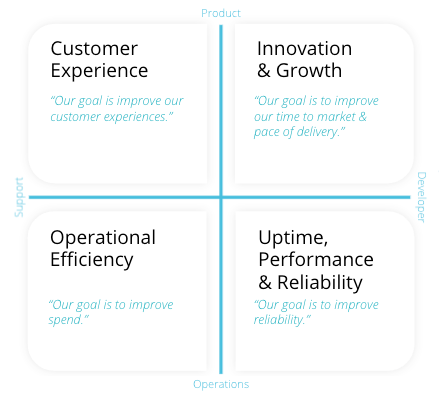

<LandingPageHero>

 <HeroContent>
   New Relic's Observability Maturity practice is about making our customers successful in one or more of the value drivers to the right. The practice aims to identify common customer needs, articulate them, and define a path forward to meet them. Within this section of Docs you will find:
* Use case implementation guides. Each implementation guide defines KPIs to measure and improve as well as how to improve them. The value realization section in each guide outlines the value of the use case to practitioners and to the business.
* Reference guides. These are referenced within the implementation guides. They explain industry concepts in greater detail or cover how to  do something, such as improve a specific KPI. 
* Links to self paced training and hands-on labs.

   The content within these pages comes from industry best practices, our experiences consulting with customers, as well as our own experiences as software engineers, operations engineers, and SREs. It is open source and we would love to include your contributions. We are always looking for new use cases and new visualizations. We'd love you to help us build out [new best practices](/docs/style-guide/writing-docs/article-templates/om-implementation-guide/). 
   </HeroContent>

 
</LandingPageHero>

 
   
<CollapserGroup>
<Collapser
 id="upr"
 title="Uptime, performance & reliability">

### Implementation guides

- [Alert quality management (AQM)](/docs/new-relic-solutions/observability-maturity/uptime-performance-reliability/aqm-implementation-guide/)
- [Service level management (SLM)](/docs/new-relic-solutions/observability-maturity/uptime-performance-reliability/slm-implementation-guide/)

### Reference
- [Incident retrospectives](/docs/new-relic-solutions/new-relic-solutions/measure-devops-success/incident-learning-retrospectives/)
- [Incident orchestration](/docs/new-relic-solutions/new-relic-solutions/measure-devops-success/incident-orchestration-align-teams-tools-processes/)

### Self-paced training and labs
- [Hands-on lab - Alert quality management](https://learn.newrelic.com/hands-on-lab-alert-quality-management)
- [Self-paced training - Service level management](https://learn.newrelic.com/self-paced-service-level-management)
</Collapser>

<Collapser
 id="cx"
 title="Customer experience">
### Implementation guides
- [Quality foundation (QF)](/docs/new-relic-solutions/observability-maturity/customer-experience/quality-foundation-implementation-guide)
- [Bottom of the funnel analysis (BotFA)](/docs/new-relic-solutions/observability-maturity/customer-experience/bofta-implementation-guide)
### Reference
- [Improve web uptime](/docs/new-relic-solutions/observability-maturity/customer-experience/cx-improve-web-uptime)
- [Improve page load performance](/docs/new-relic-solutions/observability-maturity/customer-experience/cx-improve-page-load)
- [Track experience indicators](/docs/new-relic-solutions/new-relic-solutions/measure-devops-success/customer-experience-improvement-track-experience-indicators/)
</Collapser>
<Collapser
id="innov-growth"
title="Innovation & growth">
### Implementation guides
- [Development Quality](/docs/new-relic-solutions/observability-maturity/innovation-growth/development-quality-implementation-guide)
- [Release Quality](/docs/new-relic-solutions/observability-maturity/innovation-growth/release-quality-implementation-guide)
- [Release Cadence](/docs/new-relic-solutions/observability-maturity/innovation-growth/release-cadence-implementation-guide)
### Reference
- [Measure code pipelines](/docs/new-relic-solutions/new-relic-solutions/measure-devops-success/measure-code-pipelines/)
- [Iterate and measure impact](/docs/new-relic-solutions/new-relic-solutions/measure-devops-success/iterate-measure-impact-track-metrics-after-deployments/)
</Collapser>
<Collapser
id="op-eff"
title="Operational efficiency">
### Implementation guides
- [Service characterization (SC)](/docs/new-relic-solutions/observability-maturity/operational-efficiency/sc-implementation-guide/)
### Reference
- [Resolve dependency risk](/docs/new-relic-solutions/new-relic-solutions/measure-devops-success/resolve-dependency-risk-identify-analyze-potential-issues/)
- [Automate instrumentation](docs/new-relic-solutions/new-relic-solutions/measure-devops-success/automate-instrumentation/)
- [Resource sizing](/docs/new-relic-solutions/new-relic-solutions/measure-devops-success/infrastructure-resource-sizing-analyze-operation-metrics/)
</Collapser>
</CollapserGroup>
