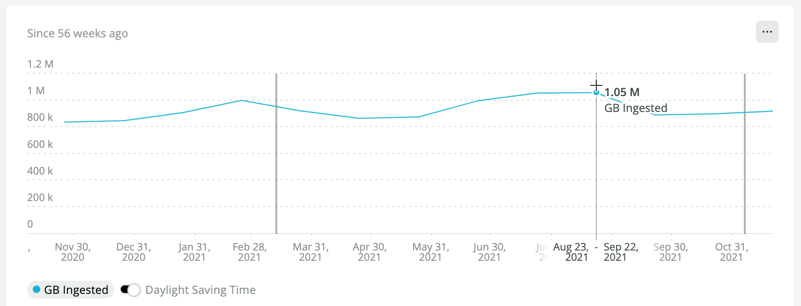
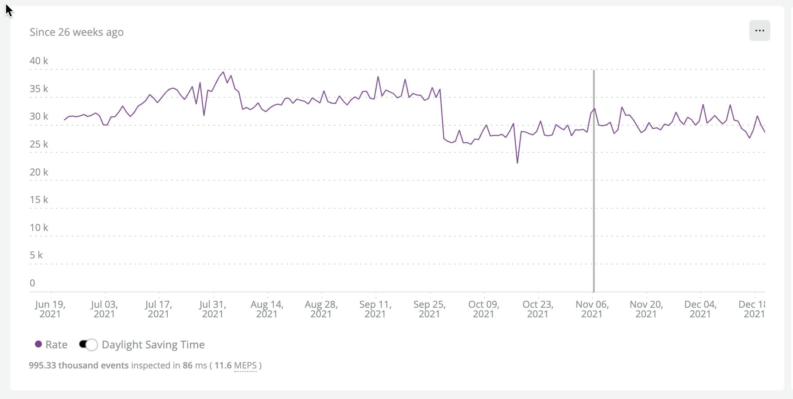
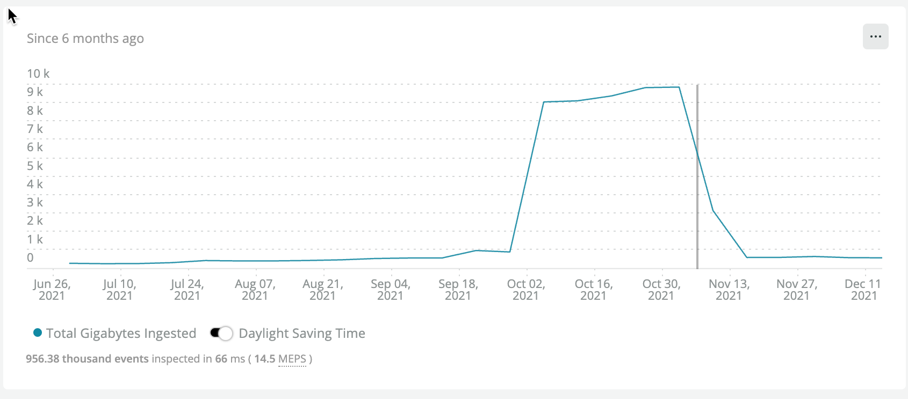
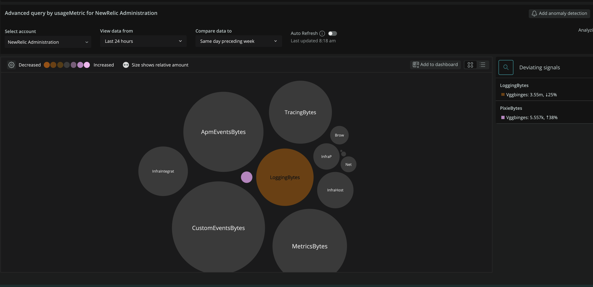

In this stage it is necessary to get a high level view of all of the telemetry currently being generated by your organization.  The unit focuses on breaking down ingest stats into various groups such as account, telemetry type, and application.  These figures will be used to inform the [Optimize your ingest data](/docs/new-relic-solutions/observability-maturity/operational-efficiency/dg-optimizing) and [Forecast your ingest data](/docs/new-relic-solutions/observability-maturity/operational-efficiency/dg-growth) stages.

You'll learn how to generate a structured breakdown report for the following dimensions:

- Organization
- Sub account
- Billable Telemetry Type

In addition you'll learn how to create highly granular breakdowns including:

- Application (APM|Browser|Mobile)
- K8s Cluster
- Infrastructure Integration

## Desired outcomes [#desired-outcome]
Understand exactly which groups within the org are contributing which types of data and how much.
 
## Prerequisites

<CollapserGroup>
<Collapser
    id="understand-nr-consumption-metrics"
    title="Understand consumption event types"
    >

All billable telemetry is tracked in the `NrConsumption` and `NrMTDConsumption` event types. This guide focuses on how to query the `NrConsumption` event type, which provides more granular, real time data than `NrMTDConsumption`. The `NrConsumption` attribute `usageMetric` denotes the telemetry type.

Using `NrConsumption` you can ask questions like "How much browser data has each sub-account ingested in the last 30 days?  How have the ingest changed since the previous 30 days?"
 
```
FROM NrConsumption SELECT sum(GigabytesIngested) WHERE usageMetric = 'BrowserEventsBytes' SINCE 30 days AGO COMPARE WITH 30 days AGO FACET consumingAccountName
```

The response shows you how many GBs of Browser data you've ingested by account.

```
Banking Platform, 75 GB, +2.9%
Marketing Platform, 40 GB, -1.3%
```

Below is a break down of the different `usageMetric` types, the constituent events (event types where the data is stored), and the type of agent or mechanism responsible for creating the data ingest. 

*Billable Telemetry Breakdown*

<table>
  <thead>
    <tr>
      <th style={{ width: "200px" }}>
        NrcConsumption.usageMetric
      </th>
      <th style={{ width: "200px" }}>
        Constituent Events
      </th>
      <th>
        Source
      </th>
    </tr>
  </thead>
  <tbody>
    <tr>
      <td>
        InfraHostBytes
      </td>
      <td>
        `SystemSample`, `StorageSample`, `ContainerSample`, `InfrastructureEvent`
      </td>
      <td> 
        Infrastructure Agent
      </td>
    </tr>
    <tr>
      <td>
        InfraProcessBytes
      </td>
      <td>
        `ProcessSample`
      </td>
      <td>
        Infrastructure Agent
      </td>
    </tr>
    <tr>
      <td>
        InfraIntegrationBytes
      </td>
      <td>
        Various Events
      </td>
      <td>
        [On-Host-Integrations](/docs/infrastructure/host-integrations/get-started/introduction-host-integrations/) and Certain [Cloud Integrations](/docs/infrastructure/infrastructure-integrations/get-started/introduction-infrastructure-integrations/#cloud)
      </td>
    </tr>
    <tr>
      <td>
        ApmEventsBytes
      </td>
      <td>
        `Transaction`, `TransactionError`
      </td>
      <td>
        APM Agent(s)
      </td>
    </tr>
    <tr>
      <td>
        TracingBytes
      </td>
      <td>
        `Span`, `SpanEvent`
      </td>
      <td>
        APM Agent(s) and OTEL
      </td>
    </tr>
    <tr>
      <td>
        BrowserEventsBytes
      </td>
      <td>
        `Browser`, `Browser:EventLog`, `Browser:JSErrors`, `PcvPerf`, `PageViewTiming`
      </td>
      <td>
        Browser Agent
      </td>
    </tr>
    <tr>
      <td>
        MobileEventsBytes
      </td>
      <td>
        `Mobile`, `MobileRequestError`, `MobileSession`, `MobileHandleException`, `MobileCrash`
      </td>
      <td>
        Mobile Agent
      </td>
    </tr>
    <tr>
      <td>
        SeverlessBytes
      </td>
      <td>
        Cloud-specific (i.e., AWS Lambda events)
      </td>
      <td>
        Cloud-specific (i.e., AWS Lambda integration)
      </td>
    </tr>
    <tr>
      <td>
        LoggingBytes
      </td>
      <td>
        `Log` as well as partition-specific events of the pattern `[partition].Log`
      </td>
      <td>
        Various (Fluentd, FluentBit, Syslog, cloud-specific streaming services)
      </td>
    </tr>
    <tr>
      <td>
        MetricEventBytes
      </td>
      <td>
        `Metric`
      </td>
      <td>
        Metrics API or agents such as browser agent, apm agent, or mobile agent. Metrics coming via the metrics API include various dimensional metrics (Prometheus, cloud-specific streamed metrics). Metrics generated by agents are dimensional timeslices.
      </td>
    </tr>
    <tr>
      <td>
        CustomEventBytes
      </td>
      <td>
        Various
      </td>
      <td>
        Various APIs
      </td>
    </tr>
  </tbody>
</table>

</Collapser>
<Collapser
    id="understand-monthly-ingest-targets"
    title="Understand your organization's monthly ingest targets"
    >

Under New Relic's consumption model, telemetry data and users both contribute to your consumption. This guide is focused on maximizing the value of telemetry data. The mention of users in this section is to help you understand different options for balancing users and data.

There are three general types of usage plans. You usage plan may affect how you set ingest targets for your organization.

### *APoF*

If you have an `Annual Pool of Funds` (APoF) agreement you will likely have a monthly target budget for data ingest.   For example you may have set a target of 5TB per day and 100 FSO users.  In this type of plan data and users can be "traded off" but it's best to discuss this with other stakeholders in your organization to ensure you are getting the right mix for your observability goals.  Although some customers will plan for variability in their consumption during the year let's assume for now our montly consumption budget is your APoF / 12.

If you know the number of FSO and Core users you need you can use this formula:

`(monthly_target_spend - (num_fso_users*per_fso_cost) - (num_core_users*per_core_cost))/0.25`

*Divide by $0.25 in order to convert to get our monthly GB ingest target.*


### *Pay As You Go*

In a pay as you go plan you will not have a pre-determined yearly commit however, you will likely have an understood limit to your montly spend.  In this model you would take the following to determine your target ingest:

`(monthly_target_spend - (num_fso_users*per_fso_cost) - (num_core_users*per_core_cost))/0.25`

*Divide by $0.25 in order to convert to get our monthly GB ingest target.*


### Free tier

The perpetual free tier allows for up to 100GB data ingest per month.  If you are currently working in a free tier account you can consider 100GB your monthly ingest target.  In a free tier account any additional data ingested over 100GB per month will be billed at $0.25 per GB.

You can find more information on this topic in [Usage plans](/docs/licenses/license-information/usage-plans/new-relic-one-usage-plan-descriptions/). 

</Collapser>
<Collapser
  id="nrql-operators-for-baselining"
  title="Understand NRQL Operations useful for baselining & change modeling"
>
<CollapserGroup>
  <Collapser
    id="the-rate-operator"
    title="Rate"
    >

<Callout variant='IMPORTANT' title='When to Use'>
Use the `rate` operator when you need to take a sample of data pulled from a certain time period and produce a given rate.  For example take a daily sample of data and compute a 30 day rate based on that.
</Callout>

*Compute rate based on a given sample of data*

See what your daily average ingest has been for the past month.  

```
SELECT rate(sum(GigabytesIngested), 1 day) AS 'Daily Ingest Rate (GB)' FROM NrConsumption WHERE productLine = 'DataPlatform' LIMIT MAX SINCE 30 days AGO
```

Our simple response for the entire organization is

```
Daily Ingest Rate: 30.4 k
```

This query shows that the daily ingest rate was approximately 30 TB per day for the last month.

</Collapser>
  <Collapser
    id="the-month-of-operator"
    title="MonthOf"
    >

<Callout variant='IMPORTANT' title='When to Use'>
When it's important to constrain an ingest calculation to specific calendar months.  For example ingest for an integration may have increased in late January and continued through mid February.  This operator will help facet the ingest to the specific calendar months used for billing.
</Callout>

*Facet by calendar month*

```
SELECT sum(GigabytesIngested) AS 'Daily Ingest Rate (GB)' FROM NrConsumption WHERE productLine = 'DataPlatform' FACET monthOf(timestamp) LIMIT MAX SINCE 56 weeks AGO
```

The resulting table shows fairly high variability.  Note that things were fairly `hot` in `august` and September.  Some of that is our organization seasonality but also was related to some increasing the breadth of our telemetry coverage.

|MONTH OF TIMESTAMP|GB INGESTED|
|---|---|
|December 2021*|636 k|
|November 2021|901 k|
|October 2021|873 k|
|September 2021|1.05 M|
|August 2021|1.08 M|
|July 2021|1.05 M|
|June 2021|887 k|
|May 2021|881 k|
|||



</Collapser>
<Collapser
   id="change-analysis"
   title="Compare With"
   >

<Callout variant='IMPORTANT' title='When to Use'>
When you want to evaluate the amount of change in ingest volume or rate between one time period in another.  This is important to know if you ingest is creeping up unexpetedly.
</Callout>

*Simple Change Analysis*

```
SELECT sum(GigabytesIngested) FROM NrConsumption WHERE productLine = 'DataPlatform' AND usageMetric = 'BrowserEventsBytes' SINCE 6 months AGO UNTIL 1 week AGO TIMESERIES 7 weeks COMPARE WITH 2 months ago
```


</Collapser>

<Collapser
   id="sliding-window"
   title="Sliding window"
   >

<Callout variant='IMPORTANT' title='When to Use'>
When you need to remove the effects of regular variability of ingest to see the broader pattern.
</Callout>

Telemetry is inherently noisy.  Real world phenomena happen in spurts leaving with many random peaks and troughs in the signal.  This is good in a way since it lets us view the full comlexity of a phenomenon.  However when we are seeking to see trends we can be distracted by detail.  NRQL provides a powerful to smoothing out any time series by cominging each data point with slightly older points  This let's us focus on the overall temporal trend rather than one extreme `increase` or `decrease`.


Note the jaggedness of the raw timeseries for 1 day ingest rate:

```
FROM NrConsumption SELECT rate(sum(GigabytesIngested), 1 day) WHERE productLine = 'DataPlatform' SINCE 26 weeks AGO TIMESERIES 1 DAY 
```




Now if we use a [sliding window](/docs/query-your-data/nrql-new-relic-query-language/nrql-query-tutorials/create-smoother-charts-sliding-windows/) of 4 days to reduce the impact of single day events we will see a clearer picture.  Four days is a good choice since it will blur the impact of `weekends` so data for a Sunday will be combined somewhat with data for a Friday etc.


```
FROM NrConsumption SELECT rate(sum(GigabytesIngested), 1 day) WHERE productLine = 'DataPlatform' since 26 weeks ago TIMESERIES 1 DAY SLIDE BY 4 days
```


</Collapser>

<Collapser
   id="derivative"
   title="Derivative"
   >
<Callout variant='IMPORTANT' title='When to Use'>
Use to estimate the statistical rate of change over a given time period.  The rate of change is calculated using a linear least-squares regression to approximate the derivative
</Callout>

NRQL provides us some tools to assess the rate of change.  This is useful since as we see in the previous example we had a very large increase over the past several months in browser metrics.  This rate of change analysis uses the `derivative` operator and it gives us some confidence that the main growth happened back in early September.  It seems as though our growth rate based on the 7 day derivative is somewhat negative so we may have reached a new plateau at the moment in BrowserEventsBytes ingest.

```
SELECT derivative(sum(GigabytesIngested) , 7 day) FROM NrConsumption WHERE productLine = 'DataPlatform'  and usageMetric = 'BrowserEventsBytes'  LIMIT MAX SINCE 3 MONTHS AGO UNTIL THIS MONTH TIMESERIES 1 MONTH slide by 3 days COMPARE WITH 1 WEEK AGO 
```


In this scenario the uptick was so blatant a simple time series of the rate will suffice.  However the benefit of the deriviative is it can be more sensitive at assessing the relative quanty of growth and give us a sense of when it first started.  This can be useful if we in the early stages of a major uptick.

Here is the simple plot of the SUM

```
SELECT sum(GigabytesIngested) FROM NrConsumption WHERE productLine = 'DataPlatform'  and usageMetric = 'BrowserEventsBytes'  TIMESERIES  7 days SINCE 6 MONTHS AGO
```



</Collapser>

  <Collapser
    id="baseline-query-examples"
    title="bytecountestimate()"
    >

<Callout variant='IMPORTANT' title='When to Use'>
Use this operator whenever you need to estimate the ingest data footprint for a subset of raw events or metrics.
</Callout>

<CollapserGroup>
### Examples    
  <Collapser
    id="ingest-by-application"
    title="Ingest by application (APM|Browser|Mobile)"
    >

Run these queies in each sub-account or in a dashboard with account-specific charts.  The queries estimate a 30 day rate based on 1 week of collection.

*Estimate 30 day rate*

_APM_

```
FROM Transaction, TransactionError, TransactionTrace, SqlTrace, ErrorTrace, Span SELECT rate(bytecountestimate()/10e8, 30 day) AS 'GB Ingest' FACET appName SINCE 1 WEEK AGO 
```

_BROWSER_

```
FROM PageAction, PageView, PageViewTiming, AjaxRequest, JavaScriptError SELECT rate(bytecountestimate()/10e8, 30 day) AS 'GB Ingest' FACET appName SINCE 1 WEEK AGO 
```

_MOBILE_

```
FROM Mobile, MobileRequestError, MobileSession SELECT rate(bytecountestimate()/10e8, 30 day) AS 'GB Ingest' FACET appName SINCE 1 WEEK AGO 
```

  </Collapser>
  <Collapser
    id="metric-ingest-by-integration"
    title="Metric ingest by integration"
    >

Some examples of `usage.Integration` values that will show up with this facet are:

- com.newrelic.mssql (the New Relic MSSQL OHI)
- com.newrelic.rabbitmq (the New Relic RabbitMQ OHI)
- EC2 (the AWS EC2 integration)
- Lambda (the Lambda integration)

Run these queries in each sub-account or in a dashboard with account-specific charts

*Estimate 30 day rate*

```
FROM Metric SELECT rate(bytecountestimate()/10e8, 30 day) FACET usage.integrationName SINCE 1 WEEK AGO
```

*Seven day sum*


```
FROM Metric SELECT bytecountestimate()/10e8 FACET usage.integrationName SINCE 1 WEEK AGO 
```

  </Collapser>
  <Collapser
    id="ingest-by-k8s-cluster"
    title="Ingest By K8s Cluster"
    >

*Estimate 30 day rate*

```
FROM K8sClusterSample, K8sContainerSample,K8sDaemonsetSample, K8sDeploymentSample, K8sEndpointSample, K8sHpaSample, K8sNamespaceSample, K8sNodeSample, K8sPodSample, K8sReplicasetSample, K8sServiceSample, K8sVolumeSample SELECT rate(bytecountestimate()/10e8, 30 day) AS 'GB Ingest' FACET clusterName SINCE 1 WEEK AGO 
```

  </Collapser>
  <Collapser
    id="ingest-by-process-sample"
    title="Process Samples"
    >
   ProcessSample can be quite a high volume event.  In this example we'll compute the 30 day ingest per commandline.

    *Estimate 30 day rate by command name*

    ```
    FROM ProcessSample SELECT rate(bytecountestimate()/10e8, 30 day) AS 'GB Ingested' FACET commandName SINCE 1 DAY AGO
    ```

  </Collapser>
 </CollapserGroup>
</Collapser>

</CollapserGroup>
</Collapser>

</CollapserGroup>

## Process

[Install the data governance baseline dashboard](#install-dashboard)  
[Add ingest target indicators to your dashboard](#add-target-indicators)  
[Generate a tabular 30 day ingest report](#generate-report)  
[Customize your report](#customize-report)  
[Detect ingest anomalies](#detect-anamolies)  
[Install the entity breakdown dashboard (Optional)](#install-entity-breakdown-dashboard)  
[Install the cloud integration dashboard (optional)](#install-cloud-integration-dashboard)

### Install the data governance baseline dashboard [#install-dashboard]

1. Navigate to the [data governance quickstart](https://onenr.io/0PoR8zpDYQG).
3. Click `Install this quickstart` in the upper right portion of your browser window.
4. Select your top level master account or POA account in the account drop down.
5. Click `Done` since there is no agent to install.
6. When the quickstart is done installing open the `Data Governance Baseline` dashboard.

That will bring you to the newly installed dashboard.

#### Dashboard Overview 

The main overview tab shows a variety of charts including some powerful time series views.  


The second tab provides baseline report by sub-account and usage metric. 


The remaining tabs provide detailed views of specific telemetry types such as browser data, apm data, logs, and traces.  For example this screenshot shows the browser detail page


Detail tabs include:

- APM - `ApmEventsBytes`
- Tracing - `TracingBytes`
- Browser - `BrowserEventsBytes`
- Mobile - `MobileEventsBytes`
- Infra (Host) - `InfraHostBytes`
- Infra (Process) - `InfraProcessBytes`
- Infra (Integration) - `InfraIntegrationBytes`
- Custom Events - `CustomEventsBytes`
- Serverless - `ServerlessBytes`
- Pixie - `PixieBytes`

<Callout variant="caution">
If you are using a POA account, be aware that it will not be included facets by `consumingAccountName`.  If you install the dashboard into a parent account the consumption value of that parent account is the `sum` of data ingested directly to the parent account and data sent to any sub-accounts.  

For example, when faceting on monthly ingest you may see something like:

- Parent Account Ingest: 100GB
- Sub Account 1 Ingest: 50GB
- Sub Account 2 Ingest: 20GB

Where `Parent Account Ingest` includes data for sub accounts 1 and 2 and an additional 30GB that is sent directly to the parent account.
</Callout>

### Add ingest target indicators to your dashboard [#add-target-indicators]

In the prerequisites section we discussed the concept of a monthly usage target.  You may actually have several targets to help keep you on track:

- An overall organizational target on daily rate or monthly ingest.
- Targets per data type to ensure the optimal breakdown (for example 1 TB per day for logs and 2 TB per day for metrics).
- Targets for specific sub-accounts or business units.  

In our example we have an organization that targets their total organizational ingest to `<` 360 TB per month.  This was a new target after having reduced ingest down from over 20TB per day (600 TB per month). 

To make the target easier to measure against we added a threshold line chart by adding the static number `360000` to our `SELECT` statement.

```
SELECT 360000, rate(sum(GigabytesIngested), 30 day) AS '30 Day Rate' FROM NrConsumption WHERE productLine='DataPlatform' since 30 days ago limit max compare with 1 month ago TIMESERIES 7 days
```


We can also apply a daily rate target line.   Let's just divide 360000 by 30 and we'll use 12000 as our daily rate target.  Update the `Daily Ingest Rate (Compare With 3 Months Prior)` chart:

```
SELECT 12000, rate(sum(GigabytesIngested), 1 day) AS avgGbIngestTimeseries FROM NrConsumption WHERE productLine='DataPlatform' TIMESERIES AUTO since 9 months ago limit max COMPARE WITH 3 months ago
```


### Generate a tabular 30 day ingest report [#generate-report] 

1. Open the previously installed *Data governance baseline* dashboard.
2. Click on the *Baseline report* tab.
3. Click on `...` in the upper right of the "Last 30 Days" table and choose `Export as CSV`
4. Import the CSV into *Google Sheets* or the spreadsheet of your choice.

*Alternatively* if you did not install the dashboard you may simply use this query to create a custom chart in [Query Builder](/docs/query-your-data/explore-query-data/query-builder/introduction-query-builder/):

```
SELECT sum(GigabytesIngested) AS 'gb_ingest_30_day_sum', rate(sum(GigabytesIngested), 1 day) AS 'gb_ingest_daily_rate', derivative(GigabytesIngested, 90 day) as 'gb_ingest_90_day_derivative' FROM NrConsumption WHERE productLine='DataPlatform' since 30 days ago facet consumingAccountName, usageMetric  limit max
```

Below is an example of a sheet we imported into Google Sheets.  


The screenshot shows the table sorted by 30 day ingest total.

Feel free to adjust your timeline and some of the details as needed.  For example, we chose to extract a *90 day derivative* to have some sense of change over the past few months.  You could easily alter the time period of the derivative to suite your objectives.

### Customize your report [#customize-report]

Add useful columns to your report in order to facilitate other phases of data governance such as *optimize* and *forecast*.  The following fields will help guide optimization and planning decisions:

- Notes: Note any growth anomalies and any relevant explanations for them.  Indicate any major expected growth if foreseen.
- Technical Contact: Name of the manager of a given sub-account or someone related to a specific telemetry type.

### Detect ingest anomalies [#detect-anamolies]

#### Alert on ingest anomalies

Use [this ingest alerts guide](/docs/accounts/accounts-billing/new-relic-one-pricing-billing/usage-queries-alerts/) to make sure that an increase in data consumption doesn't catch you by surprise.
At a minimum, create:
* A threshold alert to notify if you exceed monthly targets for data ingest beyond seasonal increases 
* A baseline alert to notify you of a sudden sharp increase ingest data 

In addition to using alerts to identify consumption anomalies, you can use lookout to explore potential ingest anomalies. 

#### Lookout View

Lookout allows you to provide nearly any NRQL query and it will search for anomalies over a given period of time.
This view is based on the query

```
SELECT rate(sum(GigabytesIngested), 1 day) AS avgGbIngest FROM NrConsumption WHERE productLine='DataPlatform' FACET usageMetric 
```



Change the facet field to `consumingAcountName` to get this view:


### Install the entity breakdown dashboard (Optional) [#install-entity-breakdown-dashboard]

In a previous section you installed the ingest `baseline` dashboard that uses NrConsumption as its primary source. In addition to that high level view you can create other visualizations that use `bytescountestimate()` to estimate ingest for nearly any event or metric.  A detailed overview of `bytescountestimate()` was discussed [in the prerequisites section](/docs/new-relic-solutions/observability-maturity/operational-efficiency/dg-baselining#baseline-query-examples).

1. Go to the [same quickstart](https://onenr.io/0PoR8zpDYQG) you used for the baseline dashboard.
2. Click `Install this quickstart` in the upper right section of your browser window.
3. Don't install this instance of the dashboard into a POA account.  Instead, install it into any account that contains APM, Browser, Mobile appliactions or K8s clusters [import dashboard function](/docs/query-your-data/explore-query-data/dashboards/introduction-dashboards/#dashboards-import).  You can install this dashboard into multiple accounts.  You can install it into a top-level parent account and modify the dashboard so you have account-specific charts all in one dashboard.
4. Click `Done` since there is no agent to install.
6. When the quickstart is done installing open the `Data Governance Entity Breakdowns` dashboard.


You can refer back to [this section](/docs/new-relic-solutions/observability-maturity/operational-efficiency/dg-baselining#understand-nr-consumption-metrics) to see exactly which event types are used in these breakdowns.

*NOTE* these queries consume more resources since they are not working from a pre-aggregated data source like NrConsumption.  It may be necessary to adjust the time frames and take advantage of additional `where` clauses and the `limit` clause to make them performant in some of your environments.

### Install the cloud integration dashboard (optional) [#install-cloud-integration-dashboard]

Cloud Integrations can often be a signficant source of data ingest growth.  Without good visualizations it can be very difficult to pinpoint where the growth is coming from.  This is partly because these integrations are so easy to configure and they are not part of an organizations normal CI/CD pipeline. They may also not be part of a formal configuration management system.
Fortunately this powerful set of dashboards can be installed [directly from New Relic I/O](https://onenr.io/0EPwJJO9Ow7).
Individual dashboards installed by this pakage include:

- AWS Integrations
- Azure Integrations
- GCP Integrations
- On-Host Integrations
- Kubernetes


## Conclusion
The [process](#process) section of this page took you through the creation of data ingest visualizations and reports. You can now review data ingest with a data driven visual approach that you and your peers can use to collaborate around.

Going forward, decide which visualizations to use for:
- For [monthly ingest check-ins](docs/new-relic-solutions/observability-maturity/operational-efficiency/dg-coe#monthly-ingest-check-ins) 
- For [yearly ingest planning meetings](docs/new-relic-solutions/observability-maturity/operational-efficiency/dg-coe#yearly-ingest-target-planning) 
- As best practice visualizations for anyone managing data ingest for one or more sub-accounts

## Additional resources [#additional-resources]

[Manage Incoming Data](/docs/data-apis/manage-data/manage-data-coming-new-relic/)  
[Data Management Hub](/docs/data-apis/manage-data/manage-your-data/)  
[Drop Data Using Nerdgraph](/docs/data-apis/manage-data/drop-data-using-nerdgraph/)  
[Alert on Data Ingest Anomalies](/docs/accounts/accounts-billing/new-relic-one-pricing-billing/usage-queries-alerts/)  
[Automating Telemetry Workflows](https://developer.newrelic.com/automate-workflows/)  
[Metrics Aggregation and Events to Metrics](/docs/data-apis/convert-to-metrics/create-metrics-other-data-types/)
