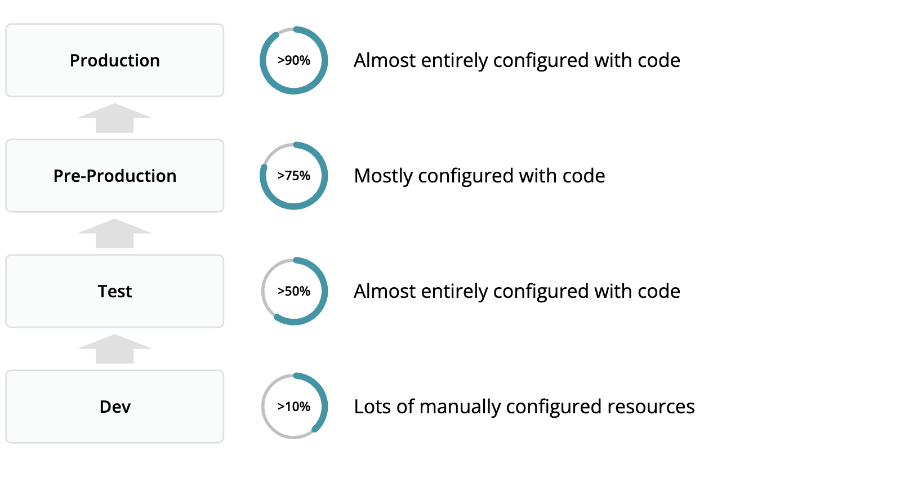

## Overview
Observability as Code is a term used to best describe methods of automating the configuration of New Relic’s Observability Platform to accelerate a move from instrumentation to true observability, using telemetry data to drive consistent and repeatable actions that deliver real value to both the IT organization and the business it supports.

Observability as code leverages automation workflows and provisioning tools to allow organisations to scale observability best practices in rapidly changing and highly complex environments, ensuring that as technology evolves risks to the business are minimised and optimizing service delivery is always at the forefront.

This guide provides guidance on how to approach implementing Observability as Code, offers good practice advice and reference examples to enable you to build and maintain your New Relic platform at speed and at scale.

## Desired outcomes [#desired-outcomes]
Why should you adopt Observability as Code? As your infrastructure, application and service technologies evolve, the scale and complexity increases, increasing the volume of data collected from instrumentation tools (including New Relic) and the challenges associated with making sense of the data, bringing it into context, and driving actions off the back of it.

With constant change and growth maintaining your New Relic platform to keep pace and avoid a drop in observability can become increasingly difficult and time consuming to achieve manually via the New Relic user interface.

Using Observability as Code to automate the configuration of New Relic addresses this challenge helps organisations accelerate adoption, improve stability and drive better governance.

Specifically some of the benefits of adopting Observability as Code practices are…

> TODO: Decide on the order of these benefits

<CollapserGroup>

    <Collapser
        id="oac-benefits-1"
        title="Repeatable, replicable"
    >
        Managing New Relic resources through code means that they can easily be repeated, scaled and updated in bulk. Leveraging a modular approach with provisioning tools like terraform allow packaged sets of resources such as dashboards, alerts and workloads to be quickly and easily shared and deployed, accelerating startup time and improving organization wide standards.    
    </Collapser>

    <Collapser
        id="oac-benefits-2"
        title="Reduced toil"
    >
        The toil of creating and maintaining New Relic resources managed through code is significantly less than manually managing them via the user interface, especially when working at scale. Whilst the interface lends itself well to discovery and testing, changes to code-managed resources can be bulk applied vastly reducing the time administering the resources. One common approach is to develop alerts and dashboards within the user interface and then when considered mature enough they are then migrated to code-managed resources.    
    </Collapser>

    <Collapser
        id="oac-benefits-3"
        title="Documentation and context"
    >
        The huge variety of resources that can be configured in New Relic may make it difficult to understand just by looking at a single resource why it has been created or configured as it has. Configuration via code allows for commenting and documentation to be included that helps explain why certain choices may have been made, when and by whom.    
    </Collapser>

    <Collapser
        id="oac-benefits-4"
        title="Auditable history"
    >
        Whilst it is possible to understand who made changes to New Relic resources via the NRAuditEvent event type this does not provide much background as to *why* the changes were made, what their previous state was or who approved the changes to be made. Managing resources via code in tandem with an automated approval based provisioning workflow allows for much clearer visibility of changes and improved governance whilst also providing methods for rollback and recovery.
    
    </Collapser>

    <Collapser
        id="oac-benefits-5"
        title="Security"
    >
        Observability as code allows for stricter controls over the use of API keys for managing New Relic resources. Security is improved by reducing the number of API keys in circulation and ensuring adequate governance is in place  concerning their creation and dissementation. Dissuading users from using their own keys, especially within automated worfklows,  means the surface area for a key breach or unintended corruption is reduced.  
    </Collapser>

    <Collapser
        id="oac-benefits-6"
        title="Efficient, delta changes"
    >
        Provisioning tools like Terraform make it possible to make delta changes to existing resources. This makes updates quick and efficient as only resources attributes that need changing are changed, with minimal resource destruction and re-creation. This is important as it ensures that the GUIDs of resources such as dashboards and alerts are not changed on update.    
    </Collapser>

    <Collapser
        id="oac-benefits-7"
        title="React to external stimuli"
    >
        Combining Observability as code with automated workflows allows for New Relic resources to be created and amended as a result of external stimuli such as application deployments, infrastructure events or any other data input. For example, you could automatically generate dashboards and alerts that compare key golden signal metrics between code version releases at deployment time.    
    </Collapser>

    <Collapser
        id="oac-benefits-8"
        title="Contextual ownership and packaging"
    >
        Managing resources in code allows for related resources to be managed together. It's easier to comprehend and manage them in one place, in code, than it is when distributed across the user interface. For instance, this allows different teams to manage, view and maintain the resources within their sphere of influence and not have to hunt for  resources they manage.    
    </Collapser>

   <Collapser
        id="oac-benefits-9"
        title="Disaster recovery"
    >
        Occasionally mistakes happen, the wrong resource is updated or deleted. Recovering from these situations with manual resource management is difficult as it's not easy to know what existed before or even if the resource has been changed or lost at all. Observability as code helps protect from these issues by ensuring that any resource can be recreated or reset to the expected configuration. It also creates an opportunity to proactively detect configuration drift.    
    </Collapser>

   <Collapser
        id="oac-benefits-10"
        title="Speed of deployment"
    >
        Observability as code accelerates the speed of deployment by allowing for a common set of resources to be easily shared amongst teams and used to bootstrap observability tooling. This is particularly evident in microservice architectures where similar application deployment architectures benefit from cookie-cutter module-based New Relic resources. Creating reusable centrally managed modules also helps to standardize common approaches to observability tooling.    
    </Collapser>

  
</CollapserGroup>   

## Key performance indicators [#key-performance-indicators]
The maturity of your Observability as Code deployment can be evaluated in a number of ways. Generally the more resources within an environment that are managed via code the more mature the deployment.

### KPI: Ratio of resources managed by code
The proportion of resources managed through code can be used as an indicator of maturity. This KPI can be tracked over time to evaluate the maturity of your Observability as Code deployment.

#### Calculating the KPI
First you should decide which resources and at what granularity to include in your calculation. 

For example, some resources such as alert policies are composed of multiple sub resources (alert conditions). You may want to consider counting just the number of policies or you may choose to go a level deeper and also count the conditions too.

Once you have decided which resources to include in your KPI you need to identify how many of those resources are managed by code and how many are not.

You can then calculate the KPI with the following formula:

  Percentage OaC Resource KPI  = (resources_code_managed/(resources_code_managed + resources_not_code_managed)) * 100

For example:

|Resource type|Code Managed|Not Code managed|KPI|
|---|---|---|---|
|Dashboards|20|13|60%|
|Alert Policies|10|20|33%|
|Workloads|5|3|63%|
|Synthetic Journeys|14|5|74%|
|**Total**|**49**|**41**|**54%**|

### Environment maturity
It's a familiar pattern for entities from different environments to be instrumented and report to different New Relic accounts. For instance, your production stack might report to a production account, and non-production to another. The ratio of resources provisioned with code compared to those manually provisioned should be higher the closer an environment is to production. Some customers choose to restrict manual access to production environments entirely, enforcing auditable, managed code changes to production configurations.

<figcaption>
  This diagram illustrates how the percentage of resources managed with code may increase toward production environments.
</figcaption>

### KPI: Ratio of resources managed via shared resources
One of the benefits of adopting Observability as Code is the ability to publish and share configuration easily amongst teams. Building and sharing modules that package up multiple resources in a consistent and standardised manner allows teams to accelerate their deployment, reduce toil and maintain quality. A mature Observability as Code deployment will have a higher ratio of resources that are managed with centralised shared modules.

#### Calculating the KPI
Calculating this KPI requires you to know how many of the resources that are managed are by code are provisioned as a result of a shared module. You can make resource deployed via shared modules more easy to identify by ensuring they are well tagged.

  Shared resources KPI = number of resources deployed via shared modules / total number of code managed resources

### Automatic provisioning based on triggers
Observabilty as Code offers opportunites to innovate by deploying configuration that is automatically provisioned based on triggers. For example you may automatically provision a dashbaord and alert package when a new version of an application is deployed or when a new product is released. A mature Observability as Code deployment will exhibit some of these innovations.

## Prerequisites [#prerequisites]
TBC

## Establish current state [#establish-current-state]
Before embarking on adopting Obersvabioity as Code practices you hsould evaluate the current state. You can leverage the maturity assesment concepts discussed above to determine how mature your environments and prioritise which environments to tackle first.

> Not sure what to suggest here?!

## Improvement process [#improvement-process]
You have decided to adopt Observability as Code with New Relic but are unsure how to get started or you want to avoid common dead ends and bear traps. Here we provide guides on good practice, advice and reference examples to help you confidently adopt Observability as Code.

### Team based resource management  [#team-based-resources]
Many teams may be involved in managing resources within a single, or across multiple, New Relic accounts. Observability as Code provides a way to more tightly control the access and management of resources. Restricting write access to individuals and enforcing changes to be made via managed code allows teams to safely work within the same space without risking affecting each others resources. 

For example, you may have a shared infrastructure team that manages cloud infrastructure on behalf of multiple application teams who each monitor their applications in different New Relic accounts. This shared infrastrcuture team would manage their own New Relic resources within these accounts alongside the application teams own resources. Restricting user write access and ensuring key resources are only managed via Observability as Code workflows allows the resources from the teams to live together in harmony and reduces the possibily of unauthorized or unintentional change.

<figcaption>
  This diagram illustrates how CI/CD piplines for different teams may have access to manage resources in multiple overlapping accounts.
</figcaption>

### API keys [#api-keys]
Managing resources using the NerdGRaph graphQL API or via provisioning tools such as terraform requires the use of [user API keys](/docs/apis/intro-apis/new-relic-api-keys/). New Relic API keys are generated against a user and inherit the permissions of that user. 

### Service Accounts
Creating API keys against real human users can cause issues to automated pipelines. For example if that user's permissions change as part of a team move or the user leaves the organization an automation pipeline that relies upon it could fail. 

Consider creating "service account" users that are managed by a central management team that are specifically created for  automation purposes. These teams can then generate and manage API keys for dissemination to other implementing teams. Service accounts can be used to generate multiple API keys ensuring that implementing teams only use their own key. Keys managed in this way are more easily audited and help ensure that permissions are set correctly and remain stable. Individuals should be encouraged not to use their own API keys except for development and testing.

### Automated API Key Generation
API Keys can be generated via [NerdGraph](/docs/apis/nerdgraph/examples/use-nerdgraph-manage-license-keys-user-keys) allowing for fully automated on-demand API key provisioning. This could be used to automate generation of keys via a portal or service process flow. 

## Automation tools
We recommend using [Terraform](https://www.terraform.io) (or a derivative such as [Pulumi](https://www.pulumi.com)) to manage the provisioning of your New Relic resources. Tools like Terraform allow you to configure resources in code without having to concern yourself with which API's to call or how to maintain a record of what has been created. 

New Relic actively maintains our own [New Relic Terraform provider](https://registry.terraform.io/providers/newrelic/newrelic/latest/docs). Features and issues can be raised on the open source [Github repository](https://github.com/newrelic/terraform-provider-newrelic/issues).

### State management
When managing New Relic resources with Terraform it's important to keep a stable record of the terraform state. Ideally state should be securely stored in a [remote location](https://www.terraform.io/language/state/remote), be version controlled and leverage [state locking](https://www.terraform.io/language/state/locking) in order to ensure stability. 

### Dealing with large resource sets
Every resource configured in Terraform needs to be refreshed and evaluated to look for changes when new configurations are applied. As the size of configuration grows the list of resources to check against increases. Each check requires an API call and so large configurations may take some time to complete and may encounter API limits if too many requests are made in parallel. One approach is to reduce the number of resources managed within a single state, breaking down the configuration into parts. Also reducing the [parallelism of Terraform requests](https://www.terraform.io/cli/commands/apply#parallelism-n) can alleviate API limiting. 

### Take a modular approach
Modules are the main way to package and reuse resource configurations with Terraform and can be leveraged to package together any number of New Relic resources. Packaging like this allows for parameter driven deployments. For example, you may have a module that takes an application name and builds an overview dashboard, golden signal alerts and synthetic journey all in one operation.
 
Terraform modules can be [published](https://www.terraform.io/language/modules#published-modules) to remote registries allowing teams to share and consume resource packages developed by other teams.  This provides opportunities to implement standardization and roll out versio controlled changes and improvements easily.

## Implementation Reference [#implementation-reference]

### Automation Workflows
Automation workflows are essential for scaling observability as code to teams and organizations. There are many CI/CD tools and services available that can drive [Terraform workflows](https://www.terraform.io/intro/core-workflow). These allow configuration changes to be discussed and approved whilst also providing an auditable trail of changes.

We recommend adopting a [Terraform workflow](https://www.terraform.io/intro/core-workflow) to enable teams to work together on New Relic configuration. One such workflow leverages the CI/CD capabilites of code versioning systems such as Github, Gitlab and Bitbucket to automatically plan and apply code using built in approval and review mechanisms

<figcaption>
  This diagram illustrates how a change is raised as a PR which is then approved and merged to main to trigger resource deployment.
</figcaption>

### Example workflows implementations
The following [reference examples](https://github.com/newrelic-experimental/oma-nr-terraform-workflows) demonstrate how to setup a Terraform worfklow in a number of different systems:

- [Github Actions Example](https://github.com/newrelic-experimental/oma-nr-terraform-workflows/blob/main/github-action-example) - This example demonstrates how to use [Github actions](https://github.com/features/actions) together with AWS S3 backed state storage.
- [Gitlab Pipeline Example](https://github.com/newrelic-experimental/oma-nr-terraform-workflows/blob/main/gitlab-pipeline-example) - This example demonstrates hwo to use a [Gitlab pipeline](https://docs.gitlab.com/ee/user/infrastructure/iac/) together with Gitlab http state storage.
- [Bitbucket Pipeline Example](https://github.com/newrelic-experimental/oma-nr-terraform-workflows/blob/main/bitbucket-pipeline-example) - This example demonstrates using a [Bitbucket pipeline](https://bitbucket.org/product/features/pipelines) together with S3 backed state storage.

> TODO: CircleCI & Terraform cloud examples

### Detecting configuration drift
Understanding configuration drift is important to ensure stability and reliability of your Observability platform. Depending on your strategy for access control and permissions it may be possible that users can change resources in the UI that are also managed by code. Detecting this configuration drift enables you to understand the changes and fix the configuration if necessary.

There are two main modes of operation: 
- **Detect and notify**: In this mode drift is detected and operators are notified. However no remedial changes are made automatically.
- **Detect, remediate and notify**: In this mode drift is detected and where possible also remediated automatically by the workflow.

<figcaption>
  This diagram illustrates how a configuration drift workflow may be implented. Detected changes are reported to New Relic where they can be alerted upon and tracked over time.
</figcaption>

#### Configuration drift reference example
This reference example leverages Gtihub actions to schedule regular terraform plan operations. The number of changes detected is reported to New Relic and the re-apply of the terraform can be optionally initiated.

[Github Action Configuration Drift Example (TBC)](url-to-be-supplied)

> TODO: SUPPLY EXAMPLE ABOVE

## Conclusion [#conclusion]
TBC