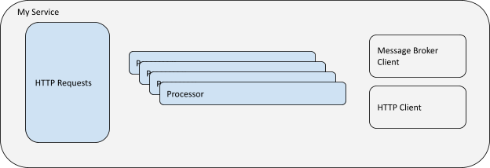
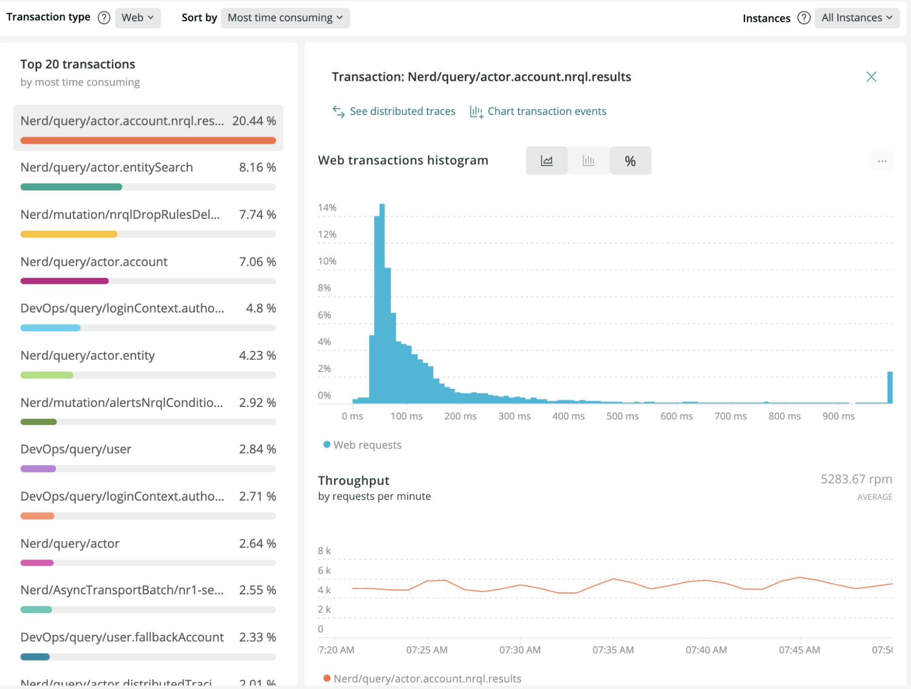
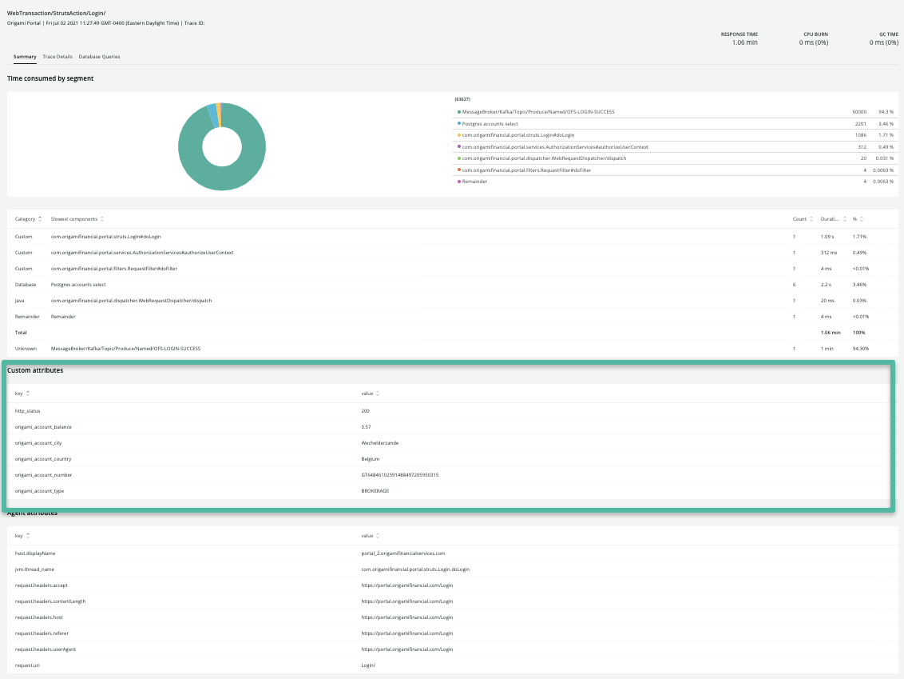
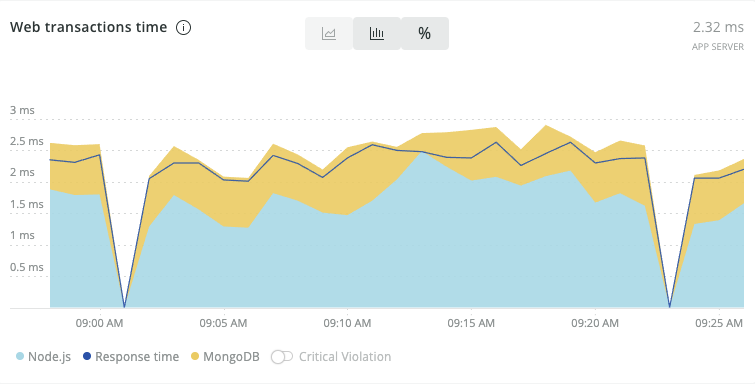
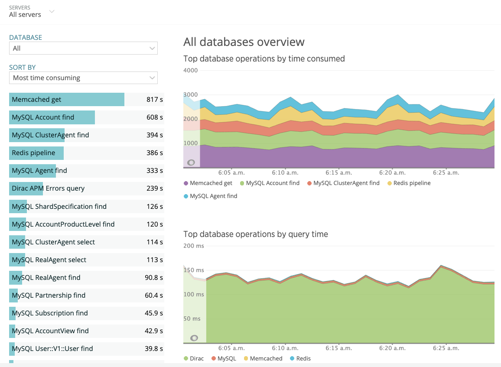

## Overview [#overview]

**"Do I have all the telemetry I need to adequately measure my service?"**

The process of onboarding a service for production monitoring tends to start from the end and work its way to the beginning. Typically, a service is instantiated with agent based monitoring and the team responsible for service delivery needs to read the telemetry coming out of the agent like tea leaves. They work their way backward to understand how the service functions by what can be observed. 

At New Relic, through tens of thousands of observability deployments, we have discovered that the more involved designers, architects, and developers can be in the definition of optimal service delivery measurement, the better. The emergence of the IT aphorism [shift left](https://en.wikipedia.org/wiki/Shift-left_testing) speaks to the need to involve developers more directly in the software lifecycle activities that happen after the development stage is complete. 

In the case of service observability, we find there is little specific guidance on how developers can meaningfully contribute to production telemetry definitions. This guide is intended to provide practical suggestions for developers to evaluate the state of your telemetry and suggest paths to improve it. Observability programs that closely link developer expectations with the runtime behavior of production systems are much more effective to diagnose and remediate aberrant conditions. The closer developer connection also produces services that are more robust and performant.      

You’re a good candidate for service characterization if any of the following are true:

- Your development teams are disconnected from production observability design.
- Your production monitoring program suffers from a lag between the introduction of new services/capabilities and their coverage with telemetry and alerting.
- You need to provide additional business context to your instrumentation for diagnosis and business KPI measurement.     
- You employ a highly customized or proprietary software framework.
- Your service is under active development. Legacy services, and services built from commercial-off-the-shelf platforms tend to be better served with generic instrumentation options.      

## Desired outcome [#desired-outcome]
This guide focuses on the metrics derived from your service’s runtime operation (its code execution) as well as external measurements of execution (through synthetic testing). Service instrumentation planning is the approach used to describe a single service runtime through telemetry.

Modern monitoring systems provide deep insight into the technical details of service implementation. The power of distributed trace or bytecode instrumentation allows operations teams to quickly collect detailed service telemetry. Unfortunately, operations teams are often not in the best position to evaluate the quality of the telemetry gathered from the instrumentation. This challenge is compounded by the fact that service delivery teams are asked to implement telemetry collection for the first time in live production systems. 

Exposing inadequately instrumented services to production users for the purposes of refining that instrumentation creates a period that puts customer satisfaction at risk. This burn-in period often becomes difficult to escape as new features are delivered from code bases without a strong linkage between software delivery and observability programs. 

By having your development staff involved in improving your service instrumentation, you should realize observability benefits in the following ways.

1. Better informed development decisions by:
    - Detecting areas of volatility or unexpected behavior and addressing them.
    - Understanding what dependencies in your code lack redundancy or robustness, and taking measures to refactor the service. 
    - Appreciating how end-user cohorts are employing your software. You can better understand where improvements will have the biggest impact.

2. Improved troubleshooting:
    - More precise and contextually relevant telemetry from your service will allow for more accurate and actionable detection of faults.
    - With better telemetry naming, operations staff can use a common language with developers during incidents, reducing the time to triage and remediate incidents.   

## Key performance indicators [#key-perf-indicators]
It is important to identify some simple KPIs that help to gauge the ongoing improvements in your software delivery and operations programs. The following outlines some suggested KPIs to consider as you invest in improved instrumentation. 
- Business KPIs are aligned to your overall program objectives and should be consistently measured to demonstrate ongoing program improvement for each service. 
- Practitioner KPIs are used to measure changes in the execution of job functions for those participating in the development and management of services. 


### Business KPIs [#kpi-business]
    
<CollapserGroup>
  <Collapser
    id="kpi-service-quality"
    title="Service quality"
  >
    A metric is required to define how well your service is operating. This will depend upon the needs of your organization and the constraints of the services being monitored.

    **Goal:** Improved service quality attainment score over time.

    **Best practices:**
      * Create a graphical representation as a trend of Service Quality achievement for defined periods (Monthly / Quarterly).
      * Service Apdex can provide an effective Service specific quality score. (See [Apdex: Measure user satisfaction](/docs/apm/new-relic-apm/apdex/apdex-measure-user-satisfaction/).)
      * A well defined Service Level Management (SLM) approach using SLIs that describe the level of expected operation for service boundaries can be a useful way to establish a single measurement of quality.
  </Collapser>
  <Collapser
    id="kpi-release-frequency"
    title="Release frequency"
  >
    The number of releases for a given service. This should indicate the velocity of the software delivery organization. Often release frequency isn’t immediately comparable between development organizations. Instead, weighting high-value releases or features to bugs can provide an improved comparative context.

    **Goal:** Consistency of attainment with consistent or improving Service Quality indicator.

    **Best practices:**
      * Can be derived from deployment markers or other events sent to New Relic.
      * Measure directly from code or project management tools such as Jira, BitBucket, GitHub. 
      * Consider implementing a collection mechanism to capture release events and store them directly in New Relic. See [NR1 CICD Innovation](https://github.com/newrelic-experimental/nr1-innovation-cicd/tree/main/Webhooks) for example JIRA and BitBucket configs.

  </Collapser>
</CollapserGroup>

### Practitioner KPIs [#kpi-practitioner]

<CollapserGroup>
  <Collapser
    id="kpi-feature-release-frequency"
    title="Feature release frequency"
  >
    Quantification of the percentage of releases that are directly related to new feature development versus bug fixes or technical debt retirement. The relationship to feature to fix will vary between teams and projects based on the history of the service.

    **Goal:** A consistent or improving feature release frequency consistent with the service delivery goals.

    **Best practices:**
      * Practitioner feature release frequency is often acquired in the same manner as the broader release frequency business KPI. This metric is then made available to the development team for the service.
  </Collapser>
  <Collapser
    id="kpi-mean-time-to-close"
    title="Mean time to close"
  >
    Average duration of alert-driven incidents in New Relic. See [Alert Quality Management Use Case Implementation Guide](/docs/new-relic-solutions/observability-maturity/aqm-implementation-guide/) for more details.

    **Goal:** Steady decrease of incident close time for identified services.

    **Best practices:**
      * Follow the Alert Quality Management Use Case Implementation Guide, understanding Service behavior through the lens of the alerts defined to help improve service delivery.
  </Collapser>
</CollapserGroup>
    
## Prerequisites [#prerequisites]
Before you begin to introduce Service Instrumentation into your development processes, get acquainted with New Relic fundamentals available from [New Relic University](https://learn.newrelic.com/). 

In addition to NRU training, review and keep the following documentation resources handy:

- [APM agent install and configuration](https://docs.newrelic.com/docs/agents/)
- Instrumentation guides:
    - [C-SDK](/docs/apm/agents/c-sdk/instrumentation/instrument-your-app-c-sdk)
    - [Go](/docs/agents/go-agent/instrumentation)
    - [Java](/docs/apm/agents/java-agent/custom-instrumentation/java-custom-instrumentation)
    - [.NET](/docs/apm/agents/net-agent/custom-instrumentation/introduction-net-custom-instrumentation)
    - [Node.js](/docs/apm/agents/nodejs-agent/extend-your-instrumentation/nodejs-custom-instrumentation)
    - [PHP](/docs/apm/agents/php-agent/php-agent-api/)
    - [Python](/docs/apm/agents/python-agent/custom-instrumentation)
    - [Ruby](/docs/apm/agents/ruby-agent/api-guides)
    - [OpenTelemetry SDKs](https://opensource.newrelic.com/projects/open-telemetry)
- [Introduction to New Relic synthetic monitoring](/docs/synthetics/) 

## Establish current state [#current-state]
[Determine your instrumentation needs](#instrumentation-needs)   
[Understand endpoint testing](#endpoint-testing)

### Determine your instrumentation needs [#instrumentation-needs]
Instrumentation is the process to acquire telemetry from a software system and its associated services for the purpose of describing that software system's runtime behavior and business function. Monitoring systems tend to provide generic capabilities for telemetry acquisition that can be fine tuned to close gaps when monitoring the function of a software system. This use case assumes that your Observability Program has completed the Quality Foundation OMA use case implementation guide and that you have a well considered and deployed telemetry collection architecture for your services.  

With the possible exception of alert definition, instrumentation offers the most open-ended and customizable activities related to observability. The New Relic One platform provides features to highly customize your use of instrumentation. Because of this, you should carefully consider the amount of time and effort you’re going to put into instrumenting your services. 

Like all service instrumentation assets and dependencies, the introduction of instrumentation will require ongoing oversight and maintenance and therefore is a form of technical debt you will accrue for your project. As you begin the process of instrumentation, you want to continually ask yourself the question:

**Is the visibility I will gain from this instrumentation worth the cost of implementation and support?**    

#### Decision matrix [#instrumentation-needs-decision-matrix]
As a first step you should evaluate the default instrumentation you obtain from your Observability platform and ask yourself the question:

**Does the telemetry adequately describe the function and the purpose of my service?**

Think about what your service does. Perhaps it receives an order, needs to validate the order for integrity, conveys that order to a clearinghouse service, and receives a confirmation code that is relayed back to the requestor. This example gives a clear path to break down the function of service and evaluate if we have enough telemetry and context to make informed appraisals of how the service is functioning.  


<figcaption>
Conceptual service that receives and processes http requests.
</figcaption>

If this conceptual diagram represents the implementation of the service, you need to know at any moment in time:
- How many requests do I receive?
- How many messages and HTTP requests do I send?
- How many requests are successful?
- What is the response time for a full request?
- What is the response time for invocation to a dependency?
- How much resource should this process take under what number of requests?
- What are all my points of failure?    

Most monitoring frameworks for application runtimes will gather telemetry like this as basic functionality. However, sometimes specific implementation of your service will pose a challenge to the generic instrumentation assumptions made by the monitoring software. In this case your Observability platform will need to accommodate your needs and provide an ability to modify a default monitoring configuration.

The following table documents some additional situations where you would consider adding additional telemetry or metadata capture through instrumentation. The practices section that follows describes how to close those gaps to ensure your observability platform provides telemetry needed to manage your service.     

Considerations for instrumentation:

| | |
|-|-|
|Are my base telemetry requirements satisfied?|If not, document the gaps and evaluate if they can be closed through custom configuration or additional instrumentation techniques.| 
|Can I isolate discrete user stories within the telemetry?|If not, use trace capabilities of agents to capture the invocation of a discrete user story with adequate context metadata.| 
|Do I have insight into the parameters that are invoking user stories?|If not, use custom attributes through agent SDKs to add context to the transactions and spans.|
|Can I measure the major functional components of the software?|If not, use instrumentation SDKs to create baseline metrics on a specific functional element of the code. (cache lookups, processing routines, or utility functions).|
|Can I measure the client interactions from my code to external systems?|If not, ensure requests and responses are encapsulated by component level tracking. If the client invocation is asynchronous, consider implementing distributed trace features to view the successive processing.|

### Understand endpoint testing [#endpoint-testing] 

Endpoint testing is a simple and practical approach that greatly expedites how to determine the root cause of a given system failure. It allows operations and supporting teams to quickly know there is a real problem, and isolate that problem to a specific service.     

Modern software systems depend on a number of services to complete their tasks. Historically, the process of monitoring those service endpoints was straightforward. The architecture team would produce a well documented map of dependencies for the operations team. The operations team would dutifully create a check of the itemized endpoints. 

Today, with continuous delivery processes and small batch changes, new endpoints and dependencies can be created and deployed at a rate that makes it difficult for an operations team to anticipate and proactively define synthetic checks. By giving the service developers greater scope of control to define production services tests during the development phase, you will greatly increase the coverage of endpoint tests for your Observability program.   

#### Decision matrix [#endpoint-testing-decision-matrix]

To determine whether to create a synthetic check is straightforward. You will want to know the first occurrence of a failure for a dependency. If you answer “yes” to any of the following questions, consider creating a dedicated synthetic check. 

- Is the end point customer facing?
- Does the endpoint invoke new dependencies?
- Is the endpoint on a different network infrastructure?
- Is the endpoint shared between multiple services?
- Is the endpoint a content origin supported by a CDN?

## Improvement process [#improvement-process]
[Config based instrumentation](#config-based-instrumentation)   
[Isolate service functions](#isolate-service-functions)   
[Define custom transaction names](#custom-transaction-names)   
[Measure service components](#component-measurement)   
[Ensure your frameworks are measured](#framework-measurement)   
[Track every external call](#external-services)   
[Test your endpoints](#endpoint-testing2)   

### Config based instrumentation [#config-based-instrumentation]

Each New Relic agent provides a variety of configuration options. Typically you will define a standard approach to include the agents within infrastructure hosts, application runtimes, and connections to your cloud service providers. Default agent configurations are generic and widely applicable. 

One of the best ways for developers to influence the applicability of deployment is by overriding the default configuration options for your service instance. The following are default instrumentation options to consider.     

#### Create an effective service name [#service-naming]

<Callout variant="tip">
New Relic agents provide a variety of mechanisms to define the Service runtime name. Please see the [application naming guide](/docs/agents/manage-apm-agents/app-naming/) to find the implementation details for your runtime environment.
</Callout>

The name you give a service provides the **namespace** (where you will find the agent data). One of the most important strategies New Relic uses to understand the behavior of your services is to aggregate like things together and to use the commonalities derived from aggregation to isolate variance.  

Modern services are often deployed to multiple contexts to ensure capacity handling or specific functional segmentation. In order to take advantage of the benefits of aggregation, it is very important that your service runtimes are grouping instances with identical operational characteristics. Therefore, when deploying services, pay close attention to the following three criteria to help you name your deployed services: 

- Does my service target a specific audience? 
- Is my service running a different codebase?
- Is my codebase using a different runtime configuration? 

If you answer “yes” to any of these questions, consider creating a unique name for your service.

**Audience criteria**

Think of the audience as the group of end users or service functions. If your service is split between North American and European deployments, the runtimes in those deployments should be grouped accordingly. For example:

```
newrelic.appname = PORTAL_AMER
```

and

```
newrelic.appname = PORTAL_EMEA
```

This will group the telemetry created by that audience together, allowing you to better understand the contextual similarities of service problems related to a specific user audience.

Sometimes the way we deploy applications divides the operational context of a service, such as a portal application with administrative functions. Maybe the admin functions are baked into the general portal codebase, but only one instance in a cluster is handling the portal admin requests. In that case you have a functional audience segmentation opportunity, so you should ensure that it is named appropriately. For example:

```
newrelic.appname = PORTAL_MAIN
```

and

```
newrelic.appname = PORTAL_ADMIN
```
    
**Codebase criteria**

If you’re running different code versions under the guise of one service, consider segmenting those runtime instances and incorporating version naming as part of your naming scheme. When you group code together as one service name that is executing different service versions, you’re increasing the noise to signal ratio of any metrics you produce.

Different code versions might use different amounts of compute resource or process data differently. It becomes very difficult to determine if a service is behaving normally when the signals you get from the metrics are due to different functional implementations.

Consider adding a numeric identifier to the service name if you have multiple versions running concurrently. For example:

```
newrelic.appname = PORTAL_MAIN_V112
```

and

```
newrelic.appname = PORTAL_MAIN_V115
```

If you employ feature flag framework frameworks like LaunchDarkly or Split, you may have multiple versions of an application or service within a single codebase. Please consult the Isolating Service Functions section to address those conditions.

**Runtime criteria**

If an instance of a service is deployed to a system with different runtime constraints, it should be encapsulated in its own telemetry namespace. This can be a deployment to a different datacenter that offers network connectivity advantages to a shared resource, or perhaps the service is running on a separate compute tier with a different memory or thread configuration.

These characteristics that affect the code runtime operation can cause different behaviors that lead to different operations behaviors. For example:

```
newrelic.appname = PORTAL_NYC_DC
```

and

```
newrelic.appname = PORTAL_REALLY_BIG_FOOTPRINT
```

#### Override default agent configuration [#override-default-agent-config]

<Callout variant="tip">
The New Relic agents provide a variety of options for runtime configuration. Please refer to the [agent configuration guide](/docs/agents/) for the options specific to your runtime.
</Callout>

Each New Relic APM agent provides a variety of options to modify the default configuration. The most comprehensive and consistent location is the configuration file that accompanies each agent install. However, New Relic agents can also be configured by passing command line parameters directly to the service instance runtime, by using environment variables, or by calling functions within the agent's SDK at runtime. 

.NET agent configuration options:
- [Using the New Relic .NET SDK API](https://docs.newrelic.com/docs/agents/net-agent/net-agent-api/)
- [Environment variables](https://docs.newrelic.com/docs/agents/net-agent/configuration/net-agent-configuration/#environment-variables)
- [Config file options](https://docs.newrelic.com/docs/agents/net-agent/configuration/net-agent-configuration/#setup)

### Isolate service functions [#isolate-service-functions]

As the [Create an effective service name](#service-naming) section indicated, one of the primary objectives of instrumentation is to configure the New Relic agent to group like runtime constraints together as a single named unit. We suggest this because software systems should behave in deterministic ways.

For a specific set of inputs, you should get an expected range of measurable outcomes. The degree to which we can comfortably contain these constraints into named service runtime components greatly helps us understand normal behavior and isolate aberrant behavior.    

Once you have settled on an effective service naming strategy, the next step is to look within the telemetry collected for the service and determine if it suitably isolates the service’s functionality. The implementation pattern we most often encounter is a series of functions being invoked by a web request. The initial receipt and handling of a web request to a service runtime results in the allocation of processing resources. New Relic defines this resource allocation and code execution as a transaction. 

The New Relic agent is configured with a set of assumptions that create namespaces for transactions as they are detected. Those assumptions differ between the agent language runtime. For example, a good example of how the New Relic Java agent determines the transaction name can be found in the [Java agent's transaction naming documentation](https://docs.newrelic.com/docs/agents/java-agent/instrumentation/transaction-naming-protocol/).    

However, even after the agent transaction naming protocol has been applied, it may leave you with an unsatisfactory result. By adding additional instrumentation to name the transaction to improve its context, this can greatly improve your understanding of the service’s execution behavior.

The goal for transaction naming should be an APM transactions view that provides good segmentation of the services functions in an approach that is easy to understand for a non-developer.


<figcaption>New Relic service transaction breakdown view.</figcaption>

The transaction breakdown image is a good example of transaction segmentation. It provides detailed tracking of the amount of work being done by each transaction within the broader codebase of the service. It also displays the transaction with a plain user-friendly name that offers some hint of its business context (what the transaction does). As you learn more about naming transactions and including attributes, be sure to make your naming approach accessible for non-technical observers of the data. 


<figcaption>Transaction breakdown: the transactions in this service seem to be highly weighted to one transaction name with a pretty generic name. Breakdowns like this beg the question: "Is this a good representation of the work my service does?"</figcaption>

The obtuse transaction breakdown image demonstrates a bad example of transaction name segmentation. In this case we have about 60% of the transaction volume being named `OperationHandler/handle`. Both the percentage attribution of the transaction volume and the generic nature of the name indicate there might be an overly zealous aggregation of transactions underneath that transaction namespace.   

A good way to validate your transaction naming approach is to review the distribution of response times for your transaction over a significant period of time in the service web transaction histogram dashboard. 


<figcaption>The service transaction histogram view shows the count of transactions that fall into each response time bucket. A good naming strategy tends to display a normal distribution.</figcaption>

The service transaction image shows a wide range of transaction response rates. Although the bulk of the transactions land in the 0-200 millisecond range, it indicates values ranging from 200-1000 milliseconds. When you have a highly distributed range of responses for a transaction, you should ask yourself:

**What information do I have during the transaction execution that can help me name this transaction?** 

In many cases, non-normal distributions are a direct result of the parameters being passed to a request, or the work the transaction is being asked to do. It is pretty easy to consider that a service query transaction might take a data range as a parameter. The date range when small might provide a faster lookup time. Therefore, perhaps providing a meaning scheme that is derived from some expected parameter constraints (> 1day, 1-5 days, >5 days) might provide a more meaningful segmentation.

Your objective is to create a transaction name that facilitates grouping transactions with the fewest unique characteristics. 


<figcaption>A more normal distribution of transaction segmentation where individual transactions report more consistent response time attainment with fewer exceptions.</figcaption>

The normal distribution image demonstrates more purposefully named transactions within a service. In this case the web transaction response times are more closely grouped, indicating consistent execution characteristics.

By ensuring your transaction naming strategy provides a consistent mechanism to group your service’s functions by the types of operations they are performing, you will be able to quickly isolate aberrant behavior, or better understand the root cause of the variations. This will allow you to refactor your application and increase the overall predictability of your service’s functions. 

### Define custom transaction names [#custom-transaction-names]

<Callout variant="tip">
Consult the [New Relic agent API guide](https://docs.newrelic.com/docs/agents/) for your language agent to review the transaction naming procedure for your runtime.
</Callout>

The New Relic agent transaction naming service requires the invocation of a `SetName(String name)` like API call to the New Relic agent SDK. Each language runtime agent has its own syntax and option for setting the name. 

For example, to take the value of an http request parameter and use it to name a transaction in the New Relic Java agent, you can use code similar to this:

```
com.newrelic.agent.Agent.LOG.finer("[my query handler] Renaming transaction based on an important query parameter");

com.newrelic.api.agent.NewRelic.setTransactionName("Query Handler_" + (javax.servlet.http.HttpServletRequest)_servletrequest_0).getParameter("important_query_parm"));
```

Please note: There is a maximum capacity to transaction names within New Relic. Your transaction naming strategy will have to trade off a degree of specificity if there are thousands of potential transaction names.

When too many transaction names are being reported, New Relic will attempt to create rules to group those transaction names. More details can be found in the [agent troubleshooting guide](https://docs.newrelic.com/docs/using-new-relic/cross-product-functions/troubleshooting/metric-grouping-issues/) related to metric grouping issues. 

Should you suspect a metric grouping issue, open a support case with New Relic, and we will be happy to work with you to isolate the cause of the transaction naming issue. 

### Capture parameters with your transactions [#capture-parameters]

<Callout variant="tip">
Consult the [New Relic agent custom attributes guide](https://docs.newrelic.com/docs/using-new-relic/data/customize-data/collect-custom-attributes/) for your agent language to review the metadata enhancement options for attribute customization.
</Callout>

The transaction name is a powerful way for you to segment your Service’s functionality so that you can better understand its behavior. This allows you to discretely isolate functionality directly in the New Relic UI. 

However, there are many occasions when you will want to get some additional context on the function of your Service without resorting to isolating the transaction name. This can be accomplished by introducing attribute capture by your Service.

You can add `name:value` pair attributes to decorate the details of each transaction. The attributes will be available in each transaction event through the APM transaction trace and errors UI, or through direct query of parameters from the NRDB transaction event type.  


<figcaption>After you select a transaction trace, you can view the custom attributes you have set for your Service’s transaction.</figcaption>

Here is an example of the transaction trace details you can see in the APM errors UI.


<figcaption>Custom attributes displayed in the APM errors UI.</figcaption>

If you have developed a useful transaction name segmentation, you can use the additional context of the attributes to better understand the inputs, cohorts, or segments that led to an unexpected result.

In addition to being able to understand the context of your transaction within the APM UI, the introduction of parameters is an extremely useful tool to aggregate and analyze transactions by querying transaction data directly. Custom attributes are added to each transaction, making it easy to isolate and facet on specific conditions. 


<figcaption>NRQL query expression that uses a custom attribute to facet database call duration.</figcaption>

The parameter capture approach can also be used with feature flag systems like Split or LaunchDarkly. In this case, as you are implementing the decision handler for the feature flag, consider capturing the flag context (for example, `optimized_version = on`) that is being applied to the block of code controlling the version or feature the customer sees.   


<figcaption>NRQL query that demonstrates the result when the state of a feature flag is captured by a transaction custom attribute. The feature flag state attribute allows us to understand the impact of the code execution path on performance, throughput, and dependency utilization.</figcaption>

For example, to take the value of an http request parameter and save it as a custom attribute in the New Relic Java agent, you can use code similar to this:

```
com.newrelic.agent.Agent.LOG.finer("[my query handler] Adding an Attribute to transaction based on an important query parameter");

com.newrelic.api.agent.NewRelic.addCustomParameter("ImportantParm", (javax.servlet.http.HttpServletRequest)_servletrequest_0).getParameter("important_query_parm"));
```

### Measure service components [#component-measurement]

The behavior of a specific transaction within the context of a service is a powerful way to segregate functionality and ensure a software system is operating effectively. However, another way to look at the behavior of a software system is to review the detailed component execution model of its implementation. The application framework code components are shared throughout the service, and the ongoing evaluation of component performance can provide an insight into the overall service health. 

Within New Relic One there are two places we can observe component execution details. The service summary dashboard in APM provides a view of the composite execution of the service broken down by its component parts (for example, garbage collection execution or database calls). 


<figcaption>This summary dashboard provides a breakdown of major component types within the application. Memcached, External Web Invocations, MySQL and Dirac are all examples of shared code frameworks that the collective transactions of the Service are using to execute their business logic.</figcaption>

A similar breakdown is provided on a transaction by transaction basis. 


<figcaption>This single transaction summary view breaks out the contributing execution time by component. This helps you see the aggregate performance of components within a transaction.</figcaption>

Transaction component segments will tend to demonstrate consistent performance behavior, you can use this consistency to detect a change in its fundamental behavior. This can be a good indication of an underlying issue. Resource constraints tend to manifest more obviously within component frameworks than within individual transaction details. This allows you to infer characteristics of dependencies through the common constraints being experienced by all code running within a service.  

### Ensure your frameworks are measured [#framework-measurement]

<Callout variant="tip">
Consult the [New Relic agent instrumentation and SDK guides](https://docs.newrelic.com/docs/agents/) under the language agent for your service runtime to find information about adding metric names to your instrumentation.
</Callout>

The syntax for framework instrumentation is specific to the language your service is written in, but the general approach is consistent for all. Consider the threads of execution within your Services as an analogy for transactions within New Relic telemetry. Each method or function execution on the stack is an opportunity to add additional instrumentation. In this way New Relic maintains a time-annotated invocation stack for the transaction and uses those method/function start/stop timings to aggregate it into a series of component metrics. 


<figcaption>A simple Node.js application making a call to a MongoDB. The two major components of the application are the receipt of the request and get/put operations to the MongoDB.</figcaption>

If a particular segment of logic is crucial to the function of your Service or transaction, consider wrapping that call with callbacks to the New Relic agent so that the agent can understand that it has entered a discrete code component and can aggregate the time consumed within that component accordingly. By passing a metric name to the callback, you will create a component segment metric for your service and transaction.

The metric naming option is specific to the instrumentation language, so be sure to consult the specific language documentation. 

The New Relic agents allow you to specify a custom metric name for the instrumentation. The `metricName` will be used to determine the aggregated metric for the component. The following example demonstrates the `metricName` parameter being passed to a Java agent SDK `@Trace` annotation.

```
@Weave
public abstract class MQOutboundMessageContext implements OutboundTransportMessageContext {

    @Trace(dispatcher = true, metricName="MQTransport")
    public void send(final TransportSendListener listener) throws TransportException {
        try {
            NewRelic.getAgent().getTracedMethod().setMetricName("Message", "MQ", "Produce");
            MQHelper.processSendMessage(this, NewRelic.getAgent().getTracedMethod());
        } catch (Exception e) {
            NewRelic.getAgent().getLogger().log(Level.FINE, e, "Unable to set metadata on outgoing MQ message");
        }

        Weaver.callOriginal();
    }

}
```

### Track every external service call [#external-services]

<Callout variant="tip">
Consult the [New Relic agent instrumentation and SDK guides](https://docs.newrelic.com/docs/agents/) under the language agent for your service runtime to find the details of client library instrumentation.
</Callout>

Client instrumentation refers to encapsulating a call from your service to an external resource. Generally, New Relic agents are aware of clients popular for HTTP, gRPC, messaging, and database protocols and will apply the appropriate instrumentation pattern to aggregate calls to those clients as external services.


<figcaption>External service dashboard details within New Relic APM.</figcaption>

If you have written your own client handler for a protocol, or are using something very new or somewhat niche, the New Relic agent may not recognize the client and record the behavior of the client call. To this end you should verify the external services and databases within APM to represent all expected externalities for your service.


<figcaption>Database protocol dashboard details within New Relic APM.</figcaption>

It is important to validate that all your services' dependencies are represented here. If you do not see your service dependencies, you will need to introduce new instrumentation to intercept the external call so that your APM agent can track it accordingly. The following example demonstrates wrapping an external call in Golang for capture by the agent. 

```
package main

import (
	"net/http"

	"github.com/newrelic/go-agent/v3/newrelic"
)

func currentTransaction() *newrelic.Transaction {
	return nil
}

func main() {
	txn := currentTransaction()
	client := &http.Client{}
	request, _ := http.NewRequest("GET", "http://www.example.com", nil)
	segment := newrelic.StartExternalSegment(txn, request)
	response, _ := client.Do(request)
	segment.Response = response
	segment.End()
}
```

Examples of other agent API external call tracing:

- [Go `ExternalSegment`](https://pkg.go.dev/github.com/newrelic/go-agent/v3/newrelic#ExternalSegment)
- [Java `ExternalParameters`](https://newrelic.github.io/java-agent-api/javadoc/com/newrelic/api/agent/TracedMethod.html#reportAsExternal(com.newrelic.api.agent.ExternalParameters))
- [Python `external_trace`](https://docs.newrelic.com/docs/agents/python-agent/python-agent-api/externaltrace-python-agent-api/)

### Test your endpoints [#endpoint-testing2]
Endpoint testing provides two benefits to your Service Instrumentation program. 

1. **Defect detection:** By encoding a test for an endpoint that produces a simple true/false result, it allows the operations team to isolate discrete failures to determine if the integrity of service delivery has been compromised. 

2. **Baselining:** Synthetic or machine tests provide a predictable set of conditions that allow you to evaluate the consistency of your service delivery from a control perspective. 

New Relic’s synthetic monitoring offers the ability to create a variety of testing types by employing an enhanced Selenium JavaScript SDK. Once a Selenium-based test script has been defined, New Relic will manage the location of the script execution as well as its frequency. 


<figcaption>New Relic synthetics launch dashboard.</figcaption>

The synthetic test offers a variety of test options, each with its own focus. For more information see our [synthetic monitoring documentation](https://docs.newrelic.com/docs/synthetics/).

From the perspective of a Service developer, the monitor type that is most frequently employed is **Endpoint availability**. This monitor type provides the ability to script http request conditions. These can be as simple as a POST or GET to an accessible API, or involve multiple steps where the Selenium monitoring script successively evaluates requests to ascertain functional integrity of a multi-step process.

In practice, developers should consider implementing the simplest possible test to evaluate endpoint availability and integrity. For example, you have just created a new Service endpoint that provides the current exchange rate for a group of currencies. This is a simple GET at an endpoint that returns a JSON object array. 

- Request example:  `http://example-ip:3000/exchange`
- Response example: 
```
[
  {
    "status": [
      "quote"
    ],
    "_id": "5b9bf97f61c22f4fb5beb5c9",
    "name": "cdn",
    "Created_date": "2021-07-12T18:10:07.488Z",
    "__v": 1
  },
  {
    "status": [
      "quote"
    ],
    "_id": "5b9bfb2a61c22f4fb5beb5ca",
    "name": "usd",
    "Created_date": "2021-07-12T18:17:14.224Z",
    "__v": 0.80
  },
  {
    "status": [
      "quote"
    ],
    "_id": "5b9bfb3261c22f4fb5beb5cb",
    "name": "eur",
    "Created_date": "2021-07-12T18:17:22.476Z",
    "__v": 0.68
  },
  {
    "status": [
      "quote"
    ],
    "_id": "5b9bfb3761c22f4fb5beb5cc",
    "name": "mex",
    "Created_date": "2021-07-12T18:17:27.009Z",
    "__v": 15.97
  }
]
```

In order for this service to be considered operational, it needs to respond to requests but also provide the four currency responses. We’re not worried about the content at the moment, just the fact we get four elements back in the array one, for each CDN, USD, EUR and MEX currencies. 

Using New Relic synthetic monitoring, an API test script could look like the following:

```
/**
* This script checks to see if we get the currency data from the endpoint.
*/
var assert = require('assert');
var myQueryKey = 'secret_key';
var options = {
  uri: 'http://example_ip:3000/exchange',
  headers: {
    'X-Query-Key': myQueryKey,
    'Accept': 'application/json'
  }
};

function callback (err, response, body){
  var data = JSON.parse(body);
  var info = body;
  if (Array.isArray(data)) {
    if (data.length !== 4) {
      assert.fail('Unexpected results in API Call, result was ' + JSON.stringify(data));
    }
  }
}

$http.get(options, callback);
```

The synthetics script can be directly configured in the New Relic interface, but we highly recommend you maintain your endpoint tests within your source repository system and employ automation. This will help ensure your endpoint testing accompanies the new endpoint dependencies that your Services introduce to production service delivery.

## Value realization [#value-realization]

The impact of Service Instrumentation will be directly related to the level of attention you’re willing to invest in overseeing the process. Like the process of monitoring services, your Observability program will benefit through a dedicated team function that thinks critically about its expectations of return for its investment in effort. Here is some guidance to think about the cost of investment for your organization and expectation of benefit.

The following section outlines an approach for estimating the investments and returns you should expect by incorporating Service Instrumentation into your Observability practice.   

### Investments [#investments]

<CollapserGroup>
  <Collapser
    id="inv-training"
    title="Training"
  >
    Ensure all developers are familiar with New Relic agent SDKs and platform capabilities.

    **Cost Model:** Dependent on your company's developer FTE model and project estimation.    

    **Estimation:** Typically a number of hours for a developer to become effective using New Relic instrumentation features.
      * Initial: 16 HRS Training / Exploration
      * Recurring: 4 HRS/Q Review
      * Per developer a yearly investment of 16-40 hours training to develop core skills and maintain skills currency for New Relic platform
  </Collapser>

  <Collapser
    id="inv-maintain"
    title="Development and maintenance"
  >
    The development effort required to implement and maintain instrumentation within a Service project.

    **Cost Model:** Dependent on your company's developer FTE model and project estimation.    

    **Estimation:** This tends to be dependent on the scope of the project and the amount of instrumentation work required.
      * Initial: 8 HRS per developer per service
      * Recurring: 4 HRS/Q Maintenance
      * Per developer a project estimation of 16-32 hours developing and maintaining Service instrumentation
  </Collapser>

</CollapserGroup>

### Returns [#returns]

<CollapserGroup>
  <Collapser
    id="returns-aqm-impact"
    title="AQM impact"
  >
    Alert Quality Management delivers significant benefit to the operations team by ensuring the alert notifications from variant system performance are dealt with swiftly. This improves service delivery and resource allocation during incident remediation. 
    
    An effective instrumentation practice federated into your observability program will greatly improve your team’s ability to create meaningful alerts.

    **KPIs:**
      * Volume: Incident Count
      * Volume: Accumulated Incident Duration
      * Volume: Mean-Time-To-Close (MTTC)
      * User Engagement: Mean Time to Investigate
    

    **Outcomes:**
      * Less alert noise
      * Greater alert and incident responsiveness
      * Less unknown root cause
      * Increased operations productivity
      * Improved service delivery
  </Collapser>

  <Collapser
    id="returns-service-quality-improvement"
    title="Service quality improvement"
  >
    Improving your service quality will have a direct impact on the key financial metrics for your Service. This will require that you have a well rationalized financial model for your application. Typically this return can be projected by associating a currency value for each percent improvement on a core service quality measure like errors or apdex attainment. 
    
    As your investment in Service Instrumentation increases, you should see improved attainment on your service quality measures.

    **KPIs:**
      * Service Quality (Business KPI)
    
    
    **Outcomes:**
      * Decreased number of user impacting errors
      * More performant and resilient Service components
  </Collapser>
  
  <Collapser
  id="returns-service-delivery-improvement"
  title="Service delivery improvement"
  >
    By providing better telemetry from your Service instances, your delivery organization should be able to more quickly detect volatility or downtime and remediate faster. This will lead to better overall service delivery KPIs and decrease episodes of outage or degradation. 
    
    Cost can be associated with the amount of time it takes to detect, investigate and remediate an incident. This might be related to the value the Service provides your organization that will be lost during an event, or may be related to the general cost to deal with the poorly behaving Service.

    **KPIs:**
      * Mean time to detect (MTTD) 
      * Mean time to identify (MTTI)
      * Mean time to resolve (MTTR)
    
    
    **Outcomes:**
      * Decreased time to detect incidents
      * Decreased time to resolve incidents
  </Collapser>
</CollapserGroup>
