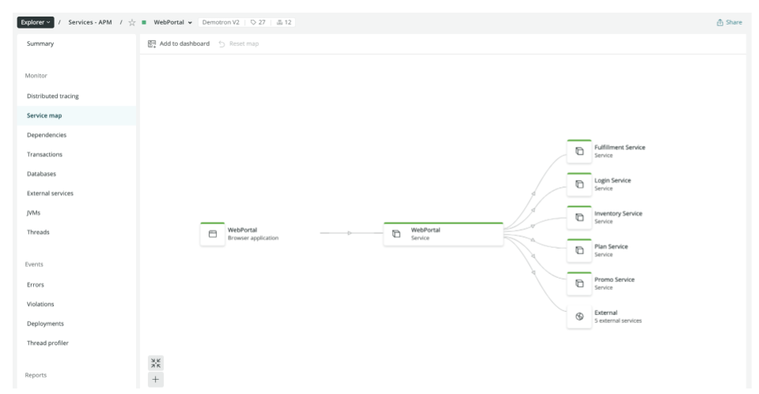
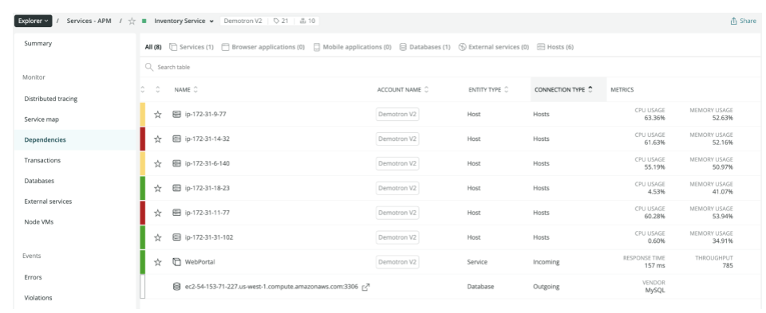
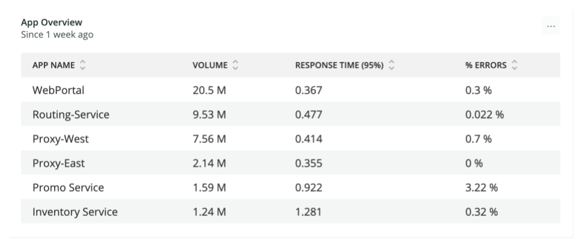
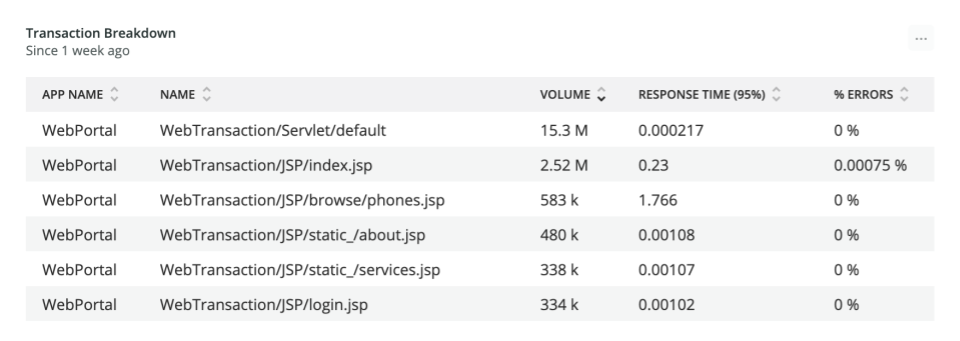
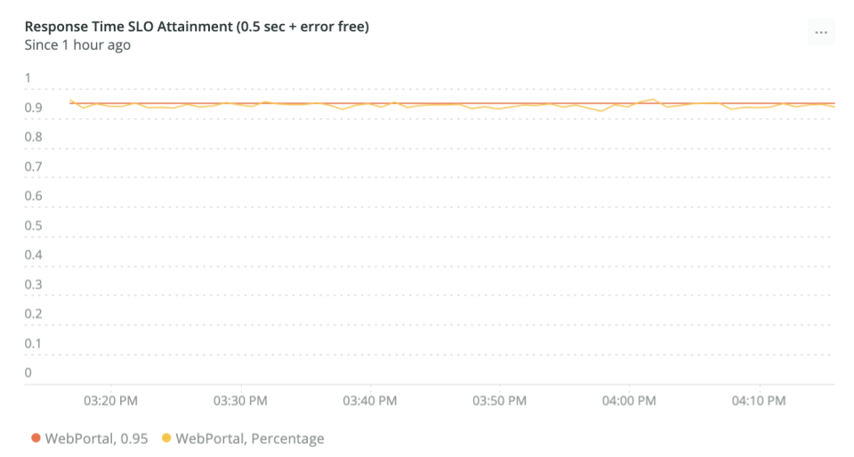

## Overview [#overview]
IT Operations is expected to provide services that meet the business’s requirements for performance and reliability. However, many ops teams attempt to measure performance and reliability using legacy methods, like measuring resource consumption. That, in turn, requires that they create complex dashboards of granular metrics which they then try to correlate with application performance and reliability. These complex dashboards require subject matter experts to interpret the results for business stakeholders.

Legacy methods create barriers to understanding what a good system state looks like and how bad system states impact the business. Essentially, IT ends up not sharing a common metric vocabulary with the business. This fundamental disconnect will result in the perception that IT is not able to deliver the services that the business requires, with all the implications and impacts that perception carries.

Service Level Management (SLM) eliminates that disconnect by better explaining the overall performance of a system in terms that are easily understood by both IT and the business. The intent is to show whether or not the system is meeting its performance and reliability expectations, and if it is trending toward or away from improvement, so proactive steps can be taken. The end goal is that systems are better oriented toward desired business outcomes with IT’s attention focused on issues in areas with the highest business impact.

You are a good candidate for SLM if any of the following are true:

- The business impact of performance and reliability issues are not well understood by all stakeholders.
- Your MTTx is too high.
- You are collecting many resource consumption metrics (such as CPU, disk, or memory) or are maintaining many metric correlation rules in order to identify system problems.
- You can’t see the value of your observability tool(s). 

## Desired outcome [#desired-outcome]
Service Level Management’s overall goal is to easily measure and communicate the overall health, performance, and quality of your digital products and services to all stakeholders. By implementing SLM at key output points in your systems, you will have a simpler and more responsive observability practice, tighter alignment with the business, and faster paths to improvement.

The SLM process described in this guide will help you to identify the points in your systems where you should measure the key performance metrics of service performance and quality. It will also define and drive a simpler alerting strategy, continuous improvement methodologies, and improved problem resolution workflows.

## Key performance indicators [#key-perf-indicators]
You will use the SLM process to collect and measure the following KPIs, often referred to as the “Golden Signals”:

<CollapserGroup>
  <Collapser
    id="kpi-response"
    title="Service response time"
  >
    Service response time measures the amount of time a service requires to process a transaction. It starts when a transaction request is received by the service and ends when the response is sent.

    **Goal:** Reduce transaction response time.

    **Best practices:**
      * Measure response time at service boundaries.
      * Use continuous improvement processes to drive down response times.
      * Ensure that non-business transactions (such as health checks) are not included or measured.
      * Map this KPI back to business impact.
      * Report KPIs to all stakeholders.
  </Collapser>
  <Collapser
    id="kpi-quality"
    title="Service quality"
  >
    Service quality is the number of transactions that result in an unhandled error. Typically, these are transactions whose HTTP response code is greater than or equal to `400`.

    **Goal:** Reduce the number of unhandled errors.

    **Best practices:**
      * Measure error rates at service boundaries.
      * Continually identify and remediate sources of high error volumes.
      * Map this KPI back to business impact.
      * Report KPIs to all stakeholders.
    
  </Collapser>
  <Collapser
    id="kpi-attainment"
    title="Service level objective attainment"
  >
    SLO attainment is the percentage of time a business service is meeting its response time and quality goals.

    **Goal:** Improve response time and quality to ensure high SLO attainment.

    **Best practices:**
      * Use continuous improvement processes to maintain / improve SLO attainment.
      * Map this KPI back to business impact.
      * Report KPIs to all stakeholders.
    
  </Collapser>
  <Collapser
    id="kpi-uptime"
    title="Service uptime"
  >
    Service uptime is the percentage of time a service can be reached by at least one client. Typically this is measured using synthetic transactions from representative remote locations.

    **Goal:** Use continuous improvement processes to watch uptime metrics and take appropriate steps to ensure uptime meets business requirements.

    **Best practices:**
      * Use continuous improvement processes to maintain / improve SLO attainment.
      * Map this KPI back to business impact
      * Report KPIs to all stakeholders.
  </Collapser>
</CollapserGroup>

These KPIs directly measure the most important aspects of an IT service, speed and quality, in a way that is easy and intuitive to understand and communicate to technical and non-technical stakeholders.

## Prerequisites [#prerequisites]
Before you begin, if you don’t have equivalent experience, you should complete the [New Relic University (NRU) Overview Course](https://learn.newrelic.com/overview-course). You should also have a basic understanding of:

- [New Relic One APM and infrastructure monitoring](https://learn.newrelic.com/fundamentals-course)
- [New Relic One Dashboards and NRQL](https://learn.newrelic.com/webinar-getting-started-with-dashboards-nrql)
- [New Relic One alerting best practices](https://learn.newrelic.com/webinar-new-relic-alerts-fundamentals)

## Establish current state [#current-state]
As with any continuous improvement process, the first step of SLM is to establish the current state of your KPIs. To do so, you will need to perform the following tasks:

- [Determine in-scope services](#determine-in-scope)
- [Identify service boundaries](#id-service-boundaries) 
- [Deploy instrumentation](#deploy-instrumentation)
- [Perform SLM educational workshops](#perform-workshops)
- [Analyze KPIs and set baseline SLOs](#analyze-kpis)
- [Establish / optimize Alerting](#establish-alerting)
- [Build problem resolution workflows](#build-workflows)
- [Execute continuous improvement review](#execute-continuous-improvement)

To help illustrate this process, we are going to apply it to an example IT service, an ecommerce site for a cellular telephone provider.

### Determine in-scope services [#determine-in-scope]
You should first identify the IT services that are going to be in-scope for the initial iteration of the SLM process. These services should be key to ongoing business operations and as close to your customers as possible. Most commonly, you will be applying the SLM process to an application, since that is the service your customers are expecting you to deliver.

SLM can be applied to infrastructure-based services; however, it is a more advanced application of SLM which is applicable to a much smaller set of organizations. If you are considering implementing SLM for infrastructure, you should ensure that the service(s) you are instrumenting are actually the closest to your organization’s end-customer. If your infrastructure is hosting a customer-facing app, then the app should be the target of SLM.

Absent anything else, a good methodology for identifying in-scope services is to consult your disaster recovery plan. Typically, the most critical business services are prioritized there.

### Identify service boundaries [#id-service-boundaries]
Next, you should identify each service’s boundary, which is the service component that is closest to the client sending transaction requests. This should be the application receiving the request from the client, browser, or mobile device, and may also be known as the "external API."

Reverse proxies, CDNs, and load balancers are not part of the service boundary. Their service level compliance should be measured via the Uptime KPI (external test requests for connectivity). 

If your services are using APM, you can identify service boundaries using the [service map or dependencies](/docs/understand-dependencies/understand-system-dependencies/service-maps/) features. A service component is on a boundary if it has no inbound connections. In the example below (from a service map), you can see that the WebPortal is on the boundary.

<figcaption>
  An example of using service maps in New Relic One to identify service boundaries.
</figcaption>

In contrast, the following screenshot (from the dependencies page) shows that the Inventory Service is not on a boundary since it has incoming connections from the WebPortal. Subsequent examples in this guide will build on the WebPortal service boundary.

<figcaption>
  An example of using the dependencies UI in New Relic One to identify service boundaries.
</figcaption>

You should understand that the SLM process defines a service boundary as being downstream of any dependencies. The service boundary is the point where all the effects and impacts of dependent services are measured as they contribute to the total response time and quality of the service.

By measuring service level compliance at the boundary, you will be able to see the impact that all service components upstream of the boundary have on service delivery. This means that your initial steps into SLM can focus on the services that are closest to your users, yet still capture the contribution of more distant services. As your practice matures, you will be able to identify the next round of upstream services that would benefit from direct SLM instrumentation.

In our example, the WebService is downstream of the Fulfillment, Plan, Promo, Login, and Inventory services (among others). By applying SLM at the WebService, we will be seeing the impact of the upstream services on the WebService. Any impactful issues with an upstream service will be reflected in the WebService’s service level KPIs. By instrumenting one service, we are capturing the contribution of five additional services. This greatly simplifies our observability practice. In time, problematic upstream services will self-identify themselves as candidates for direct SLM instrumentation. 

### Deploy instrumentation [#deploy-instrumentation]
To collect SLM service response time and transaction success KPIs, you need to deploy instrumentation into the components of your production apps on the service boundary. If you don’t have instrumentation that can do this in production already, then you will need to engage the teams and stakeholders that can help you to get this done. For detailed information on deploying the New Relic instrumentation that can gather this information, see our [APM install documentation](https://docs.newrelic.com/docs/using-new-relic/cross-product-functions/install-configure/install-new-relic/#apm-install).

The uptime KPIs can be collected using synthetic transactions, which don’t require any instrumentation to be added to the service. If needed, you can start your SLM journey there while waiting for the direct instrumentation to be deployed. The uptime tests should perform a basic, yet realistic, check of the service’s functionality. For detailed information on this capability, see our [synthetic monitoring documentation](https://docs.newrelic.com/docs/synthetics/synthetic-monitoring/getting-started/get-started-synthetic-monitoring/).

### Perform SLM educational workshops [#perform-workshops]
You should share the self-paced [New Relic Essentials](https://learn.newrelic.com/self-paced-new-relic-essentials) training course with the appropriate stakeholders so they can understand how the New Relic technology platform will aid in the SLM process.

### Analyze KPIs and set baseline SLOs [#analyze-kpis]
The SLM process uses speed and quality as its key performance indicators. In technical terms, speed means response time and quality means error rate. At the end of this phase, you will have created baseline service level objectives for each service in the form of a percentage. For example: “98% of service X’s transactions will be error free and occur in less than 500 milliseconds.”

For each in-scope service, you should analyze speed and quality at the service boundary. This will give you an overall understanding of how the entire service and all of its dependencies are performing. As you iterate through the SLM process, you can then identify and prioritize the upstream service components that require direct SLM instrumentation.

To analyze KPIs, you should do the following for each service:

1. Identify the volume and 95th percentile response time for each of the service’s transactions over a relatively long period of time, typically between seven days and one month. It is important that you use percentile rather than average, so you can see the entire range of response times, including outliers. If you use averages, you will hide outliers.

The following is an example of the initial baseline report. Here you can see the volume, p95 response time, and error volume for the WebPortal and a few other services. The WebPortal’s p95 response time is .36 seconds (or 36 milliseconds), so we have decided to set the SLO target to 0.4 seconds.

<figcaption>
  Example of an initial baseline report measuring volume and 95th percentile response time.
</figcaption>

2. Next you should review and identify any non-business transactions, since they should not be included in the SLO attainment calculation. For example, you should not include health check / keep alive transactions and you may not want to include administrative transactions.

  In the example below, we are looking at some of the transactions from the WebPortal service. We have decided that the `about.jsp` transaction is a non-business transaction that should not be tracked in our SLO attainment calculation.

<figcaption>
  Example showing transaction breakdowns from the initial baseline report to help identify what to track (or not track) for SLO.
</figcaption>

3. Finally, import and edit the SLM template dashboard to exclude non-business transactions. Then use the p95 response time as your baseline response time service level objective.

  For the example chart, we chose 0.4 seconds as our response time threshold and set our service level objective to 95%. This means that we are expecting 95% of the WebPortal’s business transactions to complete in 0.4 seconds or less and without an error. The red line on the chart shows us our 95% service level objective.

<figcaption>
  Example chart now excluding the non-business transactions.
</figcaption>

  As you can see, there are periods of hours where the app is not meeting its SLOs. If we are going to maintain the 95% target, we would need to identify and fix the service components or dependencies that are causing these problems.

### Establish or optimize alerting [#establish-alerting]
After you have set your service level objectives, you will then configure alerts that will inform you when your SLO attainment has dipped below your goal. These alerts will show you when incidents with a high business impact are occurring. When they are triggered, they should be given a high priority and you should engage the proper teams to start the process of diagnosing the source of the problem.

A basic starting point is to configure an alert that triggers when your SLO attainment has dipped under your baseline for more than 10 minutes. For more information, see our documentation on [configuring alerts](https://docs.newrelic.com/docs/alerts-applied-intelligence/new-relic-alerts/get-started/).

### Build problem resolution workflows [#build-workflows]
As we’ve been discussing, the intent of the SLM process is to identify when business impacting issues occur in your IT services. When this occurs, a diagnostic investigation should be launched. The goal of the investigation is to identify what service element is causing the business impacting issue. SLM tells you that there is a problem with business impact, the diagnostic process helps you to find where the problem is.

Typically, your high level diagnostic workflow will start at the service boundary and go as follows:  

1. Look at the service’s individual transactions and see which one(s) are departing from their performance and/or response time SLOs.
2. Look at each service component responsible for delivering that transaction until you find the component that is failing.
3. Use in-depth diagnostics to identify the root cause of the problem and then resolve it.

### Execute continuous improvement review [#execute-continuous-improvement]
This is an ongoing phase of the SLM process where data is reviewed and adjustments are made as required. Your KPIs should be reported to upper management to ensure that stakeholder teams are appropriately prioritizing work and that you are meeting the SLO goals you’ve set.

Periodic KPIs should be recorded and retained over periods of months to years to establish a baseline and to show the rate of improvement.

In addition, each time you execute the continuous improvement process, you should:

1. Review each service’s architecture to ensure your instrumentation is deployed at the boundary and that there are no observabilty gaps.
2. Review each service’s transactions to confirm that only business transactions are included in your SLO calculations.
3. Review each service’s SLO and determine if it meets the business’s performance and quality requirements. If it does not, then the SLO should be changed and the appropriate stakeholders notified so they can work to improve performance and quality.
4. Review your SLO attainment and determine if any upstream services should be added to the SLM process.

## Next steps [#next-steps]
After you’ve established the SLM process, you should identify other services that would benefit from SLM instrumentation. These may be other front-line services or upstream dependencies of services that are covered by SLOs that have shown themselves to be frequent contributors to SLO attainment failures. 

As you do this, you should start to measure and report your SLM coverage as a percentage of applications covered by SLOs. For example, you may say that 20% of your apps have established SLOs. As SLM expands into your organization and as its value is seen by management and other stakeholders, you may find that you need a dedicated team to manage the SLM process.

The SLM process should also become a primary driver to help you prioritize issue resolution activities. SLO attainment failures are a direct indicator that your IT services are having a negative business impact which is visible to your customers as poor performance and/or unhandled errors.

## Value realization [#value-realization]
Once the SLM process is established, you will see a reduction in the effort required to identify business impacting issues, a better ability to communicate with your business stakeholders, and an easier time proving the business’ return on investment in IT services. Your SLM KPIs will provide quantifiable proof of these improvements.

In addtion, you should be able to simplify your observability strategy by removing or reducing your dependency on legacy consumption metrics and the logic required to correlate them against your true goal of measuring performance and quality.

Once you are firmly on the path to SLM's goals, consider moving to other use cases within the Uptime, Performance, and Reliability value stream, such as Service Level Management, or Reliability Engineering. You can also move to other observability maturity value streams, such as Customer Experience.

## Additional resources
Need help getting started? Check out the self-paced [service level management training](https://learn.newrelic.com/self-paced-service-level-management)
